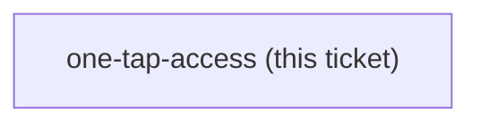
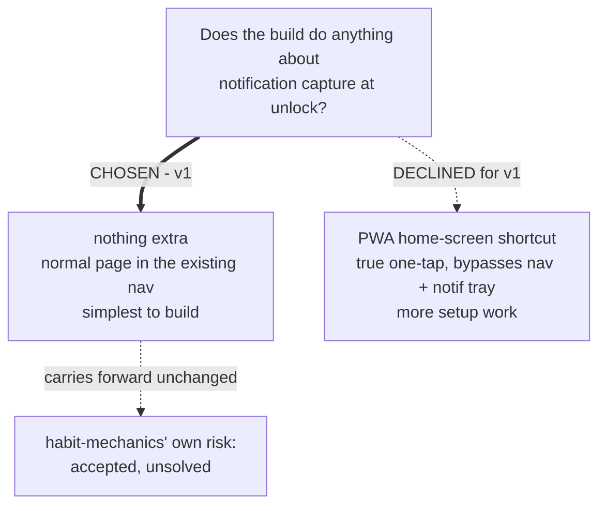

<!-- decision-map:graph:start -->

<!-- decision-map:graph:end -->

## Question

habit-mechanics flagged as unsolved that a phone notification can capture the writer before he reaches the writing page. Does the MenuNest build add anything for this (e.g. a PWA home-screen shortcut), or ship as a normal page in the existing nav for v1?

<!-- decision-map:resolution:start -->
## Resolution

Nothing extra for v1 -- a normal page in MenuNest's existing nav; the notification-capture risk from habit-mechanics stays accepted and unsolved.

Detail: docs/adr/172-v1-adds-nothing-for-one-tap-access-and-carries-the-notification-risk-forward.md

# One-tap access

**Chosen: nothing extra for v1.** The writing page ships as a normal page inside MenuNest's
existing navigation, reached the same way every other page is. `habit-mechanics`' unsolved risk
- a notification capturing the writer before he reaches the writing page - stays exactly as
that ticket left it: accepted, unsolved.

## The trade-off, as put to the writer

- **Nothing extra (chosen)** - simplest to build; carries the risk forward unchanged.
- **A PWA home-screen shortcut (declined for v1)** - a true one-tap trigger that bypasses the
  app's own nav and any notification tray, at the cost of extra setup work.

## His answer

Nothing extra for v1 (recommended option accepted).

<!-- decision-map:resolution:end -->
