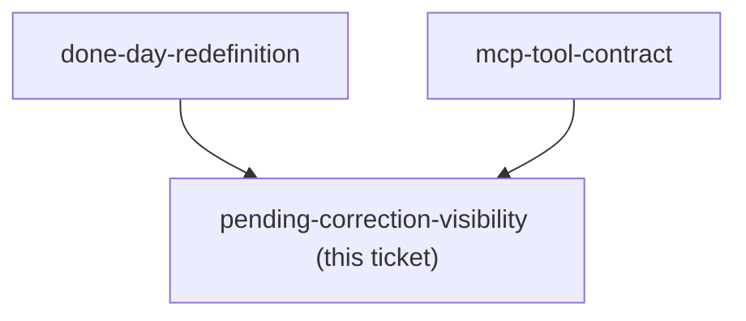
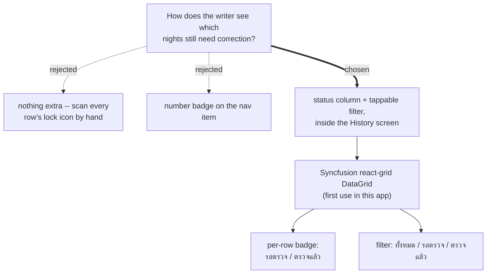

<!-- decision-map:graph:start -->

<!-- decision-map:graph:end -->

## Question

Now that correction is decoupled from the 7-minute writing session (done-day-redefinition), how does the writer see, days later, which entries are still waiting for a correction pass via Claude Code - a badge/count, a list, or nothing at all?

<!-- decision-map:resolution:start -->
## Resolution

Status badge per row (pending/corrected) + tappable filter inside the History screen, built as a Syncfusion react-grid DataGrid; no count or badge on the nav.

# Pending-correction visibility

**Chosen: a status column plus a tappable filter inside the ประวัติ (History) screen -- no nav badge, no separate count header.**

The History screen (decided by `entry-mutability` / ADR-169, not yet built) lists every
`WritingEntry`. Each row now also carries a status badge: รอตรวจ (pending -- `CorrectedAt` is
null) or ตรวจแล้ว (corrected -- `CorrectedAt` is set, text already locked per ADR-169). A filter
control at the top of the screen narrows the list to ทั้งหมด / รอตรวจ / ตรวจแล้ว.

It renders as a Syncfusion `react-grid` DataGrid -- `@syncfusion/react-grid` is already a project
dependency but unused anywhere in the app today, so this is its first use. The grid's own column
templating and toolbar filter cover both the badge and the filter without hand-rolled list/filter
code.

No number lands on the nav (`เขียน` or elsewhere). The writer only sees the correction backlog by
opening ประวัติ itself.

## Confirming exchange

- Design was posed as an ASCII mock (per-row badge column + top filter chips, no nav badge). The
  writer confirmed the shape and added the implementation choice: "ใช้ datagrid ของ syncfusion."

<!-- decision-map:resolution:end -->
