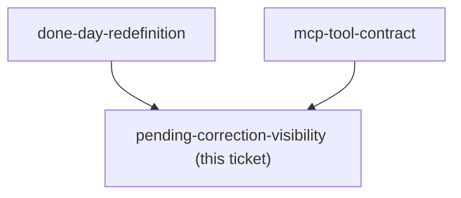

<!-- decision-map:graph:start -->

<!-- decision-map:graph:end -->

## Question

Now that correction is decoupled from the 7-minute writing session (done-day-redefinition), how does the writer see, days later, which entries are still waiting for a correction pass via Claude Code - a badge/count, a list, or nothing at all?
