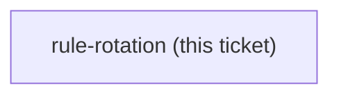
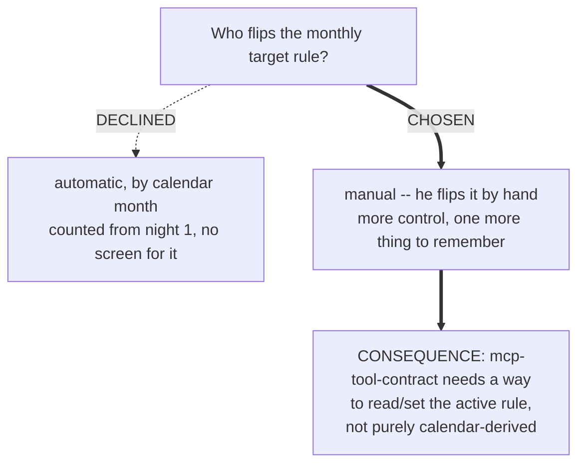

<!-- decision-map:graph:start -->

<!-- decision-map:graph:end -->

## Question

Does the active target rule (e.g. third-person -s, then articles) rotate automatically on a calendar schedule, or does the writer change it by hand?

<!-- decision-map:resolution:start -->
## Resolution

The writer flips the active target grammar rule by hand -- not an automatic calendar rotation.

Detail: docs/adr/174-the-target-rule-rotates-by-hand-so-the-app-must-read-and-set-it.md

# Target-rule rotation

**Chosen: manual.** The writer changes the active target grammar rule by hand (e.g. from the
progress screen or a settings control), rather than the app switching it automatically on a
calendar schedule.

## The trade-off, as put to the writer

- **Automatic, by calendar month (recommended, declined)** - no screen for it, changes quietly
  once a month counted from night 1.
- **Manual (chosen)** - more control over exactly when a rule change happens, at the cost of one
  more thing to remember.

## Consequence

The `WritingTools` MCP contract (`mcp-tool-contract`) needs a way for Claude Code to read (and
for the writer to set) the currently active target rule, since it is no longer purely
calendar-derived.

## His answer

Manual - "You flip it by hand."

<!-- decision-map:resolution:end -->
