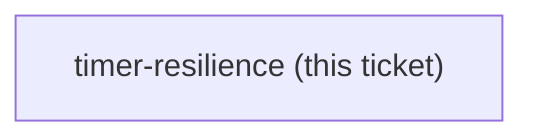
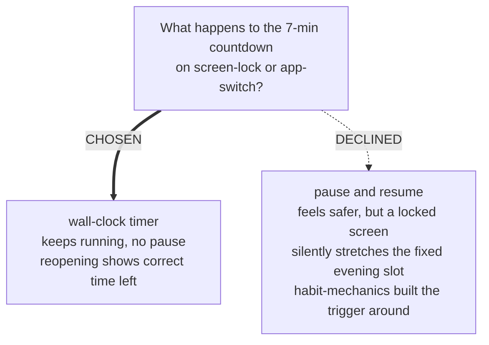

<!-- decision-map:graph:start -->

<!-- decision-map:graph:end -->

## Question

If the phone screen locks or the writer switches apps mid-timer, does the 7-minute countdown keep running (wall-clock), pause and resume, or something else?

<!-- decision-map:resolution:start -->
## Resolution

The 7-minute timer is wall-clock based and keeps running through screen-lock or app-switch; it does not pause.

# Timer resilience

**Chosen: wall-clock, keeps running.** The 7-minute countdown is computed from a stored start
timestamp, not from the screen staying awake or the tab staying foregrounded. Locking the
phone or switching apps mid-timer does not pause it; reopening the page shows the correct
remaining time.

## The trade-off, as put to the writer

- **Keeps running (chosen)** - simple, no server round-trip needed mid-timer, matches how any
  real countdown behaves.
- **Pauses and resumes (declined)** - feels safer against interruption, but a locked screen for
  5 minutes would silently turn a planned 7-minute session into a much longer wall-clock block,
  drifting from the fixed evening slot `habit-mechanics` designed the whole trigger around.

## His answer

Keeps running (recommended option accepted).

<!-- decision-map:resolution:end -->
