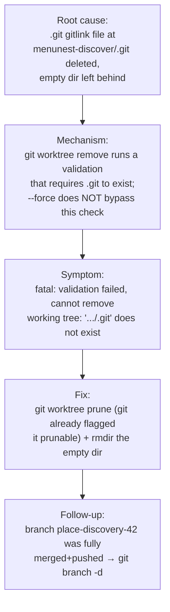

# Post-mortem: `git worktree remove` cannot delete `place-discovery-42` (#42 cleanup)

**Date:** 2026-07-20 · **Owner:** Pon · **Scope:** local git tooling (worktree cleanup for the already-shipped #42) · **Git:** 2.51.0.windows.1



## 1. Summary

The `place-discovery-42` git worktree at `C:/Repo2/t/menunest-discover` could not be removed with the documented command `git worktree remove --force <path>`. Root cause: the worktree's `.git` gitlink file had been deleted, leaving an empty directory; `git worktree remove` validates that `.git` exists before removing and refuses when it is gone — and `--force` does not bypass that specific validation. Fixed by using `git worktree prune` (git had already flagged the worktree `prunable`) plus `rmdir` of the leftover empty directory. No work was lost — branch `place-discovery-42` was at `b4c7496`, identical to `main` (local and remote).

## 2. Symptom

`git worktree list` showed the worktree flagged broken:

```
C:/Repo2/t/menunest-discover  b4c7496 [place-discovery-42] prunable
  → prunable reason: "gitdir file points to non-existent location"
```

Every removal attempt failed:

```
$ git worktree remove C:/Repo2/t/menunest-discover
fatal: validation failed, cannot remove working tree: 'C:/Repo2/t/menunest-discover/.git' does not exist   (exit 128)

$ git worktree remove --force C:/Repo2/t/menunest-discover
fatal: validation failed, cannot remove working tree: 'C:/Repo2/t/menunest-discover/.git' does not exist   (exit 128)

$ git worktree remove place-discovery-42          # (using branch name instead of path)
fatal: 'place-discovery-42' is not a working tree                                                          (exit 128)
```

## 3. Root cause

A git worktree is bound to its main repo by two pieces of state:

- **In the worktree dir:** a `.git` *file* (gitlink) whose content is `gitdir: <path to admin dir>` — here it should read `C:/Repo2/t/menunest-discover/.git` → `.git/worktrees/menunest-discover`.
- **In the main repo:** the admin dir `.git/worktrees/menunest-discover/` (holding `HEAD`, `index`, `logs`, `gitdir`, `commondir`, …). Its `gitdir` file records the reverse pointer back to `C:/Repo2/t/menunest-discover/.git`.

The worktree's `.git` gitlink file was deleted out-of-band, leaving `C:/Repo2/t/menunest-discover` as an **empty directory** while the main repo's admin metadata stayed fully intact. That is exactly the `prunable: gitdir file points to non-existent location` state git reported: the admin `gitdir` pointer targets `C:/Repo2/t/menunest-discover/.git`, which no longer exists.

`git worktree remove` performs a **`validate_worktree`** step before deleting anything — it re-resolves the target as a genuine worktree, which requires reading its `.git` gitlink. With the gitlink gone, validation fails hard and removal aborts. Critically, `--force` in `git worktree remove` only relaxes the *dirty/locked* guards (uncommitted changes, submodules, `--force --force` for a locked tree); it does **not** relax the existence-of-`.git` validation. So `--force` produced the identical error. The branch-name form failed differently and earlier — `remove` takes a **path**, not a ref, so `place-discovery-42` resolved to no worktree at all (`is not a working tree`).

The proximate trigger of the deleted gitlink: the #42 SDD work ran in this worktree; after it was rebased+pushed to `main`, an earlier cleanup attempt (the `git worktree remove --force` recorded in the project memory) had partially torn the worktree down — the tree contents / `.git` were removed but the admin metadata and empty dir survived, because that `remove` aborted at validation instead of completing.

## 4. Why it produced the symptom

The visible failure ("can't delete the worktree") sits at the last command the user ran, but the causal state was set earlier: the moment the `.git` gitlink vanished, the worktree entered a state that `git worktree remove` is architecturally unable to act on, regardless of `--force`. The user was following the exact cleanup command documented in the project memory (`git worktree remove --force …`), which was written for a *healthy* worktree — so a correct-looking documented command met a broken-state precondition and dead-ended.

## 5. Fix

```bash
git worktree prune                    # removes .git/worktrees/menunest-discover admin metadata
rmdir C:/Repo2/t/menunest-discover    # removes the leftover empty directory
```

This addresses the root cause rather than papering over it: `git worktree prune` is the operation *designed* for worktrees whose working dir / gitlink is missing — it garbage-collects admin metadata for any worktree git has flagged `prunable`, which is precisely this state. `rmdir` (not `rm -rf`) removes only the empty leftover, so it would refuse — surfacing a problem — if the dir unexpectedly still held files. Follow-up: `git branch -d place-discovery-42` (safe merge-checked delete; the branch was fully merged into `main`).

`--force` was **not** the fix and would never have been — its failure was confirmed, not assumed (see §6).

## 6. How it was found

- **Repro:** deterministic on the first try — `git worktree remove` / `remove --force` / `remove <branch>` each failed identically every run. No flakiness to raise.
- **Fail path (source-trace + knob enumeration):** inspected live state before touching anything — `git worktree list --porcelain` gave the `prunable` reason; `ls` showed the worktree dir empty (no `.git`); `.git/worktrees/menunest-discover/` and its `gitdir` (→ `C:/Repo2/t/menunest-discover/.git`) were intact. That pinpointed the missing gitlink as the divergence.
- **Hypotheses tried and rejected:**
  - *"User passed a branch name, use the path instead"* — rejected: the path form also fails (`validation failed`), so the branch/path confusion wasn't the whole story.
  - *"`--force` bypasses it"* — **disproof run first**: `git worktree remove --force <path>` returned the identical validation error → rejected decisively.
  - *"Directory is locked by another process (VS Code / parallel session)"* — rejected: the error text is a `validation` failure about a missing `.git`, not a permission/lock error; dir had no `locked` file and `ls` succeeded.
- **The single experiment that confirmed it:** `git worktree prune --dry-run --verbose` printed exactly `Removing worktrees/menunest-discover: gitdir file points to non-existent location` and nothing about the healthy `menunest-auth-fix` worktree — confirming both the cause and that the fix was correctly scoped.

## 7. Why it slipped through

Incomplete prior fix + doc-precondition gap. The project memory documented the cleanup step as `git worktree remove --force C:/Repo2/t/menunest-discover`, which is only valid for a healthy worktree. A prior partial teardown had already removed the worktree's `.git` gitlink without completing the removal (the `remove` had aborted at validation), so by the time the documented command was run, its precondition no longer held. Nothing exercised the "worktree gitlink already gone" path until the user hit it manually. Blameless: the gap is a documented command that assumed a healthy precondition, not a mistake by the operator.

## 8. Validation

Fix confirmed on git 2.51.0.windows.1:

- `git worktree prune --verbose` → `Removing worktrees/menunest-discover: gitdir file points to non-existent location` (exit 0).
- `rmdir` → succeeded (dir was empty).
- `git worktree list` → now shows only `menunest` [main] and `menunest-auth-fix` [auth-relogin-fix]; `menunest-discover` gone.
- `.git/worktrees/menunest-discover` → gone; `C:/Repo2/t/menunest-discover` → gone.
- **No work lost:** `place-discovery-42` still resolved to `b4c7496` = `main` tip (local) = `refs/heads/main` on remote (`git ls-remote`). `git branch --merged main` listed it → fully merged.
- **Sibling worktree unaffected:** `menunest-auth-fix/.git` gitlink intact (61-byte file); prune dry-run never targeted it.
- Follow-up executed: `git branch -d place-discovery-42` → `Deleted branch place-discovery-42 (was b4c7496)` (exit 0). Final `git worktree list` and `git branch` confirm both worktree and branch gone.

Scope: validated on this repo / this Windows git only. Not a code change — no test suite involved.

## 9. Action items / follow-ups

- **Doc fix (project memory):** `project_trip_place_discovery.md` cleanup note updated — the documented cleanup no longer says bare `git worktree remove --force`; it now records that a broken/`prunable` worktree needs `git worktree prune` + `rmdir`. (Pon, done 2026-07-20.)
- **Global gotcha added:** `~/.claude/GOTCHAS.md` "Tooling / environment" now carries the `prunable` worktree → `prune`-not-`remove` one-liner. (Pon, done 2026-07-20.)
- No code regression test — this is a local-tooling / operational fix with no code seam to guard.
