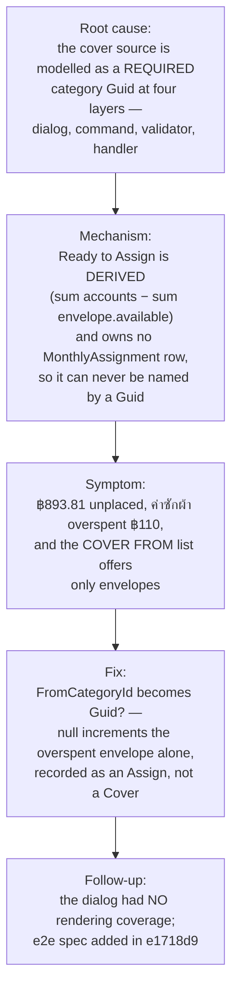

# Post-mortem: Cover Overspending could not draw on Ready to Assign (#115)

**Date:** 2026-08-31 · **Owner:** Pon · **Scope:** Budget — `CoverOverspendingDialog` / `CoverOverspendingHandler` / MCP `cover_overspending` · **Commits:** `b2e602d`, `e1718d9` on `claude/debug-mantra-twjig1` · **ADR:** menunest-215



## 1. Summary

**Cover Overspending** offered only **Envelope**s holding spare cash as a source. A **User** with ฿893.81 still to place and an **Envelope** overspent by ฿110 had no way to connect the two — the most natural source was the one source missing. Root cause: the source is modelled as a required category `Guid` at every layer, and **Ready to Assign** is a derived figure that owns no row to name. Fixed by making `CoverOverspendingCommand.FromCategoryId` nullable, where null increments the overspent **Envelope** alone — which is exactly what makes the derived figure fall. Issue #115, commits `b2e602d` (fix) and `e1718d9` (coverage), ADR menunest-215.

This is a **missing capability, not a regression**. Nothing broke; the path was never built. §7 says so plainly rather than manufacturing a regression narrative.

## 2. Symptom

Reported from prod on a phone (Chrome, Android, 07:21 +07). The **Cover Overspending** sheet, opened on `🧺 ค่าซักผ้า`:

```
Cover Overspending
ค่าซักผ้า is overspent by ฿110.00
COVER FROM   [ Pick source…            ▾ ]
AMOUNT       [ 110                       ]
```

with the **Ready to Assign** hero directly behind it reading:

```
AUGUST 2026                    Still to place
฿893.81
฿22,440.00 of ฿23,833.81 placed.                    94%
```

The placeholder reads `Pick source…`, not `No categories with available money` — so the list was non-empty. The money was visible on the same screen and unreachable from the control.

**Provenance.** `.github/workflows/azure-static-web-apps-green-rock-098e70e00.yml` deploys the SPA on push to `main`. `origin/main` was at `5cde58c` (2026-08-31 06:11 +07), and `CoverOverspendingDialog.tsx` had not changed since `cb9e0fc` — so the shipped build and the tree under review were identical for this file.

## 3. Root cause

**Ready to Assign is derived, not stored.** `GetMonthlySummaryHandler` computes it at read time:

```csharp
decimal readyToAssign = totalAccountBalance - totalEnvelopeAvailableAllCats;
```

It has no `BudgetCategory` and no `MonthlyAssignment`. There is no `Guid` that names it and no row to decrement.

The cover path models its source as a **required category `Guid`** at four independent layers. Each one alone is sufficient to block the feature:

| Layer | Site | Refusal |
|---|---|---|
| SPA | `CoverOverspendingDialog.tsx:41` | `options` built from `groups.flatMap(g => g.categories).filter(c => … && c.available > 0)` — categories only. `EnvelopeList.tsx` never passed `summary.readyToAssign` into the dialog, so it could not have offered it even in principle. |
| Command | `CoverOverspendingCommand` | `Guid FromCategoryId` — non-nullable. |
| Validator | `CoverOverspendingValidator` | `RuleFor(x => x.FromCategoryId).NotEmpty()`. |
| Handler | `CoverOverspendingHandler.GetOrCreateAsync` | `if (!belongs) throw new DomainException("Category not found.")` — any source that is not a real `BudgetCategory` row of this `Family`. |

The design assumption underneath all four: *a cover moves money between two envelopes.* `CoverOverspendingHandler`'s own docstring stated it — "Functionally identical to `MoveMoneyHandler` — decrements the source envelope and increments the overspent envelope." That is true for every source the code could express, and it is precisely what excluded the derived one.

The `MonthlyAssignment` row for `ค่าซักผ้า` was at `AssignedAmount = 0` with ฿110 of activity, so `ComputeEnvelopeAvailable` returned `available = −110`. Nothing was corrupt; the state was correct and the control simply had no vocabulary for the fix.

## 4. Why it produced the symptom

The user sees one screen holding both numbers, so "the app lost my money" is the natural reading. The chain from cause to symptom:

1. `GetMonthlySummaryHandler` returns `readyToAssign: 893.81` in `MonthlySummaryDto` — the number `RtaHero` paints.
2. `EnvelopeList.tsx:110` renders `<CoverOverspendingDialog overspent={coverFor} groups={summary.groups} … />`. The **same DTO** carries `readyToAssign`, and the prop list drops it.
3. The dialog's `options` filter therefore ranges only over `groups`, and returns the one envelope with `available > 0`.
4. The dropdown renders `Pick source…` (non-empty list) rather than the empty-state text — so the UI looked *working*, just unhelpful. Had the list been empty, the placeholder would have said so and the gap would have been self-describing.

The last step is why this reads as a bug rather than a missing feature: a populated dropdown that omits the obvious entry is indistinguishable from one that lost it.

## 5. Fix

`b2e602d`. `CoverOverspendingCommand.FromCategoryId` becomes `Guid?`, where **null means Ready to Assign**:

```csharp
var from = cmd.FromCategoryId is { } fromCategoryId
    ? await GetOrCreateAsync(familyId, fromCategoryId, cmd.Year, cmd.Month, ct)
    : null;
var overspent = await GetOrCreateAsync(familyId, cmd.OverspentCategoryId, cmd.Year, cmd.Month, ct);

overspent.AdjustAmount(+cmd.Amount);
if (from is not null) { … RecordMove(…, isCover: true) }
else                  { … RecordAssign(…, +cmd.Amount, batchId: null) }
```

**This addresses the root cause rather than the symptom** because it makes the one-sided act representable instead of faking a counterparty. Raising one **Envelope**'s `Available` by ฿110 lowers `totalEnvelopeAvailableAllCats` by ฿110, so `readyToAssign` falls by ฿110 *by derivation*. No second row is needed, and none is invented.

Three decisions worth recording:

- **Recorded as `Assign`, not `Cover`.** A `Cover` row carries a source in `CategoryId` and a destination in `SecondCategoryId`, and `BudgetChangeApplier` throws `"A move change is missing its destination."` on one whose `SecondCategoryId` is null. There is no giving **Envelope** here. An `Assign` is the accurate record — moving money out of **Ready to Assign** into one **Envelope** *is* an assign — and it undoes through the existing single-**Envelope** delta branch. No new `BudgetChangeKind`, no migration.
- **`Guid.Empty` is still refused.** `NotEmpty()` was replaced with `Must(id => id != Guid.Empty)`, which admits null and rejects the empty Guid. A caller that meant to name an **Envelope** and sent nothing must fail loudly, not silently mint money against the derived figure.
- **The write is a delta.** `AdjustAmount(+amount)`, not `SetAssignedAmount`. See §6 for why the alternative was rejected.

`e1718d9` adds the coverage §7 identifies as missing, plus `POST /api/budget/monthly/{cover,move}` to the e2e mock routes (previously unmocked) and the MCP tool's null-source test.

## 6. How it was found

- **Repro.** Deterministic on the first attempt. A throwaway `[DBG-c115]` test replayed `CoverOverspendingDialog.tsx:41`'s filter verbatim against the screenshot's state (`readyToAssign: 893.81`, `ค่าซักผ้า: −110`, `อาหาร: 240`) and returned `['food']` — no Ready-to-Assign entry, with unplaced money present. No flakiness to raise.
- **Fail path.** No debugger; source trace plus knob enumeration across the four layers in §3. Each was read at its own site rather than inferred from the one above it, which is what surfaced that all four block independently.
- **Hypotheses tried and rejected:**
  - *"The RTA option exists but was filtered out for this user."* — **Dead first.** `grep -c "readyToAssign\|ready" CoverOverspendingDialog.tsx` → `0`. The filter has no RTA branch at all.
  - *"Frontend-only omission; the SPA can just call `setAssignedAmount(overspent.assigned + amount)`."* — **Rejected on the disproof.** `MonthlyAssignment.SetAmount` assigns an **absolute** figure, while every cover and move path uses `AdjustAmount(delta)` precisely so a concurrent write survives (menunest-193). A client computing `assigned + 110` from a rendered summary overwrites a **Family** member's assign made since that render. Real, and pinned by a test.
  - *"The domain cannot represent it — no row exists, and `BudgetChangeApplier` refuses a `Cover` with a null destination."* — **Half true, demoted.** Correct that no row exists; wrong that it blocks the fix. `BudgetChangeKind.Assign` already models a single-**Envelope** delta and undoes correctly, so no new kind and no migration.
  - *"A real `Ready to Assign` BudgetCategory, moved out of like any envelope."* — Rejected in ADR menunest-215: it would make the figure both a stored **Envelope** and a derivation that subtracts every **Envelope**'s `Available`, including its own.
- **The single experiment that confirmed it:** the same fixture, re-run against `coverSourceOptions` after the fix, returned `[READY_TO_ASSIGN, 'food']` — the repro flipped with no change to the fixture.
- **A second pass (`/scrutinize`) found the real defect in the work**, not the code: see §7.

## 7. Why it slipped through

**Two separate gaps. Blameless: both are about coverage and scope, not about a person.**

**a) The capability was never built — a design-scope gap, not a regression.** The cover flow was written envelope-to-envelope and **Ready to Assign** was never considered a source. `CoverOverspendingHandler`'s docstring documented that assumption openly ("Functionally identical to `MoveMoneyHandler`"), so it was visible and simply not questioned until a real month produced the state that needed it. No test could have caught this; nothing was wrong. *(This clone is shallow — 87 commits, horizon 2026-08-29 — so the commit that introduced the flow is not recoverable here. The earliest touch in this clone is `cb9e0fc`.)*

**b) The fix's first round shipped with no rendering coverage — the more instructive gap.** `b2e602d` changed a dialog and added only `lib/coverSourceOptions.test.ts`. That proves the option list is **built** correctly and proves nothing about it being **seen**: `frontend/vite.config.ts` runs vitest in `environment: 'node'` with no jsdom, so `tsc`, `npm run build` and the unit suite are all blind to rendering. Verification was done with a throwaway Playwright harness that was then **deleted**, leaving nothing durable.

This is the exact failure mode CLAUDE.md documents twice — #33 (a popover clipped invisible by an `overflow:hidden` ancestor, green through every gate) and #97 (a missing Syncfusion stylesheet, invisible to every gate, catchable by a Playwright snapshot). A Syncfusion `DropDownList` renders its list into a popup **outside** the form element, which is precisely the #33 shape. And `grep Cover e2e/*.spec.ts` returned zero hits: `CoverOverspendingDialog` had never had a spec, and `POST /api/budget/monthly/cover` was not even mocked in `budgetRoutes.ts`. Closed in `e1718d9`.

## 8. Validation

- **Original repro flipped.** The `[DBG-c115]` fixture that returned `['food']` now returns `[READY_TO_ASSIGN, 'food']`, asserted permanently in `coverSourceOptions.test.ts` (8 tests).
- **Backend, Release, full suite green:** 1,038 tests — `MenuNest.Application.UnitTests` 869, `MenuNest.McpServer.UnitTests` 80, `MenuNest.WebApi.UnitTests` 65, `MenuNest.Infrastructure.IntegrationTests` 24. 10 new in `CoverOverspendingFromReadyToAssignTests`, 1 new in `BudgetToolsTests`.
- **Concurrency pinned:** `A_concurrent_assign_by_another_member_survives_the_cover` seeds 0, applies a concurrent `+500`, covers `110`, asserts `610`. Fails on any absolute write.
- **Undo/redo pinned:** `The_recorded_change_undoes_and_redoes_through_the_existing_applier` drives `BudgetChangeApplier` at `direction: -1` then `+1` → `0` then `110`.
- **Frontend:** `tsc -b` clean, `npm run build` clean, vitest 533/533 across 60 files.
- **Rendering + wire, e2e:** `budget.cover-overspending.spec.ts`, 3/3 green in Chromium at the default viewport — the entry has a real layout box inside the viewport (the #33 shape), it leads the list, and picking it puts `fromCategoryId: null` on the request body. **Mutation-probed:** stubbing the option out (`if (false)`) fails 2 of the 3; the negative-case test correctly stays green.
- **Interactive:** the real dialog was driven at 412×915 (the reporter's phone) — both options rendered unclipped, Ready to Assign first, selection landed in the field.

**Coverage stated honestly.** The e2e spec runs Chromium only, at the default desktop viewport — the 412×915 phone check was manual and is not pinned by a spec. Nothing was exercised against the real Azure SQL backend or the deployed SPA; the e2e suite mocks `/api/*`. `dotnet` is absent from this container's base image and was installed for the run (SDK 10.0.400). No migration is involved, so CLAUDE.md's manual-migration step does not apply.

## 9. Action items / follow-ups

- **Regression + rendering test added:** `frontend/e2e/budget.cover-overspending.spec.ts`, plus `CoverOverspendingFromReadyToAssignTests` and the MCP null-source test. (Pon, `e1718d9`.)
- **E2E mock gap closed:** `POST /api/budget/monthly/{cover,move}` now routed and recorded in `budgetRoutes.ts`, so future specs can assert request bodies on those endpoints. (Pon, `e1718d9`.)
- **Open — naming decision for the User.** `RtaHero` calls this quantity **"Still to place"**; the new option calls it **`เงินที่ยังไม่ได้จัดสรร`**. One number, two names, one screen. Every other string in the dialog is English. Deliberately left unresolved — it is a product-voice call, not a correctness one.
- **Open — ADR wording.** menunest-215's rejection of option B implies `SetAssignedAmount`'s absolute write is uniquely unsafe. `EnvelopeCard.hooks.ts:93` already writes an absolute `assignedDraft` on the assigned-amount input, so the honest claim is "do not add a **second** clobber path." Worth one sentence of softening.
- **Open — filed for triage.** `coverSourceOptions` offers **Payment envelopes** as cover sources, while `transactionCategoryOptions` and `fundingEnvelopeOptions` both deliberately exclude them (menunest-203/214). Here it is arguably coherent — lowering `assignedToDate` genuinely lowers a Payment envelope's derived `Available` — but it silently widens that card's shortfall, and the asymmetry with its two sibling option-builders is undocumented. Pre-dates #115; not changed by it.
