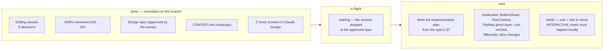

# Handoff — Trip detail: map-driven redesign (#154)

**From:** a local Claude Code session, 2026-09-20 · **Branch:** `claude/154-trip-detail-map-driven-redesign`
**Next session's job:** write the implementation plan, then build it. **No code has been written yet.**

## Read these first, in this order

| what | where |
|---|---|
| **The design spec** — the contract | `docs/superpowers/specs/2026-09-20-trip-detail-map-driven-redesign-design.md` |
| The 8 decisions and why the alternatives lost | `docs/adr/menunest-234-*.md` … `menunest-241-*.md` |
| Vocabulary (use these words in code and tests) | `CONTEXT.md` — Plan sheet, Detent, Plan panel, Ghost pin, Selected Stop, Compact stop card |
| The ticket | GitHub issue #154 (closes #6) |
| Repo rules that will bite you | `CLAUDE.md` — read it before your first commit |

**The screen mocks are the visual source of truth and are NOT in this repo.** They live in
Claude Design → *MenuNest design system* → Screens → `trip-detail-mobile` (4 frames) and
`trip-detail-desktop` (option A). A cloud session without the `DesignSync` tool cannot open
them; in that case build from the spec's §4–§6, which describe every element in words, and
leave the mock-diff to the local machine (see *What cloud cannot do*).

## What this session actually did

Read the trip code, ADRs and `CONTEXT.md`; researched the map-app bottom-sheet pattern on the
web; grilled the owner through 8 decisions one at a time, rendering two mock screens as the
questions; wrote an ADR per decision as it landed; wrote the spec; verified its load-bearing
claims against the code; got the spec approved. Nothing was implemented.

## Decisions this conversation made that no artifact records

Everything material is in an ADR or the spec. Two things are only here:

1. **The owner's pain ranking.** Asked what made the screen hard to use, the owner picked
   **all four** offered symptoms — pins not tappable, mobile map too small or fully occluding,
   too many tap layers, map zoomed out until stops pile up. Treat all four as in-scope
   acceptance criteria, not a menu.
2. **Why the branch is new.** This work was grilled while sitting on
   `claude/decision-map-per-user-cost-control`, which is an unrelated topic. The branch was
   cut fresh so #154 gets its own PR. That old branch still holds ~160 unrelated dirty files
   (mostly `.agents/skills/**`) — **they are not part of this work.**

## Assumed, not verified — do not treat as fact

- **`@vis.gl/react-google-maps`'s `AdvancedMarker` accepts an `onClick`** suitable for the
  pin-selection behaviour the spec requires. Not checked in this session. Verify before
  planning the selection task around it.
- **Google Maps renders grey tiles when its container's visible area changes without a
  container resize** (a detent change). This is carried over from ADR-026's note, not
  re-measured. The spec's "re-run `fitBounds` on detent change" mitigation is therefore a
  precaution, not a proven fix — confirm interactively.
- **`frontend/e2e/trips.reorder.spec.ts` self-skips** when the Day has fewer than 2 Stops
  (read in the source), so it may be a no-op in CI today. Do not take its passing as evidence
  the itinerary still works.
- The spec's **§11 assumptions** (cross-day ghost pin wording, detent not persisted,
  ghost toggle in `localStorage`, tablet gets the sheet) were approved as sensible defaults,
  not validated against real use.

## Verified in this session — you can rely on these

- `TripMap` route pins have **no** `onClick` (`TripMap.tsx:216-224`).
- `useDayRoute.ts:122` prepends `viewerLocation` to the route path and `TripMap.tsx:139-141`
  feeds that whole path to `fitBounds` — this is the "zoomed out across the province" bug.
- `tripsSlice.activeStopId` is declared with a reducer (`tripsSlice.ts:14,42`) and **read by
  nothing** — free to become `selectedStopId`.
- `AddPlacePreviewCard` already supports `secondaryLabel` / `onSecondary`, and `AddPlaceMode`
  wires that slot **only** for Discover's `choose` target (`AddPlaceMode.tsx:286-287`) — so
  the trip surface's slot is free for **เก็บเข้าคลัง**.
- `useGetItineraryQuery` returns **all** Days with their Stops, so "is this Place scheduled on
  another Day?" is answerable client-side with no new endpoint.
- `/discover` already runs the target layout (`DiscoverPage.tsx:170-241`) — but it is
  **out of scope** (menunest-237). Do not refactor it.

## Suggested skills

These are plugin skills from the originating machine. **They may be absent on a cloud
session** — if a name does not resolve, do not hunt for it; the spec is self-contained and
describes the target screen in full.

| skill | for |
|---|---|
| `dev-workflows:sp-writing-plans` | the immediate next step — turn the spec into a task-by-task plan |
| `dev-workflows:sp-subagent-driven-development` *or* `superpowers:executing-plans` | executing that plan |
| `dev-workflows:scrutinize` | reviewing the diff before the PR |
| `dev-workflows:debug-mantra` | only if something misbehaves — verify the cause before fixing |

If none resolve: write the plan by hand from the spec's §7 (it already names the component
split), and make each task carry its own files, commands and checks.

## Repo rules that will cost you a commit if you miss them

- **A pre-commit hook runs the whole suite** — backend `dotnet build` + `dotnet test`
  (Release) and frontend `tsc --noEmit` + `npm run build`. Every commit must leave the whole
  suite green. Do not `--no-verify`.
  **Caveat, measured on 2026-09-20:** `git config core.hooksPath` is `frontend/.husky/_`, and
  on the originating machine that directory is **empty** — so the hook did **not** run on the
  two commits that carry this handoff, and it will not run in a fresh clone either until
  husky is installed (`npm install` in `frontend/`). Those commits are docs-only, so nothing
  was skipped that mattered. Before you commit **code**, either install husky or run the four
  checks by hand — do not assume the gate is armed.
- **Never `git add -A` / `git add .`** — `daily-state.md` and `AGENTS.md` are working files
  that must never enter a feature commit. Stage explicit paths.
- **Every commit references the issue** — `type(scope): summary (#154)`, or
  `(closes #154)` on the last one.
- **Never push `main`.** Pushing `main` deploys to prod.
- **Minting a new ADR number** requires the global scan across every ref and worktree — it is
  in the grilling skill's `ADR-FORMAT.md`. The current max is `menunest-241`, but re-run the
  scan; parallel sessions work this repo.
- This work is **frontend-only**. No EF migration, no backend change, so the "entity and its
  mapping must land in one commit" rule does not apply here.

## What cloud cannot do — leave these for the local machine

The repo has **no component/visual test harness** (`vite.config.ts` runs vitest in
`environment: 'node'`). `tsc`, `npm run build` and vitest cannot see a rendering bug, and the
review gates are blind to visual fidelity — CLAUDE.md records three separate incidents
(#33, #46, #97). So a cloud session can write the code, the unit tests and the Playwright
specs, but **must not declare the work done**:

1. The **mock-fidelity diff** (open the two Claude Design cards, compare tokens, colours and
   structure against the built screen) has to happen where `DesignSync` and a browser exist.
2. The **interactive smoke test** on a phone viewport and a desktop viewport — map tiles after
   a detent change, the armed-capture banner, ghost-pin density on a Place-heavy Trip — has to
   happen on a machine that can run the app against real Google Maps.

Say so in the PR rather than claiming verification you could not perform.

## Launching and getting the work back

- **Web:** claude.ai/code → *Create session* → this repo → branch
  `claude/154-trip-detail-map-driven-redesign`.
- **CLI:** `claude --cloud "Read docs/superpowers/handoffs/2026-09-20-trip-detail-map-driven-redesign.md and continue from it."`
  (if `claude` is not on the PATH, use the web route).

The cloud session works on its own `claude/…` branch and can open a PR. Locally, pick it up
with `claude --teleport <session>` or `git fetch` + checkout. **Before merging**, on this
machine: re-run the pre-commit suite, do the two checks above, and re-run the ADR number scan
if the cloud session added an ADR.
