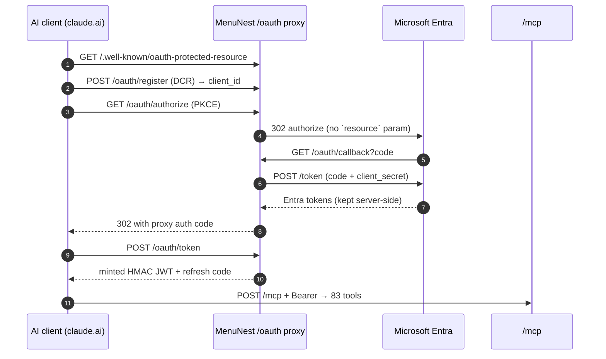

# Professional README (hiring demo) Implementation Plan

> **For agentic workers:** REQUIRED SUB-SKILL: Use superpowers:subagent-driven-development (recommended) or superpowers:executing-plans to implement this plan task-by-task. Steps use checkbox (`- [ ]`) syntax for tracking.

**Goal:** Turn the root `README.md` into a portfolio front door that an evaluating reader can judge in 30 seconds, backed by five screenshots of the real shipped UI.

**Architecture:** Operational content moves out of the README into `docs/development.md` and `docs/deployment.md` verbatim, linked back. A new opt-in Playwright spec drives the real SPA against fabricated API responses and writes five PNGs into `docs/images/`, which are committed so the README renders for a reader who runs nothing. Two new mock-route modules (`tripRoutes`, `chatRoutes`) are required because `mockApi` has no coverage for `/trips` or `/ai-assistant`.

**Tech Stack:** Playwright 1.x (`@playwright/test`), React 19.2.4 + Vite 8.0.4, TypeScript 6.0.2, .NET 10 backend (only for the pre-commit hook), Markdown + Mermaid.

**Spec:** [`docs/superpowers/specs/2026-09-05-professional-readme-demo-design.md`](../specs/2026-09-05-professional-readme-demo-design.md)

**Tracking issue:** [#149](https://github.com/ThodsaphonSonthiphin/MenuNest/issues/149)

**Branch:** `claude/professional-readme-demo-u8x26h`

## Global Constraints

- **Every commit references the issue.** Subject ends with `(#149)`, or `Refs #149` in the body. Never `(closes #149)` until the final task.
- **`git add <explicit paths>` only.** Never `git add -A` / `git add .`. `daily-state.md` and `AGENTS.md` must never enter a commit.
- **The pre-commit hook runs the full suite** (`frontend/.husky/pre-commit`, `set -e`): backend `dotnet build` + `dotnet test` (Release), then frontend `tsc --noEmit` + `npm run build`. Do **not** use `--no-verify`. In a container without the SDK, install it first: `curl -fsSL https://dot.net/v1/dotnet-install.sh | bash -s -- --channel 10.0 --install-dir /opt/dotnet10` then `export PATH="/opt/dotnet10:$PATH"`.
- **Local Playwright runs need two things** this repo does not provide: `cp frontend/.env.example frontend/.env` (gitignored, `.gitignore:109`), and a Chromium override because the container ships build 1194 while the pinned Playwright wants 1223 — `PW_CHROMIUM_PATH=/opt/pw-browsers/chromium-1194/chrome-linux/chrome`.
- **Never commit `executablePath` into `playwright.config.ts`.** CI installs its own browsers; a hardcoded path breaks it. It is read from an env var only.
- **The e2e suite is red on `main`** (31 failed / 17 skipped / 99 passed at `01447e1`) for reasons documented in [#150](https://github.com/ThodsaphonSonthiphin/MenuNest/issues/150). A green suite is **not** the gate for any task here. The gate is: the tasks' own tests pass. Do not fix, skip, or touch the #150 failures.
- **No claim in the README may assert CI is passing.**
- **Numbers are load-bearing.** Every count in the README must be re-verified with the command in spec §8 at implementation time, not copied from this plan.
- **Verified values** (2026-09-05): 83 MCP tools · 8 tool classes · 983 backend tests · 36 e2e specs · 61 vitest files · 215 ADRs · 55 specs · .NET 10 · React 19.2.4 · TypeScript 6.0.2 · Vite 8.0.4 · RTK 2.11.2.

---

## File Structure

| file | responsibility |
|---|---|
| `docs/development.md` | **new** — prerequisites, external-account table, setup commands. Moved verbatim from `README.md:85`–`:127`. |
| `docs/deployment.md` | **new** — Azure split, App Service settings, SWA settings, Entra registration. Moved verbatim from `README.md:128`–`:172`. |
| `frontend/e2e/helpers/mockRoutes/tripRoutes.ts` | **new** — stubs `GET /api/trips` and `GET /api/me` for the Trips screen. |
| `frontend/e2e/helpers/mockRoutes/chatRoutes.ts` | **new** — stubs `GET /api/chat/conversations` and its messages for the AI assistant screen. |
| `frontend/e2e/helpers/mockRoutes/index.ts` | modify — register the two new mock factories on `createMockApi`. |
| `frontend/e2e/screenshots.spec.ts` | **new** — opt-in spec writing five PNGs to `docs/images/`. |
| `docs/images/*.png` | **new** — five committed screenshots. |
| `README.md` | rewritten. |

---

### Task 1: Move the operational docs out of the README

Splitting first means the README rewrite (Task 5) starts from a file that no longer contains the content it is supposed to shed, so the two changes never conflict.

**Files:**
- Create: `docs/development.md`
- Create: `docs/deployment.md`
- Modify: `README.md` (delete lines 85–172; add a "Running it" section linking to both)

**Interfaces:**
- Consumes: nothing.
- Produces: `docs/development.md` and `docs/deployment.md` at those exact paths. Task 5 links to both by relative path.

- [ ] **Step 1: Read the two blocks that are moving**

```bash
cd /home/user/MenuNest
sed -n '85,127p' README.md   # Local Development → docs/development.md
sed -n '128,172p' README.md  # Deployment (Azure) → docs/deployment.md
```

Expected: the first ends just before `## Deployment (Azure)`; the second ends just before `## Contributing`.

- [ ] **Step 2: Create `docs/development.md`**

Write a file whose body is **lines 85–127 verbatim**, with only these two changes: retitle the `## Local Development` heading to `# Local Development`, and add this line directly under the title:

```markdown
> Part of [MenuNest](../README.md). This is the operational setup guide; the README is the project overview.
```

Do not reword the prerequisites table, the external-account table, the setup commands, or the note about VAPID/Gemini/Syncfusion. They are correct and in use.

- [ ] **Step 3: Create `docs/deployment.md`**

Write a file whose body is **lines 128–172 verbatim**, retitling `## Deployment (Azure)` to `# Deployment (Azure)` and adding the same back-link line under the title. The App Service settings table, the SWA settings table and the Entra ID App Registration steps must be byte-identical to what they replace — a reworded setting name is a production incident, not a typo.

- [ ] **Step 4: Delete the moved block from the README and link out**

Delete `README.md` lines 85–172. In their place insert:

```markdown
## Running it

```bash
# Backend  → https://localhost:5001/swagger
cd backend && dotnet run --project src/MenuNest.WebApi

# Frontend → http://localhost:5173
cd frontend && npm install && npm run dev
```

Full prerequisites, external accounts and first-run setup: **[docs/development.md](docs/development.md)**
Azure topology and every configuration setting: **[docs/deployment.md](docs/deployment.md)**
```

- [ ] **Step 5: Verify no content was lost**

```bash
cd /home/user/MenuNest
for s in "ConnectionStrings__DefaultConnection" "AzureAd__Audience" "VITE_MSAL_CLIENT_ID" "web-push generate-vapid-keys" "access_as_user" "Azurite"; do
  printf '%-40s %s\n' "$s" "$(grep -rl "$s" docs/development.md docs/deployment.md 2>/dev/null | tr '\n' ' ')"
done
```

Expected: every string resolves to one of the two new files. An empty right-hand column means content was dropped in the move — go back to Step 2 or 3.

- [ ] **Step 6: Verify every relative link resolves**

```bash
cd /home/user/MenuNest
grep -oE '\]\(([^)]+\.md)\)' README.md docs/development.md docs/deployment.md \
  | sed -E 's/.*\((.*)\)/\1/' | sort -u \
  | while read -r l; do [ -f "$l" ] || [ -f "docs/$l" ] || echo "BROKEN: $l"; done
```

Expected: no output.

- [ ] **Step 7: Commit**

```bash
cd /home/user/MenuNest
export PATH="/opt/dotnet10:$PATH"
git add README.md docs/development.md docs/deployment.md
git commit -m "docs: move setup and Azure config out of the README (#149)"
```

---

### Task 2: Mock routes for the Trips screen

**Files:**
- Create: `frontend/e2e/helpers/mockRoutes/tripRoutes.ts`
- Modify: `frontend/e2e/helpers/mockRoutes/index.ts`
- Test: `frontend/e2e/trips.mock.spec.ts` (temporary — deleted in Step 6)

**Interfaces:**
- Consumes: `recordRequest`, `RequestCapture` from `./types`.
- Produces: `createTripMocks(page, capture)` returning a chainable object with `.me(data)`, `.trips(rows)` and `.apply()`. Exported fixture `tripsFixture: TripDto[]`. Registered on `createMockApi` as `.trips`. Task 4 calls `mockApi.trips.apply()`.

- [ ] **Step 1: Write the failing test**

Create `frontend/e2e/trips.mock.spec.ts`:

```ts
import {expect} from '@playwright/test'
import {test} from './fixtures/healthFixture'

test.describe('Trips — mock routes', () => {
  test('the mocked trip list renders on /trips', async ({authedPage: page, mockApi}) => {
    await mockApi.trips.apply()

    await page.goto('/trips')
    await page.waitForLoadState('networkidle')

    await expect(page.getByRole('heading', {name: /ทริปของฉัน/})).toBeVisible()
    await expect(page.getByText('เชียงใหม่ 3 วัน')).toBeVisible()
  })
})
```

- [ ] **Step 2: Run it to make sure it fails**

```bash
cd /home/user/MenuNest/frontend
cp -n .env.example .env
npx playwright test trips.mock.spec.ts --reporter=line
```

Expected: FAIL. `mockApi.trips` does not exist yet, so the run errors on `Cannot read properties of undefined (reading 'apply')`.

- [ ] **Step 3: Create the mock module**

Create `frontend/e2e/helpers/mockRoutes/tripRoutes.ts`:

```ts
import type {Page} from '@playwright/test'
import {recordRequest, type RequestCapture} from './types'

/**
 * `/trips` is NOT behind FamilyRequiredRoute (src/router.tsx:55-77), so it
 * needs no familyId to render — but the app shell still reads /api/me, and
 * the grid is empty without /api/trips. Both are stubbed here.
 *
 * TravelMode is 'Drive' | 'Walk' | 'Transit' (api.ts:667). Not 'Driving'.
 */

const meResponse = {
  userId: 'user-1',
  email: 'test@menunest.app',
  displayName: 'ทศพล',
  familyId: 'family-1',
  familyName: 'ครอบครัวทดสอบ',
  familyInviteCode: 'TEST01',
  authProvider: 'Google',
  homePath: null,
  uvWarnThreshold: null,
  feelsLikeWarnThreshold: null,
  activeTargetRule: null,
}

export const tripsFixture = [
  {
    id: 'trip-1', name: 'เชียงใหม่ 3 วัน', destination: 'เชียงใหม่',
    startDate: '2026-10-10', dayCount: 3, defaultTravelMode: 'Drive', isDaily: false,
  },
  {
    id: 'trip-2', name: 'ทะเลหัวหิน', destination: 'หัวหิน',
    startDate: '2026-11-02', dayCount: 2, defaultTravelMode: 'Drive', isDaily: false,
  },
  {
    id: 'trip-3', name: 'เดินเล่นเยาวราช', destination: 'กรุงเทพฯ',
    startDate: '2026-09-20', dayCount: 1, defaultTravelMode: 'Transit', isDaily: true,
  },
]

interface TripConfig {
  me: unknown
  trips: unknown[]
}

export const createTripMocks = (page: Page, capture: RequestCapture) => {
  const config: TripConfig = {me: meResponse, trips: tripsFixture}

  const self = {
    me: (data: unknown) => {
      config.me = data
      return self
    },
    /** Pass [] to render the empty state. */
    trips: (rows: unknown[]) => {
      config.trips = rows
      return self
    },
    apply: async () => {
      await page.route(/\/api\/me(\?|$)/, async (route, request) => {
        await recordRequest(route, request, capture)
        await route.fulfill({json: config.me})
      })
      await page.route(/\/api\/trips(\?|$)/, async (route, request) => {
        await recordRequest(route, request, capture)
        await route.fulfill({json: {result: config.trips, count: config.trips.length}})
      })
    },
  }

  return self
}

export type TripMocks = ReturnType<typeof createTripMocks>
```

- [ ] **Step 4: Register it on `createMockApi`**

In `frontend/e2e/helpers/mockRoutes/index.ts`, add the import beside the existing ones and the key beside the existing keys:

```ts
import {createTripMocks} from './tripRoutes'
```

```ts
export const createMockApi = (page: Page, capture: RequestCapture) => ({
  episodes: createEpisodeMocks(page, capture),
  report: createReportMocks(page, capture),
  drugs: createDrugMocks(page, capture),
  settings: createSettingsMocks(page, capture),
  budget: createBudgetMocks(page, capture),
  trips: createTripMocks(page, capture),
})
```

- [ ] **Step 5: Run the test to verify it passes**

```bash
cd /home/user/MenuNest/frontend
npx playwright test trips.mock.spec.ts --reporter=line
```

Expected: PASS, 1 passed.

If it fails on a missing Chromium (`Executable doesn't exist at .../chromium_headless_shell-1223`), the container's browser build differs. Re-run with the override rather than `npx playwright install`:

```bash
PW_CHROMIUM_PATH=/opt/pw-browsers/chromium-1194/chrome-linux/chrome \
  npx playwright test trips.mock.spec.ts --reporter=line
```

This requires the `PW_CHROMIUM_PATH` wiring added in Task 4 Step 3. If Task 4 has not run yet, temporarily add `launchOptions: {executablePath: process.env.PW_CHROMIUM_PATH}` under `use` in `playwright.config.ts`, verify, then revert it before committing.

- [ ] **Step 6: Delete the temporary spec**

```bash
rm /home/user/MenuNest/frontend/e2e/trips.mock.spec.ts
```

It proved the mock works; Task 4's screenshot spec is its permanent consumer, and leaving it would add a 37th spec to a suite that is already red for unrelated reasons.

- [ ] **Step 7: Commit**

```bash
cd /home/user/MenuNest
export PATH="/opt/dotnet10:$PATH"
git add frontend/e2e/helpers/mockRoutes/tripRoutes.ts frontend/e2e/helpers/mockRoutes/index.ts
git commit -m "test(e2e): mock routes for the Trips screen (#149)"
```

---

### Task 3: Mock routes for the AI assistant screen

**Files:**
- Create: `frontend/e2e/helpers/mockRoutes/chatRoutes.ts`
- Modify: `frontend/e2e/helpers/mockRoutes/index.ts`
- Test: `frontend/e2e/chat.mock.spec.ts` (temporary — deleted in Step 6)

**Interfaces:**
- Consumes: `recordRequest`, `RequestCapture` from `./types`.
- Produces: `createChatMocks(page, capture)` returning a chainable object with `.me(data)`, `.conversations(rows)`, `.messages(rows)` and `.apply()`. Registered on `createMockApi` as `.chat`. Task 4 calls `mockApi.chat.apply()`.

- [ ] **Step 1: Write the failing test**

Create `frontend/e2e/chat.mock.spec.ts`:

```ts
import {expect} from '@playwright/test'
import {test} from './fixtures/healthFixture'

test.describe('AI assistant — mock routes', () => {
  test('the mocked conversation renders on /ai-assistant', async ({authedPage: page, mockApi}) => {
    await mockApi.chat.apply()

    await page.goto('/ai-assistant')
    await page.waitForLoadState('networkidle')

    await expect(page.getByRole('heading', {name: 'AI Assistant'})).toBeVisible()
    await expect(page.getByText(/มีไข่กับหมูสับ/)).toBeVisible()
  })
})
```

- [ ] **Step 2: Run it to make sure it fails**

```bash
cd /home/user/MenuNest/frontend
npx playwright test chat.mock.spec.ts --reporter=line
```

Expected: FAIL — `mockApi.chat` is undefined.

- [ ] **Step 3: Create the mock module**

Create `frontend/e2e/helpers/mockRoutes/chatRoutes.ts`:

```ts
import type {Page} from '@playwright/test'
import {recordRequest, type RequestCapture} from './types'

/**
 * `/ai-assistant` IS behind FamilyRequiredRoute (src/router.tsx:79), so
 * /api/me must answer with a familyId or the page renders
 * "Could not load your profile." instead of the chat.
 *
 * Endpoints (api.ts:1190-1220):
 *   GET /api/chat/conversations                  → ConversationSummaryDto[]
 *   GET /api/chat/conversations/{id}/messages    → ChatMessageDto[]
 */

const meResponse = {
  userId: 'user-1',
  email: 'test@menunest.app',
  displayName: 'ทศพล',
  familyId: 'family-1',
  familyName: 'ครอบครัวทดสอบ',
  familyInviteCode: 'TEST01',
  authProvider: 'Google',
  homePath: null,
  uvWarnThreshold: null,
  feelsLikeWarnThreshold: null,
  activeTargetRule: null,
}

export const conversationsFixture = [
  {id: 'conv-1', title: 'เมนูเย็นนี้', createdAt: '2026-09-01T10:00:00Z', updatedAt: '2026-09-01T10:04:00Z'},
]

export const messagesFixture = [
  {
    id: 'msg-1', role: 'user',
    content: 'ตอนนี้มีไข่กับหมูสับ ทำอะไรกินดี',
    structuredData: null, createdAt: '2026-09-01T10:00:00Z',
  },
  {
    id: 'msg-2', role: 'assistant',
    content: 'จากของในสต็อก ทำได้ 2 เมนูครับ — ไข่เจียวหมูสับ และข้าวคลุกกะปิ ต้องการให้เพิ่มลงแผนมื้อเย็นวันนี้ไหม',
    structuredData: null, createdAt: '2026-09-01T10:00:12Z',
  },
]

interface ChatConfig {
  me: unknown
  conversations: unknown[]
  messages: unknown[]
}

export const createChatMocks = (page: Page, capture: RequestCapture) => {
  const config: ChatConfig = {
    me: meResponse,
    conversations: conversationsFixture,
    messages: messagesFixture,
  }

  const self = {
    me: (data: unknown) => {
      config.me = data
      return self
    },
    /** Pass [] to render the no-conversation empty state. */
    conversations: (rows: unknown[]) => {
      config.conversations = rows
      return self
    },
    messages: (rows: unknown[]) => {
      config.messages = rows
      return self
    },
    apply: async () => {
      await page.route(/\/api\/me(\?|$)/, async (route, request) => {
        await recordRequest(route, request, capture)
        await route.fulfill({json: config.me})
      })
      await page.route(/\/api\/chat\/conversations\/[^/]+\/messages(\?|$)/, async (route, request) => {
        await recordRequest(route, request, capture)
        await route.fulfill({json: config.messages})
      })
      await page.route(/\/api\/chat\/conversations(\?|$)/, async (route, request) => {
        await recordRequest(route, request, capture)
        await route.fulfill({json: config.conversations})
      })
    },
  }

  return self
}

export type ChatMocks = ReturnType<typeof createChatMocks>
```

The messages route is registered **before** the conversations route on purpose: Playwright matches routes in reverse registration order, so the broader `/api/chat/conversations` pattern must be registered last to avoid swallowing the `/messages` request.

- [ ] **Step 4: Register it on `createMockApi`**

In `frontend/e2e/helpers/mockRoutes/index.ts`:

```ts
import {createChatMocks} from './chatRoutes'
```

```ts
export const createMockApi = (page: Page, capture: RequestCapture) => ({
  episodes: createEpisodeMocks(page, capture),
  report: createReportMocks(page, capture),
  drugs: createDrugMocks(page, capture),
  settings: createSettingsMocks(page, capture),
  budget: createBudgetMocks(page, capture),
  trips: createTripMocks(page, capture),
  chat: createChatMocks(page, capture),
})
```

- [ ] **Step 5: Run the test to verify it passes**

```bash
cd /home/user/MenuNest/frontend
npx playwright test chat.mock.spec.ts --reporter=line
```

Expected: PASS, 1 passed.

- [ ] **Step 6: Delete the temporary spec**

```bash
rm /home/user/MenuNest/frontend/e2e/chat.mock.spec.ts
```

- [ ] **Step 7: Commit**

```bash
cd /home/user/MenuNest
export PATH="/opt/dotnet10:$PATH"
git add frontend/e2e/helpers/mockRoutes/chatRoutes.ts frontend/e2e/helpers/mockRoutes/index.ts
git commit -m "test(e2e): mock routes for the AI assistant screen (#149)"
```

---

### Task 4: The screenshot spec

**Files:**
- Create: `frontend/e2e/screenshots.spec.ts`
- Modify: `frontend/playwright.config.ts` (add the env-gated `executablePath` only)
- Output: `docs/images/{budget,health-quick-log,doctor-report,trips,ai-assistant}.png`

**Interfaces:**
- Consumes: `mockApi.budget`, `mockApi.episodes`, `mockApi.report`, `mockApi.trips` (Task 2), `mockApi.chat` (Task 3); the `authedPage` fixture.
- Produces: five PNG files at the paths above. Task 5 embeds them by those exact filenames.

- [ ] **Step 1: Write the spec**

Create `frontend/e2e/screenshots.spec.ts`:

```ts
import {mkdirSync} from 'node:fs'
import {dirname, resolve} from 'node:path'
import {fileURLToPath} from 'node:url'
import {expect} from '@playwright/test'
import {test} from './fixtures/healthFixture'

/**
 * Regenerates the README's screenshots. Opt-in — it writes files into the
 * repo, so it must never run as part of the normal e2e suite:
 *
 *   SHOOT=1 npx playwright test screenshots.spec.ts
 *
 * Every screen is driven against mocked API responses, so no backend, no
 * Azure, no SQL and no real health or financial data is involved.
 */

const baseDir = dirname(fileURLToPath(import.meta.url))
const OUT = resolve(baseDir, '../../docs/images')

const SYMPTOMS = [{id: 'symptom-migraine', name: 'Migraine', isCustom: false}]
const TRIGGERS = [{id: 'trigger-stress', name: 'Stress', isCustom: false}]

test.describe('README screenshots', () => {
  test.use({viewport: {width: 1280, height: 800}})

  test.beforeEach(() => {
    test.skip(!process.env.SHOOT, 'Set SHOOT=1 to regenerate docs/images/*.png')
    mkdirSync(OUT, {recursive: true})
  })

  test('budget', async ({authedPage: page, mockApi}) => {
    await mockApi.budget.apply()
    await page.goto('/budget')
    await expect(page.getByTestId('bdg-rta-hero')).toBeVisible()
    await page.waitForLoadState('networkidle')
    await page.screenshot({path: `${OUT}/budget.png`})
  })

  test('health quick log', async ({authedPage: page, mockApi}) => {
    await mockApi.episodes.activeNone().startSuccess().apply()
    await page.route('**/api/symptoms', (route) => route.fulfill({json: SYMPTOMS}))
    await page.route('**/api/triggers', (route) => route.fulfill({json: TRIGGERS}))
    await page.goto('/health/log')
    await expect(page.getByRole('button', {name: /บันทึก attack/})).toBeEnabled()
    await page.waitForLoadState('networkidle')
    await page.screenshot({path: `${OUT}/health-quick-log.png`})
  })

  test('doctor report', async ({page, mockApi}) => {
    await mockApi.report.publicReport().apply()
    await page.goto('/share/valid-token-abc')
    await expect(page.getByText('ทดสอบ ใจดี')).toBeVisible()
    await page.waitForLoadState('networkidle')
    await page.screenshot({path: `${OUT}/doctor-report.png`, fullPage: true})
  })

  test('trips', async ({authedPage: page, mockApi}) => {
    await mockApi.trips.apply()
    await page.goto('/trips')
    await expect(page.getByRole('heading', {name: /ทริปของฉัน/})).toBeVisible()
    await page.waitForLoadState('networkidle')
    await page.screenshot({path: `${OUT}/trips.png`})
  })

  test('ai assistant', async ({authedPage: page, mockApi}) => {
    await mockApi.chat.apply()
    await page.goto('/ai-assistant')
    await expect(page.getByRole('heading', {name: 'AI Assistant'})).toBeVisible()
    await page.waitForLoadState('networkidle')
    await page.screenshot({path: `${OUT}/ai-assistant.png`})
  })
})
```

- [ ] **Step 2: Verify it is skipped by default**

```bash
cd /home/user/MenuNest/frontend
npx playwright test screenshots.spec.ts --reporter=line
```

Expected: `5 skipped`. If any test *runs*, the `SHOOT` guard is wrong — fix it before continuing, or a normal CI run will start writing files into the repo.

- [ ] **Step 3: Add the env-gated browser override**

In `frontend/playwright.config.ts`, inside the existing `use: {...}` block, add:

```ts
    // Local escape hatch only: this container ships a Chromium build that
    // differs from the one the pinned Playwright expects. CI installs its
    // own browsers and leaves this unset, so the default resolution stands.
    launchOptions: {executablePath: process.env.PW_CHROMIUM_PATH},
```

`executablePath: undefined` is exactly the default, so an unset variable changes nothing for CI.

- [ ] **Step 4: Generate the screenshots**

```bash
cd /home/user/MenuNest/frontend
cp -n .env.example .env
SHOOT=1 PW_CHROMIUM_PATH=/opt/pw-browsers/chromium-1194/chrome-linux/chrome \
  npx playwright test screenshots.spec.ts --reporter=line
```

Expected: `5 passed`.

- [ ] **Step 5: Confirm the files exist and are not blank**

```bash
ls -la /home/user/MenuNest/docs/images/
```

Expected: five PNGs, each **> 30 KB**. A file under ~10 KB is almost certainly a blank or error page.

- [ ] **Step 6: Look at all five images**

Open each of the five PNGs and confirm, for each, that it shows the intended populated screen — not a login page, not "Could not load your profile.", not an empty state, not a Syncfusion trial banner covering the content.

This step is not optional and cannot be replaced by the size check. `CLAUDE.md` records two shipped incidents (#36, #46) where every automated gate passed on a visually broken render. The size check catches a blank file; only looking catches a wrong one.

- [ ] **Step 7: Commit**

```bash
cd /home/user/MenuNest
export PATH="/opt/dotnet10:$PATH"
git add frontend/e2e/screenshots.spec.ts frontend/playwright.config.ts docs/images
git commit -m "test(e2e): opt-in script that shoots the README's five screenshots (#149)"
```

---

### Task 5: Rewrite the README

**Files:**
- Modify: `README.md` (full rewrite)

**Interfaces:**
- Consumes: `docs/development.md`, `docs/deployment.md` (Task 1); the five PNGs in `docs/images/` (Task 4).
- Produces: the finished front door. Nothing depends on it.

- [ ] **Step 1: Re-verify every number before writing it**

```bash
cd /home/user/MenuNest
echo "MCP tools:    $(grep -rhoE '\[McpServerTool(,|\])' backend/src/MenuNest.McpServer --include=*.cs | wc -l)"
echo "tool classes: $(grep -rhoE '\[McpServerToolType\]' backend/src/MenuNest.McpServer --include=*.cs | wc -l)"
echo "tests:        $(grep -rho '\[Fact\]\|\[Theory\]' backend/tests --include=*.cs | wc -l)"
echo "e2e specs:    $(ls frontend/e2e/*.spec.ts | wc -l)"
echo "vitest files: $(find frontend/src -name '*.test.ts' | wc -l)"
echo "ADRs:         $(ls docs/adr/*.md | wc -l)"
echo "specs:        $(ls docs/superpowers/specs | wc -l)"
grep -E '"(react|typescript|vite)"' frontend/package.json
grep -h TargetFramework backend/src/MenuNest.WebApi/MenuNest.WebApi.csproj
```

Use whatever this prints. The spec's recorded values were true on 2026-09-05; if a number has moved, the command wins. Note `e2e specs` will now read one higher than the spec's 36, because Task 4 added `screenshots.spec.ts`.

- [ ] **Step 2: Write the README**

Replace `README.md` entirely, following spec §4's section order. Requirements that are not negotiable:

- **English throughout.** One sentence early stating the UI is Thai by design because the app is in daily use by the author's household.
- **Above the fold:** project name, a one-sentence description, a badge row (.NET 10 · React 19 · TypeScript 6 · Azure · MCP), and the first screenshot.
- **All six feature areas** — Health, Meal planning, Budget, Trips, Writing/Pomodoro/Discover, and the MCP server — one line each, each naming the non-obvious engineering problem inside it.
- **Five screenshots** embedded as `` with a one-line caption each.
- **No "Live Demo" link.** State plainly that production holds real health and financial data, which is why there is no public instance. The reason is the signal.
- **Links** to `docs/architecture.md`, `docs/development.md`, `docs/deployment.md`, `docs/adr/`.
- **The CI line states what runs, never that it passes.**

- [ ] **Step 3: Write the MCP section**

It carries the second target audience and has no UI, so it gets a diagram and real code. Include this Mermaid block, adapted from `docs/architecture.md` §13:

````markdown

````

State the reason the proxy exists, because that is the interesting part: Entra ID v2 rejects the RFC 8707 `resource` parameter that claude.ai mandates (`AADSTS500011`), so `MenuNest.WebApi` hosts its own OAuth 2.1 Authorization-Server facade at `/oauth/*` that absorbs the parameter, runs a clean flow against Entra server-side, keeps Entra tokens server-side, and mints its own HMAC JWT for `/mcp` (ADR-003, ADR-004).

Then this code block, lifted verbatim from `backend/src/MenuNest.McpServer/Tools/MealPlanTools.cs`:

````markdown
```csharp
[McpServerTool, Description("Add a recipe to a meal slot on a specific date")]
public async Task<MealPlanEntryDto> create_meal_plan_entry(
    [Description("Date for the meal")] DateOnly date,
    [Description("Meal slot: Breakfast, Lunch, or Dinner")] MealSlot mealSlot,
    [Description("Recipe ID")] Guid recipeId,
    [Description("Optional notes")] string? notes,
    CancellationToken ct)
    => await mediator.Send(new CreateMealPlanEntryCommand(date, mealSlot, recipeId, notes), ct);
```
````

Point out what it demonstrates: the `[Description]` annotations become the tool's schema, and the `IMediator` call is the same handler the SPA drives — the MCP surface shares the application layer rather than duplicating it. Add the per-class distribution so the count is checkable: Trip 26, Budget 24, Shopping 10, MealPlan 7, Recipe 5, Writing 4, Ingredient 4, Stock 3. Cite `menunest-213` — every function a feature adds is reachable over MCP.

- [ ] **Step 4: Verify links and images resolve**

```bash
cd /home/user/MenuNest
grep -oE '\]\(([^)]+)\)' README.md | sed -E 's/.*\((.*)\)/\1/' \
  | grep -v '^http' | sort -u \
  | while read -r l; do [ -e "$l" ] || echo "BROKEN: $l"; done
```

Expected: no output.

- [ ] **Step 5: Verify no stale or forbidden claims survive**

```bash
cd /home/user/MenuNest
grep -nE 'React 18|91 (MCP )?tools|Live Demo|CI (is )?(green|passing)|build passing' README.md \
  && echo "^^ FIX THESE" || echo "clean"
```

Expected: `clean`.

- [ ] **Step 6: Read the rendered README top to bottom**

Confirm the first screenful carries hero, badges and a screenshot; that all five images render; and that nothing reads as a claim you cannot back. This is a document whose whole purpose is first impressions — it gets read, not just linted.

- [ ] **Step 7: Commit**

```bash
cd /home/user/MenuNest
export PATH="/opt/dotnet10:$PATH"
git add README.md
git commit -m "docs: rewrite the README as a portfolio front door (closes #149)"
```

---

### Task 6: Final verification and push

**Files:** none modified.

**Interfaces:** consumes everything above.

- [ ] **Step 1: Confirm the working tree is clean**

```bash
cd /home/user/MenuNest && git status --short
```

Expected: empty. `frontend/.env` must not appear (it is gitignored at `.gitignore:109`); `frontend/package-lock.json` must not appear — if `npm install` modified it, `git checkout -- frontend/package-lock.json`.

- [ ] **Step 2: Confirm no scratch files were committed**

```bash
cd /home/user/MenuNest
git diff --stat origin/main...HEAD
```

Expected: only `README.md`, `docs/development.md`, `docs/deployment.md`, `docs/images/*.png`, `docs/adr/menunest-216-*.md`, `docs/superpowers/specs/2026-09-05-*.md`, `docs/superpowers/plans/2026-09-05-*.md`, `frontend/e2e/screenshots.spec.ts`, `frontend/e2e/helpers/mockRoutes/{tripRoutes,chatRoutes,index}.ts`, `frontend/playwright.config.ts`. Anything else — `pw-probe.config.ts`, `test-results/`, `daily-state.md`, `AGENTS.md` — must be removed from the branch.

- [ ] **Step 3: Confirm the screenshot spec stays out of normal runs**

```bash
cd /home/user/MenuNest/frontend && npx playwright test screenshots.spec.ts --reporter=line
```

Expected: `5 skipped`.

- [ ] **Step 4: Confirm the two new mock modules did not break existing specs**

```bash
cd /home/user/MenuNest/frontend
npx playwright test budget.smoke.spec.ts health.doctor-report.spec.ts --reporter=line
```

Expected: **unchanged from before this branch** — `health.doctor-report` passes; `budget.smoke` still fails its first test for the pre-existing `/api/me` reason in #150. A *newly* failing test here is this branch's fault and must be fixed. Do not "fix" the pre-existing budget failure — that is #150's, and the ticket rule means it needs its own commit against its own issue.

- [ ] **Step 5: Push**

```bash
cd /home/user/MenuNest
git push -u origin claude/professional-readme-demo-u8x26h
```

- [ ] **Step 6: Report honestly**

State: which of the five screenshots were visually inspected; that the suite as a whole is still red for #150's reasons and this branch did not change that; and the final verified numbers as printed in Task 5 Step 1.

---

## Self-Review

**Spec coverage**

| spec section | task |
|---|---|
| §3 deliverables — `docs/development.md`, `docs/deployment.md` | Task 1 |
| §3 — `screenshots.spec.ts`, `docs/images/*` | Task 4 |
| §3 — README rewrite | Task 5 |
| §4 README structure (8 sections, no Live Demo) | Task 5 Steps 2, 5 |
| §5 five screens | Task 4 Step 1 |
| §5 constraint 1 — gated pages need `/api/me` | Tasks 3, 4 (budget + chat mocks stub it) |
| §5 constraint 2 — no mocks for `/trips`, `/ai-assistant` | Tasks 2, 3 |
| §5 browser override must not reach CI | Task 4 Step 3 (env-gated), Global Constraints |
| §5 `.env` required locally | Task 2 Step 2, Task 4 Step 4 |
| §5a suite red, not a gate | Global Constraints, Task 6 Step 4 |
| §6 MCP diagram + real code block | Task 5 Step 3 |
| §7 engineering practice, no CI-green claim | Task 5 Steps 2, 5 |
| §8 claims verification | Task 5 Step 1 |
| §9 out of scope | Global Constraints (do not touch #150) |
| §10 acceptance criteria 1–8 | 1→T5S2/S5, 2→T5S2, 3→T1S5/S6, 4→T4S5, 5→T4S6, 6→T5S1, 7→T5S5, 8→#150 filed |

**Placeholder scan:** every code step carries the literal file content; no "TBD", no "similar to Task N", no "add error handling". Task 5's prose steps specify exact required elements and pair each with a grep that fails the task if they are missing.

**Type consistency:** `createTripMocks` / `createChatMocks` match their `index.ts` keys (`trips`, `chat`) and their Task 4 call sites (`mockApi.trips.apply()`, `mockApi.chat.apply()`). `TravelMode` uses `'Drive'`/`'Transit'` per `api.ts:667`, not `'Driving'`. `ConversationSummaryDto` (`id`, `title`, `createdAt`, `updatedAt`) and `ChatMessageDto` (`id`, `role`, `content`, `structuredData`, `createdAt`) match `api.ts:336` and `:343`. `TripDto` matches `api.ts:671`. The `meResponse` shape is copied from `budgetRoutes.ts`. ESM `import.meta.url` is used because `frontend/package.json` sets `"type": "module"`, matching `episodeRoutes.ts:7`.
