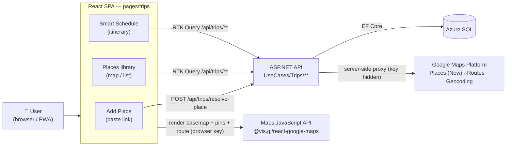
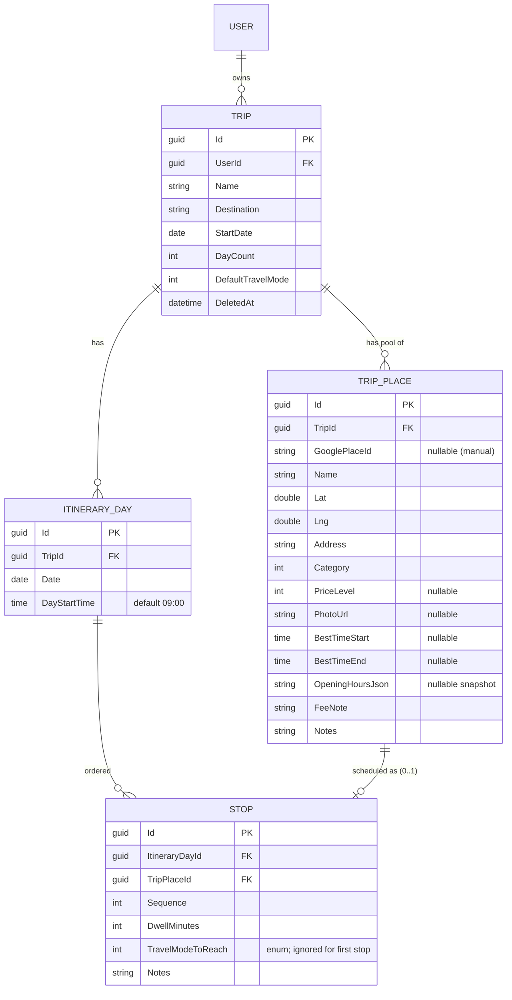
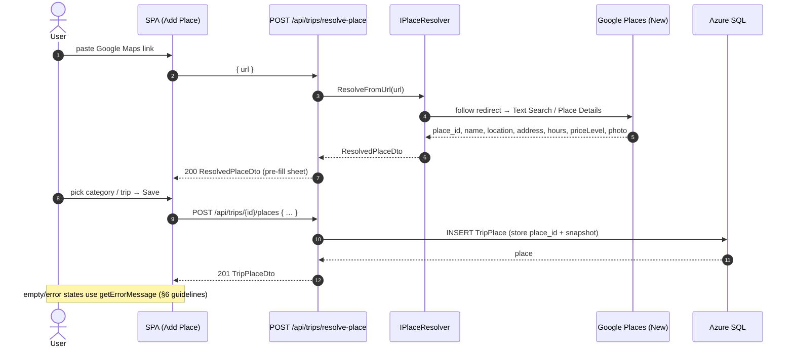

# Trip Planner — Design Spec (MVP)

**Date:** 2026-06-29
**Status:** Draft for review
**Module:** Trip Planner — MenuNest's fourth product line (after Meal Planning, Health, Budget)
**Decision records:** ADR-005, ADR-007, ADR-008, ADR-009, ADR-010 (ADR-006 superseded)
**Glossary:** see [CONTEXT.md](../../../CONTEXT.md) → "Travel & trip planning"
**Visual source of truth:** the "Trip Planner — Map-Forward" handoff (`README.md` + `Trip Planner — Map-Forward.dc.html`) — adopted per ADR-010.

---

## 1. Summary

A new **user-scoped** module that lets a person collect places from **Google Maps**
into a per-trip library, then arrange them into a **time-aware, map-forward
itinerary** that auto-computes arrival/leave times and flags whether each stop is
visited at a good time. The MVP delivers the first two of the user's five goals;
expense tracking is deferred.

| # | User goal (Thai) | MVP? |
|---|---|---|
| 1 | **สำรวจ** — collect places from Google Maps | ✅ MVP |
| 2 | **สร้างแผนการเดินทาง** — time-aware itinerary + map | ✅ MVP |
| 3 | **บันทึกค่าใช้จ่าย** — log expenses | ⛔ Phase 2 |
| 4 | **รวมค่าใช้จ่าย** — sum / split / FX | ⛔ Phase 2 |
| 5 | **สรุปงบทริป** — total + settle-up | ⛔ Phase 2 |

The reasons behind every choice live in the ADRs; this spec is the buildable detail.

### System context



---

## 2. Scope

**In (MVP):**

1. **Trip CRUD** — create / rename / delete a trip with a destination label, a
   **start date**, and a **day count** (calendar dates, ADR-005 owner = current user).
2. **Capture a place** by **pasting a Google Maps link** (ADR-007); the backend
   resolves it to authoritative place data and the SPA pre-fills an Add-Place sheet.
3. **Places library** per trip — list + **map** view, category pins, category filter.
4. **Itinerary (Smart Schedule)** per day — add stops from the library, **drag to
   reorder**, set **dwell minutes** and **travel mode** per leg, with the **schedule
   cascade** computing arrival/leave times and the **best-time / opening-hours flag**
   (ADR-008).
5. **Map-forward UI** (ADR-010) — map is the hero; teal Trips accent; Google basemap
   with numbered pins + route polyline.
6. **Responsive** — mobile-first; desktop split view (itinerary column + full-height map).

**Out (Phase 2 — leave clean seams, do not build):**

- All expenses: logging, per-person **split**, multi-currency + **FX**, **settle-up**,
  trip cost **summary** (ADR-009).
- **Traveller / `TripMember`** model (needed only by splitting).
- **Capture** via PWA **share-target** and **bookmarklet** (MVP = paste-link only).
- Route **auto-optimization** (ADR-008); cross-trip user-level **place library**.
- Google Maps **Places enrichment beyond v1 needs** and third-party **crowd/popular-times**
  (crowd-by-hour is a **manual** field for v1).

---

## 3. Domain model (`MenuNest.Domain`)

User-scoped, following the Health-module conventions (`sealed class : Entity`,
private setters, EF private ctor, static `Create` factory with `DomainException`
validation, soft-delete via `DeletedAt`, JSON-backed collections).



### 3.1 Entities

**`Trip`** — `UserId`, `Name`, `Destination?`, `StartDate (DateOnly)`,
`DayCount (int ≥ 1)`, `DefaultTravelMode (TravelMode)`, `DeletedAt?`.
Factory `Create(userId, name, startDate, dayCount, …)`. On create, the handler
seeds `DayCount` `ItineraryDay` rows (`StartDate + i`). `Rename`, `Reschedule`
(adjust start/day-count, adding/removing trailing days), `SoftDelete`.

**`TripPlace`** — the per-trip candidate pool (ADR — trip-scoped). `TripId`,
`GooglePlaceId?` (the durable Google reference, ADR-007 — null for manual entries),
`Name`, `Lat`, `Lng`, `Address`, `Category (PlaceCategory)`, `PriceLevel? (0–4)`,
`PhotoUrl?`, `BestTimeStart?`/`BestTimeEnd? (TimeOnly)`, `OpeningHoursJson?` (cached
snapshot from Places — refreshed within ToS caching limits), `FeeNote?`, `Notes?`.
Factory `Create(tripId, …)`, `UpdateDetails`, `SetBestTime`, `Delete`.
**Uniqueness:** `(TripId, GooglePlaceId)` unique when `GooglePlaceId` is non-null
(dedupe re-pastes of the same place).

**`ItineraryDay`** — `TripId`, `Date (DateOnly)`, `DayStartTime (TimeOnly, default
09:00)`. Owns ordered `Stop`s. `SetStartTime`.

**`Stop`** — `ItineraryDayId`, `TripPlaceId` (must belong to the same trip),
`Sequence (int)`, `DwellMinutes (int > 0, default 60)`, `TravelModeToReach
(TravelMode)` — the mode for the leg arriving from the previous stop; ignored for
`Sequence == 0`. `Notes?`. `AddFromPlace`, `Reorder`, `SetDwell`, `SetTravelMode`,
`Remove`. Arrival/leave times are **derived (not stored)** — see §5.

> **Note — no stored arrival times.** The cascade is recomputed; storing it would
> drift on every reorder. Travel times are cached separately (§6.2), not on `Stop`.

### 3.2 Enums (`MenuNest.Domain.Enums`)

- `PlaceCategory { Stay, Eat, See, Cafe, Shop, Other }` — drives pin colour
  (handoff tokens §10).
- `TravelMode { Drive, Walk, Transit }` — maps to Routes API `travelMode`.

### 3.3 Phase-2 seams (not built)

`TripMember`, `TripExpense`, `ExpenseShare`, `TripFxRate` are intentionally absent.
A `Trip` gains them additively later (ADR-009). Nothing in the MVP model blocks that.

---

## 4. Backend (`MenuNest.Application` + `MenuNest.Infrastructure` + `MenuNest.WebApi`)

CQRS per the repo pattern (`UseCases/Trips/<Feature>/` → Command/Query + Validator +
Handler; `IMediator` in a `TripsController`). All handlers resolve the user via
`UserProvisioner.GetOrProvisionCurrentAsync` (**no** `RequireFamilyAsync` — ADR-005)
and scope every query by `Trip.UserId`.

### 4.1 Use cases

| Area | Commands / Queries |
|---|---|
| Trips | `CreateTrip`, `UpdateTrip`, `DeleteTrip`, `ListTrips`, `GetTripDetail` |
| Places | `ResolvePlace` (command — calls Google), `AddTripPlace`, `UpdateTripPlace`, `DeleteTripPlace`, `ListTripPlaces` |
| Itinerary | `GetItinerary` (days + stops + cached leg times), `AddStopFromPlace`, `RemoveStop`, `ReorderStops`, `UpdateStop` (dwell / travel mode), `SetDayStartTime` |

### 4.2 API endpoints

| Route | Purpose |
|---|---|
| `GET /api/trips` | list current user's trips |
| `POST /api/trips` | create `{ name, destination?, startDate, dayCount, defaultTravelMode }` |
| `GET /api/trips/{id}` | trip detail (days + stops + places) |
| `PUT /api/trips/{id}` · `DELETE /api/trips/{id}` | update / soft-delete |
| `POST /api/trips/resolve-place` | `{ url }` → `ResolvedPlaceDto` (server-side unfurl + Places lookup, ADR-007) |
| `GET /api/trips/{id}/places` · `POST` · `PUT /places/{pid}` · `DELETE /places/{pid}` | trip place pool |
| `GET /api/trips/{id}/itinerary` | days → stops + per-leg travel times |
| `POST /api/trips/{id}/days/{dayId}/stops` | add stop from a place |
| `PATCH /api/trips/{id}/stops/{stopId}` | set dwell / travel mode |
| `POST /api/trips/{id}/days/{dayId}/reorder` | `{ orderedStopIds }` → recompute leg cache |
| `DELETE /api/trips/{id}/stops/{stopId}` | remove stop |
| `PATCH /api/trips/{id}/days/{dayId}` | set day start time |

`ResolvedPlaceDto = { googlePlaceId, name, lat, lng, address, category, priceLevel?, photoUrl?, openingHoursJson? }`.
Domain/validation errors flow through the existing `ProblemDetails` middleware (HTTP 400).

### 4.3 Google Maps Platform integration (ADR-007)

All Google REST calls are **server-side** (Critical Failure CF1 — `googleapis.com`
has no permissive CORS). The browser only loads the Maps JavaScript API for display.

- **`IPlaceResolver`** (Infrastructure) — `ResolveFromUrl(url)`:
  1. Follow the `maps.app.goo.gl` / `goo.gl/maps` redirect server-side to the long URL.
  2. Extract a reference (place name / coords / `ftid`) from the URL.
  3. Call **Places API (New)** Text Search / Place Details to obtain the
     authoritative `place_id` + name + location + address + `regularOpeningHours`
     + `priceLevel` + a photo name. **Never** trust scraped coords as stored truth
     (ToS — place data must come from a live API).
  4. Return `ResolvedPlaceDto`. Persist only the `place_id` long-term; treat the rest
     as a cache snapshot.
- **`IRouteService`** — `GetLegTimes(origin[], dest[], mode)` via the **Routes API**
  `computeRouteMatrix` (NOT Distance Matrix — disabled). Returns seconds + metres
  per leg. Used to fill the schedule (§6).
- **`IGeocoder`** (optional) — Geocoding REST for manual address → coords.
- **Credentials & config:** a backend-only key. Local/dev = the **Maps Demo Key**
  (free, no billing); production = a restricted key. Config:
  `GoogleMaps__ApiKey` (server), `GoogleMaps__BrowserKey` (Maps JS, referrer-restricted),
  `GoogleMaps__MapId` (or `DEMO_MAP_ID`). If `GoogleMaps__ApiKey` is unset, the
  resolve endpoint returns a friendly "paste failed — enter manually" error and the
  Routes service falls back to a Haversine × 1.3 road-factor estimate.
- **Compliance:** carry the `gmp_git_agentskills_v1` attribution id on the map; store
  `place_id` only as the durable datum; surface the cost / key-restriction / ToS
  appendix (§13). Implementation **must** load the `google-maps-platform` skill
  (fetch index + per-product sub-skills) and run `compliance-review` before writing
  Maps code.

### 4.4 Capture / resolve flow



---

## 5. Schedule cascade (the "calculation")

Per ADR-008 — deterministic forward cascade per day, then flag. **No auto-optimize.**

```
arrival[0]   = day.DayStartTime
depart[i]    = arrival[i] + dwellMinutes[i]
arrival[i+1] = depart[i] + travelTime(stop[i] → stop[i+1], mode[i+1])
dayEnd       = depart[last]
```

`travelTime` comes from `IRouteService` (Routes API), **cached per (originPlaceId,
destPlaceId, mode)** so a reorder/dwell change re-cascades without re-billing
(§6.2). Fallback when Routes is unavailable: `haversine(a,b) / avgSpeed[mode] × 1.3`.

**Best-time / opening-hours flag** — for each stop, compare its computed
`[arrival, depart]` window against:
- the place's **best-time window** (`BestTimeStart`–`BestTimeEnd`, user-entered), and
- the **opening hours** (`OpeningHoursJson` snapshot).

→ **green** when arrival is inside the best window **and** the place is open;
**amber** otherwise (before opening / after closing / outside best window / day
overflow), with a suggestion ("ไปถึงเร็วกว่าช่วงที่ดี — ย้ายไปท้ายวัน?"). The user
reorders manually (drag); a one-tap "↻ ย้าย & คำนวณใหม่" shifts a single stop and
re-cascades. Mock: [docs/mocks/trip-day-timeline-mock.html](../../mocks/trip-day-timeline-mock.html)
(the budget/expense figures shown there are illustrative — not built, ADR-009).

The cascade itself runs **client-side** in a `useSchedule` hook (pure, recomputes on
reorder/dwell/mode change); it consumes leg times the server provides with the
itinerary payload.

---

## 6. Frontend (`frontend/src/pages/trips/`)

Per `docs/frontend-guidelines.md`. Mirrors the **Budget** feature's shape
(mobile-first, own accent, list + detail). Server state in `shared/api/api.ts`;
slice holds UI state only.

### 6.1 Structure & wiring

```
src/pages/trips/
  components/   PlaceCard, ItineraryStopCard, TravelLeg, BestTimeBar, DwellStepper,
                TripMap, AddPlaceSheet, DayTabs, ...
  hooks/        useSchedule (cascade), useResolveLink
  tripsSlice.ts UI state: selectedTripId, activeDayId, activeTab('places'|'itinerary'),
                placesView('map'|'list'), placeCategoryFilter, activeStopId, dialog flags
  TripsPage.tsx        trip list (container)
  TripDetailPage.tsx   one trip; tabs Places / Itinerary  (Expenses / Summary = Phase 2)
  index.ts
```

- **Routing** (`router.tsx`) — under `ProtectedRoute → AppLayout` (NOT
  `FamilyRequiredRoute`; ADR-005, overriding the handoff): `/trips`, `/trips/:tripId`.
  Tabs inside `TripDetailPage` keep the map mounted.
- **Nav** (`NavBar.tsx`) — add `{ to: '/trips', label: '🧳 Trips' }`.
- **Store** (`store/index.ts`) — register `trips: tripsSlice`.
- **API** (`shared/api/api.ts`) — a new `// ---- Trips ----` section; tags
  `Trips, TripPlaces, TripItinerary`; endpoints mirror §4.2 with `providesTags` /
  `invalidatesTags`.

### 6.2 Map & travel-time

- **Interactive map:** **`@vis.gl/react-google-maps`** (ADR-010, skill CF5 — **not**
  `@react-google-maps/api`) with `AdvancedMarkerElement`, a `mapId` (`DEMO_MAP_ID`
  in dev), explicit CSS height (CF2), teal teardrop pins coloured by category, and a
  route polyline ordered by `Sequence`. One allowed non-Syncfusion UI (Syncfusion has
  no street map) — mark it `// Google Maps: Syncfusion has no interactive street map`.
- **Travel-time cache:** the itinerary payload includes each leg's time/distance;
  the server computes them via `computeRouteMatrix` and caches per
  `(originPlaceId, destPlaceId, mode)`. Reorder → server recomputes only missing legs.

### 6.3 Syncfusion-first mapping (guidelines §2)

| Element | Component (package) |
|---|---|
| Paste-link / search field | `TextBox` (`@syncfusion/react-inputs`) |
| Category / trip / travel-mode picker | `DropDownList` (`@syncfusion/react-dropdowns`) |
| Dwell stepper | `NumericTextBox` step 15 + quick chips (`react-inputs`/`react-buttons`) |
| Day tabs / detail tabs | `Tab` (`@syncfusion/react-navigations`) |
| Map/List toggle, category filter chips | `Chip` (`@syncfusion/react-buttons`) |
| Add-place sheet / stop editor (full-screen on mobile) | `Dialog` (`@syncfusion/react-popups`) |
| Buttons / FAB | `Button`, `Fab` (`@syncfusion/react-buttons`) |
| Drag-to-reorder stops | Syncfusion `ListView` drag (check `.d.ts` for the Pure-React drag API) |
| Crowd-by-hour bar (best-time, manual v1) | `Chart` column series (`@syncfusion/react-charts`) |

Forms use `react-hook-form` + `Controller` (guidelines §3); user-visible strings
**Thai** (lift the handoff copy verbatim); code/comments English (§5).

### 6.4 Screens (handoff subset built in MVP)

1. **Add Place** — full-bleed map + bottom sheet; source chip, place title + coords
   (Spline Sans Mono), category + trip dropdowns, fee row, "บันทึกลง Nest Trips" CTA.
2. **Places library** — header + Map/List toggle; teardrop category pins; bottom-sheet
   list (dot + name + category·distance + price); floating category filter chips.
3. **Smart Schedule (★)** — day tabs → map (numbered route) → dark day-summary bar
   ("เริ่ม 09:00 → เสร็จ 14:55 · เดินทางรวม 55 น") → stop cards (left rail arrival time,
   dwell chip, best-time chip, drag handle) with travel-leg rows between them; amber
   state for badly-timed stops.
4. **Stop Editor** — best-time bar (manual crowd-by-hour v1) + dwell stepper + computed
   "ถึง 09:00 → ออก 10:30" box + next-leg footer; full-screen `Dialog` on mobile.
5. **Desktop** — two-pane: 464px itinerary column + full-height map; `useBreakpoint()`.

States for every list/data view: **loading**, **empty** ("ยังไม่มีสถานที่ — วางลิงก์
จาก Google Maps เพื่อเริ่ม"), **error** (`getErrorMessage`).

---

## 7. Design tokens (ADR-010 / handoff §"Design tokens")

- **Trips accent (page CSS only):** teal `#0e8f9e`, deep `#0b7a87`, bright `#5ad0d8`,
  soft `#e3f5f6`. **Global Syncfusion primary stays orange `#f57c00`** (flag in first PR).
- Ink/dark surface `#0f172a`; page bg `#f8fafc`; surface `#fff`; border `#eef2f6`;
  text `#0f172a` / muted `#94a3b8`.
- Category: stay `#6d5ae6` · eat `#e2553e` · see `#1f9d76` · cafe `#b4791f` · shop `#c2418f`.
- Crowd: low `#1f9d76` · med `#e9a23b` · high `#e2553e`. Warn `#b4791f`/bg `#fff4e0`.
- Type: **Noto Sans Thai** (UI, already loaded) + **Spline Sans Mono** (times/coords/codes — add from Google Fonts).
- Radius cards 12–14 · sheets 22–26 · pills 999 · buttons 11–13. Card shadow
  `0 12px 34px rgba(15,23,42,.12)`. Breakpoints mobile `<640` / tablet `640–1023` / desktop `≥1024`.

---

## 8. Configuration & secrets

| Key | Where | Notes |
|---|---|---|
| `GoogleMaps__ApiKey` | App Service (server) | Places + Routes + Geocoding; never sent to browser. Dev = Demo Key. |
| `GoogleMaps__BrowserKey` | SWA build env (`VITE_…`) | Maps JS only; restrict by HTTP referrer. Dev = Demo Key. |
| `GoogleMaps__MapId` | both | `DEMO_MAP_ID` in dev; a Cloud-styled map id in prod. |

No key hardcoded anywhere (skill §7). Missing server key → manual-entry fallback +
Haversine ETA (§4.3).

---

## 9. Testing

- **Application unit tests** (xUnit + Moq): cascade-affecting handlers, `ReorderStops`,
  `UpdateStop`, `CreateTrip` day-seeding, `ResolvePlace` with a faked `IPlaceResolver`.
- **Domain tests:** `Trip.Create`/`Reschedule` day math; `Stop` ordering invariants;
  `TripPlace` uniqueness on `(TripId, GooglePlaceId)`.
- **Frontend (Vitest + RTL):** `useSchedule` cascade math (incl. fallback ETA) and the
  best-time flag (green/amber boundaries); `AddPlaceSheet` pre-fill from a resolved DTO.
- **Maps integration is mocked** in tests — no live Google calls in CI.

## 10. Verification (smoke)

1. Sign in (personal Microsoft account) — **no family needed**; `/trips` reachable.
2. Create trip "เชียงใหม่ 3 วัน 2 คืน", start 14 Nov 2026, 3 days → 3 day tabs appear.
3. Paste a Google Maps link → Add-Place sheet pre-fills name/coords/category → save →
   place appears in the library (map pin + list row).
4. Add 3–4 places to Day 1; set dwell + travel mode → arrival/leave times cascade;
   reorder by drag → times + route recompute.
5. Give a place a best-time window earlier than its scheduled arrival → its card turns
   **amber** with the shift suggestion.
6. Desktop width → two-pane itinerary + map; mobile width → stacked with map peek.

---

## 11. Google Maps Platform compliance appendix (skill §8)

- **Cost notice:** *Usage of Google Maps Platform products and services may incur
  costs against your Google Cloud project billing account.* Dev uses the free Maps
  Demo Key (not for production; daily limit).
- **Products used:** Places API (New); Routes API (`computeRouteMatrix`); Geocoding
  API (optional); Maps JavaScript API (via `@vis.gl/react-google-maps`).
- **API key restrictions:** restrict by HTTP referrer (browser key) and by API, and
  keep the server key server-side — https://docs.cloud.google.com/api-keys/docs/add-restrictions-api-keys
- **License scope:** Google-sourced snippets are provided "as-is" under Apache 2.0;
  this covers only those snippets, not the whole project.
- **ToS:** https://cloud.google.com/maps-platform/terms — incl. regional terms.
- Implementation must load `google-maps-platform` (index + sub-skills) and run
  `compliance-review` before/while writing Maps code.

## 12. Phase 2 (explicitly deferred)

Expenses (record / split / multi-currency + FX / settle-up / trip summary);
`TripMember`; capture via share-target + bookmarklet; route auto-optimization;
cross-trip place library; third-party crowd/popular-times.

## 13. Suggested build order (MVP)

1. Scaffold: Domain entities + EF config + migration; `pages/trips/` + route + nav +
   slice + stubbed `api.ts` Trips section.
2. Trips list + create trip + Places library (list only — no map yet).
3. `resolve-place` backend (`IPlaceResolver`) + Add-Place via paste-link.
4. Itinerary + `useSchedule` cascade (dwell + Routes ETA, with fallback) — core value;
   map starts schematic, then wire `@vis.gl/react-google-maps`.
5. Stop editor + best-time flag (manual best-time/crowd).
6. Desktop split layout + responsive passes.
```

