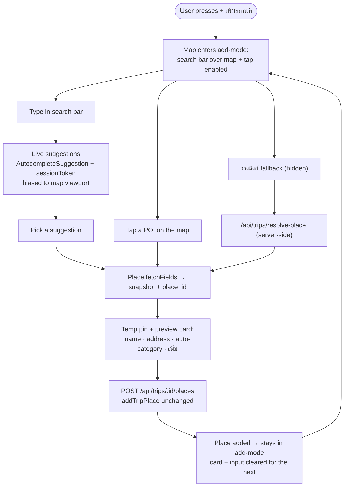
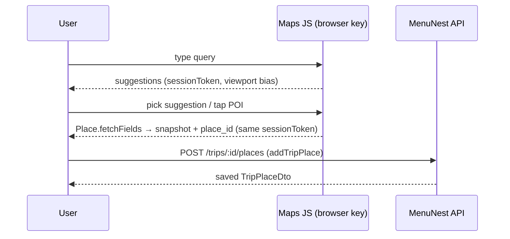

# Design Spec — Add a place by searching "like Google" (autocomplete + tap-on-map)

**Date:** 2026-07-03
**Status:** Approved-pending (grill-then-plan → writing-plans)
**Feature area:** Trips → Capture
**ADRs:** [014](../../adr/014-add-place-entry-paths-search-and-map-tap.md) (entry paths),
[015](../../adr/015-client-side-autocomplete-and-place-details.md) (client-side architecture),
[016](../../adr/016-map-centric-add-place-ux.md) (map-centric UX)
**Confirmed mock:** [`docs/mocks/trip-add-place-search-mock.html`](../../mocks/trip-add-place-search-mock.html)
**Glossary:** [Capture](../../../CONTEXT.md) (updated)

---

## 1. Summary

Replace the paste-a-link-only add-place flow with a **map-centric search
experience**: the user types a place name and gets **live Google Places
suggestions**, or **taps a place (POI) directly on the map**. Either path drops a
temporary pin and shows a preview card (name, address, an auto-guessed editable
category) with **+ เพิ่มลงทริป**. Autocomplete and place-detail fetch run
**client-side** on the Maps JS SDK with the existing referrer-restricted browser
key; the resulting snapshot is POSTed to the **unchanged** `addTripPlace` endpoint.
The old paste-a-link path is retained as a hidden fallback.



---

## 2. Current state (what exists today)

- **[AddPlaceSheet.tsx](../../../frontend/src/pages/trips/components/AddPlaceSheet.tsx)** —
  a blocking Syncfusion `Dialog` with a single URL field → "ดึงข้อมูล" →
  `useResolvePlaceMutation` → preview → category `DropDownList` → `useAddTripPlaceMutation`.
- **Backend** — `POST /api/trips/resolve-place` → `ResolvePlaceHandler` → `IPlaceResolver`
  → [`GooglePlaceResolver`](../../../backend/src/MenuNest.Infrastructure/Maps/GooglePlaceResolver.cs)
  (unfurl short link → Text Search → `ResolvedPlaceDto`). `POST /api/trips/{id}/places`
  → `AddTripPlaceCommand` persists a `TripPlace`.
- **[TripMap.tsx](../../../frontend/src/pages/trips/components/TripMap.tsx)** — `@vis.gl/react-google-maps`
  `<APIProvider apiKey={KEY}>` + `<Map mapId>`; the persistent right-pane map on desktop,
  a map/list toggle on mobile. Browser key = `VITE_GOOGLE_MAPS_BROWSER_KEY`.

The `ResolvedPlaceDto` / `addTripPlace` contract and the resolver are **not changed**
by this feature.

---

## 3. Entry paths (ADR-014)

| Path | Rank | Trigger | How the `place_id` is obtained |
|------|------|---------|-------------------------------|
| **Live search** | primary | Type in the search bar over the map | `AutocompleteSuggestion.fetchAutocompleteSuggestions` → pick → `Place.fetchFields` (client) |
| **Tap-on-map** | primary | Tap a labelled POI on the map | Map click event `placeId` → `Place.fetchFields` (client) |
| **Paste a link** | fallback, hidden | "วางลิงก์" control in the search bar | existing `POST /api/trips/resolve-place` (server) |

All three converge on the **same preview + save** code.

---

## 4. Architecture — client-side Maps JS (ADR-015)

Autocomplete and detail fetch use the Places **JS library** (not REST), loaded via
`useMapsLibrary('places')` inside the existing `APIProvider`. The add-mode UI must
therefore live **within the `<Map>`/APIProvider context** so it can call `useMap()`
and `useMapsLibrary('places')`.



### 4.1 API surface (verify exact signatures via the `google-maps-platform` skill at build time — ADR-007 compliance)

- **Session token:** one `new google.maps.places.AutocompleteSessionToken()` per
  search session (from first keystroke until a pick or cancel), passed to **both** the
  autocomplete calls and the follow-up `fetchFields` → Google bills the pair as **one
  session**. A new token is minted after each pick/cancel. A map-tap has no
  autocomplete phase → its `fetchFields` is a standalone detail call (no token).
- **Autocomplete request:** `{ input, sessionToken, locationBias: <map viewport
  bounds>, language: 'th', region/includedRegionCodes as sensible default }`.
- **Detail fields (field mask — cost-scoped):** `id`, `displayName`, `location`,
  `formattedAddress`, `types`, `priceLevel`, `regularOpeningHours`. Mapped into the
  existing `ResolvedPlaceDto` shape so the preview + save code is path-agnostic.
- **Map POI tap:** on the `<Map>` click event, if the event carries a `placeId`,
  suppress the default Google InfoWindow, build `new google.maps.places.Place({ id })`,
  `fetchFields`, then open the preview. Clicks without a `placeId` (empty ground) are
  ignored.

### 4.2 Config / key requirement

The browser key (`VITE_GOOGLE_MAPS_BROWSER_KEY`) must have **Places API (New)**
enabled in addition to Maps JavaScript, and remain referrer-restricted. Dev uses the
free **Demo Key**. If the key lacks Places, the map still renders but autocomplete
fails — the UI must degrade to a visible error + the "วางลิงก์" fallback, never a
silent dead search box.

---

## 5. Map-centric UX (ADR-016) — see the confirmed mock

The blocking `AddPlaceSheet` dialog is removed. Pressing **+ เพิ่มสถานที่** arms
**add-mode** on the Trip map (on mobile, this switches the places view to the map).

**Add-mode surface:**
- A **floating search bar** at the top of the map: magnifier icon, text input (live
  suggestions dropdown beneath), and a small **"วางลิงก์"** fallback control.
- The map is **tap-enabled** for POIs; a subtle hint pill ("หรือแตะหมุดบนแผนที่เพื่อเพิ่ม").
- Suggestions are **biased to the current map viewport** (`locationBias`), with an
  "ใกล้ที่มองอยู่" affordance on viewport-local results.

**On select / POI tap:**
- A **temporary teal pin** drops at the place; the map recentres on it.
- A **preview card** (floating bottom-centre on desktop; bottom sheet on mobile)
  shows: **name**, **address**, a **category control** pre-filled with an
  auto-guess + "เดาจาก Google" badge, and **[ยกเลิก] [+ เพิ่มลงทริป]**.
- The category control is a colour-dot + Thai label (per-category colour from
  `TripMap.tsx` `CAT_COLOR`), **not emoji**, and stays editable.

**On save:** POST `addTripPlace`; the new place appears in the list/map; the card and
search input **clear and add-mode stays armed** for the next place. **Esc / close**
exits add-mode and removes the temporary pin.

### 5.1 Category auto-guess (Google `types` → MenuNest `PlaceCategory`)

First matching rule wins; fall through to `Other`.

| Google place type (examples) | MenuNest category |
|------------------------------|-------------------|
| `restaurant`, `food`, `meal_takeaway`, `bakery` | **Eat** |
| `cafe`, `coffee_shop` | **Cafe** |
| `lodging`, `hotel`, `resort_hotel`, `guest_house` | **Stay** |
| `tourist_attraction`, `museum`, `place_of_worship`, `park`, `landmark` | **See** |
| `store`, `shopping_mall`, `market`, `department_store` | **Shop** |
| anything else / no types | **Other** |

The exact `types` vocabulary must be confirmed against the Places API (New) type
tables when the lookup is built.

---

## 6. Data contract

No backend or DTO change. The client assembles the existing `ResolvedPlaceDto`-shaped
snapshot and calls the existing `addTripPlace` mutation:

```
googlePlaceId, name, lat, lng, address, category (user-confirmed),
priceLevel, photoUrl (null for MVP), openingHoursJson
```

`place_id` is the only durable Maps datum stored; name/coords/address/hours remain a
cached snapshot (ADR-007 / CONTEXT Place).

---

## 7. Cost & performance guards (owner runs Pay-As-You-Go)

- **Debounce** keystrokes (≈300 ms) before firing autocomplete.
- **Min input length** (≥ 2–3 chars) before the first autocomplete call.
- **Session tokens** bundle autocomplete + one detail fetch into a single billed
  session (§4.1).
- **Scoped field mask** on `fetchFields` (§4.1) — request only fields the preview and
  `TripPlace` need.
- Abort/ignore stale in-flight autocomplete responses when input changes.

---

## 8. Error & edge states

| Situation | Behaviour |
|-----------|-----------|
| Browser key lacks Places API (New) | Visible error in the search bar + steer to "วางลิงก์" fallback; map still works |
| Autocomplete returns nothing | "ไม่พบสถานที่" empty state under the input; keep typing / try tap / วางลิงก์ |
| `fetchFields` fails / times out | Toast/inline error; keep the search bar open, no pin dropped |
| Tap on empty ground (no `placeId`) | Ignored (optional one-time hint "แตะที่หมุดสถานที่") |
| Place has no coordinates | Cannot add (should not happen for Places results); guarded like existing code |
| Duplicate place already in trip | Out of scope for MVP — allowed (matches today's behaviour); flag as possible Phase 2 |
| Offline / SDK not loaded | Search/tap disabled; "วางลิงก์" (server path) still attempts |

---

## 9. Compliance (ADR-007)

- Data originates from a **live Maps Platform API** (JS SDK) — no scraping, ToS-OK.
- Keep `internalUsageAttributionIds={['gmp_git_agentskills_v1']}` on the map.
- Ground the Places JS calls against the **`google-maps-platform`** skill and run its
  `compliance-review` before finalizing Maps code (per ADR-007).

---

## 10. Out of scope (Phase 2)

- Reverse-geocoding arbitrary (non-POI) map taps into a place.
- Share-from-Maps (PWA share target) and the bookmarklet (already Phase 2 — CONTEXT).
- Duplicate-place detection/merge.
- Place **photos** (`photoUrl` stays null); rich detail beyond the current snapshot.
- A cross-trip / user-level place library (ADR-009 keeps places trip-scoped).

---

## 11. Affected surfaces (orientation for the plan — not the plan)

- **Frontend (primary):** new add-mode UI inside `TripMap`/APIProvider context (search
  bar overlay, suggestions list, temp pin, preview card, bottom-sheet variant); a
  `places`-library hook (autocomplete + fetchFields + session token + viewport bias);
  category-guess lookup; wire `+ เพิ่มสถานที่` to arm add-mode; retire the blocking
  `AddPlaceSheet` dialog, relocating its paste-resolve behind the "วางลิงก์" fallback;
  `tripsSlice` state for add-mode; `trips-tokens.css` styles matching the mock.
- **Backend:** none (existing `resolve-place` + `addTripPlace` reused).
- **Config/ops:** ensure the production browser key has Places API (New) enabled and
  restricted.

---

## 12. References

- ADRs 014 / 015 / 016; ADR-007 (Maps Platform), ADR-011 (client-side map precedent).
- Confirmed mock: `docs/mocks/trip-add-place-search-mock.html`.
- CONTEXT.md → Capture, Place.
