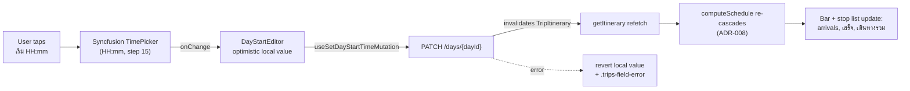
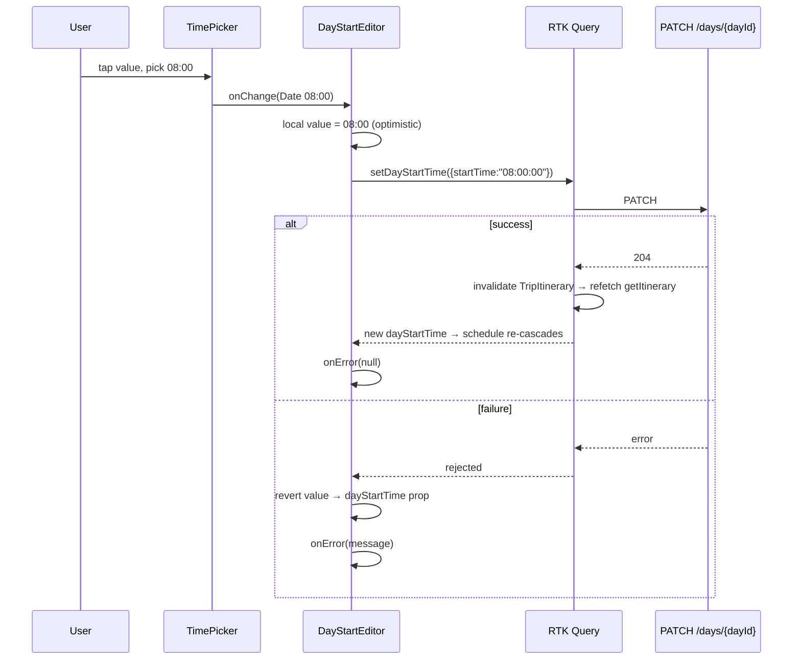

# Design — Edit a Day's start time from the itinerary summary bar

**Date:** 2026-07-03
**Status:** Draft (awaiting approval)
**Related:** ADR-012 (inline tap-to-edit), ADR-013 (commit-on-change), ADR-008 (schedule cascade), ADR-010 (Map-Forward redesign)
**Mock:** [docs/mocks/day-start-edit-mock.html](../../mocks/day-start-edit-mock.html)

## 1. Problem

Every itinerary day is pinned to **09:00**. That value is the domain default
`new TimeOnly(9, 0)` in `ItineraryDay.Create` ([ItineraryDay.cs:18](../../../backend/src/MenuNest.Domain/Entities/ItineraryDay.cs#L18)),
and the whole **Smart Schedule** cascades forward from it (ADR-008), so the first
**Stop** always arrives at 09:00 and never moves. The SPA renders it as read-only
text in the day-summary bar ([ItineraryTab.tsx:148](../../../frontend/src/pages/trips/components/ItineraryTab.tsx#L148)).

The entire back half already exists and is unused:

| Layer | Location | State |
|---|---|---|
| Domain `SetStartTime` | [ItineraryDay.cs:21](../../../backend/src/MenuNest.Domain/Entities/ItineraryDay.cs#L21) | ✓ |
| Command + handler (user-scoped) | `SetDayStartTime/` | ✓ |
| PATCH `/api/trips/{id}/days/{dayId}` | [TripsController.cs:94](../../../backend/src/MenuNest.WebApi/Controllers/TripsController.cs#L94) | ✓ |
| RTK `useSetDayStartTimeMutation` (invalidates `TripItinerary`) | [api.ts:1308](../../../frontend/src/shared/api/api.ts#L1308) | ✓ but **never called** |

**This is a frontend-only feature.** No backend, DB, or API change.

## 2. Goal / non-goals

**Goal:** Let the user set the active Day's start time by tapping the `เริ่ม HH:mm`
value in the summary bar; the schedule re-cascades immediately.

**Non-goals:** whole-trip "set all days at once"; drag-to-reorder; auto-optimize
(ADR-008 Phase 2); redesigning the summary bar (ADR-010, separate track); changing
the `09:00` default itself.

## 3. Overview



## 4. Changes, file by file

### 4.1 New — `frontend/src/pages/trips/utils/time.ts`

Extract the two converters currently **private** in `BestTimeBar.tsx` so both it and
the new editor share one tested implementation:

- `hmsToDate(hms: string | null): Date | null` — `"HH:mm:ss"` → local-time `Date`
  (via `setHours`, TZ-stable — identical to today's `BestTimeBar` logic).
- `dateToHms(date: Date | null): string | null` — `Date` → `"HH:mm:ss"`.

`BestTimeBar.tsx` is refactored to import from here (no behavior change).

### 4.2 New — `frontend/src/pages/trips/components/DayStartEditor.tsx`

```
Props: { tripId: string; dayId: string; dayStartTime: string;  // "HH:mm:ss"
         onError: (msg: string | null) => void }
```

Behavior:
- Renders a Syncfusion `TimePicker` (`@syncfusion/react-calendars`) with
  `format="HH:mm"`, `step={15}`, **`editable={false}`**, **`openOnFocus`**, and
  **`clearButton={false}`**. These three props are a deliberate divergence from
  `BestTimeBar` (which sets none) and were verified against the installed package (v33):
  by default `openOnFocus` is false and `editable` is true, so tapping the value only
  places a caret (raising the mobile keyboard) and the popup opens *only* via the clock
  icon — breaking the "tap → picker opens" promise; and `clearButton` defaults true, so a
  ✕ appears on focus that could fire `onChange(null)`. `editable={false}` makes the field
  read as a label (no caret/typing), `openOnFocus` opens the picker on tap, and
  `clearButton={false}` drops the meaningless clear (a Day's start time is non-nullable).
  Chrome is neutralized to read as bar text (§4.4).
- **Optimistic local state**: local `value` is seeded from the `dayStartTime` prop; a
  `useEffect` keyed on `dayStartTime` re-syncs it whenever the prop changes (after the
  refetch, or when the active Day switches). On pick: set local `value` immediately,
  **capture the current `dayId`**, then fire
  `useSetDayStartTimeMutation({tripId, dayId, startTime: dateToHms(picked)})`.
- **Success**: `TripItinerary` is invalidated; `getItinerary` refetches; `computeSchedule`
  re-cascades and the whole bar + stop list update. Clear any prior error via `onError(null)`
  — but only if the captured `dayId` still equals the current prop (guard against a slow
  request resolving after the user has switched Days).
- **Error**: if the captured `dayId` still matches, revert local `value` to the
  `dayStartTime` prop and `onError(getErrorMessage(err))`; otherwise ignore — the stale
  request belongs to a Day no longer shown.
- Ignores a `null`/unchanged pick (no-op, no request).

### 4.3 Edit — `ItineraryTab.tsx`

Inside the `.day-summary` div (preserved — it also holds `เสร็จ` / `เดินทางรวม`),
replace only the static `เริ่ม <b>{resolvedDay.dayStartTime.slice(0,5)}</b>` span
([ItineraryTab.tsx:147-149](../../../frontend/src/pages/trips/components/ItineraryTab.tsx#L147))
with `<DayStartEditor key={resolvedDayId} tripId={tripId} dayId={resolvedDayId} dayStartTime={resolvedDay.dayStartTime} onError={setActionError} />`.
The **`key={resolvedDayId}`** gives each Day a fresh editor instance, isolating its
local `value` across day switches. The existing `{actionError && <p className="trips-field-error">…}`
line ([:158](../../../frontend/src/pages/trips/components/ItineraryTab.tsx#L158)) already
renders the error under the bar — reused, not duplicated; additionally, **clear `actionError`
when `resolvedDayId` changes** (an effect in `ItineraryTab`, mirroring how the existing
`move`/reorder error should not leak) so a stale error never surfaces against a different
Day. `เสร็จ` and `เดินทางรวม` stay as-is.

### 4.4 Edit — `trips-tokens.css`

Add rules scoped under `.day-summary` targeting the classes the **React** package
(`@syncfusion/react-calendars` v33) actually emits — `sf-timepicker`, `sf-input-group`,
`sf-input` (the `sf-` prefix, **not** the legacy ej2 `.e-*` hooks). Neutralize the input
chrome so the picker reads as bar text at rest: transparent background, white mono value,
a faint `rgba(255,255,255,.18)` border + clock cue that turns `--teal` on hover/focus, and
the animated focus underline removed. **Constrain the width**: `sf-input-group` / `sf-input`
default to `width:100%`, which would break the balanced 3-cell `space-between` bar; set the
root `.sf-timepicker{width:auto; display:inline-flex}` and size `sf-input` to content
(≈`5ch` for `HH:mm`). The popup keeps its default light styling (it portals onto the white
page). Note: the mock renders a static value, not the live widget, so these exact
chrome/width overrides are verified **in-app once wired** — the mock confirms the at-rest
look and the four states, not the Syncfusion DOM.

## 5. Interaction



## 6. Edge cases

- **Overnight start** (e.g. 22:00): `computeSchedule` already handles day-crossing and
  the `overnight` flag ([useSchedule.test.ts:81](../../../frontend/src/pages/trips/hooks/useSchedule.test.ts#L81)).
  No new constraint; any `00:00–23:45` value is valid.
- **Switching active Day** while a picker value is shown: the `dayId`/`dayStartTime`
  props change → the sync `useEffect` reseeds local value to the newly active Day's
  start. Editing only ever targets the active Day (its own `DayStartTime`).
- **Rapid re-picks**: each pick is one PATCH + one refetch (not debounced — fine at
  human pick rate, matching every other trips mutation). Last write wins server-side.
- **Empty day / loading**: `DayStartEditor` is only rendered after `ItineraryTab`'s
  `if (!dayList.length)` guard, so `dayId`/`dayStartTime` are always defined.

## 7. Testing

The frontend has **no** `@testing-library/react` — unit tests are vitest over pure
functions ([useSchedule.test.ts](../../../frontend/src/pages/trips/hooks/useSchedule.test.ts)),
and interaction coverage is Playwright e2e ([frontend/e2e/](../../../frontend/e2e/)).

1. **Unit (vitest)** — new `utils/time.test.ts` for `hmsToDate` / `dateToHms`:
   round-trip, midnight, `null` handling, single-digit hours. (Locks the extraction.)
2. **E2E (Playwright)** — a trips spec: open a trip, tap the start value, pick a new
   time, assert the first stop's arrival and the `เสร็จ` total both shift.
3. **Manual** — verify optimistic value + error revert against a forced 500 (per the
   project's manual-verification habit; migrations note in CLAUDE.md is unrelated here
   since no DB change).

## 8. Out of scope / deferred

Route auto-optimization remains Phase 2 (ADR-008/009). (Drag-to-reorder is *in* the Trip
MVP per ADR-009, not deferred; a per-trip "set all days at once" is not covered by any ADR
and is simply out of this feature's scope — see §2 Non-goals.) The Map-Forward summary-bar
restyle (ADR-010) proceeds separately and will inherit this one editable value rather than
a new control.
