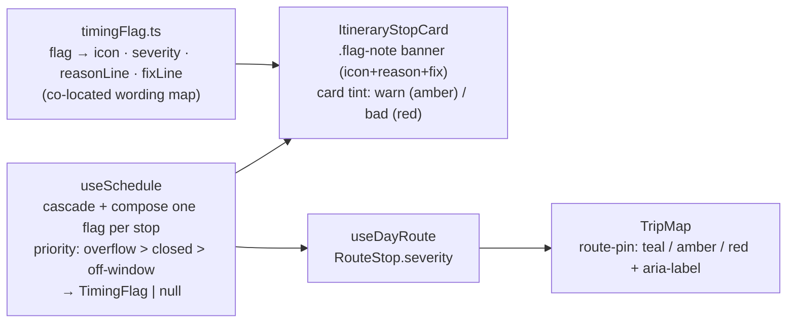

# Design spec — Trip Planner timing-flag redesign

**Date:** 2026-07-03
**Status:** Draft for approval (revised after adversarial verification)
**ADRs:** [019](../../adr/019-timing-flag-explains-reason-and-fix.md) ·
[020](../../adr/020-three-distinct-timing-flag-types-single-most-severe.md) ·
[021](../../adr/021-timing-flag-severity-colour-and-no-positive-state.md) ·
[022](../../adr/022-map-pins-reflect-flag-severity.md)
**Confirmed mock:** [docs/mocks/trip-timing-flag-redesign-mock.html](../../mocks/trip-timing-flag-redesign-mock.html)
(the mock shows the three primary states; §5 sub-cases and §8 map are specified in text below)

## 1. Problem

On the per-day itinerary, a Stop whose timing is off is shown as an **orange card +
a tiny `⚠ ช่วงดี 12:00–13:00` chip**. End users don't know what the orange means or
what to do about it, and the single amber collapses **three different situations** —
place **closed** at arrival, arrival **outside the best-time window**, and the day
**overflowing past midnight**. Icons are emoji (`⚠`/`✓`), against the project's
Syncfusion-icon rule.

## 2. Goal

A flagged Stop tells the user, at a glance, **what is wrong and what to do**, with
severity legible from colour and the specific problem legible from an icon + words —
consistently on both the itinerary list and the map, and legible without relying on
colour alone.

## 3. Overview



Colour = **severity** (ADR-021); icon + words = **reason + fix** (ADR-019/020). A
well-timed Stop shows **no flag** (no positive state).

## 4. The flag model (domain)

Replaces `StopFlag = 'green' | 'amber'` ([useSchedule.ts:6](../../../frontend/src/pages/trips/hooks/useSchedule.ts)).

```ts
export type FlagReason   = 'overflow' | 'closed' | 'off-window'
export type FlagSeverity = 'problem' | 'suggestion'
export type ClosedKind   = 'before-open' | 'on-break' | 'after-close' | 'all-day'

export interface TimingFlag {
  reason: FlagReason
  severity: FlagSeverity           // overflow,closed → 'problem'; off-window → 'suggestion'
  // closed only:
  closedKind?: ClosedKind
  reopenAt?: string                // 'HH:MM' next opening today (before-open | on-break); else undefined
  // off-window only:
  bestStart?: string               // 'HH:MM'
  bestEnd?: string                  // 'HH:MM'
  windowDir?: 'before' | 'after'   // arrived before vs after the window
  // overflow only:
  arrival?: string                 // 'HH:MM' (post-midnight, mod-24) of the crossing stop
}

export type StopFlag = TimingFlag | null   // null = well-timed (no flag line, teal pin)
```

**Severity map:** `overflow → problem`, `closed → problem`, `off-window → suggestion`.

### 4.1 Per-reason evaluators

- **overflow** (problem) — the day runs past midnight. Fires **once per day, on the
  first Stop whose `arrival >= 1440`** (the moment the plan tips past midnight, tracked
  in composition §4.2). `arrival` is carried as `HH:MM` mod-24 — which is therefore
  always a post-midnight value (e.g. `00:20`). A day where every Stop is *reached*
  before midnight but the last one *departs* after it produces **no** overflow flag
  (the late finish is already the day-end time). This replaces the removed
  `overnight`-driven `+1วัน` chip (ADR-021 §5).
- **closed** (problem) — fires when `isOpenAt(...) === false`
  ([useSchedule.ts:25-43](../../../frontend/src/pages/trips/hooks/useSchedule.ts)).
  A **new helper** classifies the closure for that weekday using the opening periods,
  from two signals about the arrival minute `a`:
  - `reopenAt` = the earliest period-open later today (`open.day === dow && openMin > a`), else none.
  - `openedEarlierToday` = a period already opened/closed earlier today
    (`open.day === dow && openMin <= a`, **or** an overnight period with
    `close.day === dow && closeMin <= a`).

  | reopenAt? | openedEarlierToday? | closedKind |
  |---|---|---|
  | yes | no  | `before-open` |
  | yes | yes | `on-break` |
  | no  | yes | `after-close` |
  | no  | no  | `all-day` |

  `null`/unknown opening hours never fire closed (parity with `isOpenAt === null`).
- **off-window** (suggestion) — replaces `flagStop`
  ([useSchedule.ts:59-63](../../../frontend/src/pages/trips/hooks/useSchedule.ts)).
  Returns `null` when no best window is set **or** arrival is **inside it, bounds
  inclusive** (`a >= bestStart && a <= bestEnd`). Otherwise returns a flag with
  `windowDir = a < bestStart ? 'before' : 'after'`. (Splitting the current single
  inclusive check must keep the in-window test inclusive on both bounds, so arriving
  exactly at `bestStart` or `bestEnd` is **not** flagged.)

### 4.2 Composition (single most-severe, overflow once)

Iterate the day's ScheduledStops in sequence order, tracking `overflowShown`:

1. if `!overflowShown && arrivalMin >= 1440` → `overflow`; set `overflowShown = true`.
2. else if `closed` evaluator returns a flag → that flag.
3. else if `off-window` evaluator returns a flag → that flag.
4. else `null`.

Exactly one flag per Stop; overflow appears at most once per day; the current
`no place → 'green'` becomes `null` (ADR-020 priority overflow > closed > off-window).

## 5. Wording (Thai) — the co-located label map

Wording lives in a **new co-located module** `frontend/src/pages/trips/timingFlag.ts`,
mirroring the codebase's one convention for UI wording
([placeCategory.ts](../../../frontend/src/pages/trips/placeCategory.ts): a `Record` +
accessor + co-located test). **No i18n library exists and none is added.** A function
maps a `TimingFlag` → `{ icon, severity, reasonLine, fixLine }`:

| reason | sub-case | severity | reason line | fix line |
|---|---|---|---|---|
| overflow | — | problem (red) | `แผนวันนี้ยาวข้ามเที่ยงคืน (ถึง {arrival})` | `ตัดจุดแวะออก หรือเริ่มวันให้เร็วขึ้น` |
| closed | before-open | problem (red) | `ยังไม่เปิดตอนไปถึง · เปิด {reopenAt}` | `เลื่อนสตอปนี้ไปช่วงสาย` |
| closed | on-break | problem (red) | `ปิดพักช่วงนี้ · เปิดอีกที {reopenAt}` | `เลี่ยงช่วงพักกลางวัน` |
| closed | after-close | problem (red) | `ร้านปิดแล้วตอนไปถึง` | `เลื่อนสตอปนี้ให้เร็วขึ้น` |
| closed | all-day | problem (red) | `ร้านปิดทั้งวันนี้` | `ย้ายไปวันอื่น หรือเอาออก` |
| off-window | arrived after | suggestion (amber) | `ไปถึงหลังช่วงแนะนำ · ช่วงเหมาะ {bestStart}–{bestEnd}` | `เลื่อนสตอปนี้ขึ้นก่อนหน้า` |
| off-window | arrived before | suggestion (amber) | `ไปถึงก่อนช่วงแนะนำ · ช่วงเหมาะ {bestStart}–{bestEnd}` | `เลื่อนสตอปนี้ไปช่วงหลัง` |

## 6. Icons (Syncfusion, no emoji)

Per the project rule, use `@syncfusion/react-icons` SVG components — **never emoji**.
Three **visually distinct** glyphs, one per reason:

| reason | glyph intent |
|---|---|
| closed | lock |
| off-window | clock / schedule |
| overflow | moon / night |

Implementation must bind each to a **real exported component** (verify the export name
exists — do not invent; see the Syncfusion version-skew note in memory). The three must
be mutually distinguishable — in particular **overflow must not fall back to a clock**
(it would collide with off-window and defeat ADR-020's "own icon per reason"). Exact
component names are an implementation open item (§12); the mock's inline SVGs
(lock / clock / crescent) show the intended shapes only.

## 7. Visual spec — itinerary list (ItineraryStopCard)

- **Reason line** — a full-width inset banner **below `.stop-chips`, inside
  `.stop-body`** ([ItineraryStopCard.tsx:44-55](../../../frontend/src/pages/trips/components/ItineraryStopCard.tsx)):
  `[icon] {reasonLine}` (bold reason phrase) `— {fixLine}` (muted). One line, wraps if
  long. Rendered **only when `flag != null`**.
- **Card tint** — map severity → class via an explicit lookup, **never by
  interpolating the raw severity string** (the enum values are `problem`/`suggestion`
  but the classes are `bad`/`warn`): `{ problem: 'bad', suggestion: 'warn' }`, else no
  class ([:39](../../../frontend/src/pages/trips/components/ItineraryStopCard.tsx)).
  Tints card background, border, and the left time-rail.
- **Retire** the `✓/⚠ {bestLabel}` chip ([:49-53](../../../frontend/src/pages/trips/components/ItineraryStopCard.tsx))
  and the `bestLabel` prop/function ([ItineraryTab.tsx:24-27,237](../../../frontend/src/pages/trips/components/ItineraryTab.tsx)).
- **Retire** the standalone `+1วัน` chip ([:48](../../../frontend/src/pages/trips/components/ItineraryStopCard.tsx))
  **and the now-unused `overnight` prop** (declared :19, typed :34, passed
  [ItineraryTab.tsx:243](../../../frontend/src/pages/trips/components/ItineraryTab.tsx))
  — midnight-crossing is the red overflow line.
- **No positive state** — a well-timed Stop shows only its dwell chip.

### 7.1 CSS ([trips-tokens.css](../../../frontend/src/pages/trips/trips-tokens.css))

- Add red tokens in the `.trips-page,.trip-detail` block (near :18-21):
  `--bad: #b42318; --bad-bg: #fdeceb;` (≈5.75:1 on the light fill — passes AA).
- Add an **amber text token that passes AA**: `--warn-ink` (a darker amber than the
  chip-tuned `--warn #b4791f`, which is only ≈3.38:1 on `--warn-bg` — **fails AA at the
  11.5px reason-line size**). Pick a value clearing 4.5:1 on `--warn-bg #fff4e0` (e.g.
  `#7a5310`; verify). The `.flag-note` (amber) text uses `--warn-ink`, not `--warn`.
- Add `.stop-card.bad` (+ `.bad .stop-rail`) parallel to `.warn` (:130,:144).
- Add the `.flag-note` / `.flag-note.bad` / `.fix` banner block: amber note = `--warn-bg`
  fill + `--warn-ink` text; `.flag-note.bad` = `--bad-bg` fill + `--bad` text.
- Remove `.chip.good` (:224) **and `.chip.warn` (:225)** — both become dead once the
  ✓/⚠ chip and `+1วัน` chip are retired — and remove `--good`/`--good-bg` (:18-19).
  **Keep `--warn`/`--warn-bg`** — still used by `.nav-note` (:107-108) and the
  `.flag-note` amber fill.

## 8. Visual spec — map (TripMap / useDayRoute)

Map pins mirror severity (ADR-022): **teal = ok · amber = suggestion · red = problem**.

- `RouteStop.amber: boolean` → `severity: FlagSeverity | null`
  ([useDayRoute.ts:20](../../../frontend/src/pages/trips/hooks/useDayRoute.ts)); the
  derivation `amber: s.flag === 'amber'` (:66) → `severity: s.flag?.severity ?? null`.
- `TripMap` ([:126](../../../frontend/src/pages/trips/components/TripMap.tsx)): map
  severity → modifier via explicit lookup (**not** raw interpolation — `.route-pin.suggestion`
  does not exist): `{ problem: 'problem', suggestion: 'amber' }`, else no modifier.
- Add `.route-pin.problem .route-dot` (red fill + red shadow) and
  `.route-pin.problem .route-callout` (red text) parallel to `.amber`
  ([trips-tokens.css:264,280-283](../../../frontend/src/pages/trips/trips-tokens.css)),
  reusing `--bad`.
- **Accessibility (ADR-019/022):** a flagged marker gets an `aria-label` stating stop +
  reason + severity (e.g. `ริเวอร์โฮมสเตย์ — ไปถึงหลังช่วงแนะนำ (น่าปรับ)`) so meaning
  is not colour-only. The **callout text stays `{arrival} · {name}`**; the itinerary
  list is the authoritative worded surface.

## 9. Code-impact map (verified against HEAD)

| File | Line(s) | Change |
|---|---|---|
| `hooks/useSchedule.ts` | 6 | `StopFlag` union → `TimingFlag \| null` + `FlagReason`/`FlagSeverity`/`ClosedKind` |
| `hooks/useSchedule.ts` | 25-43 | add closed-classification helper (`reopenAt` + `openedEarlierToday` → `ClosedKind`) |
| `hooks/useSchedule.ts` | 59-63 | `flagStop` → `offWindowFlag` (inclusive in-window → null; else `windowDir`) |
| `hooks/useSchedule.ts` | 70-77 | compose single-most-severe with overflow-once (§4.2); null when none |
| `trips/timingFlag.ts` | new | `TimingFlag` → `{icon,severity,reasonLine,fixLine}` map + accessor |
| `trips/timingFlag.test.ts` | new | wording-map unit test (mirrors placeCategory.test.ts) |
| `components/ItineraryTab.tsx` | 24-27, 236-237, 243 | remove `bestLabel` fn + prop; pass `flag` object; stop passing `overnight` |
| `components/ItineraryStopCard.tsx` | 3,13,19,27-28,34 | new flag type; drop `bestLabel` **and `overnight`** props |
| `components/ItineraryStopCard.tsx` | 39 | card class via severity→`{problem:'bad',suggestion:'warn'}` lookup |
| `components/ItineraryStopCard.tsx` | 48 | remove `+1วัน` chip |
| `components/ItineraryStopCard.tsx` | 49-53 | replace chip with `.flag-note` banner (render iff flag) |
| `hooks/useDayRoute.ts` | 20, 66 | `RouteStop.amber:boolean` → `severity`; derive `s.flag?.severity ?? null` |
| `components/TripMap.tsx` | 126, 127 | `route-pin` modifier via severity lookup; add `aria-label` (reason+severity) |
| `trips-tokens.css` | 18-21,130,144,222-225,264,280-283 | add `--bad*`,`--warn-ink`,`.stop-card.bad`,`.flag-note*`,`.route-pin.problem*`; remove `.chip.good`,`.chip.warn`,`--good*` |
| `hooks/useSchedule.test.ts` | 3, 24-40 | update import (drop `flagStop`, add `offWindowFlag`/helpers); rewrite `describe` block + assertions |

## 10. Testing plan

Unit (vitest, [useSchedule.test.ts](../../../frontend/src/pages/trips/hooks/useSchedule.test.ts) + new `timingFlag.test.ts`):

- **off-window:** inside window → `null`; **boundary inclusive** — arrival == `bestStart`
  and == `bestEnd` both → `null`; before → `{off-window, before}`; after →
  `{off-window, after}`; no window set → `null`.
- **closed classification:** `before-open` (opens later, not opened yet); `on-break`
  (split hours, e.g. 11:00–14:00 & 17:00–22:00, arrive 15:00 → reopenAt 17:00);
  `after-close` (opened earlier, now past last close → move earlier); `all-day` (no
  period this weekday, e.g. Monday-closed museum → *not* "move earlier"); unknown hours
  → no flag.
- **composition / overflow-once:** a day with 3 post-midnight stops → **only the first**
  gets `overflow`, the rest fall to closed/off-window/none; a day whose last stop only
  *departs* past midnight (arrival < 1440) → **no** overflow anywhere; overflow’s
  `arrival` token is always post-midnight; priority overflow > closed > off-window.
- **wording map:** each reason/sub-case yields the §5 reason+fix strings and severity.

No component render tests exist for the trips area today; adding React Testing Library
there is **out of scope for MVP** (coverage stays at the `useSchedule`/`timingFlag`
unit level). Manual verification via the itinerary + map.

## 11. Non-goals

- Auto-optimising / reordering stops (ADR-008 — Phase 2). Fixes are **text hints**.
- Drag-to-reorder (Phase 2).
- Reason/fix text on map callouts (kept to time + name; severity reaches AT via
  `aria-label` — ADR-022).
- An i18n framework (none exists; co-located wording map is the convention).

## 12. Open items

- **Syncfusion icon component names** — the three glyphs (lock / clock / moon) must be
  bound to real, verified `@syncfusion/react-icons` exports at implementation, and be
  mutually distinct (overflow ≠ a second clock). Names not pinned here to avoid
  inventing an export that may not exist.
- **Rare closed edge:** opening periods that span midnight (e.g. Fri 18:00 → Sat 02:00)
  can mis-label `before-open` vs `on-break`/`after-close` in unusual arrivals; the
  `close.day === dow` signal in §4.1 covers the common overnight case, deeper spanning
  cases are accepted as MVP imprecision (wording stays non-catastrophic).
- **Pre-existing a11y (out of scope):** `.nav-note` (:107-108) also uses `--warn` on
  `--warn-bg` at 11px and shares the same sub-AA contrast; not touched here, flagged for
  a later pass.
