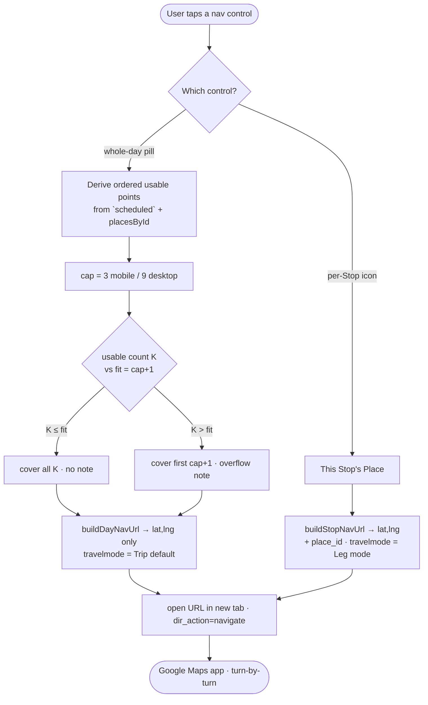
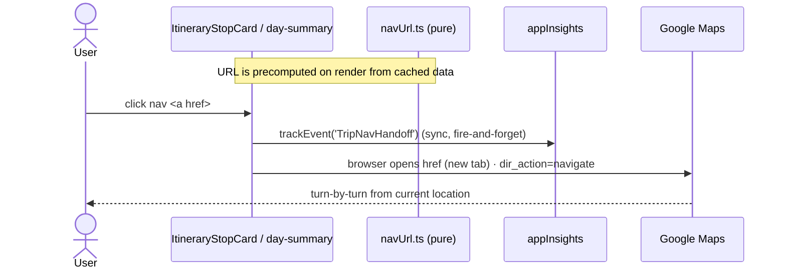

# Trip → Google Maps navigate hand-off — Design

**Date:** 2026-07-03
**Status:** Approved (design) — ready for `superpowers:writing-plans`
**ADR:** [ADR-011](../../adr/011-google-maps-navigate-handoff.md)
**Glossary:** CONTEXT.md → *Navigate hand-off*, *Stop*, *Leg*, *Travel mode*
**UI mock (confirmed):** `docs/mocks/trip-nav-button-mock.html`

Adds two buttons to the Trip itinerary that open **Google Maps** for real turn-by-turn
navigation: a **whole-day route** pill and a **per-Stop** navigate icon. The feature is
**frontend-only** — a client-side Google Maps *Maps URLs* deep link built from data
already on screen. No backend, no API key, no Maps Platform billing/quota, and (unlike
the rest of the Trip module, ADR-007) **no proxy** — a deep link is a plain
`https://www.google.com/maps/...` URL, not a REST call, and `place_id` deep-linking is
the use Google explicitly sanctions.



---

## 1. Scope

**In scope (Phase 1):**

- A **whole-day route** button (teal pill) in the dark `.day-summary` bar of the
  itinerary tab — opens the active day's Stops as a Google Maps route.
- A **per-Stop** navigate button (small teal icon) inside every `.stop-card` — opens a
  single-destination route to that Stop.
- Truncate-and-note behaviour when a day exceeds Google's waypoint cap.
- A mixed-travel-mode note when the day's Legs use more than one mode.
- Minimal App Insights telemetry.

**Out of scope (Phase 2 / rejected — see §15):** splitting a long day across multiple
links; `bicycling`/`two-wheeler` modes; injecting an explicit origin via the browser
Geolocation API; any backend or data-model change.

---

## 2. Decisions (traceable to ADR-011)

| # | Decision | Chosen |
|---|----------|--------|
| D1 | Scope | Both whole-day route **and** per-Stop |
| D2 | Whole-day origin | **Current location** (omit `origin`) |
| D3 | Travel mode | Whole-day = Trip `defaultTravelMode`; per-Stop = that Stop's `travelModeToReach`; mixed-mode day → note |
| D4 | Overflow | Cover first *N* = cap+1 Stops in order + note; **conservative cap 3 mobile / 9 desktop**; iPad counts as mobile |
| D5 | Placement | Whole-day = teal pill in `.day-summary`; per-Stop = icon **sibling** of `.stop-body` |
| D6 | Launch | Append `dir_action=navigate` → start turn-by-turn immediately |
| D7 | Encoding | Whole-day = `lat,lng` only; per-Stop adds `destination_place_id` when present |
| D8 | Single-Stop day | Whole-day pill still shown (valid one-leg navigation) |

---

## 3. Deep-link contract

Base: `https://www.google.com/maps/dir/?api=1&…` (the official *Maps URLs* directions
action). `api=1` and `destination` are **required**.

| Param | Whole-day route | Per-Stop |
|-------|-----------------|----------|
| `origin` | **omitted** (⇒ current location) | omitted |
| `destination` | `lat,lng` of the last covered Stop | `lat,lng` of the Stop |
| `destination_place_id` | **not sent** (see §7) | sent when `googlePlaceId` present |
| `waypoints` | `lat,lng` of earlier covered Stops, `\|`-joined | not used |
| `waypoint_place_ids` | **not sent** (see §7) | not used |
| `travelmode` | `travelModeToGmaps(Trip.defaultTravelMode)` | `travelModeToGmaps(Stop.travelModeToReach)` |
| `dir_action` | `navigate` | `navigate` |

Build with `URLSearchParams` so commas (`%2C`) and pipes (`%7C`) are correctly encoded
(Google decodes them). Coordinates are formatted to **6 decimals** (`toFixed(6)`, ~0.1 m,
no scientific notation). Total URL is asserted **< 2048 chars** (a hard Google limit);
`lat,lng`-only whole-day URLs stay well under it (~22 chars/point).

**Examples**

Whole-day, 3 Stops, driving (mobile, cap 3 → all 3 fit):
```
https://www.google.com/maps/dir/?api=1&destination=19.060000%2C99.650000&waypoints=19.010000%2C99.600000%7C19.040000%2C99.630000&travelmode=driving&dir_action=navigate
```

Per-Stop, walking, place present:
```
https://www.google.com/maps/dir/?api=1&destination=19.040000%2C99.630000&destination_place_id=ChIJ...&travelmode=walking&dir_action=navigate
```

---

## 4. Travel-mode mapping

`TravelMode` is the closed union `'Drive' | 'Walk' | 'Transit'` (`api.ts:491`), so the
mapper is a total `Record` — no default branch needed in normal flow:

| App `TravelMode` | Google `travelmode` |
|------------------|---------------------|
| `Drive` | `driving` |
| `Walk` | `walking` |
| `Transit` | `transit` |

Defensive: if a value outside the union ever appears at runtime (data drift), **omit**
`travelmode` entirely rather than emit an invalid string (Google then auto-selects).

---

## 5. Waypoint cap & overflow math (D4)

The cap applies to **waypoints only** — `origin` and `destination` don't count. With a
current-location origin (D2), a day of **K** usable points needs **K − 1** waypoints, so
a link fully covers a day when `K ≤ cap + 1`.

```mermaid
flowchart TD
    K[K = usable, deduped points] --> B{K ≤ cap + 1 ?}
    B -->|yes| F[covered = K · overflow = false<br/>dest = points[K-1]<br/>waypoints = points[0 .. K-2]]
    B -->|no| O["covered = cap + 1 · overflow = true<br/>included = points[0 .. cap]<br/>dest = included[cap]<br/>waypoints = included[0 .. cap-1]"]
```

- `fit = cap + 1`. **Guard with `≤`** (mobile boundary K = 4, desktop K = 10 is the
  prime off-by-one site).
- **Conservative cap.** The client cannot know whether the link opens the native Maps
  app (cap 3) or a browser tab (cap 3 mobile / 9 otherwise), and Google **silently
  drops** waypoints past the cap. So err toward over-truncating (merely shows the note)
  rather than losing Stops unseen.

**Surface detection** (`getWaypointCap()` — the one impure helper; kept out of the pure
builders):
```ts
function isMobileSurface(): boolean {
  const nav = navigator as Navigator & { userAgentData?: { mobile?: boolean } }
  if (typeof nav.userAgentData?.mobile === 'boolean') return nav.userAgentData.mobile
  if (/Android|iPhone|iPad|iPod|Mobile/i.test(nav.userAgent || '')) return true
  // iPadOS 13+ reports a desktop "Macintosh" UA with touch — treat as mobile:
  if (nav.platform === 'MacIntel' && nav.maxTouchPoints > 1) return true
  return false
}
export const getWaypointCap = (): number => (isMobileSurface() ? 3 : 9)
```
Resolve the cap **once** per render (`useMemo(getWaypointCap, [])`).

---

## 6. Point usability, ordering & dedup

- **Order** comes from the same sequence-sorted `scheduled` array `ItineraryTab` renders
  (from `useSchedule`), so on-screen order == navigation order. (This is what
  `useDayRoute` also does; nav derives its own points because it additionally needs
  `googlePlaceId` and `travelModeToReach`, which `RouteStop` omits.)
- **Usable** point: `Number.isFinite(lat) && Number.isFinite(lng) && !(lat === 0 && lng === 0)`.
  (Extends `useDayRoute`'s finite-only filter with a Null-Island guard.)
- **Missing place:** a Stop whose `tripPlaceId` isn't in `placesById` (deleted, or query
  still loading) is skipped — never emit `undefined,undefined`. Mirrors the existing
  `{place && …}` guard at `ItineraryTab.tsx:168`.
- **Consecutive duplicates** (same `googlePlaceId`, else same 6-dp `lat,lng`, back-to-back)
  collapse to one point to save a scarce waypoint slot. **Non-consecutive** revisits
  (hotel → sight → hotel) are preserved — they're intentional.
- **Overnight** Stops (`useSchedule` overnight flag) are included at their scheduled
  position; the flag is a clock-rollover artefact, not a location signal.

---

## 7. place_id strategy (D7)

Always send `lat,lng` as the text value (exact; also the fallback if a `place_id` is
stale — Google then routes by the coordinates).

- **Whole-day route:** `lat,lng` **only** — no `waypoint_place_ids`. That list must align
  index-for-index with `waypoints`; a single missing slot silently misroutes every later
  point. Combined with the 2048-char limit (place_ids can exceed 100 chars each), coords
  alone are the safe, robust choice.
- **Per-Stop:** a single destination, so alignment is trivial — add `destination_place_id`
  when the Place has a `googlePlaceId` (a precise refinement over raw coords).
- `origin_place_id` is never used (origin is omitted).

---

## 8. Module design — `frontend/src/pages/trips/lib/navUrl.ts`

Pure string-builders (no React, no RTK), unit-tested — mirrors the
`useSchedule` + `useSchedule.test.ts` pure-fn pattern. **`window.open` / navigation is
NOT here** — the builders return a URL string (or `null`); the component opens it.

```ts
import type {TravelMode} from '../../../shared/api/api'

export interface NavPoint { lat: number; lng: number; placeId?: string | null }
export interface DayNav { url: string; coveredCount: number; overflow: boolean }

export function travelModeToGmaps(mode: TravelMode): 'driving' | 'walking' | 'transit'

/** Single-destination link to one Place. null when coords are unusable. */
export function buildStopNavUrl(
  place: {lat: number; lng: number; googlePlaceId?: string | null},
  mode: TravelMode,
): string | null

/**
 * Whole-day route. `points` are in itinerary order (from `scheduled`).
 * Filters unusable points, collapses consecutive dupes, applies the cap,
 * returns null when no usable point remains.
 */
export function buildDayNavUrl(points: NavPoint[], cap: number, mode: TravelMode): DayNav | null

/** Impure surface detection (see §5). Kept separate so builders stay pure. */
export function getWaypointCap(): number
```

---

## 9. Component integration

Two files change; both already hold everything needed.

**`ItineraryTab.tsx`** (has `scheduled`, `placesById`, `trip`):
- `const cap = useMemo(getWaypointCap, [])`.
- Derive ordered nav points from `scheduled` (skip stops missing from `placesById`):
  `scheduled.map(s => placesById[s.stop.tripPlaceId]).filter(Boolean).map(p => ({lat, lng, placeId: p.googlePlaceId}))`.
- `const mode = trip?.defaultTravelMode ?? 'Drive'`; `const dayNav = buildDayNavUrl(navPoints, cap, mode)`.
- Mixed-mode = any inter-Stop Leg whose mode differs from the single whole-day mode:
  `const mixedMode = scheduled.slice(1).some(s => s.stop.travelModeToReach !== mode)`.
  (Catches both differing-legs **and** an all-one-mode day whose mode ≠ the Trip default —
  either way the route's single `travelmode` misrepresents at least one Leg.)
- Wrap the three existing `.day-summary` spans in a `.day-stats` group; render the pill
  (`dayNav && …`) as its right-aligned sibling.
- Render the **overflow note** when `dayNav?.overflow`, and the **mixed-mode note** when
  `mixedMode && dayNav` — both between `.day-summary` and `.stop-list` (as in the mock).
- Compute each Stop's `buildStopNavUrl(place, s.stop.travelModeToReach)` at the call site
  and pass `navUrl: string | null` into `ItineraryStopCard`.

**`ItineraryStopCard.tsx`** — add a `navUrl: string | null` prop; render the nav control
as a **sibling of `.stop-body`** (before `.stop-reorder`), never nested (button-in-button
is invalid HTML and would also fire the stop editor).

**Opening the link — synchronously, no `window.open`:** both controls render as
`<a href={url} target="_blank" rel="noopener noreferrer">` styled as the pill / icon. A
native anchor gesture is immune to popup blockers (incl. iOS Safari), supports
middle-click, and needs no async. The per-Stop anchor's `onClick` calls
`e.stopPropagation()` (so it doesn't open the editor) and fires telemetry; it never
`preventDefault`s and never `await`s before the browser follows the href.



---

## 10. Inline notes, states & Thai microcopy

| Element | Copy |
|---------|------|
| Whole-day pill label | `นำทาง` |
| Overflow note | `นำทางครอบคลุม {N} จุดแรก — จุดที่เหลือใช้ปุ่มนำทางรายจุด` |
| Mixed-mode note | `วันนี้มีหลายโหมดเดินทาง — เส้นทางทั้งวันใช้โหมดเดียว ใช้ปุ่มรายจุดเพื่อโหมดที่ถูก` |
| Per-Stop `aria-label` | `นำทาง` |
| Per-Stop disabled tooltip / `aria-label` | `ไม่มีพิกัดสำหรับนำทาง` |

`{N}` = `dayNav.coveredCount`. Notes reuse one shared `.nav-note` style (amber, as in the
mock's overflow note). Visibility rules:

- **0 usable points** → hide the whole-day pill entirely (`dayNav === null`).
- **≥ 1 usable point** → show the pill (D8; a single-Stop day is a valid one-leg route,
  no note).
- Per-Stop button → **disabled** state (not hidden) when its Place has unusable coords.

---

## 11. Accessibility & styling

CSS additions to `trips-tokens.css` (classes already prototyped in the mock):
`.day-stats`, `.btn-day-nav` (teal pill in the dark bar), `.stop-nav` (icon sibling),
`.nav-note` (amber inline note).

- Icon-only per-Stop control has a Thai `aria-label` (precedent: the `ขึ้น`/`ลง` reorder
  buttons, `ItineraryStopCard.tsx:62-63`); ≥ 44×44 px touch target; icon contrast ≥ 3:1
  (teal-on-white for the card icon, white-on-teal for the pill); visible focus ring.
- Uses the existing teal tokens (`--teal`, `--teal-soft`, `--teal-deep`); the global
  orange Syncfusion theme is untouched (ADR-010).

---

## 12. Telemetry

One event per hand-off, via the existing safe `appInsights` singleton (no-op when no
connection string — safe in dev). **No PII** — no coordinates, place names, or IDs.

```ts
appInsights.trackEvent({
  name: 'TripNavHandoff',
  properties: { scope: 'day' | 'stop', travelMode, stopCount, coveredCount, overflow, mixedMode /* day */, hasPlaceId /* stop */ },
})
```
Fired synchronously in the anchor's `onClick`, fire-and-forget (never awaited before the
browser follows the href).

---

## 13. Edge-case behaviour matrix

| Scenario | Behaviour |
|----------|-----------|
| Day has 0 stops | Pill hidden (`buildDayNavUrl` → null). No cards, so no per-Stop buttons. |
| Day has 1 usable stop | Pill shown; destination only, 0 waypoints, no note. |
| Day 2..cap+1 stops (incl. boundary) | Full coverage, no note. Guard with `≤`. |
| Day > cap+1 stops | Cover first cap+1 in order; overflow note; rest via per-Stop. |
| Place `googlePlaceId` null | Whole-day already coords-only; per-Stop omits `destination_place_id`. |
| Coords NaN/∞/undefined or `(0,0)` | Point unusable → dropped from route; per-Stop button disabled. |
| Stop's place missing from `placesById` | Stop skipped in route; its card (hence button) isn't rendered. |
| Consecutive duplicate stops | Collapse to one point. Non-consecutive revisits preserved. |
| Overnight stop | Included at scheduled position; flag ignored for routing. |
| Non-contiguous / tied `sequence` | Built from post-sort `scheduled`; never raw index. |
| Mixed travel modes in the day | Route uses Trip default; mixed-mode note shown. |
| `trip`/`places` query undefined (first render) | Pill hidden/absent until resolved; `defaultTravelMode` falls back to `'Drive'`. |
| Popup blocker / iOS Safari | Native `<a target="_blank">` — immune; no `window.open`, no await. |
| Location denied / desktop no GPS | Omitting origin still valid — Maps prompts / pre-fills destination+waypoints. Maps-side degraded state, not an app bug. |
| iPad (desktop-class UA) | `MacIntel && maxTouchPoints > 1` → treated as mobile (cap 3). |
| Stale/retired `place_id` | Google falls back to the accompanying `lat,lng`; route still resolves. |

---

## 14. Testing plan

- **`navUrl.test.ts` (Vitest, primary):** exact query-string assertions for
  `buildStopNavUrl` and `buildDayNavUrl` across the matrix — 0/1/at-cap/over-cap points;
  null vs present place_id; unusable coords `(0,0)`/NaN; consecutive dedup vs preserved
  revisit; each travel mode; `dir_action=navigate` present; URL < 2048 chars; 6-dp
  formatting; correct destination/waypoint split at the cap boundary (K = cap+1 vs cap+2).
- **`travelModeToGmaps`:** all three enum values.
- **`getWaypointCap` / `isMobileSurface`:** mock `navigator` (userAgentData.mobile,
  Android/iPhone UA, iPad MacIntel+touch, desktop) → 3 vs 9.
- **Component-level:** pill hidden at 0 usable, shown at ≥ 1; overflow/mixed-mode notes
  toggle correctly; per-Stop control is a sibling (no `onEdit` bubbling) and disabled
  when coords unusable.

---

## 15. Out of scope / Phase 2

- **Route splitting** across multiple links (morning/afternoon) when a day exceeds the
  cap — Phase 1 truncates + notes instead.
- **`bicycling` / `two-wheeler`** travel modes (no app `TravelMode` for them).
- **Explicit origin** via the browser Geolocation API — Phase 1 relies on Maps' own
  current-location behaviour.
- Any **backend / data-model** change — none required.
