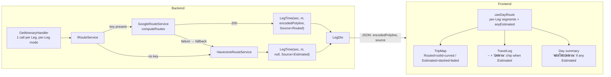
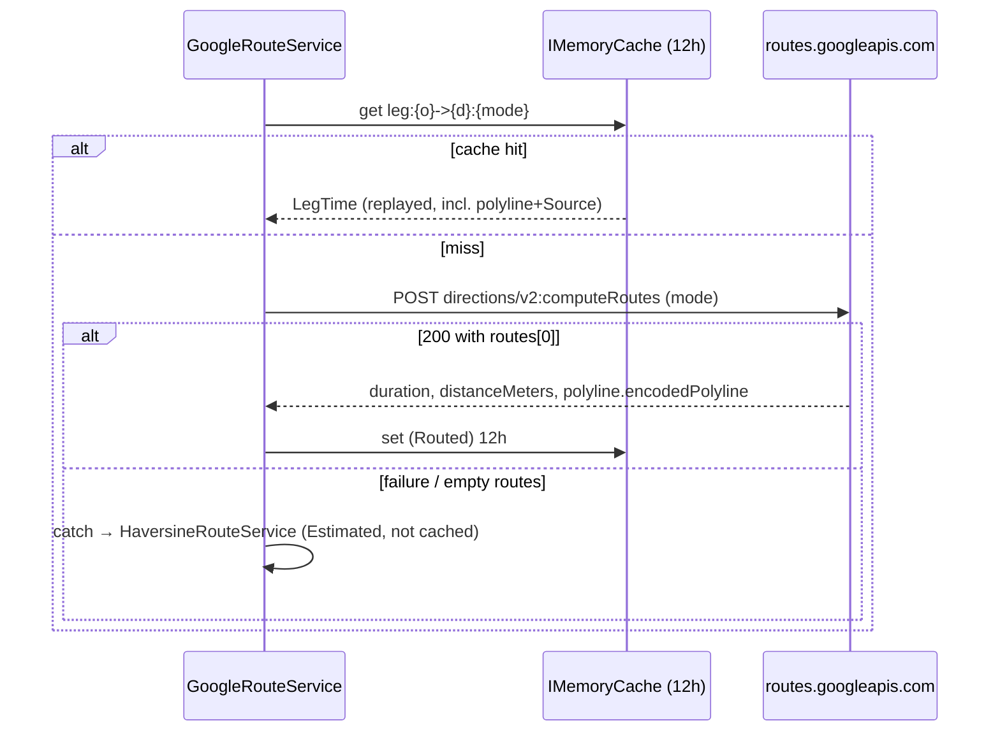

# Design — Trip route geometry + honest Estimated fallback

**Date:** 2026-07-03
**Status:** Draft for approval
**ADRs:** [016](../../adr/016-route-geometry-and-distance-via-compute-routes.md) ·
[017](../../adr/017-per-leg-route-resolution.md) ·
[018](../../adr/018-honest-fallback-route-source-on-leg.md) ·
[019](../../adr/019-estimated-leg-ui-treatment.md) ·
[020](../../adr/020-fallback-observability-via-existing-dependency-telemetry.md)
**Mock:** `docs/mocks/route-estimate-treatment-mock.html` (owner-confirmed)
**Walkthrough:** `docs/problem-description/2026-07-03-per-leg-vs-per-day-walkthrough.html`

## Problem (verified via debug-mantra)

The Trips map draws a straight line between stops and the per-Leg distance/time
looks wrong. Confirmed root cause: the Google Cloud project (`#483442944628`) has
**billing disabled**, so every Routes API `computeRouteMatrix` call returns
`403 BILLING_DISABLED`; `GoogleRouteService` silently falls back to
`HaversineRouteService` (straight-line ×1.3 ÷ mode speed = the "40 km/h exactly"
estimate). Two distinct defects follow:

1. **No road geometry** — `computeRouteMatrix` returns distance/time only, so the
   map has nothing to draw but a straight `geodesic` line (by design today).
2. **Estimated distance shown as truth** — the Haversine fallback is silent; the UI
   presents the estimate identically to a routed distance.

Enabling billing is an **operational** step (out of this change). This design makes
the app (a) use real road geometry + distance when the Routes API is available, and
(b) honestly label + visually distinguish estimates when it is not.

## Overview

## Goals / non-goals

**Goals:** road-accurate per-Leg geometry on the map; real routed distance/time;
explicit `RouteSource` on every Leg; honest UI for `Estimated` legs on all three
surfaces (map / pill / summary); stay in the Routes API **Essentials** pricing tier;
zero new observability code.

**Non-goals (deferred / cut):** per-day batching for single-mode days (Phase 2);
custom telemetry metric/alert; replacing the pill's mode emoji (separate debt);
enabling Google billing (operational); any `appsettings`/Bicep/DI wiring change.

## Backend design

### One Leg resolution (sequence)

### `GoogleRouteService.ComputeOneAsync` — computeRouteMatrix → computeRoutes

`backend/src/MenuNest.Infrastructure/Maps/GoogleRouteService.cs`

- **URL:** `https://routes.googleapis.com/distanceMatrix/v2:computeRouteMatrix`
  → `https://routes.googleapis.com/directions/v2:computeRoutes`.
- **Field mask** (`X-Goog-FieldMask`, mandatory): `originIndex,destinationIndex,duration,distanceMeters,condition`
  → **`routes.duration,routes.distanceMeters,routes.polyline.encodedPolyline`**. The
  `routes.` prefix is required (computeRoutes wraps output in `routes[]`); drop the
  matrix-only fields.
- **Request body:** singular `origin` / `destination` Waypoint objects (not arrays,
  no `waypoint` wrapper). Change `Wp()` from `{ waypoint: { location: { latLng } } }`
  → `{ location: { latLng: { latitude, longitude } } }`; set `origin = Wp(o), destination = Wp(d)`.
  Keep the `travelMode` `DRIVE|WALK|TRANSIT` switch.
- **routingPreference:** continue to send **none** — omission = `TRAFFIC_UNAWARE`
  = Essentials tier, and it is the only valid choice for WALK/TRANSIT. Do **not** set
  `polylineQuality: HIGH_QUALITY` or widen the mask (either bumps to the paid tier).
- **Response parse:** root is an object `{ "routes": [ { "duration":"120s", "distanceMeters":n, "polyline":{ "encodedPolyline":"…" } } ] }`.
  Replace `doc.RootElement.EnumerateArray().First()` with
  `doc.RootElement.GetProperty("routes").EnumerateArray().First()`; read `duration`
  (reuse `ParseDuration`, still `"###s"`), `distanceMeters`, and
  `polyline.encodedPolyline` (guard with `TryGetProperty`). Empty `routes[]` →
  `.First()` throws → caught by the existing outer try → whole-request Haversine
  fallback (acceptable).
- **Return:** `new LegTime(seconds, meters, encodedPolyline, RouteSource.Routed)`.
- Keep `X-Goog-Api-Key` (same server key) and `X-Goog-Maps-Solution-ID: gmp_git_agentskills_v1`
  (ADR-007 attribution — must not be dropped).
- Ensure `using MenuNest.Domain.Enums;` is present (verify/add).
- Update the stale header comment (lines 10–15) to describe computeRoutes.

### New enum + widened records

- **`backend/src/MenuNest.Domain/Enums/RouteSource.cs`** (new): `public enum RouteSource { Routed, Estimated }`
  (mirror `TravelMode.cs`). Note `Routed = 0` is the C# default — so every
  `new LegTime(...)` must pass `Source` **explicitly** (never rely on the default).
- **`LegTime`** (`Application/Abstractions/IRouteService.cs:5`):
  `(int Seconds, int Meters, string? EncodedPolyline, RouteSource Source)`. It is the
  cached type, so both fields thread through the 12h cache automatically.
- **`LegDto`** (`Application/UseCases/Trips/TripDtos.cs:15`): same 4 params (wire DTO).
- **`HaversineRouteService.cs:18`**: `new LegTime(…, EncodedPolyline: null, Source: RouteSource.Estimated)`.
  This single edit covers both the standalone no-key service and `GoogleRouteService`'s
  internal `_fallback`.
- **`GetItineraryHandler.cs:62`** (the only `LegDto` producer): hoist
  `var l = legByKey[(day.Id, i)];` then `new LegDto(l.Seconds, l.Meters, l.EncodedPolyline, l.Source)`.
  `AddStopHandler.cs:34` keeps `LegToReach = null` (no change).
- **Cache:** unchanged calls; `Estimated` legs remain **not** cached (preserve — do
  not pin a polyline-less entry for 12h). 12h TTL stays within Google's ToS caching
  window even holding `encodedPolyline`.

### Wire contract (confirmed, no codegen)

`Program.cs:185` registers `JsonStringEnumConverter` (PascalCase) on the controller
pipeline, so `RouteSource` serializes as the **string** `"Routed"`/`"Estimated"`
— matching the frontend union, same mechanism as `TravelMode`. There is **no**
OpenAPI/TS codegen; `api.ts` is hand-maintained and `getItinerary` has no
`transformResponse`, so widening the interface is the sole frontend contract edit and
it propagates through the shared RTK cache untouched.

## Frontend design

- **`api.ts`**: add `export type RouteSource = 'Routed' | 'Estimated'`; widen
  `LegDto` → `{ seconds; meters; encodedPolyline: string | null; source: RouteSource }`
  (camelCase). **Robustness:** treat a missing/`undefined` `source` (older cached
  payload) as `Estimated`, so the pill and the map never disagree.
- **`useDayRoute.ts`**: return a new **`segments: RouteSegment[]`** where
  `RouteSegment = { from: LatLng; to: LatLng; encodedPolyline: string | null; source: RouteSource }`,
  each connecting **consecutive surviving** route points (the existing null-drop of
  bad-coord stops means a dropped middle stop invalidates its adjoining legs → draw a
  straight line between surviving neighbours; the first stop has no incoming leg).
  Add `anyEstimated = scheduled.some(s => s.stop.legToReach?.source === 'Estimated')`;
  when true, prefix the summary distance with `~` and append the **`ระยะโดยประมาณ`**
  flag. `totalKm` still sums leg meters exactly (unchanged). Keep memo deps
  `[scheduled, placesById]`.
- **`TripMap.tsx`**: add `useMapsLibrary('geometry')` and
  `geometry.encoding.decodePath(encoded)`. Replace the single geodesic `RoutePolyline`
  with **per-Leg** segments (new `segments` prop): `Routed` + polyline → **solid**
  teal `#0e8f9e` decoded (road-following) `Polyline`; `Estimated` → **dashed, faded,
  straight** 2-point line (`strokeOpacity:0` + `icons:[{icon:{path:'M 0,-1 0,1', strokeOpacity:1, scale}, offset:'0', repeat:'10px'}]`).
  Track all per-Leg polylines in an array and dispose **every** one in the effect
  teardown. Feed the segments array as a stable memoised reference. `FitBounds` stays
  on the stop-point `path` (cheap; keep single-stop special-case). No-op cleanly when
  `route`/`segments` is undefined (places-only map).
- **`TravelLeg.tsx`**: read `leg.source`; when `Estimated`, prefix minutes/km with
  `~` and render a small amber **`ประมาณ`** chip (Thai text, no emoji). The mode emoji
  🚗/🚶/🚃 stays as-is (out of scope).
- **`trips-tokens.css`**: add the amber `ประมาณ` chip class inside `.travel-leg`
  (reuse `--warn` / `#e9a23b`; `TravelLeg` has no local styles).
- **No change**: `useSchedule.ts` (cascade reads only `seconds`; `ScheduledStop`
  carries the full leg — must not be reshaped), `ItineraryTab.tsx` (already passes the
  whole `legToReach`), `ItineraryStopCard.tsx`, and `StopEditorDialog.tsx:59-61`
  (a third leg readout — additive-safe; per ADR-019 the marker is scoped to pill + map,
  so it is deliberately left untouched).

## Complete touchpoint inventory (grep-verified)

| # | File | Change |
|---|------|--------|
| 1 | `backend/src/MenuNest.Domain/Enums/RouteSource.cs` | **new** `{ Routed, Estimated }` |
| 2 | `Application/Abstractions/IRouteService.cs:5` | widen `LegTime` (+EncodedPolyline, +Source) |
| 3 | `Infrastructure/Maps/GoogleRouteService.cs` | computeRoutes swap; return Routed+polyline; comment |
| 4 | `Infrastructure/Maps/HaversineRouteService.cs:18` | `null, RouteSource.Estimated` |
| 5 | `Application/UseCases/Trips/TripDtos.cs:15` | widen `LegDto` |
| 6 | `Application/UseCases/Trips/GetItinerary/GetItineraryHandler.cs:62` | map new fields (hoist lookup) |
| 7 | `Infrastructure/DependencyInjection.cs:112` | de-stale comment only |
| 8 | `backend/tests/…/GetItineraryHandlerTests.cs:31,67` | update `new(…)` LegTime literals |
| 9 | `backend/tests/…/Maps/HaversineRouteServiceTests.cs` | assert `Source==Estimated`, `polyline==null` |
| 10 | `backend/tests/…` (new) | GoogleRouteService computeRoutes-JSON parse test |
| 11 | `frontend/src/shared/api/api.ts` | `RouteSource` type + widen `LegDto` interface |
| 12 | `frontend/src/pages/trips/hooks/useDayRoute.ts` | `segments` + `anyEstimated` + summary flag |
| 13 | `frontend/src/pages/trips/components/TripMap.tsx` | geometry decode + per-Leg polylines |
| 14 | `frontend/src/pages/trips/components/TravelLeg.tsx` | `~` + `ประมาณ` chip when Estimated |
| 15 | `frontend/src/pages/trips/trips-tokens.css` | amber chip class |
| 16 | `frontend/src/pages/trips/hooks/useSchedule.test.ts:8` | **compile-break** — add `source`/`encodedPolyline` to the leg literal |
| 17 | `frontend/src/pages/trips/components/TripMap.tsx:30-32` | de-stale comment |

No change confirmed for: `appsettings*.json`, `infra/modules/app-service.bicep`,
`docs/frontend-guidelines.md`, `Program.cs`, `TripsController.cs`, `AddStopHandler.cs`,
`useSchedule.ts`, `ItineraryTab.tsx`, `ItineraryStopCard.tsx`, `StopEditorDialog.tsx`,
`googleMapsTelemetry.ts`.

## Implementation order

Backend first. Widening a positional record breaks the build until **every**
construction site is updated, so steps 1–6 below (the enum, both records, both
producers, the handler map, and the backend test literals) land as **one commit**;
the frontend contract edit (step 7) and its `useSchedule.test.ts` literal fix must
also share a commit:

1. Create `RouteSource.cs`.
2. Widen `LegTime` (`IRouteService.cs`).
3. Fix both `LegTime` producers — `GoogleRouteService` (computeRoutes swap +
   `Routed`+polyline) and `HaversineRouteService` (`Estimated`+null).
4. Fix `LegTime` test literals (`GetItineraryHandlerTests.cs:31,67`).
5. Widen `LegDto` (`TripDtos.cs`).
6. Map fields in `GetItineraryHandler.cs:62`; de-stale comments.
7. Frontend `api.ts`: `RouteSource` type + widen `LegDto`; fix `useSchedule.test.ts:8`
   in the same commit (or make the two fields optional).
8. Frontend render: `useDayRoute` segments/flag → `TripMap` per-Leg polylines →
   `TravelLeg` chip → `trips-tokens.css`.

## Testing

- **Backend (new/updated):** `HaversineRouteService` → `Source==Estimated`,
  `EncodedPolyline==null`; **new** `GoogleRouteService` unit test parsing a sample
  computeRoutes JSON (asserts `Routed`, distance/seconds, decoded polyline present);
  `GetItineraryHandler` → new fields flow into `LegDto`; existing handler tests keep
  passing after the literal update. (Note: locally with no `GoogleMaps:ApiKey`, DI
  wires Haversine — unit-test `GoogleRouteService` by injecting `IOptions<GoogleMapsOptions>`
  directly, as `GooglePlaceResolverTests` does.)
- **Frontend:** `useSchedule.test.ts` literal fixed to compile; recommended new
  `useDayRoute` test for `anyEstimated` + segment pairing across a dropped-coord stop.
  (No existing TripMap/TravelLeg tests — new surface is otherwise unguarded.)
- **Verify end-to-end:** the change only exercises `computeRoutes` when a key is
  present; verify against prod behaviour once billing is on (all `Routed`, solid
  curved lines), and confirm the billing-off / no-key path renders all-`Estimated`
  (dashed, `ระยะโดยประมาณ`).

## Gates & risks

- **Compliance gate (ADR-007):** run the `google-maps-platform` skill's
  `compliance-review` on the computeRoutes code **before merge**.
- **Pricing:** field mask must stay exactly the three basic fields; no
  `routingPreference`, no `HIGH_QUALITY` polyline — any of these moves the call to the
  paid tier.
- **Wire contract:** `RouteSource` must serialize as a string (confirmed via
  `Program.cs:185`); a numeric enum would make every `=== 'Estimated'` silently false.
- **Frontend robustness:** treat missing `source` as `Estimated`.
- **Map cleanup:** dispose every per-Leg polyline on teardown (leak risk on
  zoom/day-switch).
- **Operational:** until billing is enabled on project `#483442944628`, every Leg is
  `Estimated` — which now renders honestly rather than as a wrong-looking truth.
