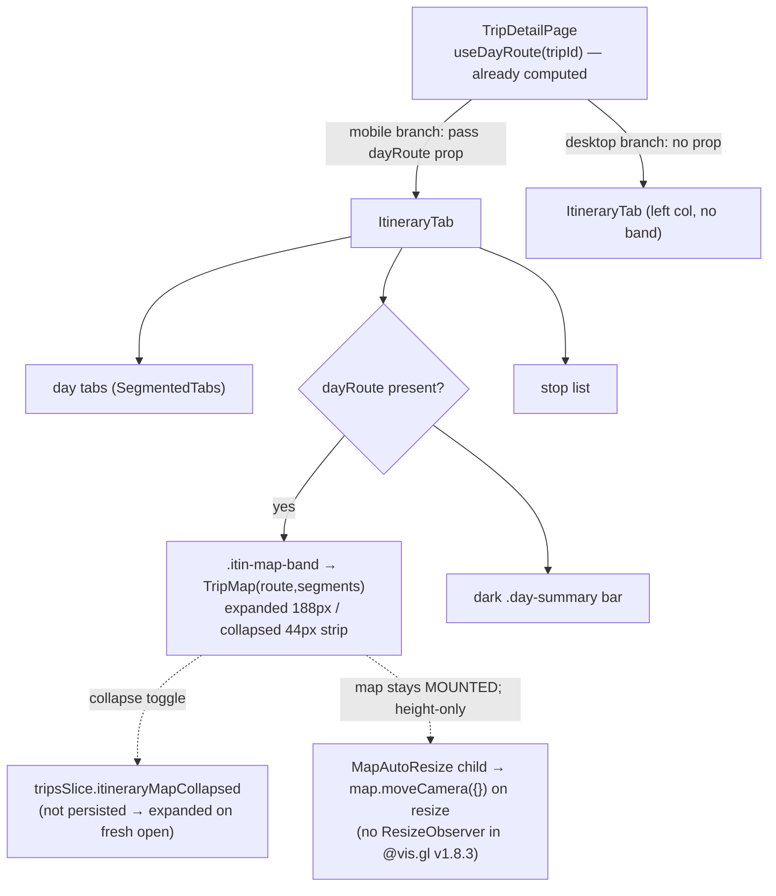
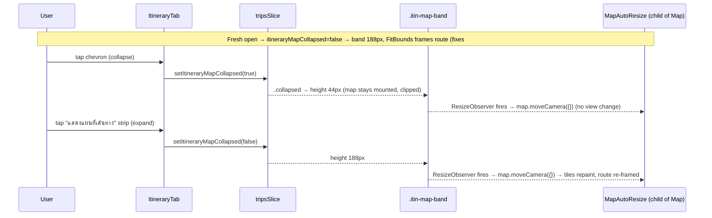

# Design — Collapsible route-map band on the mobile/tablet itinerary (issue #8)

**Date:** 2026-07-04
**Status:** Draft (awaiting approval)
**Related:** ADR-026 (this decision), ADR-010 (Map-Forward handoff / map is the hero), ADR-022 (map pins reflect flag severity), ADR-008 (schedule cascade), GitHub issue [#8](https://github.com/ThodsaphonSonthiphin/MenuNest/issues/8)
**Mock:** [docs/mocks/trip-itinerary-map-toggle-mock.html](../../mocks/trip-itinerary-map-toggle-mock.html) — Option A confirmed with the owner ([default](../../mocks/trip-itinerary-map-toggle-preview-default.png) · [toggled](../../mocks/trip-itinerary-map-toggle-preview-toggled.png))

## 1. Problem

On mobile/tablet the **Itinerary** view shows **no map at all**. The route map is
rendered only in the desktop split's right pane
([TripDetailPage.tsx:119-130](../../../frontend/src/pages/trips/TripDetailPage.tsx#L119-L130),
inside the `isDesktop` branch); the mobile branch renders `<ItineraryTab>` alone
([TripDetailPage.tsx:201](../../../frontend/src/pages/trips/TripDetailPage.tsx#L201)),
and `ItineraryTab` does not import `TripMap`
([ItineraryTab.tsx:1-22](../../../frontend/src/pages/trips/components/ItineraryTab.tsx#L1-L22)).

Because the default tab is `itinerary`
([tripsSlice.ts:21](../../../frontend/src/pages/trips/tripsSlice.ts#L21)), opening a
trip link on a phone lands on the mapless screen — exactly what issue #8 reports
("บนมือถือไม่แสดงแผนที่"), and a direct contradiction of the Map-Forward hero (ADR-010,
handoff Screen F3, which specifies a ~188px route map under the day tabs).

Diagnosis was confirmed via debug-mantra (reproduce → fail-path → falsify) and the
owner confirmed the screenshot is the **itinerary (แผนเที่ยว)** default tab. Root cause:
a missing render, not a broken map. The mobile places→map view renders `TripMap`
normally and is out of scope.

**This is a frontend-only change.** No backend, DB, or API change.

## 2. Goal / non-goals

**Goal:** On mobile/tablet, the Itinerary view shows the active **Day**'s route as a
**~188px map band** (numbered pins + per-leg polylines — the same `TripMap` route mode
the desktop right pane uses), placed between the day tabs and the dark `.day-summary`
bar. The band is **expanded by default** (this is what fixes #8) and can be **collapsed**
to a thin strip to give the stop list more room, then re-expanded.

**Non-goals:** redesigning the `.day-summary` bar (already dark, `background: var(--ink)`
at [trips-tokens.css:60-71](../../../frontend/src/pages/trips/trips-tokens.css#L60-L71) — no change);
the mobile places→map view (works, untouched); the desktop split (untouched); a
Map/List switch or a full-screen map (rejected in ADR-026); auto-optimize / drag semantics.

## 3. Overview



## 4. Changes, file by file

### 4.1 Edit — `tripsSlice.ts` (one UI-state bit)

Add a boolean mirroring the existing `createTripOpen` / `addMode` pattern
([tripsSlice.ts:35-36](../../../frontend/src/pages/trips/tripsSlice.ts#L35-L36)):

- `TripsState`: add `itineraryMapCollapsed: boolean`.
- `initialState`: add `itineraryMapCollapsed: false` — **`false` = expanded**, so a fresh
  render always shows the map.
- reducer: `setItineraryMapCollapsed(s, a: PayloadAction<boolean>) { s.itineraryMapCollapsed = a.payload }`.
- export the auto-generated `setItineraryMapCollapsed` action.

The trips slice is plain in-memory Redux — no `redux-persist`/`preloadedState`, and no
`localStorage` reads trips state ([store/index.ts:19-34](../../../frontend/src/store/index.ts#L19-L34);
verified: zero `redux-persist`/`persistReducer` matches). So a reload resets it to
expanded, keeping #8 fixed on every fresh open. **Constraint to record:** the trips slice
must stay non-persisted; if persistence is ever added, blacklist `itineraryMapCollapsed`.

> Chosen over a local `useState` in `ItineraryTab` for consistency with the other trips
> UI toggles and because it makes the default-expanded guarantee unit-testable (§7).

### 4.2 Edit — `TripMap.tsx` (add `gestureHandling` prop + a `MapAutoResize` child)

`TripMap` already supports route mode for the band with no marker/overlay changes:
passing `route`+`segments` **without** `summaryText`/`summaryLabel` suppresses the
`.map-day-card` overlay — the gate is `routeMode && summaryText`
([TripMap.tsx:212](../../../frontend/src/pages/trips/components/TripMap.tsx#L212)) — so the
dark `.day-summary` bar remains the sole day summary. Omitting `addMode` (default `false`,
[:88](../../../frontend/src/pages/trips/components/TripMap.tsx#L88)) disables the click
handler, temp pin, and `AddPlaceMode`, making the band read-only. `places` is still passed
(required prop; it is the center fallback for a day with zero scheduled stops).

Two real changes:

1. **`gestureHandling` prop.** It is currently hardcoded `"greedy"`
   ([TripMap.tsx:142](../../../frontend/src/pages/trips/components/TripMap.tsx#L142)), which
   traps one-finger page scroll — unacceptable for a short band inside the vertically
   scrolling mobile page. Add `gestureHandling?: string` (default `'greedy'` so desktop and
   places→map are unchanged); the band passes **`'cooperative'`** (one finger scrolls the
   page, two fingers pan the map).
2. **`MapAutoResize` re-layout child.** `@vis.gl/react-google-maps` **v1.8.3 installs no
   ResizeObserver**, and its only self-heal (`setTimeout(() => map.moveCamera({}), 0)`) is
   gated behind `reuseMaps`, which `TripMap` does not enable
   ([use-map-instance.ts:141-152](../../../frontend/node_modules/@vis.gl/react-google-maps/src/components/map/use-map-instance.ts)),
   so nothing re-renders tiles when the container height changes. Add a tiny child of `<Map>`
   (a sibling of `FitBounds`, so it can call `useMap()`):

   ```tsx
   function MapAutoResize() {
     const map = useMap()
     useEffect(() => {
       if (!map || typeof ResizeObserver === 'undefined') return
       const el = map.getDiv()
       let raf = 0
       const ro = new ResizeObserver(() => {
         cancelAnimationFrame(raf)
         // moveCamera({}) forces a re-layout WITHOUT changing the view — the
         // library's own documented remedy. Keeps tiles from staying grey when
         // the band expands from the collapsed strip.
         raf = requestAnimationFrame(() => map.moveCamera({}))
       })
       ro.observe(el)
       return () => { ro.disconnect(); cancelAnimationFrame(raf) }
     }, [map])
     return null
   }
   ```

   Render it unconditionally inside `<Map>` (harmless everywhere; it also hardens the
   desktop and places→map maps against any container resize). This is what guarantees the
   band's map repaints on every expand.

`FitBounds` stays as-is: it frames the route on mount (initial expanded load) and whenever
`path` changes; the collapse/expand cycle keeps the map **mounted** so the existing framing
is preserved and `MapAutoResize` only forces the tile re-layout.

### 4.3 Edit — `useDayRoute.ts` (export the return type)

Add `export type DayRoute = ReturnType<typeof useDayRoute>` so `ItineraryTab` can type the
new prop. `route`/`segments` shapes are already exported
([useDayRoute.ts:15,26](../../../frontend/src/pages/trips/hooks/useDayRoute.ts#L15)).

### 4.4 Edit — `TripDetailPage.tsx` (pass the already-computed route on mobile)

`dayRoute = useDayRoute(tripId)` is already called unconditionally at the top and is
currently **discarded on mobile** ([TripDetailPage.tsx:45](../../../frontend/src/pages/trips/TripDetailPage.tsx#L45)).
Wire it through **Option A** (zero new hooks, zero new computation):

- **Mobile branch** ([:201](../../../frontend/src/pages/trips/TripDetailPage.tsx#L201)):
  `<ItineraryTab tripId={tripId} dayRoute={dayRoute} />`.
- **Desktop branch** ([:114](../../../frontend/src/pages/trips/TripDetailPage.tsx#L114)):
  **unchanged** — `<ItineraryTab tripId={tripId} />` with **no** `dayRoute` prop, so no band
  renders in the left column (the desktop map stays the right pane). Gating on the prop's
  presence is what confines the band to mobile/tablet.

> The parent already runs `useDayRoute` and `ItineraryTab` already runs `useSchedule`
> ([ItineraryTab.tsx:112](../../../frontend/src/pages/trips/components/ItineraryTab.tsx#L112)),
> so the double schedule computation pre-exists on both breakpoints; Option A adds none.

### 4.5 Edit — `ItineraryTab.tsx` (render the band + collapse control)

Signature becomes `export function ItineraryTab({tripId, dayRoute}: {tripId: string; dayRoute?: DayRoute})`.

Immediately **after** the day-tabs `SegmentedTabs`
([:156-160](../../../frontend/src/pages/trips/components/ItineraryTab.tsx#L156-L160)) and
**before** the `.day-summary` div ([:162](../../../frontend/src/pages/trips/components/ItineraryTab.tsx#L162)),
render the band only when `dayRoute` is present:

```tsx
const collapsed = useAppSelector((s) => s.trips.itineraryMapCollapsed)
// ...
{dayRoute && (
  <div className={`itin-map-band${collapsed ? ' collapsed' : ''}`}>
    <TripMap
      places={places ?? []}
      route={dayRoute.route}
      segments={dayRoute.segments}
      gestureHandling="cooperative"
    />
    {/* collapse control (expanded): chevron-up, overlaid top-right */}
    {!collapsed && (
      <button
        className="itin-map-collapse"
        aria-label="ย่อแผนที่"
        aria-expanded={true}
        onClick={() => dispatch(setItineraryMapCollapsed(true))}
      >
        <ChevronUpIcon />
      </button>
    )}
    {/* expand strip (collapsed): full-width 44px bar over the clipped map */}
    {collapsed && (
      <button
        className="itin-map-strip"
        aria-label="แสดงแผนที่เส้นทาง"
        aria-expanded={false}
        onClick={() => dispatch(setItineraryMapCollapsed(false))}
      >
        <RouteIcon /> <span>แสดงแผนที่เส้นทาง</span> <ChevronDownIcon />
      </button>
    )}
  </div>
)}
```

- Both control elements are siblings of `<TripMap>` inside the `position:relative` band, so
  the map **stays mounted** in both states (never `display:none`, never unmounted — the
  collapse is height-only, per §4.6). When collapsed, the opaque `.itin-map-strip` covers the
  44px sliver of clipped map.
- Icons are **inline hand-authored SVG components** added to
  [TripFormIcons.tsx](../../../frontend/src/pages/trips/components/TripFormIcons.tsx)
  (`ChevronUpIcon`, `ChevronDownIcon`, `MapRouteIcon`), following that file's existing
  `base` pattern (`viewBox 0 0 24 24`, `stroke: currentColor`, `1em`). This is the trips
  module's established no-emoji convention ([NavIcon.tsx](../../../frontend/src/pages/trips/components/NavIcon.tsx),
  TripFormIcons.tsx). Note: `docs/frontend-guidelines.md` §Icons prescribes
  `@syncfusion/react-icons`, but that package is **not a declared dependency** (absent from
  `frontend/package.json`, zero imports in the codebase) — adding it is out of scope for a
  bug fix, so we follow the local inline-SVG pattern. The mock's 🗺/˄/˅ are placeholders; the
  Thai label is user-visible copy.
- The collapse bit is read from `tripsSlice` and toggled via `setItineraryMapCollapsed`; hook
  order is unconditional (Rules-of-Hooks safe).

### 4.6 Edit — `TripDetailPage.css` (band sizing, scoped to `.itinerary-tab`)

`.itinerary-tab` is already a flex column
([trips-tokens.css:118](../../../frontend/src/pages/trips/trips-tokens.css#L118)), so a band
child takes `flex: none` directly. Add these rules **in `TripDetailPage.css`** (imported last,
[TripDetailPage.tsx:13-14](../../../frontend/src/pages/trips/TripDetailPage.tsx#L13-L14), so it
wins equal-specificity ties):

```css
.itinerary-tab .itin-map-band {
  position: relative;
  flex: none;
  height: 188px;
  min-height: 0;            /* CRITICAL: base .trip-map carries min-height 320/280 */
  overflow: hidden;
  border-radius: 12px;
  transition: height .2s ease;
}
.itinerary-tab .itin-map-band.collapsed { height: 44px; }
.itinerary-tab .itin-map-band .trip-map {
  height: 100%;
  min-height: 0;            /* neutralise trips-tokens.css 60vh/320 + @479 50vh/280 */
}
```

Specificity: `.itinerary-tab .itin-map-band .trip-map` (0,3,0) beats base `.trip-map`
(0,1,0, [trips-tokens.css:272](../../../frontend/src/pages/trips/trips-tokens.css#L272)) and
the `@media (max-width:479px)` override (0,1,0 — media adds no specificity,
[:426-431](../../../frontend/src/pages/trips/trips-tokens.css#L426-L431)). Rooted at
`.itinerary-tab`, it cannot match the mobile places→map (`.trip-places`) or the desktop map
(`.trip-detail-col-right`), and the higher-specificity desktop rule
`.trip-detail.desktop .trip-map { height:100% }` (0,3,0,
[TripDetailPage.css:103-107](../../../frontend/src/pages/trips/TripDetailPage.css#L103-L107))
is unaffected. **The `min-height:0` on both selectors is mandatory** — without it the base
`min-height` floors the box at 280/320px. Plus control styling: `.itin-map-collapse` (small
round icon button, absolute top-right, above the map), `.itin-map-strip` (full-width 44px
opaque bar, teal-deep text, `cursor:pointer`), in the teal Trips accent.

## 5. Interaction



## 6. Edge cases

- **Desktop unaffected:** no `dayRoute` prop → no band; the right-pane map is the desktop
  map. Verified by gating render on `dayRoute` presence (§4.4) and CSS scoped to
  `.itinerary-tab` (§4.6).
- **Tablet (640–1023):** uses the mobile branch already (`isDesktop = bp === 'desktop'`,
  ≥1024, [useBreakpoint.ts](../../../frontend/src/shared/hooks/useBreakpoint.ts)), so it
  receives the `dayRoute` prop and gets the same band — intended.
- **Grey-tiles-on-toggle (the core risk):** avoided by keeping the map mounted (height-only
  collapse) + `MapAutoResize` forcing `moveCamera({})` on resize. **Never** `display:none`
  or unmount — that triggers a full `google.maps.Map` re-init and the grey-tile failure.
- **FitBounds at 188px:** single stop → `setCenter` + `setZoom(14)` (height-independent);
  multi-stop → `fitBounds(bounds, 64)`. The fixed 64px pad is generous for a 188px band and
  may render the route slightly zoomed-out with upward callouts near the top edge clipped by
  `overflow:hidden`. **Verify visually in-app**; if it reads poorly, add an optional
  `fitPadding?` prop to `TripMap`/`FitBounds` and pass a smaller/asymmetric pad from the band
  (extra on top for callouts). Deferred as a refinement, not a blocker.
- **No Maps key:** `TripMap` returns `.trip-map-fallback` (fixed 160px,
  [TripDetailPage.css:227](../../../frontend/src/pages/trips/TripDetailPage.css#L227)), not
  `.trip-map`, so the band height rule doesn't size it — acceptable (shows the Thai
  "set the key" message inside the band).
- **Empty day / loading:** the band renders inside `ItineraryTab`, after its
  `if (!dayList.length)` guard ([:134](../../../frontend/src/pages/trips/components/ItineraryTab.tsx#L134));
  a day with zero finite-coord stops yields an empty `route`, and `TripMap` centers on the
  first place or Bangkok fallback — no NaN/crash (route stops with non-finite coords are
  already dropped, [useDayRoute.ts:96](../../../frontend/src/pages/trips/hooks/useDayRoute.ts#L96)).
- **Day switch while collapsed:** `itineraryMapCollapsed` is global to the itinerary view, so
  switching days keeps the user's collapsed/expanded choice; the band re-fits to the new day's
  route via `FitBounds` (path change).

## 7. Testing

Per repo conventions: Vitest runs **pure functions/reducers only** (node env, `src/**/*.test.ts`,
no `@testing-library/react`/jsdom); component/UI behaviour is Playwright e2e (Desktop-Chrome
project only, no trip mock-routes).

1. **Unit (Vitest) — primary regression guard.** Extend
   [tripsSlice.test.ts](../../../frontend/src/pages/trips/tripsSlice.test.ts), mirroring the
   existing `setAddMode` block: assert `itineraryMapCollapsed` **defaults to `false`
   (expanded)** and that `setItineraryMapCollapsed(true|false)` toggles it. This locks the
   "fresh open shows the map" guarantee that fixes #8.
2. **Manual / visual.** Confirm against the mock ([trip-itinerary-map-toggle-mock.html](../../mocks/trip-itinerary-map-toggle-mock.html))
   and then in-app on a real mobile viewport: band visible on open, collapse→strip→expand,
   **tiles repaint on expand (no grey)**, one-finger scroll moves the page (cooperative),
   FitBounds framing at 188px. Drive it with the running app (the project's verify-in-app habit).
3. **Mobile e2e — deferred to Phase 2 (§8).**

## 8. Out of scope / deferred

- **Mobile-viewport e2e for the band.** A Playwright spec asserting the band's visibility/
  collapse on a phone viewport needs **net-new infrastructure** — a mobile viewport project
  (config ships Desktop-Chrome only), trip mock-routes + fixtures (none exist), and a
  `data-testid` on the band (trips have none) — and mobile-viewport e2e was explicitly
  deferred out-of-scope in the [Phase-2 coverage design](2026-05-18-phase2-playwright-coverage-design.md).
  Recorded as Phase 2; the Vitest reducer test + manual verification cover this change.
- **`fitPadding` prop** on `TripMap` — only if the 64px pad reads poorly at 188px (§6).
- **`.day-summary` restyle, places→map view, desktop split** — untouched (§2).
