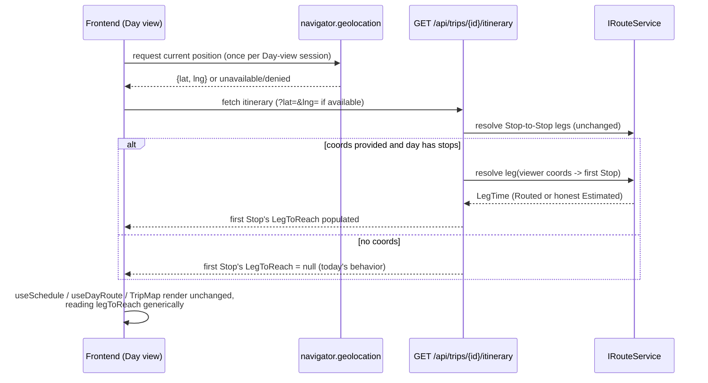

# Design — Approach leg: travel time into a Day's first Stop, from the viewer's live location

**Date:** 2026-07-05
**Status:** Proposed
**Related:** ADR-007 (Routes API is the source of truth for travel time), ADR-008
(Smart Schedule cascade), ADR-011 (Navigate hand-off uses current location),
ADR-017/018 (per-leg route resolution + honest fallback), ADR-023/024 (route
geometry + Estimated leg UI treatment), **ADR-027** (this feature's decision record)
**Issue:** [#4](https://github.com/ThodsaphonSonthiphin/MenuNest/issues/4)

## 1. Problem

Every **Leg** between two consecutive **Stops** carries a travel time/distance
resolved through the Google Routes API. The **first** Stop of a Day has none:
`GetItineraryHandler` only resolves legs for index `1..dayStops.Count-1`
([GetItineraryHandler.cs:44](../../../backend/src/MenuNest.Application/UseCases/Trips/GetItinerary/GetItineraryHandler.cs#L44)),
and `Stop.cs`'s own doc comment says "Sequence 0 has no leg." Consequently:

- `useSchedule.ts`'s cascade seeds `cursor = dayStartTime` and adds no travel time
  for the first arrival
  ([useSchedule.ts:144](../../../frontend/src/pages/trips/hooks/useSchedule.ts#L144)).
- `useDayRoute.ts`'s total-distance figure and the map polyline both silently treat a
  null `legToReach` on the first stop as "doesn't count"
  ([useDayRoute.ts:134](../../../frontend/src/pages/trips/hooks/useDayRoute.ts#L134)).

The itinerary header shows a start time (`เริ่ม 09:00`) with nothing explaining how
the traveller gets from wherever they are to that first Stop — the gap the issue
screenshot circles.

## 2. Goal / non-goals

**Goal:** Give every Stop, including the first one of a Day, an incoming travel
time/distance — the **Approach leg** — computed from the viewer's live location at
the moment they view the Day, resolved server-side through the same routing
machinery as every other Leg, and reflected in the Smart Schedule's arrival cascade,
the day's total-distance figure, and the itinerary map.

**Non-goals:**
- A stored/editable "trip start address" — explicitly rejected during grilling
  (ADR-027) in favor of live location.
- Making the Approach leg persist on the `Stop` entity — it is viewer- and
  moment-dependent by design, so it lives only in the response DTO for the request
  that computed it.
- Any change to the Navigate hand-off (ADR-011) — that feature already uses live
  location for a different purpose (an outbound deep link) and is untouched.

## 3. Overview

The key implementation insight: `useSchedule.computeSchedule` and
`useDayRoute`'s total/segment logic already treat `stop.legToReach` as "the leg that
reaches this stop, if any" **generically for every index**, including index 0 — they
just never receive one today. Populating `StopDto.LegToReach` for the first Stop,
instead of inventing a parallel per-Day field, means the arrival cascade and
total-distance math need **no changes** — only the map (§4.4) needs new code, because
its pins/segments are built purely from Stops and have no "viewer" concept yet.

## 4. Changes, file by file

### 4.1 `GetItineraryQuery` / `GetItineraryHandler` (backend)

- `GetItineraryQuery(Guid TripId, double? ViewerLat, double? ViewerLng)` — new
  optional fields.
- In `GetItineraryHandler`, for each Day whose `dayStops.Count > 0` and the query
  carries both coordinates: add one more `ResolveLegAsync` task with
  `origin = (ViewerLat, ViewerLng)` and `dest = places[dayStops[0].TripPlaceId]`,
  keyed at index `0` in `legByKey`. The existing `for (var li = 1; ...)` loop is
  untouched; the stop-DTO assembly loop's `if (i > 0)` guard becomes
  `if (i > 0 || (viewer coords provided))`, looking up index `0` from `legByKey` the
  same way it looks up any other index.
- Travel mode for the Approach leg: the first Stop's own `TravelModeToReach` (same
  field every other leg already uses — no new mode concept needed).

### 4.2 `TripsController.GetItinerary` (backend)

- `[HttpGet("api/trips/{id:guid}/itinerary")]` gains two optional query params:
  `double? lat, double? lng` → passed straight into `GetItineraryQuery`.

### 4.3 Frontend: sourcing the viewer's location

- A new hook (e.g. `useViewerLocation()`) wraps `navigator.geolocation.getCurrentPosition`,
  called once when the trip detail page mounts (not once per Day switch — switching
  the active Day tab must not re-prompt for permission or refire the browser API).
  Rounds coordinates to a stable precision (e.g. 4 decimal places, ~11m) before
  handing them to RTK Query, so re-renders don't fragment the `getItinerary` cache key
  with floating-point jitter.
- Denied / unsupported / timed-out → hook resolves to `null`; callers omit
  `lat`/`lng`, reproducing today's behavior exactly (§5 edge cases).
- `getItinerary` (api.ts:1289) changes from `build.query<ItineraryDayDto[], string>`
  to accept `{tripId: string; lat?: number; lng?: number}`, appending `lat`/`lng` as
  query-string params only when present. Both `ItineraryTab`'s data source and
  `useDayRoute.ts` must resolve through the **same** viewer-location value for a
  given Day view, or the map and the stop list could disagree on the Approach leg.

### 4.4 Map: `useDayRoute.ts` + `TripMap.tsx`

- `useDayRoute` gains a `viewerLocation: {lat, lng} | null` in its return (from the
  same hook as §4.3), independent of whether the Approach leg resolved (permission
  can be granted after the itinerary already loaded once).
- `TripMap` renders a distinct, **unnumbered** `AdvancedMarker` for `viewerLocation`
  (not part of the `route.map(...)` numbered-pin list) and includes it as the first
  point in `path` (for `FitBounds`) and in the segment-building input, so
  `buildSegments` draws a polyline from the viewer's pin to Stop 1 using the same
  Routed (solid)/Estimated (dashed) styling as every other segment (ADR-024).

## 5. Edge cases

- **No stops on the Day yet**: nothing to resolve an Approach leg into; unchanged
  from today.
- **Geolocation denied/unsupported/times out**: no Approach leg, no map pin — dead
  simple fallback, per ADR-027 decision 4.
- **Permission granted mid-session** (after an initial denial or a slow prompt):
  the itinerary refetches with coordinates once the hook's state updates; no manual
  refresh needed.
- **Switching Days**: the Approach leg is resolved into whichever Day is being
  viewed (ADR-027 decision 2) — no special-casing the first Day of the trip.
- **Coordinate jitter**: rounding (§4.3) keeps repeated `getCurrentPosition` reads
  from constantly invalidating the RTK Query cache for the same physical spot.
- **Routes API failure for the Approach leg specifically**: falls back to the same
  honest `Estimated` treatment as any other leg (ADR-017/018) — no special case.

## 6. Testing (planned)

- **Backend unit**: `GetItineraryHandler` resolves index-0 legs only when both
  coordinates are present and the Day has ≥1 Stop; omits it otherwise (mirrors the
  existing per-leg resolution tests).
- **Frontend unit**: `computeSchedule` / `useDayRoute`'s total-distance and
  `anyEstimated` logic need **no new test cases** beyond confirming they already
  treat a populated index-0 `legToReach` correctly (they're generic over index today).
- **Manual**: verify against a real browser geolocation prompt (grant/deny/no-op),
  confirm the map pin + polyline render, and confirm today's no-coords behavior is
  byte-for-byte unchanged when geolocation is unavailable.
