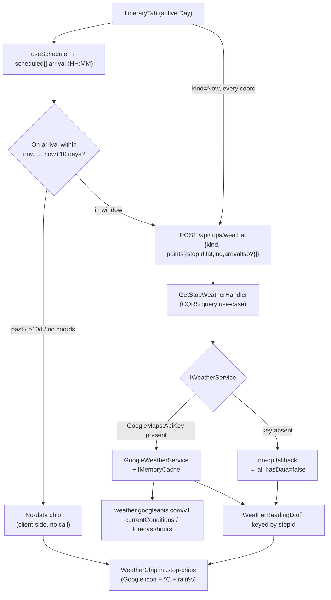
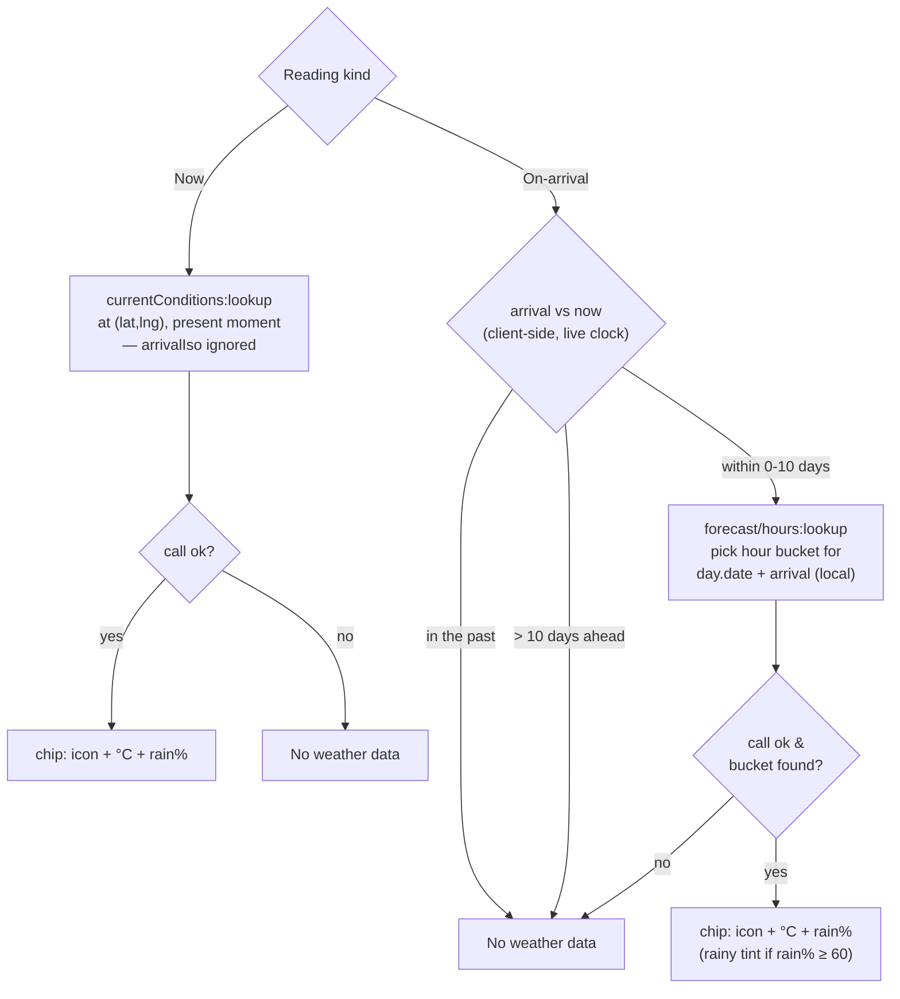
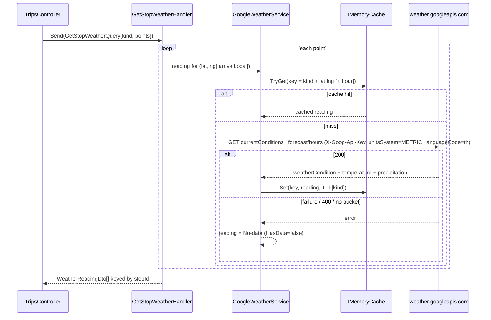
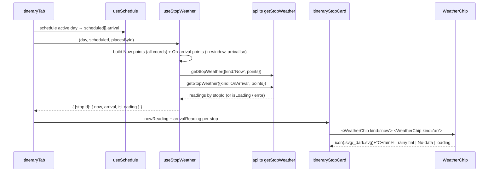

# Design — Trip weather on the itinerary (per-Stop, two readings) (issue #10)

**Date:** 2026-07-05
**Status:** Draft (awaiting approval)
**Related:** ADR-028 · ADR-029 · ADR-030 · ADR-031 · ADR-032 · ADR-033 (this feature), ADR-007 (Google Maps Platform + backend proxy), ADR-008 (Smart Schedule → arrival times), ADR-018 (honest fallback route source), ADR-026 (itinerary UI / stop card), GitHub issue [#10](https://github.com/ThodsaphonSonthiphin/MenuNest/issues/10)
**Mock:** [docs/mocks/trip-weather-mock.html](../../mocks/trip-weather-mock.html) — confirmed with the owner

---

## 1. Summary & goal

GitHub issue [#10](https://github.com/ThodsaphonSonthiphin/MenuNest/issues/10) ("add
whether notification functionality" — a typo for *weather*) asks for weather on the trip
itinerary. Grilling with the owner (2026-07-05) settled it as a **display-only** feature
(ADR-028): weather is shown inline on the itinerary and nowhere else — no push, no
pre-trip alerts, no background delivery. The Health module's `WebPushSubscription` entity
is intentionally left untouched.

**Goal.** Every **Stop** on the active itinerary **Day** shows **two weather readings side
by side** (ADR-029), never a toggle:

- **Now** — current conditions at the Stop's coordinates at the **real present moment**,
  independent of the Trip's dates.
- **On-arrival** — the hourly **forecast** at the Stop's coordinates for that Stop's
  scheduled **arrival** time, where arrival comes from the client-side Smart Schedule
  cascade (`useSchedule`, ADR-008).

Each reading renders as a chip: **[condition icon] + temperature (°C) + rain probability
(%)**. When On-arrival cannot be answered — arrival is in the past, more than 10 days
ahead, or the provider fails — the Stop shows an honest **"No weather data"** chip rather
than hiding the value (ADR-031). Weather is fetched through a **backend batch endpoint**
that proxies the **Google Weather API** with the server-side key and caches in memory;
**nothing is persisted** (ADR-030, ADR-033), so there is **no entity, no migration, and no
prod-DB step**.

This diagram shows the whole shape end to end — the itinerary stop cards gather coordinates
and arrival times, a batched POST resolves both readings through `IWeatherService`, and
per-Stop chips render the result (or a No-data chip for the client-gated cases).



---

## 2. Decisions (ADR-028 … ADR-033)

The six ADRs written for this feature each settle one axis; this spec implements them.

- **[ADR-028](../../adr/028-weather-display-only-no-push.md)** — Trip weather is **display-only**;
  no push / pre-trip alerts, and the Health `WebPushSubscription` is not touched.
- **[ADR-029](../../adr/029-weather-per-stop-two-readings.md)** — weather is **per-Stop** and shows
  **both** readings (**Now** + **On-arrival**) at once as two labelled chips — no checkbox/toggle
  (supersedes the issue's "pick one" wording).
- **[ADR-030](../../adr/030-weather-provider-google-weather-api.md)** — the provider is the **Google
  Weather API** (`currentConditions:lookup`, `forecast/hours:lookup` on
  `https://weather.googleapis.com/v1`), extending ADR-007 and reusing the existing
  `GoogleMaps:ApiKey`; Open-Meteo and OpenWeatherMap rejected.
- **[ADR-031](../../adr/031-weather-no-data-beyond-forecast-horizon.md)** — beyond the **10-day**
  forecast horizon, in the **past**, or on any **failure**, the Stop shows an honest **"No weather
  data"** chip (slashed-cloud + ไม่มีข้อมูลอากาศ); never hidden. "Now" shows No-data only on failure.
- **[ADR-032](../../adr/032-weather-icons-google-iconbaseuri-svg.md)** — condition icons come from Google's
  `weatherCondition.iconBaseUri` (`.svg` / `_dark.svg`), an **allowed exception** to
  frontend-guidelines §2 (Syncfusion has no weather-icon set; these are SVG, not emoji) — on the
  same footing as the `@vis.gl/react-google-maps` map exception.
- **[ADR-033](../../adr/033-weather-backend-batch-endpoint-no-persistence.md)** — weather is fetched via a
  **backend batch endpoint** → `IWeatherService` (Google impl + no-op fallback) → `IMemoryCache`;
  **nothing is persisted**. SPA-direct-to-Google and DB persistence rejected.

---

## 3. Glossary alignment

The domain terms are already recorded in [CONTEXT.md](../../../CONTEXT.md) under *Travel & trip
planning*; this spec must use them exactly and introduce no synonyms.

| Term | Meaning (CONTEXT.md) | Notes for this spec |
|---|---|---|
| **Weather reading** | A per-**Stop** indication of sky/precipitation, shown as a small chip. Each Stop carries two side by side. | *Avoid* "forecast" as the name for a reading — it names only one of the two. |
| **Now** | Current conditions at a Stop's coordinates at the real present moment, independent of the Trip's dates. | *Avoid* "live" (the issue-#10 word). |
| **On-arrival** | The forecast at a Stop's coordinates for that Stop's scheduled **arrival** time in the Smart Schedule. | *Avoid* "trip-date weather", "departure weather". |
| **Forecast horizon** | The 10-day window ahead of now the provider can forecast. | An On-arrival reading outside it resolves to **No weather data**. |
| **No weather data** | The state a reading shows when unavailable (beyond horizon, in the past, or provider failure). Slashed-cloud chip, never hidden. | *Avoid* "unknown", "error". |

UI copy (Thai): the chip labels are **ตอนนี้** (Now) and **ไปถึง** (On-arrival); the No-data
text is **ไม่มีข้อมูลอากาศ**. Code identifiers stay English (`Now`, `OnArrival`).

---

## 4. UX — the two chips per Stop

Reference: [docs/mocks/trip-weather-mock.html](../../mocks/trip-weather-mock.html) (tokens copied
verbatim from `frontend/src/pages/trips/trips-tokens.css`).

**Placement.** The chips sit in the existing **`.stop-chips`** row inside
[`ItineraryStopCard`](../../../frontend/src/pages/trips/components/ItineraryStopCard.tsx), immediately
**after** the current dwell chip (`⏱ อยู่ N น.`). Order in the row: `dwell → Now → On-arrival`.
The `.stop-rail` (arrival/leave time) and the flag note are unchanged. No new card layout — this
reuses the row already rendered at `ItineraryStopCard.tsx:64`.

**Chip anatomy** (mock classes, already tokenised in `trips-tokens.css`):

- `.chip.wx.now` — teal (`--now` / `--now-bg`), label **ตอนนี้**.
- `.chip.wx.arr` — blue (`--arr` / `--arr-bg`), label **ไปถึง**.
- `.chip.wx.arr.rainy` — deeper blue (`--arr-rain` / `--arr-rain-bg`), a **rainy tint** applied to
  the On-arrival chip when its rain probability is high. This spec sets the threshold at
  **rain% ≥ 60** (the mock tints 75% and leaves 40% plain); it is a single tunable constant.
- `.chip.wx.nodata` — muted grey, a **slashed-cloud** icon + **ไม่มีข้อมูลอากาศ**.

Each data chip's content, left→right: the **Google condition icon** (`` from
`iconBaseUri`, 18×18), **temperature** (`29°`), then a small **rain-drop** glyph + **rain %**.

**Icon sourcing.** Only the *condition* icon comes from Google (ADR-032). The **rain-drop** and
**slashed-cloud** glyphs are **hand-authored inline SVG**, following the trips module's existing
inline-SVG icon convention ([`FlagIcons.tsx`](../../../frontend/src/pages/trips/components/FlagIcons.tsx),
[`TripFormIcons.tsx`](../../../frontend/src/pages/trips/components/TripFormIcons.tsx)) — no emoji.

**Alt text.** The condition `` uses the Google `weatherCondition.description` (requested with
`languageCode=th`) as its `alt`, so screen readers get a Thai label matching the UI. The No-data
chip's text is itself the label.

---

## 5. Reading semantics

Each Stop yields two readings mapped to two different Google endpoints. **Now** always reads the
present moment and ignores the Trip dates; **On-arrival** is keyed to the scheduled arrival instant
and is horizon-limited. This flowchart is the decision logic for a single Stop, per kind.



**Now → `currentConditions:lookup`.** The batch request supplies each Stop's `lat,lng`; `arrivalIso`
is irrelevant. Now has **no horizon constraint** and shows No-data **only** on provider failure
(ADR-031). A trip planned for next month still shows what that place is doing today.

**On-arrival → `forecast/hours:lookup`.** The arrival instant is `ItineraryDay.date` + the
`useSchedule` `.arrival` (`"HH:MM"`) as a **local wall-clock** date-time (e.g. `2026-07-12T14:30`).
The backend requests the hourly forecast for the coordinates and selects the **hour bucket** whose
location-local hour equals the arrival hour (arrival truncated to the hour). The forecast is
requested with `hours=240` (the max — see horizon below).

**Forecast horizon and the exact No-data conditions.** Verified live, the provider caps the forecast
at **10 days / 240 hours**: `hours=241` and `days=11` both return HTTP 400 `INVALID_ARGUMENT`, while
`hours<=240` / `days<=10` return 200 (ADR-030). Therefore On-arrival is **No weather data** when:

1. **In the past** — arrival instant `< now`.
2. **Beyond the horizon** — arrival instant `> now + 240h` (the boundary is inclusive: exactly
   `now + 240h` is the last valid hour).
3. **Provider failure** — network/quota error, a 400 from the provider, no matching hour bucket, or
   the no-op fallback is active (key absent).

Per ADR-031, checks **(1)** and **(2)** are evaluated **client-side against the live clock** and the
Stop renders No-data **without a request**; check **(3)** surfaces from the backend batch call. Both
paths funnel to the identical No-data chip. Because the gate uses the live clock, a Stop can flip
data↔No-data as its arrival crosses the boundary, so the horizon check is re-evaluated on every render,
never cached with a reading.

---

## 6. Backend design

### 6.1 Service seam — `IWeatherService` (Application/Abstractions)

A new abstraction sits alongside `IRouteService` / `IPlaceResolver` in
[`MenuNest.Application/Abstractions`](../../../backend/src/MenuNest.Application/Abstractions/IRouteService.cs),
with its own small records (mirroring `RoutePoint` / `LegTime`). **Proposed** shape:

```csharp
// WeatherReadingKind { Now, OnArrival } lives in MenuNest.Domain/Enums (like RouteSource), imported via `using MenuNest.Domain.Enums;`

// arrivalLocal is the Stop's scheduled arrival wall-clock (null for Now / no schedule).
public sealed record WeatherPoint(string StopId, double Lat, double Lng, DateTime? ArrivalLocal);

public sealed record WeatherReading(
    string StopId, bool HasData, string? ConditionType, string? IconBaseUri,
    double? TempC, int? RainPct, string? Description);

public interface IWeatherService
{
    Task<IReadOnlyList<WeatherReading>> GetReadingsAsync(
        IReadOnlyList<WeatherPoint> points, WeatherReadingKind kind, CancellationToken ct);
}
```

### 6.2 Google implementation (Infrastructure/Maps)

`GoogleWeatherService` in `MenuNest.Infrastructure/Maps` mirrors
[`GoogleRouteService`](../../../backend/src/MenuNest.Infrastructure/Maps/GoogleRouteService.cs) wholesale:

- **HttpClient** via `IHttpClientFactory`; each Google call carries `X-Goog-Api-Key` (the existing
  `GoogleMapsOptions.ApiKey`) and `X-Goog-Maps-Solution-ID` (`gmp_git_agentskills_v1`) for attribution.
  **No `X-Goog-FieldMask`** — unlike Routes, the Weather API returns the full document without one
  (verified live), and a wrong mask returns HTTP 400, so the mask is omitted.
- **Endpoints** (both GET, coordinates as `location.latitude`/`location.longitude` query params,
  `unitsSystem=METRIC` for °C, `languageCode=th`):
  - Now → `GET /v1/currentConditions:lookup`
  - On-arrival → `GET /v1/forecast/hours:lookup?hours=240`, then pick the hour bucket for the
    arrival (§5).
- **Field mapping** → `WeatherReading`: `conditionType` ← `weatherCondition.type`; `iconBaseUri` ←
  `weatherCondition.iconBaseUri`; `tempC` ← `temperature.degrees`; `rainPct` ←
  `precipitation.probability.percent`; `description` ← `weatherCondition.description.text`.
- **`IMemoryCache`** (already registered via `AddMemoryCache()`), keyed like the route service's
  `leg:` key — coordinates rounded to ~5 dp plus the kind, and for On-arrival plus the arrival
  **hour bucket**. TTLs per kind: **Now ≈ 30 min** (short — a stale "Now" must not linger), **On-arrival
  ≈ 3 h** (a forecast hour is stable for longer). A per-call timeout (as in `GoogleRouteService`, ~8 s)
  bounds one slow upstream.
- **Graceful degradation (ADR-031).** On any provider failure — a non-success status (incl. the 400
  for an out-of-range request that slips past the client gate), a timeout, or no matching bucket — the
  point degrades to `HasData=false` rather than throwing. Honest No-data, mirroring the Estimated-vs-Routed
  honesty of ADR-018.

### 6.3 No-op fallback when the key is absent

DI wiring follows the exact `MissingConfigPlaceResolver` pattern in
[`DependencyInjection.cs`](../../../backend/src/MenuNest.Infrastructure/DependencyInjection.cs) (the block
that already branches on `GoogleMaps:ApiKey` for `IPlaceResolver` and `IRouteService`):

```csharp
if (!string.IsNullOrWhiteSpace(mapsKey))
    services.AddScoped<IWeatherService, GoogleWeatherService>();
else
    services.AddScoped<IWeatherService, MissingConfigWeatherService>();
```

**One deliberate difference from `MissingConfigPlaceResolver`:** that stub *throws* a `DomainException`
(link resolving is a user action that should surface an error). The weather no-op instead **returns
`HasData=false` for every point** — it never throws — because weather degrades honestly to No-data
chips rather than failing the page (ADR-031 / ADR-033). DI bootstrap still succeeds with no key.

### 6.4 CQRS use-case + WebApi endpoint

A batch query use-case under `MenuNest.Application/UseCases/Trips/GetStopWeather/` (Query + Handler +
Validator) — the Query/Handler/**Validator** triad follows `ResolvePlace` (which likewise carries a
validator and is **not** trip-id-scoped), while the DTO mapping mirrors `GetItineraryHandler`: the
handler calls `IWeatherService` and maps `WeatherReading` → `WeatherReadingDto` exactly as
`GetItineraryHandler` maps `LegTime` → `LegDto`. It touches **no
DbContext** — weather needs only the coordinates the client supplies, so (like `resolve-place`) it is
not trip-id-scoped. Wire DTOs into
[`TripDtos.cs`](../../../backend/src/MenuNest.Application/UseCases/Trips/TripDtos.cs):

```csharp
public sealed record WeatherPointDto(string StopId, double Lat, double Lng, DateTime? ArrivalIso);
public sealed record WeatherReadingDto(
    string StopId, bool HasData, string? ConditionType, string? IconBaseUri,
    double? TempC, int? RainPct, string? Description);
```

Endpoint on `TripsController`, mirroring `POST /api/trips/resolve-place`:

```csharp
[HttpPost("api/trips/weather")]
public async Task<ActionResult<IReadOnlyList<WeatherReadingDto>>> Weather(
    [FromBody] GetStopWeatherQuery q, CancellationToken ct) => Ok(await _mediator.Send(q, ct));
```

**Request / response contract:**

| Direction | Field | Type | Notes |
|---|---|---|---|
| Request | `kind` | `"Now"` \| `"OnArrival"` | Reading kind (one per call). |
| Request | `points[]` | `{ stopId, lat, lng, arrivalIso? }` | `arrivalIso` = local wall-clock arrival; required for OnArrival, ignored for Now. |
| Response | `stopId` | string | Echoes the request; the SPA keys results by it. |
| Response | `hasData` | bool | `false` → render the No-data chip. |
| Response | `conditionType` | string? | Google `weatherCondition.type` (diagnostic / future use). |
| Response | `iconBaseUri` | string? | Base URI; the SPA appends `.svg` / `_dark.svg` (ADR-032). |
| Response | `tempC` | number? | Degrees Celsius. |
| Response | `rainPct` | number? | Rain probability %, drives the rainy tint. |
| Response | `description` | string? | Thai condition text → chip `alt`. |

The validator rejects an empty `points` list and out-of-range `lat`/`lng`; a missing/late `arrivalIso`
on an OnArrival point is tolerated and returns a No-data reading rather than erroring (ADR-033).

This sequence traces one batch call through the handler, showing the cache-first path and the honest
degradation on failure.



**Persistence: none.** No entity, no `DbSet`, no EF migration — so the manual prod-DB migration step
in the project instructions does **not** apply here. `IMemoryCache` is the only store; the DB never
sees a weather value.

---

## 7. Frontend design

### 7.1 One endpoint in the single shared API

Per repo convention the weather endpoint goes in the single **authenticated** `createApi` instance
`api` ([`frontend/src/shared/api/api.ts`](../../../frontend/src/shared/api/api.ts)) — a separate
anonymous `publicApi` slice also lives in that file (for the public doctor-report endpoint), but the
weather endpoint belongs in `api`. Endpoints are **not** injected from feature folders. Add a new **`// -------------------- Trip weather --------------------`**
section inside `endpoints`, next to the existing Trips block. Because it is a batched read expressed as
a POST, model it as a `build.query` with a POST body — the same pattern as `stockCheckBatch`
(`api.ts:791`), including an order-insensitive `serializeQueryArgs` so the cache key does not depend on
point order. **Proposed:**

```ts
getStopWeather: build.query<
  WeatherReadingDto[],
  { kind: 'Now' | 'OnArrival'; points: WeatherPointDto[] }
>({
  query: (body) => ({ url: '/api/trips/weather', method: 'POST', body }),
  serializeQueryArgs: ({ endpointName, queryArgs }) => ({
    endpointName, kind: queryArgs.kind,
    points: [...queryArgs.points].sort((a, b) => a.stopId.localeCompare(b.stopId)),
  }),
  keepUnusedDataFor: 300, // ephemeral; roughly the server "Now" TTL
}),
```

Weather is ephemeral, so the endpoint declares **no `providesTags`** and adds no `tagType`. It does not
need explicit invalidation: editing dwell / day-start / order invalidates `TripItinerary`, which
refetches the itinerary → new legs → new `useSchedule` arrivals → new `arrivalIso` → a new query key →
automatic refetch. This satisfies ADR-029's "re-fetch the forecast when the schedule changes". Export
`useGetStopWeatherQuery` in the hooks block.

The wire types (`WeatherPointDto`, `WeatherReadingDto`) are added to the Trips DTO section of `api.ts`
alongside `TripPlaceDto` / `StopDto`.

### 7.2 Gathering points and calling the batch endpoint

`ItineraryTab` already computes the active day's `scheduled[]` via `useSchedule` and has `placesById`
([`ItineraryTab.tsx:117-122`](../../../frontend/src/pages/trips/components/ItineraryTab.tsx#L117-L122)).
A new hook `useStopWeather(day, scheduled, placesById)` derives the two batches:

1. Map each scheduled Stop → its place's `lat,lng` (drop non-finite coords).
2. Build the **Now** batch = every Stop with finite coords.
3. Build the **On-arrival** batch = only Stops whose arrival is **within `[now, now+240h]`** (the
   client-side horizon/past gate, §5), each carrying `arrivalIso` = `day.date` + `.arrival` as a local
   wall-clock string. Out-of-window / no-coord Stops are marked No-data locally and never sent.
4. Issue two `useGetStopWeatherQuery` calls (`kind:'Now'`, `kind:'OnArrival'`), then index both results
   by `stopId` into a `Record<stopId, { now, arrival, isLoading }>`.

`ItineraryTab` passes each Stop's pair down to `ItineraryStopCard`, which renders two `WeatherChip`s in
`.stop-chips`. This sequence shows the render/fetch flow.



### 7.3 `WeatherChip` component

A new `components/WeatherChip.tsx` renders one chip from `{ kind, reading, isLoading }`:

- **Loading** → a muted placeholder chip (reserves width, avoids layout shift) while the batch query
  is in flight.
- **`hasData === false`** (or no reading) → the **No-data** chip: inline slashed-cloud SVG +
  **ไม่มีข้อมูลอากาศ** (`.chip.wx.nodata`).
- **`hasData === true`** → `.chip.wx.{now|arr}` with the Google condition ``, `tempC` rounded to
  `29°`, and the rain-drop glyph + `rainPct%`. For the On-arrival chip, add `.rainy` when
  `rainPct >= 60`.

**Icon URL (ADR-032 exception).** The `` `src` is `iconBaseUri + suffix`, where `suffix` is
`_dark.svg` when the app is in dark theme and `.svg` otherwise (both verified 200 across the condition
set). The suffix is derived from the active theme signal the app already uses (theme token /
`prefers-color-scheme`); `alt` is the Thai `description`. This is the documented, narrow exception to
frontend-guidelines §2 — condition icons only — analogous to the `@vis.gl/react-google-maps` exception.

`ItineraryStopCard` gains two optional props (`nowReading`, `arrivalReading`, each
`WeatherReadingDto | 'loading' | undefined`); when absent (e.g. a future non-weather caller) the card
renders exactly as today, so the change is additive.

---

## 8. Edge cases

- **Today / near-term overlap.** For a Stop today, "Now" and "On-arrival" can read almost the same —
  kept deliberately (ADR-029): both chips still show, so the UI is consistent and the comparison is
  explicit rather than special-cased.
- **Arrival in the past.** Viewing a trip whose dates have passed → every On-arrival is No-data; "Now"
  still shows the place's current weather (mock's second panel).
- **Arrival beyond 10 days.** Far-future trips → On-arrival No-data on most/all Stops; "Now" unaffected.
- **Boundary flip.** A Stop's arrival crossing `now + 240h` flips it data↔No-data; the client re-gates
  on every render (§5), never caching the horizon verdict.
- **Stop without coordinates.** No finite `lat,lng` → both chips render No-data; the Stop is sent in
  neither batch.
- **Provider / billing off.** No `GoogleMaps:ApiKey` → DI wires the no-op `IWeatherService` → the batch
  returns `hasData=false` for all points → every chip is No-data. No throw, page renders normally.
- **Icon 404.** If Google renames/retires an `iconBaseUri`, only the `` breaks; the chip's text
  (temperature, rain %) still renders (ADR-032). A true lookup failure is already No-data.
- **Language.** All Google calls pass `languageCode=th` so `description` (and thus chip `alt`) is Thai,
  matching the UI.
- **Schedule edit re-fetch.** Reorder/dwell/day-start edits change arrivals → new `arrivalIso` → new
  query key → automatic On-arrival refetch (§7.1).

---

## 9. Testing notes

Follows the repo split: **Vitest** covers pure functions/reducers (node env, `src/**/*.test.ts`, no
jsdom), as in [`useSchedule.test.ts`](../../../frontend/src/pages/trips/hooks/useSchedule.test.ts) and
[`timingFlag.test.ts`](../../../frontend/src/pages/trips/timingFlag.test.ts); backend logic is xUnit,
as in [`GoogleRouteServiceTests.cs`](../../../backend/tests/MenuNest.Application.UnitTests/Trips/Maps/GoogleRouteServiceTests.cs).

**Frontend (Vitest) — extract pure helpers and test them:**

- `weatherWindow(arrivalLocal, now)` → `'past' | 'ok' | 'beyond'`. Assert the **exact 10-day
  boundary**: `now + 240h` is `'ok'`, `now + 240h + 1min` is `'beyond'`, `now - 1min` is `'past'`.
- `iconUrl(base, isDark)` → appends `.svg` / `_dark.svg`.
- `isRainy(rainPct)` → true at 60, false at 59 (the tint threshold).
- Chip-state mapping (`loading` / `no-data` / `data`) as a pure function over `{ isLoading, reading }`.

**Backend (xUnit):**

- **Hour-bucket selection** in `GoogleWeatherService` — a given `arrivalLocal` picks the forecast hour
  whose local hour matches (truncated to the hour); no match → No-data.
- **No-data boundaries** — an out-of-range request that reaches the service (400) degrades to
  `HasData=false`, not an exception; a network failure does the same.
- **No-op fallback** — `MissingConfigWeatherService.GetReadingsAsync` returns `HasData=false` for every
  point and never throws.
- **DI wiring** — key present resolves `GoogleWeatherService`, key absent resolves the no-op (mirror the
  `IRouteService` / `IPlaceResolver` assertions).
- **Validator** — empty points and out-of-range lat/lng are rejected; a missing `arrivalIso` on an
  OnArrival point yields a No-data reading, not a validation error.

---

## 10. Out of scope / Phase 2

- **Push / pre-trip weather alerts** — explicitly rejected (ADR-028); would revisit the Health
  `WebPushSubscription` deliberately, as a separate decision.
- **Per-Day weather rollup** — a single "day looks rainy" summary on the day tab / day-summary bar.
  Rejected as too coarse for the per-Stop question (ADR-029); could be layered on later using the same
  batch data.
- **Weather on the map pins** — tinting or badging the `TripMap` route pins by condition. The map band
  (ADR-026) is untouched here; weather lives only in the stop cards for now.
- **Persisted / historical weather** — never (ADR-033); weather stays ephemeral cache-only.
