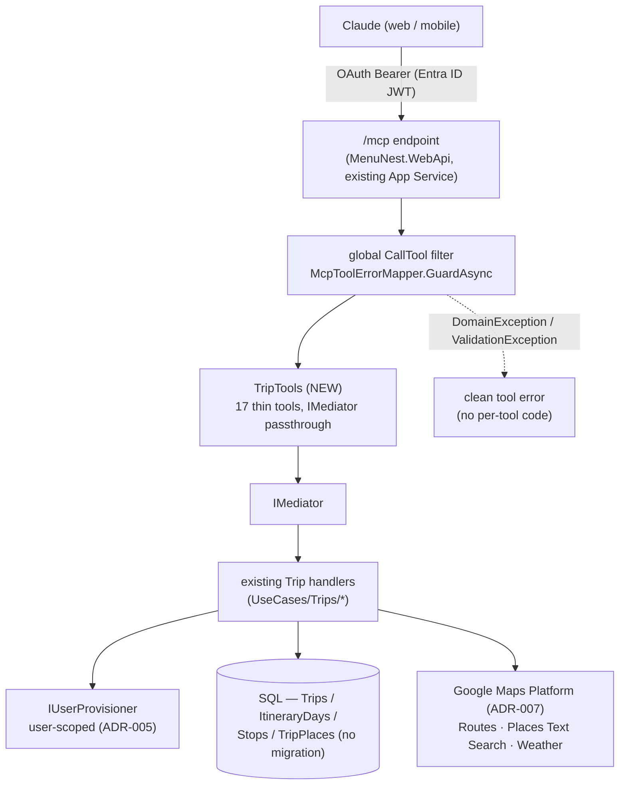
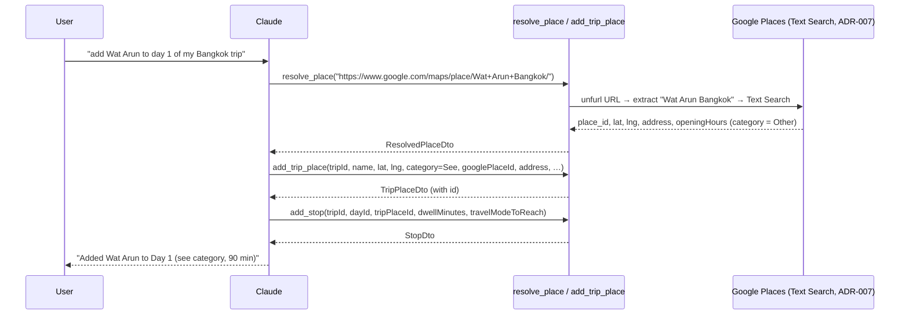
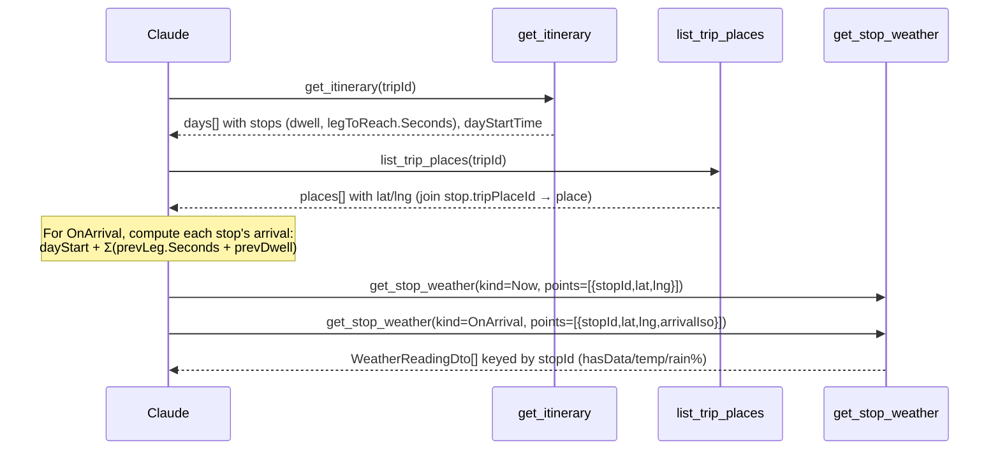

# Design — Trip Planner over MCP (expose all 17 Trip use cases as tools)

**Date:** 2026-07-10
**Status:** Draft (awaiting approval)
**Related:** ADR-034 (Trips exposed via MCP) · ADR-035 (MCP place capture via resolve_place) · ADR-001 (MCP auth via Entra ID OAuth) · ADR-005 (Trip is user-scoped) · ADR-007 (Google Maps Platform, backend proxy) · ADR-008 (Smart Schedule → arrival times) · ADR-033 (weather backend batch, no persistence) · the [MenuNest MCP Server design spec (2026-06-02)](./2026-06-02-menunest-mcp-server-design.md) (meal-planning-only scope, now extended)

---

## 1. Summary & goal

The MCP server (`MenuNest.McpServer`) already lets Claude drive the **meal-planning**
domain (49 tools across Recipes/Ingredients/MealPlan/Stock/ShoppingList/Budget), but the
**Trip Planner** was deliberately left out of scope by the 2026-06-02 spec. This change adds
**one** `TripTools` class exposing **all 17** Trip use cases, so Claude can plan and manage
trips conversationally — create a trip, capture places, build the per-day itinerary, reorder
stops, adjust dwell/day-start, and read weather — without opening the web app (ADR-034).

Each tool is a **thin passthrough** to `IMediator`, identical in shape to the existing
`RecipeTools` / `BudgetTools`. The extension reuses the existing OAuth, the global
error-mapper, DI, and App Service hosting; it adds **no** entity, **no** EF migration, and
**no** new Azure resource. The only genuinely new design work is the **place-capture flow**,
which does not translate directly from the web app's client-side Places picker (ADR-035).

This diagram shows the end-to-end shape: Claude authenticates once via Entra ID OAuth, calls
a trip tool over `/mcp`, which flows through the global error-mapper filter into `IMediator`
→ the existing Trip handlers → Infrastructure (DB for structure, Google Maps Platform for
routes/places/weather).



**Non-goals.** No new use cases, endpoints, entities, or migrations. No change to the web
app. No new geocode/text-search backend (ADR-035). Health/migraine and Chat remain out of
MCP scope, exactly as the 2026-06-02 spec set.

---

## 2. Decisions (ADR-034, ADR-035)

- **[ADR-034](../../adr/034-trips-exposed-via-mcp-server.md)** — expose the Trip domain via
  **one `TripTools` class** in the **existing** `MenuNest.McpServer` (17 tools, `IMediator`
  passthrough). Rejected: leave Trips out; a separate MCP server. Extends the 2026-06-02
  meal-planning-only scope.
- **[ADR-035](../../adr/035-mcp-place-capture-via-resolve-place.md)** — over MCP, a place is
  captured **`resolve_place` → `add_trip_place`**; Claude never invents coordinates (ADR-007).
  Free-text names are wrapped as `www.google.com/maps/place/<name>/`; category is chosen by
  Claude (resolver hardcodes `Other`); best-time/fee/notes are set later via
  `update_trip_place`. Rejected: raw lat/lng from Claude; a new server-side geocode tool.

The MCP transport, auth, and error-mapping decisions are inherited unchanged from
ADR-001…004 and the 2026-06-02 spec.

---

## 3. Glossary alignment

This change introduces **no new domain terms** — it exposes existing Trip concepts already
recorded in [CONTEXT.md](../../CONTEXT.md) under *Travel & trip planning* (Trip, Day, Place,
Stop, Leg, Dwell, Travel mode, Smart Schedule, Capture, Weather reading, Now, On-arrival, …).
MCP is already acknowledged there as an **entry path** for identity ("across every entry path
(web SPA and MCP)"). Tool names and `[Description]` text must use these canonical terms and
introduce no synonyms (e.g. "Stop" not "waypoint"; "Leg" not "segment"; "Now"/"On-arrival"
for the two weather readings).

---

## 4. Architecture — what is reused vs new

Everything except one class and one registration line already exists. The table records what
was **verified against the code** (adversarial pass, 2026-07-10) so the plan does not
re-litigate it.

| Concern | Status | Evidence |
|---|---|---|
| OAuth / Entra ID auth on `/mcp` | **Reused** | ADR-001; `/mcp` already `RequireAuthorization()`. Trips are **user-scoped** (ADR-005) via `IUserProvisioner.GetOrProvisionCurrentAsync`, **no** `RequireFamilyAsync` — works for a user with no Family. |
| Error mapping | **Reused (global)** | `McpToolErrorMapper` is a global `AddCallToolFilter` in `McpServerRegistration.cs`; wraps every tool by name. Trip handlers throw `DomainException` ("Trip not found.") + `ValidationException` — mapped for free, **zero per-tool code**. |
| DI | **Reused** | `TripTools(IMediator mediator)` — same primary-ctor pattern as `RecipeTools` / `BudgetTools` / `TripsController`. |
| Persistence / migration | **None** | `Trips`/`ItineraryDays`/`Stops`/`TripPlaces` already exist (migration `20260629104508_TripsInitial`); nothing new persisted → **no migration, no prod-DB step**. |
| Hosting / Azure | **Reused** | Same App Service; `/mcp` already mapped. No new resource. |
| **`TripTools` class** | **NEW** | `backend/src/MenuNest.McpServer/Tools/TripTools.cs` — 17 tools. |
| **Registration line** | **NEW** | `.WithTools<Tools.TripTools>()` in `McpServerRegistration.cs`, after `BudgetTools` (line 16), before `.WithRequestFilters(...)`. |

No tool-name collisions: the 17 proposed names are all distinct from the 49 existing tools
(verified).

---

## 5. Tool inventory — 17 tools

One `TripTools` class. Each tool is `[McpServerTool, Description("…")]`, takes individual
parameters (constructing the Command/Query inside, like `create_recipe`), and returns the
handler's DTO (or `Task`/void for `Unit`-returning commands, like `delete_recipe`).
Signatures below are the **verified** use-case shapes.

### Trips (5)

| Tool | Params → MediatR | Returns |
|---|---|---|
| `list_trips` | `ListTripsQuery()` | `TripDto[]` |
| `get_trip` | `(tripId: Guid)` → `GetTripQuery` | `TripDto` |
| `create_trip` | `(name, destination?, startDate: DateOnly, dayCount: int, defaultTravelMode: TravelMode)` → `CreateTripCommand` | `TripDto` |
| `update_trip` | `(tripId, name, destination?, startDate: DateOnly, dayCount: int, defaultTravelMode: TravelMode)` → `UpdateTripCommand` | `TripDto` |
| `delete_trip` | `(tripId)` → `DeleteTripCommand` | void |

> `create_trip` / `update_trip` auto-derive `ItineraryDays` from `dayCount` (verified — no
> AddDay use case). Lowering `dayCount` on `update_trip` **deletes** the trailing days and
> their stops (cascade); the tool description must warn Claude of the destructive effect.

### Places (5, incl. capture)

| Tool | Params → MediatR | Returns |
|---|---|---|
| `resolve_place` | `(url: string)` → `ResolvePlaceCommand` | `ResolvedPlaceDto` |
| `list_trip_places` | `(tripId)` → `ListTripPlacesQuery` | `TripPlaceDto[]` |
| `add_trip_place` | `(tripId, name, lat: double, lng: double, category: PlaceCategory, googlePlaceId?, address?, priceLevel?: int, photoUrl?, openingHoursJson?)` → `AddTripPlaceCommand` | `TripPlaceDto` |
| `update_trip_place` | `(tripId, placeId, name, category: PlaceCategory, address?, feeNote?, notes?, bestTimeStart?: TimeOnly, bestTimeEnd?: TimeOnly)` → `UpdateTripPlaceCommand` | `TripPlaceDto` |
| `delete_trip_place` | `(tripId, placeId)` → `DeleteTripPlaceCommand` | void |

> `add_trip_place` is normally fed from `resolve_place`'s snapshot (§7). Its `[Description]`
> must instruct Claude to **choose a real `category`** (`resolve_place` returns `Other`) and
> to **use the resolved `lat`/`lng`/`googlePlaceId`, never invented values** (ADR-035, ADR-007).
> `priceLevel` is validated 0–4.

### Itinerary & stops (6)

| Tool | Params → MediatR | Returns |
|---|---|---|
| `get_itinerary` | `(tripId, viewerLat?: double, viewerLng?: double)` → `GetItineraryQuery` | `ItineraryDayDto[]` |
| `add_stop` | `(tripId, dayId, tripPlaceId, dwellMinutes: int, travelModeToReach: TravelMode)` → `AddStopCommand` | `StopDto` |
| `update_stop` | `(tripId, stopId, dwellMinutes?: int, travelModeToReach?: TravelMode)` → `UpdateStopCommand` | void |
| `remove_stop` | `(tripId, stopId)` → `RemoveStopCommand` | void |
| `reorder_stops` | `(tripId, dayId, orderedStopIds: Guid[])` → `ReorderStopsCommand` | void |
| `set_day_start_time` | `(tripId, dayId, startTime: TimeOnly)` → `SetDayStartTimeCommand` | void |

> `get_itinerary` returns each Day's `DayStartTime`, ordered `Stops` (`Sequence`,
> `DwellMinutes`, `TravelModeToReach`) and each stop's resolved `LegToReach`
> (`Seconds`/`Meters`/`Source`) — the raw ingredients of the Smart Schedule, but **not** the
> cascade itself (arrival/leave times and timing flags are computed client-side, ADR-008). A
> tool consumer (Claude) can compute arrival times itself: `dayStart + Σ(prevLeg.Seconds +
> prevDwell)`. `viewerLat/Lng` (approach leg, ADR-027) have no meaning over MCP and are
> normally omitted. `reorder_stops` needs the day's full stop-id set in the new order (get it
> from `get_itinerary`).

### Weather (1)

| Tool | Params → MediatR | Returns |
|---|---|---|
| `get_stop_weather` | `(kind: WeatherReadingKind, points: WeatherPointDto[])` → `GetStopWeatherQuery` | `WeatherReadingDto[]` |

> `WeatherPointDto = { stopId: string, lat: double, lng: double, arrivalIso?: DateTime }`.
> This is a batch designed for the SPA; over MCP Claude assembles the points itself (§8).
> `arrivalIso` is **not** strictly required even for `OnArrival` (validator checks only
> non-empty points + lat/lng ranges); a null arrival yields a No-data reading, never an error
> (ADR-033).

---

## 6. Type & enum handling over MCP

Verified by compiling a probe against **ModelContextProtocol 1.0.0** (the SDK version in
`MenuNest.McpServer.csproj`) — the SDK's default schema generation handles our types with
**no serializer configuration**:

- **Enums → string member names.** An enum parameter renders as
  `{ "type": "string", "enum": ["Stay","Eat",…] }`. So Claude passes `"Eat"`, not an int.
  There is no `JsonStringEnumConverter` in the McpServer project (the one in
  `WebApi/Program.cs` is for MVC only and is irrelevant to MCP). Match the existing
  convention: **list the allowed names in the `[Description]`**, e.g. `PlaceCategory: Stay,
  Eat, See, Cafe, Shop, Other`. Verified enum values:
  - `PlaceCategory` = `Stay, Eat, See, Cafe, Shop, Other`
  - `TravelMode` = `Drive, Walk, Transit`
  - `WeatherReadingKind` = `Now, OnArrival`
- **Guid → `{ "type":"string", "format":"uuid" }`.** Claude passes ids as strings.
- **`DateOnly` / `TimeOnly` / `DateTime`** follow System.Text.Json (`"2026-07-12"`,
  `"09:00:00"`, ISO-8601). State the format in each `[Description]` (e.g. *"day start time,
  24h HH:mm"*), as the meal tools already do for `DateOnly`.
- **Array-of-object params** (`WeatherPointDto[]`, `Guid[]`) are supported — precedent:
  `create_recipe`'s `RecipeIngredientInput[]`.

Representative tool shapes (illustrative, not final code):

```csharp
[McpServerToolType]
public sealed class TripTools(IMediator mediator)
{
    [McpServerTool, Description("List all trips owned by the current user")]
    public async Task<IReadOnlyList<TripDto>> list_trips(CancellationToken ct)
        => await mediator.Send(new ListTripsQuery(), ct);

    [McpServerTool, Description("Resolve a Google Maps link (or a https://www.google.com/maps/place/<name>/ URL built from a place name) to an authoritative place snapshot from Google. Returns coordinates + place_id to feed add_trip_place; never fabricate these yourself.")]
    public async Task<ResolvedPlaceDto> resolve_place(
        [Description("A Google Maps URL. To search by name, build https://www.google.com/maps/place/<url-encoded name and city>/")] string url,
        CancellationToken ct)
        => await mediator.Send(new ResolvePlaceCommand(url), ct);

    [McpServerTool, Description("Add a saved place to a trip. Use lat/lng/googlePlaceId from resolve_place — do not invent coordinates. category is NOT resolved (resolve returns Other); pick the real one: Stay, Eat, See, Cafe, Shop, Other.")]
    public async Task<TripPlaceDto> add_trip_place(
        [Description("Trip id")] Guid tripId,
        [Description("Place name")] string name,
        [Description("Latitude from resolve_place")] double lat,
        [Description("Longitude from resolve_place")] double lng,
        [Description("Category: Stay, Eat, See, Cafe, Shop, or Other")] PlaceCategory category,
        [Description("Google place_id from resolve_place (optional)")] string? googlePlaceId,
        [Description("Formatted address (optional)")] string? address,
        [Description("Price level 0-4 (optional)")] int? priceLevel,
        [Description("Photo URL (optional; resolve returns none)")] string? photoUrl,
        [Description("Raw opening-hours JSON (optional)")] string? openingHoursJson,
        CancellationToken ct)
        => await mediator.Send(new AddTripPlaceCommand(
            tripId, name, lat, lng, category, googlePlaceId, address, priceLevel, photoUrl, openingHoursJson), ct);

    [McpServerTool, Description("Batch weather for stops. kind = Now (current) or OnArrival (forecast at arrivalIso). Assemble points from list_trip_places (lat/lng) + get_itinerary (arrival times).")]
    public async Task<IReadOnlyList<WeatherReadingDto>> get_stop_weather(
        [Description("Now or OnArrival")] WeatherReadingKind kind,
        [Description("Points: {stopId, lat, lng, arrivalIso?}. arrivalIso is local wall-clock for OnArrival.")] WeatherPointDto[] points,
        CancellationToken ct)
        => await mediator.Send(new GetStopWeatherQuery(kind, points), ct);
}
```

---

## 7. Place capture over MCP (resolve → add)

The web app captures a Place through a client-side Places picker; over MCP there is none, so
capture is the two-step flow of ADR-035. This sequence shows the ergonomic free-text path and
the category caveat.



**Rules encoded in tool descriptions (ADR-035):**

1. `lat`/`lng`/`googlePlaceId` for `add_trip_place` come from `resolve_place` — **never
   invented** (ADR-007).
2. `resolve_place` returns `category = Other`; Claude must choose the real `PlaceCategory`
   when calling `add_trip_place`.
3. Free-text names: wrap in `https://www.google.com/maps/place/<url-encoded name + city>/`.
   Include the city/country to disambiguate Text Search. Honest failure if the production
   redirect strips the `/place/<name>/` segment ("enter the place manually").
4. `bestTimeStart`/`bestTimeEnd`, `feeNote`, `notes` are **not** capture-time fields — set
   them afterward with `update_trip_place`.
5. `photoUrl` is always empty from resolve — do not expect a photo.

---

## 8. Weather over MCP (multi-step assembly)

`get_stop_weather` is a batch built for the SPA, which already has coords + a computed
schedule. Over MCP, Claude assembles the batch from two other tools. This is the one tool
whose ergonomics are noticeably worse than the web app (ADR-034 consequence).



**Notes.** `StopDto` carries only `TripPlaceId` (no coords) — Claude must join
stop→place via `list_trip_places` to get `lat`/`lng` (verified). Arrival times are the
client-side cascade the SPA computes with `useSchedule`; Claude reproduces the arithmetic
from `get_itinerary`. Out-of-horizon / past / no-coord stops simply come back
`hasData=false` (ADR-030/033) — no special handling required from Claude.

---

## 9. Files created / modified

| File | Action |
|---|---|
| `backend/src/MenuNest.McpServer/Tools/TripTools.cs` | **Create** — 17 tools, `IMediator` passthrough |
| `backend/src/MenuNest.McpServer/McpServerRegistration.cs` | **Modify** — add `.WithTools<Tools.TripTools>()` after `BudgetTools` (line 16), before `.WithRequestFilters(...)` |
| `backend/src/MenuNest.McpServer/GlobalUsings.cs` | **Modify (if needed)** — add `global using` for `MenuNest.Application.UseCases.Trips` + sub-namespaces + `MenuNest.Domain.Enums`, matching how the existing tools import their use cases |
| `docs/superpowers/specs/2026-06-02-menunest-mcp-server-design.md` | **Modify** — forward-note that Trips are now in scope (ADR-034) |

No changes to `MenuNest.WebApi`, `Program.cs`, DI, or the database. No new NuGet packages
(the McpServer project already references `ModelContextProtocol.AspNetCore` and `IMediator`).

---

## 10. Testing notes

Follows the existing MCP convention: the tool classes are **thin passthroughs** and carry
**no logic**, so the existing meal/budget tools have no dedicated unit tests — behavior is
covered by the handlers' xUnit tests, which already exist for Trips
(`tests/MenuNest.Application.UnitTests/Trips/…`). This change adds no new behavior to test.

The value checks are:

- **Build + pre-commit gauntlet** — the husky pre-commit runs `dotnet build` + `dotnet test`
  (Release) and the frontend `tsc`/build. `TripTools` must compile (correct `using`s /
  GlobalUsings, correct Command constructions) and not break the suite.
- **Registration smoke** — after deploy, connect Claude to `/mcp` and confirm the 17 trip
  tools appear alongside the 49 existing ones (49 → 66 total), and that a representative call
  chain works end-to-end against the personal-tenant identity: `list_trips` →
  `resolve_place` (a `/maps/place/<name>/` URL) → `add_trip_place` → `add_stop` →
  `get_itinerary`. This is the ADR-034 acceptance path.
- **Error-mapping spot check** — a call that trips a `DomainException` (e.g. `get_trip` with
  an unknown id) returns a clean tool error, confirming the global filter covers the new
  class.

If, during implementation, a decision is made to add tool-level tests, mirror whatever
harness (if any) the existing tool classes use — do not invent a new one.

---

## 11. Out of scope / Phase 2

- **Server-side "add place by name" (geocode/text-search) use case** — the ergonomic
  alternative to the URL-wrapper bridge (ADR-035); a new Application use case + tool. Deferred.
- **A convenience "trip weather" tool** that internally joins itinerary + places and computes
  arrivals server-side, so Claude makes one call instead of three (§8). Deferred — would be a
  new use case, not an exposure of the existing surface.
- **Health / migraine and Chat tools over MCP** — remain out of scope exactly as the
  2026-06-02 spec set.
- **Photo capture** — `resolve_place` returns no photo (field mask); unchanged.
- **Phase-2 Trip concepts** (TripMember/Split/Settle-up/Trip expense, ADR-009) — no backend,
  so nothing to expose.

---

## 12. Claude MCP configuration

**No config change.** The server is already registered in Claude
(`https://menunest.azurewebsites.net/mcp`, OAuth/Microsoft, scope
`api://{AzureAd:ClientId}/access_as_user`). After the backend redeploys via the existing
CD pipeline, the 17 trip tools appear automatically; the user may need to refresh the
connector's tool list. No new Azure resource, no new secret, no OAuth change.
