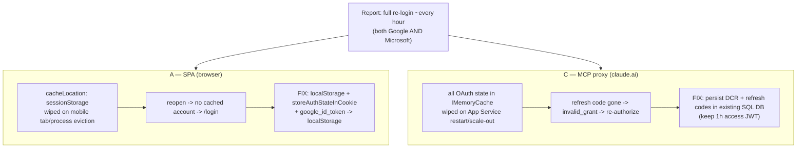
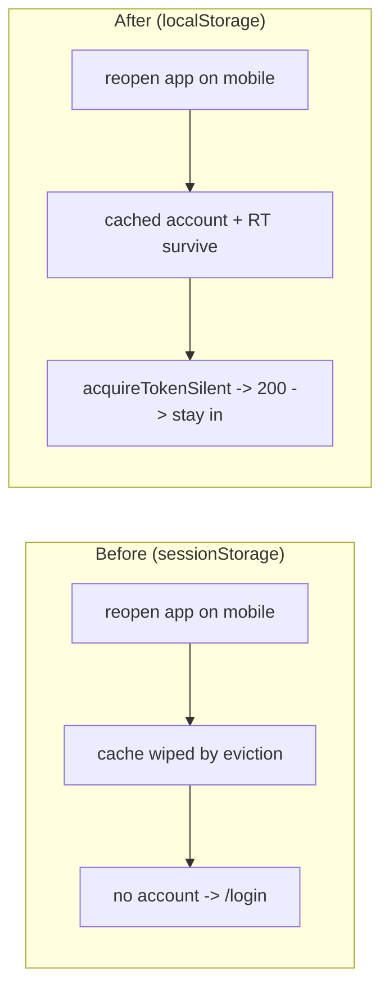
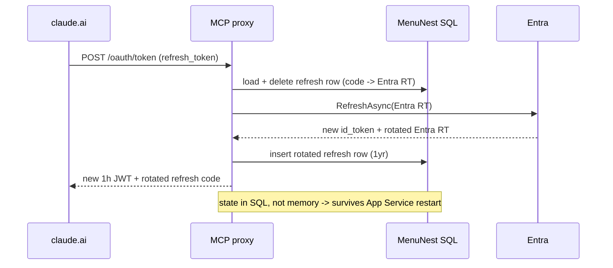

# Design — Fix "re-login every ~1 hour" (SPA session persistence + MCP proxy durable refresh)

**Date:** 2026-07-11
**Status:** Draft for approval
**ADRs:** [ADR-036](../../adr/036-spa-token-cache-persist-localstorage.md) (SPA), [ADR-037](../../adr/037-mcp-proxy-durable-refresh-sql.md) (MCP). Root cause verified against App Insights via debug-mantra (not hypothesised).
**Relates to:** ADR-001..004 (Entra/Google sign-in + MCP OAuth proxy).

## Overview

Two independent surfaces produced the same "re-login every ~1h" report. Neither is a broken
refresh token — refresh *works* on both. The problem is that the thing holding the session is
**ephemeral** and gets discarded.

## 1. Verified root cause (evidence, not hypothesis)

Confirmed by querying the workspace-based App Insights (`587ba1f6-...`, see CLAUDE.md):

- **SPA:** the mid-session `401 -> /login?reauth=expired` bounce fired **1 time in 30 days**.
  Session classification: `login-first (not-persisted)` 38, `login-only` 22, `no-login` 5,
  `app-then-login (mid-session kick)` **1**. MSAL `POST .../token` renewals all returned **200**.
  Dominant clients are **mobile** (Samsung Internet / Chrome Android), which evict background
  tabs and wipe `sessionStorage`. So "re-login" = *open-app-and-no-session*, provider-agnostic.
- **MCP:** steady **~3 `POST /mcp` 401/day**. All proxy state is `IMemoryCache`; an App Service
  restart/scale-out wipes refresh codes + DCR registrations, so claude.ai must re-authorize.

## 2. Scope

- **In:** A (SPA session persistence, both providers) and C (MCP proxy re-auth durability).
- **Deferred (Phase 2):** B — Google has no refresh token, so a tab *kept open* past ~1h still
  expires. Telemetry shows this is rarely hit. App-level encryption of the Entra RT and the
  Azure Table store variant are also deferred.

## 3. Design A — SPA session persistence

Persist the browser token cache so a session survives tab/process eviction. Silent renewal
(already returning 200) then just works on reopen; no `/login`.

**Changes (frontend):**

| File | Change |
|---|---|
| `frontend/src/shared/auth/msalConfig.ts` | `cache: { cacheLocation: 'localStorage', storeAuthStateInCookie: true }` (was `sessionStorage`, no cookie flag) |
| `frontend/src/shared/auth/googleAuth.ts` | store/read/clear `google_id_token` in `localStorage` instead of `sessionStorage` (expiry-on-read logic unchanged) |

- `reauth.ts` `clearGoogleToken()` and sign-out still work (they `removeItem` the key — same API on localStorage).
- No backend change. No new dependency.

**Security trade-off (accepted, ADR-036):** tokens (incl. MSAL refresh token) now persist on
disk until explicit sign-out — a longer XSS exposure window than tab-scoped `sessionStorage`.
Accepted for a personal app; tokens were already XSS-readable while a tab was open.

## 4. Design C — MCP proxy durable refresh (existing SQL DB)

Move only the two state pieces whose loss forces re-auth into the existing `MenuNest` SQL DB;
keep everything else as-is, including the short (1h) access JWT.

**New EF entities (added to `AppDbContext`, `MenuNest.Infrastructure/Persistence`):**

- `OAuthClient` — DCR registration: `ClientId` (PK), `RedirectUris`, `ClientName`, `Scope`, `ExpiresAt` (1 year).
- `OAuthRefreshToken` — `RefreshCode` (PK, opaque), `EntraRefreshToken` (the secret; TDE at rest), `Subject`/`Oid`, `ExpiresAt` (1 year), created/rotated timestamps.

**Store refactor (`backend/src/MenuNest.WebApi/Oauth/Stores.cs`):**

| Store | Today | Design |
|---|---|---|
| `ClientStore` (DCR) | IMemoryCache 30d | **SQL** (`OAuthClient`), 1-year TTL |
| `TokenStore` refresh codes | IMemoryCache 30d | **SQL** (`OAuthRefreshToken`), 1-year, single-use rotate (delete old row + insert new in one transaction) |
| `TokenStore` auth codes (60s) | IMemoryCache | **unchanged (in-memory)** |
| `PkceStateStore` (10min) | IMemoryCache | **unchanged (in-memory)** |

- SQL access is **async**, so `SaveRefresh`/`TakeRefresh`/client lookups become `async`; the
  now-sync `IssueTokens` helper and its callers in `OAuthEndpoints.cs` become `async Task<...>`
  and `await`. The token-endpoint handler is already `async`.
- `OAuthJwt.Mint` stays at **3600s**; `expires_in` stays **3600**. Access token remains short
  and revocable — C1 (long-lived JWT) was rejected (ADR-037).
- **Entra RT at rest:** rely on Azure SQL **TDE** (no regression; app-level encryption deferred).
- **DI (`Program.cs`):** the two durable stores resolve the scoped `AppDbContext`/`IApplicationDbContext`;
  the in-memory stores stay as-is.

## 5. Testing

- **A:** unit-test that `googleAuth` reads/writes/clears `localStorage`; update any existing
  `googleAuth.test.ts` assertions that assumed `sessionStorage`. Manual: sign in (each provider),
  close the tab/browser, reopen -> lands authenticated, no `/login`.
- **C:** unit-test the SQL-backed `ClientStore`/`TokenStore` (reuse the SQLite relational test
  harness `SqliteAppDbContext`, per the EF-relational-testing convention — InMemory won't honor
  keys). Assert: refresh rotation deletes the old code and inserts the new; a re-used old code
  returns `invalid_grant`; a DCR registration + refresh mapping survive a simulated
  "restart" (new DbContext instance). Existing `OAuthEndpoints`/discovery tests stay green.

## 6. Rollout

1. Add EF entities + `dotnet ef migrations add OAuthDurableStores` (Infrastructure project).
2. **Apply the migration to prod by hand** (CLAUDE.md) — `dotnet ef database update` with the
   `AZURE_TOKEN_CREDENTIALS=AzureCliCredential` connection. Forgetting this throws
   `Invalid object name 'OAuthRefreshTokens'` at runtime (the same failure class App Insights
   already shows for `Trips`). This step is mandatory and must precede/accompany the deploy.
3. Deploy frontend (A) + backend (C). A takes effect on next SPA load; C on next claude.ai
   token/refresh.
4. Verify: App Insights — `/mcp` 401s drop toward zero across a restart; SPA `/login` (non-reauth)
   pageViews drop for returning mobile sessions.

## 7. Non-goals

Google's ~1h no-refresh ceiling when a tab is kept open (B); app-level RT encryption; Azure Table
store variant; any change to the SPA's Entra/Google validation schemes or `/common` authority
(ADR-004 invariant preserved).