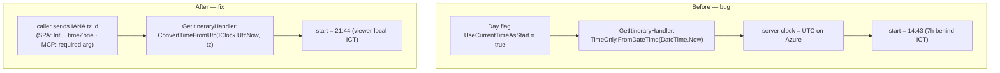
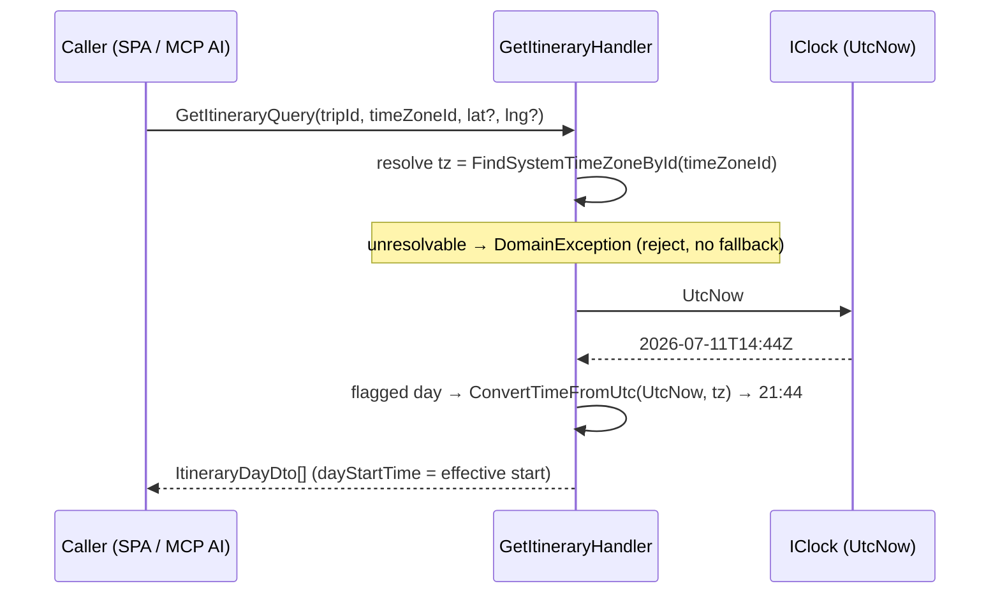

# Design — Fix "Current-time start" showing the server's UTC clock instead of the viewer's local time

**Date:** 2026-07-11
**Status:** Draft for approval
**ADR:** [ADR-038](../../adr/038-current-time-start-viewer-timezone.md). Root cause verified via debug-mantra (source trace + falsification), not hypothesised.
**Relates to:** ADR-008 (Smart Schedule cascade), ADR-012/013 (day-start inline edit + commit-on-change), ADR-027 (frontend supplies per-request input, backend resolves — the same pattern as the Approach leg). Regression introduced with the `UseCurrentTimeAsStart` flag in commit `cdd8b4f` (#25).

## Overview

A Day flagged **Current-time start** ("ใช้เวลาปัจจุบันเสมอ") shows a start time equal to
the viewer's UTC offset behind reality (Thailand 21:44 → shown 14:43). The backend
re-seeds the start with `TimeOnly.FromDateTime(DateTime.Now)`, and `DateTime.Now` on
Azure App Service is the **server's UTC clock**. The fix makes the caller supply its
**IANA time zone**, and the backend resolves "now" as `IClock.UtcNow` converted into
that zone. The value stays server-authoritative so `dayStartTime` remains the
effective start for both consumers (SPA + MCP).



## 1. Verified root cause

[GetItineraryHandler.cs:79](../../../backend/src/MenuNest.Application/UseCases/Trips/GetItinerary/GetItineraryHandler.cs#L79):

```csharp
var startTime = day.UseCurrentTimeAsStart ? TimeOnly.FromDateTime(DateTime.Now) : day.DayStartTime;
```

- `DateTime.Now` returns the **server** local wall-clock; Azure App Service runs UTC, so it equals UTC — exactly the viewer's UTC+7 offset behind.
- The frontend "ตอนนี้" button (`dateToHms(new Date())`, [DayStartEditor.tsx:76](../../../frontend/src/pages/trips/components/DayStartEditor.tsx#L76)) uses the **browser** clock and is correct — only the backend-resolved persisted-flag path is wrong.
- The unit test ([GetItineraryHandlerTests.cs:149](../../../backend/tests/MenuNest.Application.UnitTests/Trips/GetItineraryHandlerTests.cs#L149)) asserts against the same `TimeOnly.FromDateTime(DateTime.Now)` source, so it **mirrors** the bug and passes on any machine.

## 2. Scope

- **In:** the one `GetItinerary` request path — query contract, handler, HTTP controller, MCP tool, SPA callers, and the mirror test.
- **Out (non-goals):** storing a time zone per Trip/Day/User (the caller supplies it per request); the "ตอนนี้" button (already correct); the weather endpoints (On-arrival derives from the client cascade that seeds off `dayStartTime`, so it is fixed **transitively** once the seed is correct — no change needed); any server timezone config (the fix removes that dependency entirely).

## 3. Contract change — `GetItinerary` gains a required IANA time zone



### 3.1 Application layer

| File | Change |
|---|---|
| `GetItinerary/GetItineraryQuery.cs` | `record GetItineraryQuery(Guid TripId, string TimeZoneId, double? ViewerLat = null, double? ViewerLng = null)` — `TimeZoneId` **required** (non-nullable), placed before the optional viewer params. |
| `GetItinerary/GetItineraryHandler.cs` | Inject `IClock` (4th ctor arg). Resolve the tz **once, up front** (before the day loop) so a bad id is rejected regardless of whether any day is flagged. Replace line 79 with the converted-local computation. |

Handler shape (illustrative — exact code is the plan's job):

```csharp
public GetItineraryHandler(IApplicationDbContext db, IUserProvisioner users, IRouteService routes, IClock clock) { … }

TimeZoneInfo tz;
try { tz = TimeZoneInfo.FindSystemTimeZoneById(q.TimeZoneId); }
catch (Exception ex) when (ex is TimeZoneNotFoundException or InvalidTimeZoneException)
{ throw new DomainException($"Unknown time zone: {q.TimeZoneId}"); }
…
var startTime = day.UseCurrentTimeAsStart
    ? TimeOnly.FromDateTime(TimeZoneInfo.ConvertTimeFromUtc(_clock.UtcNow, tz))
    : day.DayStartTime;
```

- `IClock.UtcNow` is `DateTime.UtcNow` (Kind = Utc), which `ConvertTimeFromUtc` requires. `SystemClock`/`IClock` is already DI-registered and used by other handlers.
- `.NET` resolves IANA ids on both Linux and Windows (ICU) on the target runtime.

### 3.2 Web API

| File | Change |
|---|---|
| `TripsController.cs` (GetItinerary action) | Add `[FromQuery] string tz` **before** `lat`/`lng`; pass to `new GetItineraryQuery(id, tz, lat, lng)`. Non-nullable reference type ⇒ ASP.NET applies implicit required validation (missing `tz` → `400`); reject empty/whitespace as well. |

### 3.3 MCP tool

| File | Change |
|---|---|
| `TripTools.cs` (`get_itinerary`) | Add required `string timeZoneId` param with a `[Description]` such as *"The user's IANA time zone (e.g. Asia/Bangkok). Required — used to resolve any day set to 'always start from the current time' into the user's local wall-clock."* Pass into `GetItineraryQuery`. Update the tool `[Description]` to mention that `dayStart` for a current-time day is resolved in this zone. |

A non-nullable C# param ⇒ the MCP schema marks `timeZoneId` **required**, so the AI must supply it (no silent UTC path).

### 3.4 Frontend (SPA)

| File | Change |
|---|---|
| `shared/api/api.ts` (`getItinerary`) | Arg type `{tripId: string; tz: string; lat?: number; lng?: number}` (`tz` required). Query string always includes `tz`; `lat`/`lng` stay conditional. |
| `pages/trips/utils/time.ts` (or a small new util) | Add `getViewerTimeZone()` → `Intl.DateTimeFormat().resolvedOptions().timeZone`, so callers don't duplicate it. |
| `pages/trips/components/ItineraryTab.tsx:110` | Pass `tz: getViewerTimeZone()` to `useGetItineraryQuery`. |
| `pages/trips/hooks/useDayRoute.ts:74` | Same. |

- `tz` is stable per session, so it is a clean RTK Query cache-key component — no cache thrash, and the "re-seed on every fetch" semantics are unchanged (each real network fetch recomputes `UtcNow`+tz server-side).
- Any e2e mock (`e2e/helpers/mockRoutes`) or component test that builds the itinerary URL / arg must be updated for the new `tz`.

## 4. Behavior & edge cases

| Case | Result |
|---|---|
| Flagged day, valid tz (SPA) | `dayStartTime` = viewer-local now (e.g. 21:44 ICT). |
| Flagged day, MCP with user's tz | Same — Claude receives the correct local start. |
| Non-flagged day | `dayStartTime` = persisted value, unchanged (tz still validated up front). |
| Missing `tz` | HTTP `400` (model binding) / MCP required-arg error. No silent default. |
| Present but unresolvable `tz` | `DomainException("Unknown time zone: …")`, surfaced as an error — **always**, even if no day is flagged. |
| DST zones | Correct for any date via `ConvertTimeFromUtc` (Thailand has no DST; the design is DST-proof regardless). |

## 5. Testing strategy

**Backend (replaces the mirror test):**

- Extend the test fixture to inject a `FixedClock` (UtcNow with `DateTimeKind.Utc`). Update **every** `new GetItineraryHandler(...)` call in `GetItineraryHandlerTests.cs` for the new ctor arg.
- `Flagged day + Asia/Bangkok`: FixedClock `2026-11-01T07:44:00Z` → expect `TimeOnly(14, 44)`. Asserts a concrete converted value — cannot mirror the implementation.
- `Flagged day + America/New_York`: same fixed UTC → a **different** local time, proving the tz is actually applied.
- `Unknown tz` → `DomainException` (assert thrown), including when **no** day is flagged (eager-validation contract).
- `Non-flagged day` → `dayStartTime` equals the persisted value regardless of tz.

**Frontend:** update mocks/tests that reference the `getItinerary` arg/URL for the added `tz`; `tsc --noEmit` must pass with the new required arg (the compiler will flag any caller that forgot `tz`).

## 6. Rollout

- **No DB migration, no Azure config change.** The fix is code-only and makes the server timezone irrelevant to correctness.
- The `frontend/.husky/pre-commit` hook runs the full backend build+test and frontend `tsc`+build (~40s+); expect the wait, do not `--no-verify`.
- **Ticket:** open a GitHub issue for this bug first (CLAUDE.md: every commit references a tracking ticket); the fix commit closes it. Stage narrowly (`git add` explicit paths — never `-A`).

## 7. Self-review

- No placeholders / TODOs; every named file/line verified against the current tree.
- Internally consistent with ADR-038 (all five decisions reflected: A1, IANA, required, reject-always, IClock).
- Scope matches the recap; non-goals explicit. Transitive weather correctness noted, no extra work claimed.
- Ambiguity resolved: eager tz validation, required-arg enforcement mechanism, FixedClock Kind, cache-key stability all stated.
