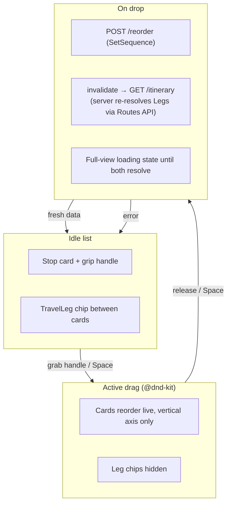
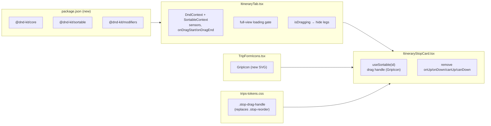

# Design spec — Drag-and-drop reorder for itinerary Stops

**Date:** 2026-07-12
**Status:** Proposed (awaiting owner approval → `superpowers:writing-plans`)
**ADRs:** [043](../../adr/043-stop-reorder-via-dnd-kit.md) ·
[044](../../adr/044-stop-drag-handle-replaces-arrow-buttons.md) ·
[045](../../adr/045-stop-reorder-full-view-loading-no-optimism.md) ·
[046](../../adr/046-stop-drag-vertical-axis-legs-hidden-during-drag.md)
**Scope:** Frontend-only. The backend `reorderStops` use case and the
`POST /api/trips/{tripId}/days/{dayId}/reorder` endpoint are **reused unchanged**.
**Ticket:** none yet — open a GitHub issue before committing (project rule: every commit
references a tracker item). This delivers the Phase-2 item the `.stop-reorder` CSS comment
("drag-to-reorder is Phase 2") already reserved.

## Overview

Today a Stop is reordered by tapping ▲▼ buttons one step at a time (`ItineraryStopCard`'s
`.stop-reorder` column → `move(index, dir)` in `ItineraryTab`). The owner wants to **drag a
Stop directly** to its new position. We build a sortable stop list on **@dnd-kit**, replace
the ▲▼ column with a single **drag handle**, and on drop cover the itinerary with a
**full-view loading state** until the server re-resolves Legs and the refetch lands.



## Goals / non-goals

**Goals**
- Drag a Stop to any position within the **active Day** by grabbing a handle (pointer +
  touch), or reorder with the keyboard when the handle is focused.
- On drop, persist the new order and show correct, server-recomputed times — never a stale
  time.
- No accessibility regression versus the ▲▼ buttons.

**Non-goals (explicit)**
- Dragging a Stop to **another Day** (endpoint + UI are per-Day — ADR-046).
- Reordering **Places** in the Places tab (this change is the Itinerary only).
- Optimistic in-place time updates (ADR-045 chose full-view loading instead).
- Backend changes.

## Decisions (from grilling)

| # | Decision | ADR |
|---|----------|-----|
| 1 | Build the sortable on `@dnd-kit/core` + `@dnd-kit/sortable` (+ `@dnd-kit/modifiers` for axis lock) — not hand-rolled pointer events, not Syncfusion. | 043 |
| 2 | Replace the ▲▼ column with one **drag handle**; keyboard reorder preserved via @dnd-kit's keyboard sensor. | 044 |
| 3 | On drop → **full-view loading** until the reorder POST **and** the itinerary refetch both resolve. No optimistic patch, no stale times. | 045 |
| 4 | Drag is **vertical-axis only**, **single-Day**; **Leg chips hidden** during an active drag. | 046 |

## Frontend changes



### 1. Dependencies (`frontend/package.json`)
Add `@dnd-kit/core`, `@dnd-kit/sortable`, `@dnd-kit/modifiers`.
**Planning-time gate (ADR-043):** confirm the chosen versions are React-19 compatible and
that `tsc -b` + `vite build` (the pre-commit suite) stay green before relying on them.

### 2. `ItineraryStopCard.tsx`
- Wrap the card with `useSortable({id: stop.id})`; apply `setNodeRef`, `transform`,
  `transition`, and a dragging style (elevate + shadow) to the card root.
- **Drag handle**: replace the `.stop-reorder` ▲▼ column with a single `<button
  className="stop-drag-handle">` carrying `{...attributes} {...listeners}`, rendering the
  new `GripIcon`, `aria-label="ลากเพื่อจัดลำดับ"`. This is the **only** drag activator on
  the card — the body (edit), checkbox, and nav link stay plain tap targets.
- Remove props `onUp`, `onDown`, `canUp`, `canDown`.
- The interleaved `TravelLeg` stays **outside** the sortable card (rendered by the parent,
  see below), so the handle drags only the card.

### 3. `ItineraryTab.tsx`
- Wrap the stop list in `DndContext` (`sensors`, `collisionDetection={closestCenter}`,
  `modifiers={[restrictToVerticalAxis]}`, `onDragStart`, `onDragEnd`) and a
  `SortableContext` over the stop ids with `verticalListSortingStrategy`.
- **Sensors**: `PointerSensor` with an activation constraint (a few px of movement) so a
  scroll/tap is not misread as a drag; `KeyboardSensor` with
  `sortableKeyboardCoordinates` for keyboard reordering; `TouchSensor` (or PointerSensor
  covering touch) with a small activation delay + tolerance so vertical scrolling of the
  list still works. Exact sensor tuning is a plan detail.
- **`onDragStart`** → set local `activeDragId` (drives leg hiding).
- **`onDragEnd`** → if position changed, compute the new id order with `arrayMove`, then
  `await reorder({tripId, dayId, orderedStopIds}).unwrap()` (existing mutation).
  On error → `setActionError(getErrorMessage(err))`. Clear `activeDragId`.
- **Legs hidden during drag** (ADR-046): while `activeDragId != null`, do not render the
  `TravelLeg` elements — show cards only.
- **Full-view loading** (ADR-045): while the reorder is in flight *and* the invalidation
  refetch is running, render the existing full-view loading treatment
  (`กำลังจัดลำดับใหม่…`, same idiom as `กำลังโหลดแผน…`) over the stop-list region. The gate
  must span **both** the POST and the refetch — see "Loading gate" below.
- The `move(index, dir)` helper and the ▲▼ wiring are deleted.

### 4. `TripFormIcons.tsx`
Add `GripIcon` following the file's inline-SVG convention (`viewBox 0 0 24 24`,
`stroke: currentColor`, `1em` sizing). A conventional 6-dot / double-bar grip glyph.

### 5. `trips-tokens.css`
Replace the `.stop-reorder` rules with `.stop-drag-handle`: a single centered handle,
comfortable touch target (≈44px wide, matching `.stop-nav`), muted resting colour, teal on
hover/focus, `cursor: grab` (→ `grabbing` while dragging), `touch-action: none` on the
handle so the browser hands pointer moves to @dnd-kit. Add a dragging-state style for the
lifted card and (optionally) a `.stop-list.dragging` modifier used to suppress legs.

## Interaction — drop round-trip

```mermaid
sequenceDiagram
    actor U as User
    participant SPA as ItineraryTab (SPA)
    participant API as TripsController
    participant DB as SQL / Routes API
    U->>SPA: grab handle, drag, release (or Space→arrows→Space)
    Note over SPA: onDragEnd — order changed?
    SPA->>SPA: show full-view loading; hide legs cleared
    SPA->>API: POST /days/{dayId}/reorder {orderedStopIds}
    API->>DB: SetSequence(i) for each Stop; SaveChanges
    API-->>SPA: 200 (void)
    SPA->>API: GET /itinerary (invalidated tag)
    API->>DB: recompute Legs (Routes API), cascade inputs
    API-->>SPA: days + legToReach + times
    SPA-->>U: hide loading; render new order + correct times
    Note over SPA,U: on any error → hide loading,<br/>show actionError, list stays in server order
```

## Loading gate (the one subtle part)

The reorder POST returns `void`; the recomputed times arrive only on the **subsequent**
`GetItinerary` refetch that the tag invalidation triggers. The loader must therefore stay
up across **both** phases. Gating on the mutation's `isLoading` alone would hide the loader
too early (before times land). Intended signal: a local `isReordering` flag raised on drop
and lowered once the itinerary query has settled after the invalidation
(`reorderLoading || itineraryFetching`, guarded so an unrelated background refetch does not
flash the loader). The codebase prefers **render-time reset** over set-state-in-effect (cf.
the `lastDayId` pattern in `ItineraryTab`); the plan picks the exact wiring.

## Accessibility

- Keyboard: focus the handle → Space/Enter picks up → Arrow Up/Down moves → Space/Enter
  drops → Escape cancels (@dnd-kit keyboard sensor + `sortableKeyboardCoordinates`).
- @dnd-kit's built-in ARIA live region announces pick-up/move/drop; provide Thai
  `screenReaderInstructions`/announcements so messages are localized, not default English.
- Handle has an explicit `aria-label`; focus-visible outline consistent with `.stop-nav`.

## Edge cases

- **0 or 1 stop** — nothing to reorder; handle still renders but a drag is a no-op
  (`onDragEnd` with unchanged order does not call the mutation).
- **Drop in same position** — no mutation, no loader.
- **Reorder fails** (network / 4xx) — loader clears, `actionError` shows, list stays in the
  server's current order (no local mutation persisted).
- **Day switched mid-interaction** — `activeDragId` is per-render; switching the day tab
  ends any drag context. Reorder is always scoped to `resolvedDayId`.
- **Map band** — the route map reflects the new order after refetch (same data path as
  today's ▲▼ reorder); no special handling.
- **Visited stops** — a Visited (มาแล้ว) Stop drags like any other; Visited is display-only
  (ADR-039) and unaffected by order.

## Verification

- **Unit** (`vitest`): `arrayMove` order computation and the `onDragEnd` "changed vs
  unchanged" branch (pure logic extracted from the DnD wiring). DnD gestures themselves are
  not unit-testable meaningfully.
- **E2E** (`playwright`, cf. `e2e/budget.interactions.spec.ts`): drag a Stop, assert the
  new order persists after reload; assert keyboard reorder; assert the loader appears then
  the recomputed times render.
- **Manual**: touch drag on mobile viewport (scroll vs drag), keyboard reorder, error path.
- Pre-commit suite (backend build/test + `tsc -b` + `vite build`) must stay green.

## Open items for planning

1. Pin `@dnd-kit/*` versions and verify React-19 compatibility (ADR-043 gate).
2. Exact sensor tuning (activation distance/delay/tolerance) for reliable touch
   scroll-vs-drag separation.
3. Exact `isReordering` gate wiring (render-time reset, no effect).
4. Open the GitHub tracking issue and reference it in commits.
