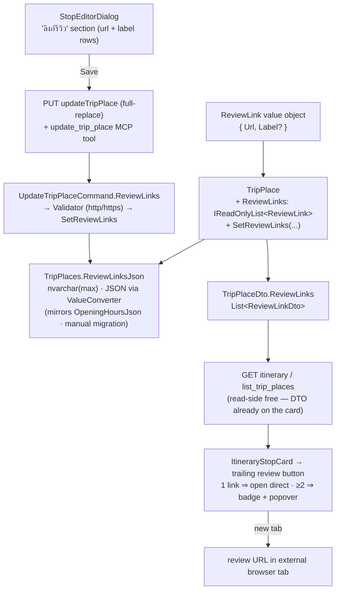
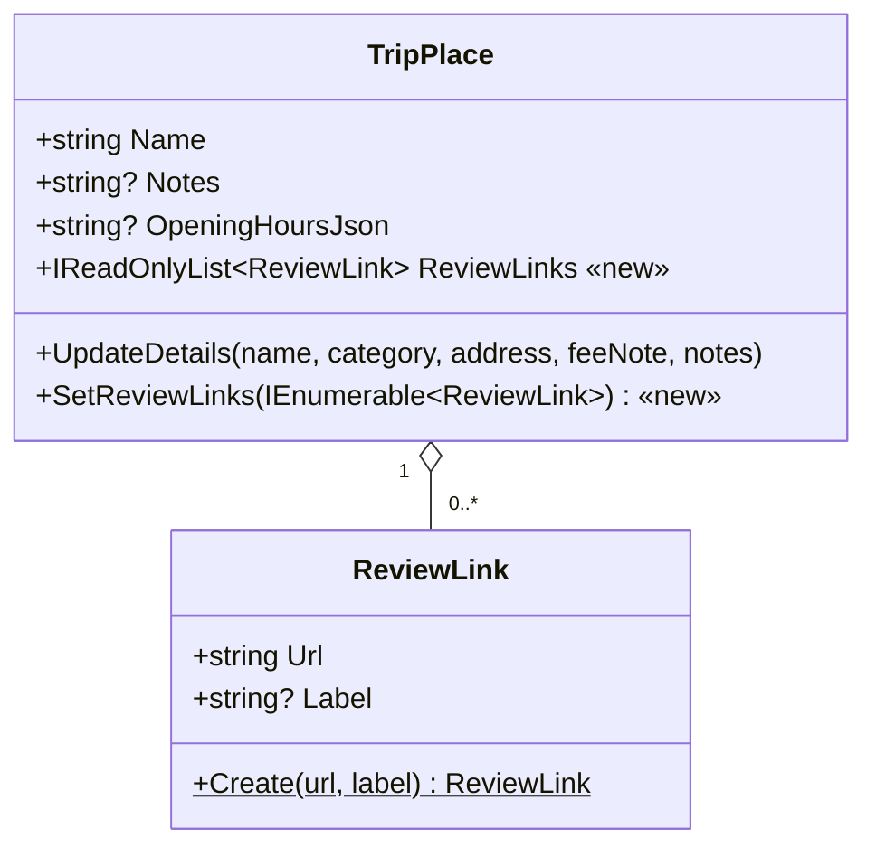
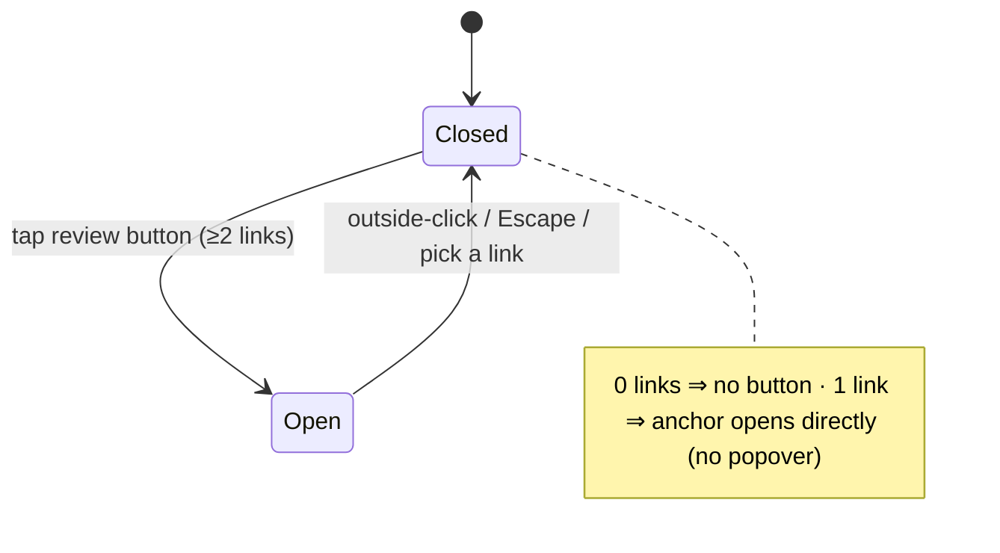

# Design — Trip Stop "Review link" (TikTok review) on a Place

**Date:** 2026-07-12
**Status:** Draft for approval
**Issue:** [#33](https://github.com/ThodsaphonSonthiphin/MenuNest/issues/33) — แนบลิงก์รีวิว TikTok ให้แต่ละสถานที่ในทริป.
**ADRs:** [049](../../adr/049-review-link-dedicated-per-place-field.md) (dedicated per-Place field) ·
[050](../../adr/050-review-links-json-value-list-any-url.md) (JSON value-list of `{url,label?}`, any http(s) URL) ·
[051](../../adr/051-review-links-reuse-stop-editor-and-updatetripplace.md) (edit in Stop editor, reuse `updateTripPlace`) ·
[052](../../adr/052-review-links-card-icon-and-popover.md) (card icon + popover) ·
[053](../../adr/053-review-links-full-replace-exposed-over-mcp.md) (full-replace field, exposed over MCP)
**Confirmed mock:** [`docs/mocks/trip-stop-review-link-mock.html`](../../mocks/trip-stop-review-link-mock.html)
(preview [`trip-stop-review-link-preview.png`](../../mocks/trip-stop-review-link-preview.png))
**Glossary:** term **Review link** added to [`CONTEXT.md`](../../../CONTEXT.md)



The whole change: a `ReviewLink` value list on `TripPlace`, persisted as one JSON column, flows out
through the *existing* `TripPlaceDto` (already on the Stop card) to a new trailing review button, and
back through the *existing* `updateTripPlace` full-replace PUT — extended with `reviewLinks` and
exposed on the `update_trip_place` MCP tool.

---

## 1. Goal & non-goals

**Goal.** Let the Trip owner attach a **list of external review links** (framed around TikTok, but
any `http(s)` URL) to each **Place**, so that while following the itinerary they can tap a Stop and
**watch the review** in a new browser tab. Each link carries an optional label; multiple links per
place are supported.

**Non-goals / design rules (explicit — see ADRs 049–053):**
- **Not the free-text Notes.** A Review link is a dedicated, structured, clickable field — not the
  dormant `Stop.Notes` and not the free-text `TripPlace.Notes` (which stays hidden; ADR-049).
- **Place-scoped, not Stop-scoped.** The link lives on `TripPlace`; it applies to every Stop that
  references the place and survives drag-reorder (ADR-049).
- **No title/thumbnail fetch.** We never call TikTok/YouTube oEmbed; we store only what the user
  types (`url` + optional `label`). Validation checks URL *shape, not liveness* (ADR-050).
- **No host restriction.** Any well-formed `http`/`https` URL is accepted (ADR-050).
- **No new endpoint / no non-invalidating mutation.** Editing reuses the existing `updateTripPlace`
  PUT and its on-save itinerary refetch; review editing is rare and explicit, unlike the Visited
  toggle that needed ADR-042 (ADR-051).
- **No schedule interaction.** Review links never feed the Smart Schedule, Timing flags, weather, or
  any computed value — pure reference/display data.

---

## 2. Domain model

A new value object and a value-list on `TripPlace`
([`TripPlace.cs`](../../../backend/src/MenuNest.Domain/Entities/TripPlace.cs)).



**`ReviewLink`** — an immutable value object. It is a **positional `record` with a public
constructor** (so `System.Text.Json` can deserialize it from the JSON column — a private ctor would
not round-trip), plus a validating `Create` factory used on the user-input path:

```csharp
public sealed record ReviewLink(string Url, string? Label)
{
    public static ReviewLink Create(string? url, string? label)
    {
        var u = (url ?? string.Empty).Trim();
        if (!Uri.TryCreate(u, UriKind.Absolute, out var uri) ||
            (uri.Scheme != Uri.UriSchemeHttp && uri.Scheme != Uri.UriSchemeHttps))
            throw new DomainException("Review link must be a valid http(s) URL.");
        if (u.Length > 500) throw new DomainException("Review link URL is too long (max 500).");
        var l = string.IsNullOrWhiteSpace(label) ? null : label.Trim();
        if (l is {Length: > 80}) throw new DomainException("Review link label is too long (max 80).");
        return new ReviewLink(u, l);
    }
}
```

The public ctor is used only by trusted paths (STJ deserialization of our own validated data, and
internal DTO mapping); all **user input** enters through `Create`, and the aggregate enforces the
count cap in `SetReviewLinks`.

**`TripPlace`** gains a backed list + a full-replace mutator (leaving `UpdateDetails` untouched, so
its blast radius stays zero):

```csharp
private readonly List<ReviewLink> _reviewLinks = new();
public IReadOnlyList<ReviewLink> ReviewLinks => _reviewLinks;

public void SetReviewLinks(IEnumerable<ReviewLink> links)
{
    var list = links?.ToList() ?? new List<ReviewLink>();
    if (list.Count > 10) throw new DomainException("A place can have at most 10 review links.");
    _reviewLinks.Clear();
    _reviewLinks.AddRange(list);
    UpdatedAt = DateTime.UtcNow;
}
```

`Create(...)` initialises the list empty (a new place has no reviews).

---

## 3. Persistence & migration

- **Column.** `TripPlaces.ReviewLinksJson` — `nvarchar(max)`, **nullable**, mirroring the existing
  `OpeningHoursJson` string column (ADR-050). Empty list serialises to `null` (or `[]` — pick one
  and keep it; `null` matches "no reviews").
- **Mapping (recommended — `ValueConverter` to a JSON string).** In
  [`TripPlaceConfiguration.cs`](../../../backend/src/MenuNest.Infrastructure/Persistence/Configurations/TripPlaceConfiguration.cs)
  (builder param **`b`**), map the typed `ReviewLinks` list through a `System.Text.Json`
  `ValueConverter<IReadOnlyList<ReviewLink>, string?>` onto an `nvarchar(max)` column named
  `ReviewLinksJson`, plus a `ValueComparer` (EF needs one for collection change-tracking). Configure
  the backing field (`_reviewLinks`). This is provider-agnostic and works identically on SQL Server
  **and** the `SqliteAppDbContext` relational test double (unlike SQLite `ToJson`, whose column-type
  handling collides with the double's nvarchar(max)-stripping — see the EF relational-testing note).
  - *Alternative the plan may pick if it verifies test-double support:* `b.OwnsMany(p => p.ReviewLinks, o => o.ToJson());` (EF Core 10 supports it). The converter path is the lower-risk default.
- **Migration.** New EF Core migration `AddTripPlaceReviewLinks` — a single
  `AddColumn<string>(name: "ReviewLinksJson", table: "TripPlaces", type: "nvarchar(max)", nullable: true)`.
- **⚠ Manual apply (project rule — CLAUDE.md).** Neither the app nor CD runs `Database.Migrate()`.
  After merge the migration **must be applied to the prod DB by hand**, or the deployed API throws
  `Invalid object name`/invalid-column (HTTP 500 → SPA "An unexpected error occurred."). Preview with
  `dotnet ef migrations script --idempotent`, then apply with the
  `AZURE_TOKEN_CREDENTIALS=AzureCliCredential dotnet ef database update …` command in CLAUDE.md. This
  is a rollout step (§9), not optional.

---

## 4. Backend API contract

A shared request/response record and one new list field threaded end-to-end. **`reviewLinks` is a
FULL-REPLACE field** (ADR-053): omitting it clears the place's reviews, so both call sites must send
the current list. Making the command parameter **required (no default)** means the compiler forces
both the controller and the MCP tool to supply it — the pre-commit build (whole solution incl.
`MenuNest.McpServer`) fails on any missed site, preventing a silent wipe.

New DTO in [`TripDtos.cs`](../../../backend/src/MenuNest.Application/UseCases/Trips/TripDtos.cs):
`public sealed record ReviewLinkDto(string Url, string? Label);` (reused for both request and response).

| Layer | File | Change |
|---|---|---|
| Value DTO | `TripDtos.cs` | add `record ReviewLinkDto(string Url, string? Label)` |
| Read DTO | `TripDtos.cs` `TripPlaceDto` | append trailing `IReadOnlyList<ReviewLinkDto> ReviewLinks` |
| DTO mapper | `AddTripPlace/AddTripPlaceHandler.cs` `ToDto` | map `p.ReviewLinks.Select(r => new ReviewLinkDto(r.Url, r.Label)).ToList()` |
| HTTP body | `TripsController.cs` `UpdatePlaceBody` | append `IReadOnlyList<ReviewLinkDto> ReviewLinks` |
| Command | `UpdateTripPlace/UpdateTripPlaceCommand.cs` | append trailing `IReadOnlyList<ReviewLinkDto> ReviewLinks` (required) |
| Controller → cmd | `TripsController.cs:70` | pass `b.ReviewLinks` into `new UpdateTripPlaceCommand(...)` |
| Validator | `UpdateTripPlace/UpdateTripPlaceValidator.cs` | validate each `Url` is absolute http/https, `≤500`; label `≤80`; list `≤10` |
| Handler | `UpdateTripPlace/UpdateTripPlaceHandler.cs` | after `SetBestTime`, call `place.SetReviewLinks(c.ReviewLinks.Select(r => ReviewLink.Create(r.Url, r.Label)))` |
| MCP tool | `MenuNest.McpServer/Tools/TripTools.cs:93` | add a `reviewLinks` parameter (list of `{url,label}`) + pass into the command (ADR-053); update the FULL-REPLACE description to mention it |

`TripPlaceDto` becomes:
`record TripPlaceDto(Guid Id, Guid TripId, string? GooglePlaceId, string Name, double Lat, double Lng, string? Address, PlaceCategory Category, int? PriceLevel, string? PhotoUrl, TimeOnly? BestTimeStart, TimeOnly? BestTimeEnd, string? OpeningHoursJson, string? FeeNote, string? Notes, IReadOnlyList<ReviewLinkDto> ReviewLinks)`.

> **Validator placement note (blast radius, ADR-053 / grill Step 3).** `reviewLinks` is validated in
> `UpdateTripPlaceValidator` only — it does **not** touch `AddTripPlace` (new places start empty) or
> any other command. Enforcement is scoped to where the input is actually consumed; unrelated place
> operations are provably unaffected.

The write path when the user saves the editor:

```mermaid
sequenceDiagram
    actor U as User
    participant D as StopEditorDialog
    participant Q as RTK Query · updateTripPlace
    participant A as TripsController (PUT)
    participant V as UpdateTripPlaceValidator
    participant H as UpdateTripPlaceHandler
    participant DB as SQL · TripPlaces
    U->>D: add/edit review rows, tap บันทึก
    D->>Q: updateTripPlace({…all place fields…, reviewLinks:[{url,label}]})
    Q->>A: PUT /api/trips/{id}/places/{placeId}
    A->>V: validate (each url http/https, ≤10, labels ≤80)
    V-->>A: ok (else 400 → inline error)
    A->>H: UpdateTripPlaceCommand(ReviewLinks=…)
    H->>DB: UpdateDetails + SetBestTime + SetReviewLinks; SaveChanges (JSON col)
    DB-->>H: ok
    H-->>A: 200 TripPlaceDto (incl. reviewLinks)
    A-->>Q: 200 (invalidates TripPlaces + TripItinerary → getItinerary refetch, ADR-051)
```

---

## 5. Frontend

Files: [`api.ts`](../../../frontend/src/shared/api/api.ts) ·
[`ItineraryStopCard.tsx`](../../../frontend/src/pages/trips/components/ItineraryStopCard.tsx) ·
[`StopEditorDialog.tsx`](../../../frontend/src/pages/trips/components/StopEditorDialog.tsx) ·
[`trips-tokens.css`](../../../frontend/src/pages/trips/trips-tokens.css) /
[`TripDetailPage.css`](../../../frontend/src/pages/trips/TripDetailPage.css).

### 5.1 API types (`api.ts` is hand-maintained — edit directly)

- New `export interface ReviewLink { url: string; label: string | null }`.
- `TripPlaceDto` interface (:496) — add `reviewLinks: ReviewLink[]`.
- `updateTripPlace` mutation — add `reviewLinks: ReviewLink[]` to its existing arg type
  (`{tripId; placeId; name; category; address?; feeNote?; notes?; bestTimeStart?; bestTimeEnd?}`).
  `invalidatesTags` stays `[TripPlaces, TripItinerary]` (no change — ADR-051).

### 5.2 `ItineraryStopCard.tsx` — the review button (presentation per ADR-052)

The card already receives `place: TripPlaceDto`, so `place.reviewLinks` is in scope — **no new prop
threading**. Render a review affordance as a **sibling of `.stop-nav`, before it** (outside the
`.stop-body` `<button>` so it never opens the editor):

- `place.reviewLinks.length === 0` → render **nothing** (no column).
- `=== 1` → render an `<a className="stop-review-btn" href={reviewLinks[0].url} target="_blank"
  rel="noopener noreferrer" aria-label="ดูรีวิว">` with a Syncfusion play/video **SVG icon** (never an
  emoji — project rule). Opens directly.
- `>= 2` → render a `<button className="stop-review-btn">` with a `.rv-count` badge
  (`reviewLinks.length`) that toggles a **popover** (`.rv-menu`) listing each link as an
  `<a target="_blank" rel="noopener noreferrer">` showing `{label ?? "ดูรีวิว " + (i+1)}` and the URL
  host (`new URL(url).hostname`). Popover closes on **outside-click** (document `mousedown` listener)
  and **Escape**.
- The play glyph = a Syncfusion react-icon or a small custom SVG component (like `NavIcon`), kept in
  a new `ReviewIcon` component alongside `NavIcon`.
- *(Optional, mirrors `TripNavHandoff`)* on open, `appInsights.trackEvent({name:'TripReviewOpen'}, {count})`.

A lightweight click-away `<div>` popover (no new dependency) is the default; `@syncfusion/react-popups`
(already used for `Dialog`) is an acceptable alternative if the plan prefers it.

### 5.3 `StopEditorDialog.tsx` — the "ลิงก์รีวิว" section

- Local state `const [reviewLinks, setReviewLinks] = useState<ReviewLink[]>(place?.reviewLinks ?? [])`.
- A new `<section className="se-sec">` "ลิงก์รีวิว (TikTok ฯลฯ)" with, per entry, a **URL input** +
  optional **label input** + a **remove** button, and a **"เพิ่มลิงก์รีวิว"** add button (appends a
  blank row). Icon = Syncfusion SVG.
- **Client validation:** each non-blank row's URL must parse as http/https (mirror the domain rule);
  drop fully-blank rows on save; block save with an inline error if any URL is invalid or count > 10.
- **Save (`save()`):** `reviewLinks` is full-replace, so it must be sent **whenever the dialog saves a
  place edit** — broaden the current `if (bestTime changed)` guard to fire `updatePlace` when
  **bestTime OR reviewLinks changed**, and include `reviewLinks` in the body alongside the existing
  pass-through fields (`name, category, address, feeNote, notes, bestTimeStart, bestTimeEnd`). The
  existing `updateStop` call for dwell/mode is unchanged.

### 5.4 Popover state machine



### 5.5 CSS (`trips-tokens.css` / `TripDetailPage.css`)

New tokens + rules (per the confirmed mock): `--review:#c2255c; --review-bg:#fdeaf1;` and
`.stop-review-btn` (44px trailing column, left border, pink), `.rv-count` badge, `.rv-menu` popover
(list of link rows with host on the right). Match the mock.

---

## 6. Validation summary

| Rule | Where |
|---|---|
| URL absolute `http`/`https`, length ≤ 500 | `ReviewLink.Create` (domain) + `UpdateTripPlaceValidator` + client input |
| Label optional, trimmed, ≤ 80; blank ⇒ null | `ReviewLink.Create` + client |
| ≤ 10 links per place | `TripPlace.SetReviewLinks` + `UpdateTripPlaceValidator` + client |
| Blank rows dropped before send | client `save()` |

`reviewLinks` validation is **scoped to `UpdateTripPlace`** — no other command/endpoint is touched.

---

## 7. UI spec

The confirmed mock ([`trip-stop-review-link-mock.html`](../../mocks/trip-stop-review-link-mock.html))
is the source of truth for layout. States shown: multi-review (pink icon + count badge + open
popover listing labelled links with host), single-review (icon only, opens directly), no-review (no
column), and the editor "ลิงก์รีวิว" section (url + label rows + add). The review icon is a
Syncfusion SVG, never an emoji.

---

## 8. Testing

- **Backend (xUnit, `SqliteAppDbContext` relational double — repo convention).**
  - `ReviewLink.Create`: rejects empty/relative/`ftp:`/malformed and over-length URLs; trims and
    nulls a blank label; rejects over-length label.
  - `TripPlace.SetReviewLinks`: full-replaces the list; clears on empty; throws over 10.
  - `UpdateTripPlaceHandler`: a list persists and round-trips through the JSON column; an **empty**
    list **clears** stored reviews (proves full-replace); ownership guard still applies.
  - `UpdateTripPlaceValidator`: rejects any invalid URL / count > 10; passes a valid list.
  - `AddTripPlaceHandler.ToDto` / `GetItinerary`: `ReviewLinks` surfaces in the DTO; a newly added
    place has an empty list.
- **Frontend typecheck (pre-commit `tsc -b` fails otherwise).** `reviewLinks` is a **required**
  `TripPlaceDto` field — every `TripPlaceDto`-shaped fixture must gain `reviewLinks: []` (enumerate
  via the failing build: `StopEditorDialog` tests, any `updateTripPlace` test fixtures, place-list
  fixtures).
- **Frontend behaviour (component tests).**
  - Card: 0 links → no button; 1 link → `<a>` with correct `href`, `target="_blank"`,
    `rel="noopener noreferrer"`; ≥2 → count badge + popover opens, lists links, closes on
    outside-click / Escape; every popover link opens in a new tab.
  - Editor: add/remove rows; invalid URL blocks save with inline error; blank rows dropped; save
    sends the full `reviewLinks` array in the `updateTripPlace` body even when only reviews changed.
- **Full suite.** Pre-commit runs backend build+test (Release) and frontend `tsc -b` + `npm run
  build` (~40s). Expect the wait; do not `--no-verify`.

---

## 9. Rollout order

1. Merge the code (adds the column mapping + migration, but does **not** apply it).
2. **Apply `AddTripPlaceReviewLinks` to prod by hand** (§3) — before/with deploy, so the API never
   queries a column that isn't there.
3. Deploy (existing CD). Verify: adding a review persists across reload; the card shows the icon
   (badge for ≥2); tapping opens the review in a new tab; an MCP `update_trip_place` call that omits
   `reviewLinks` is impossible (compile-enforced), and one that passes the current list preserves it.

---

## 10. Deferred (Phase 2)

Per-link title/thumbnail via oEmbed; drag-reorder of the links; surfacing the free-text `Notes`
field; a review affordance at the **Stop** level; cross-trip shared-Place review reuse; a
non-invalidating inline "add review" quick-action on the card (if editing ever becomes frequent);
and review-open telemetry dashboards. Each is additive and does not change the semantics defined
here.
