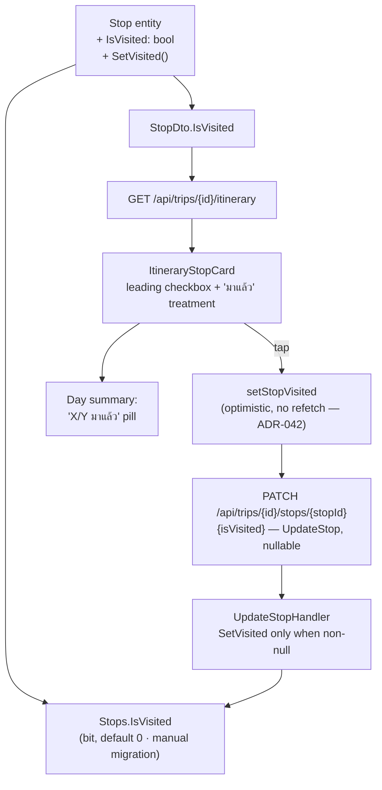
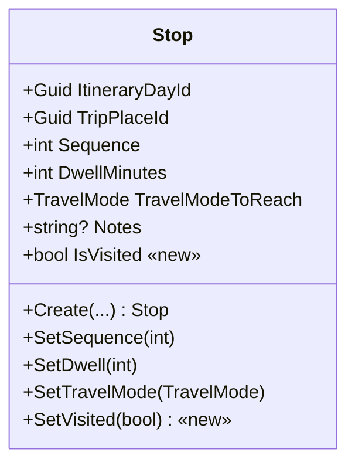
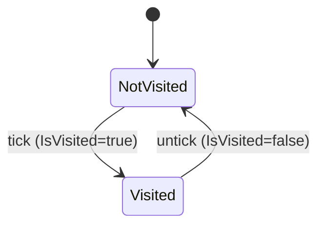

# Design — Trip Stop "Visited" (มาแล้ว) marker · issue #24

**Date:** 2026-07-12
**Status:** Draft for approval
**Issue:** [#24](https://github.com/ThodsaphonSonthiphin/MenuNest/issues/24) — "มีเช็คบล็อกเพื่อบอกว่า มาสถานที่นี้แล้ว"
**ADRs:** [039](../../adr/039-stop-visited-display-marker.md) (display-only marker) ·
[040](../../adr/040-visited-presentation.md) (presentation) ·
[041](../../adr/041-visited-write-path-and-scope.md) (backend write path + scope) ·
[042](../../adr/042-visited-non-invalidating-optimistic-write.md) (SPA non-invalidating optimistic write)
**Confirmed mock:** [`docs/mocks/trip-stop-visited-mock.html`](../../mocks/trip-stop-visited-mock.html)
(preview `docs/mocks/trip-stop-visited-preview.png`)
**Glossary:** term **Visited** added to [`CONTEXT.md`](../../../CONTEXT.md)



The diagram shows the whole change: one boolean on the `Stop` entity flows out through the
itinerary DTO to a new leading checkbox on the stop card, and back through the *existing* PATCH
endpoint — with a dedicated, non-invalidating frontend mutation (ADR-042) so a tick never
triggers a costly itinerary refetch.

---

## 1. Goal & non-goals

**Goal.** Let the Trip owner tick each **Stop** as "มาแล้ว" (Visited) while following the plan,
so the itinerary shows at a glance where they have been. The state persists and is toggleable
both ways.

**Non-goals / design rules (explicit — see ADR-039 / ADR-040 / ADR-041):**
- **No schedule re-anchor.** Ticking Visited does **not** record an actual arrival time or
  re-cascade the **Smart Schedule** (ADR-008 holds: arrival/leave are derived, never stored).
- **No arrival timestamp** stored (deferred; can be added later without changing semantics).
- **No conditional suppression of Timing flags or Weather** on a visited card. The whole row is
  de-emphasised uniformly; there is **no** logic that hides a flag or a weather chip when a Stop
  is visited (ADR-040 §3). A visited Stop that would have shown a flag still shows it, de-emphasised.
- **No map-pin change.** Visited shows on the card only; route pins keep their styling (ADR-041).
- **No MCP tool** in this issue; folded into the ADR-034/035 Trip-MCP track later (ADR-041).
  Note the existing `update_stop` MCP tool is nonetheless a *compile-time* consumer of
  `UpdateStopCommand` — see §4.
- **No reorder/compaction.** Visited Stops stay in place at full height.
- **No approach-leg re-pointing.** The Approach leg (ADR-027) still targets the day's first
  Stop, visited or not.

---

## 2. Domain model

Add one boolean to the `Stop` entity
([`Stop.cs`](../../../backend/src/MenuNest.Domain/Entities/Stop.cs)) and one mutator. The entity
is otherwise stateless today (times are derived). The class after the change:



- `IsVisited` — `bool`, `private set`, initialised **false** in `Create(...)`.
- `SetVisited(bool value)` — sets `IsVisited` and touches `UpdatedAt` (matching the other
  mutators). No validation (both values are legal).

---

## 3. Persistence & migration

- **Column.** `Stops.IsVisited` — `bit NOT NULL DEFAULT 0`. Configure in
  [`StopConfiguration.cs`](../../../backend/src/MenuNest.Infrastructure/Persistence/Configurations/StopConfiguration.cs)
  (whose builder parameter is named **`b`**) with `b.Property(s => s.IsVisited).HasDefaultValue(false);`
  so the migration emits a `DEFAULT 0` and every existing row backfills to not-visited.
- **Migration.** New EF Core migration `AddStopIsVisited`.
- **⚠ Manual apply (project rule — CLAUDE.md).** Neither the app nor CD runs
  `Database.Migrate()`. After merge the migration **must be applied to the prod DB by hand**, or
  the deployed API throws `Invalid object name` / invalid-column errors (HTTP 500 → SPA "An
  unexpected error occurred."). Preview with `dotnet ef migrations script --idempotent` first,
  then apply with the `AZURE_TOKEN_CREDENTIALS=AzureCliCredential dotnet ef database update ...`
  command in CLAUDE.md. This is a rollout step (§8), not optional.

---

## 4. Backend API contract

Reuse the existing **`PATCH /api/trips/{id:guid}/stops/{stopId:guid}`**
([`TripsController.cs`](../../../backend/src/MenuNest.WebApi/Controllers/TripsController.cs)). The
nullable field is consumed only when present, so existing callers (dwell/mode edits) are provably
unaffected — no eager validation, no regression.

> **`UpdateStopCommand` is a positional record with no defaults, and it has more than one call
> site.** Appending a plain 5th positional parameter would break compilation at every existing
> construction. Declare it **with a default**:
> `record UpdateStopCommand(Guid TripId, Guid StopId, int? DwellMinutes, TravelMode? TravelModeToReach, bool? IsVisited = null)`.
> The pre-commit hook builds the whole solution (incl. `MenuNest.McpServer`), so a missed call
> site fails the commit.

| Layer | File | Change |
|---|---|---|
| Body DTO | `TripsController.cs` `UpdateStopBody` | add `bool? IsVisited` |
| Command | `UpdateStop/UpdateStopCommand.cs` | add `bool? IsVisited = null` (trailing, defaulted) |
| Controller → command | `TripsController.cs:87` | pass `b.IsVisited` into `new UpdateStopCommand(...)` |
| Handler | `UpdateStop/UpdateStopHandler.cs` | `if (c.IsVisited is not null) stop.SetVisited(c.IsVisited.Value);` |
| MCP call site | `MenuNest.McpServer/Tools/TripTools.cs:140` | compiles unchanged thanks to the default; no functional change (Visited not exposed over MCP — ADR-041) |
| Read DTO | `Trips/TripDtos.cs` `StopDto` | add trailing `bool IsVisited` |
| Read handler | `GetItinerary/GetItineraryHandler.cs:90` | pass `s.IsVisited` |
| Read handler | `AddStop/AddStopHandler.cs:34` | pass `false` (a new stop is never visited) |

`StopDto` becomes:
`record StopDto(Guid Id, Guid TripPlaceId, int Sequence, int DwellMinutes, TravelMode TravelModeToReach, LegDto? LegToReach, bool IsVisited)`.

The write path when the user ticks a stop:

```mermaid
sequenceDiagram
    actor U as User
    participant C as ItineraryStopCard
    participant Q as RTK Query · setStopVisited
    participant A as TripsController (PATCH)
    participant H as UpdateStopHandler
    participant DB as SQL · Stops
    U->>C: tap checkbox
    C->>Q: setStopVisited({tripId, stopId, isVisited:true})
    Q-->>C: optimistic cache patch — row dims immediately
    Q->>A: PATCH /api/trips/{id}/stops/{stopId} {isVisited:true}
    A->>H: UpdateStopCommand(IsVisited=true)
    H->>DB: stop.SetVisited(true); SaveChanges
    DB-->>H: ok
    H-->>A: 204 No Content
    A-->>Q: 204 (NO TripItinerary invalidation → no refetch, ADR-042)
    Note over Q,C: on error → undo the patch + inline error via setActionError
```

---

## 5. Frontend

Files (linked individually — they live in different folders):
[`api.ts`](../../../frontend/src/shared/api/api.ts) ·
[`ItineraryStopCard.tsx`](../../../frontend/src/pages/trips/components/ItineraryStopCard.tsx) ·
[`ItineraryTab.tsx`](../../../frontend/src/pages/trips/components/ItineraryTab.tsx) ·
[`useSchedule.ts`](../../../frontend/src/pages/trips/hooks/useSchedule.ts) ·
[`trips-tokens.css`](../../../frontend/src/pages/trips/trips-tokens.css) /
[`TripDetailPage.css`](../../../frontend/src/pages/trips/TripDetailPage.css).

### 5.1 API types & the non-invalidating mutation (ADR-042)

`api.ts` is **hand-maintained** (not codegen), so edit it directly:

1. **`StopDto` interface (:503)** — add `isVisited: boolean`.
2. **New mutation `setStopVisited`.** Do **not** reuse `updateStop` (:1313), which
   `invalidatesTags: TripItinerary` and would force a full `getItinerary` refetch — re-resolving
   every **Leg** via the Google **Routes API** and re-fetching **Weather** (cost + latency) for a
   display-only toggle (ADR-042). This is the **first** RTK-cache-patching code in the repo
   (`onQueryStarted` / `updateQueryData` / `selectInvalidatedBy` are used nowhere today), so it
   has no in-repo precedent — implement and test it deliberately. `getItinerary` is keyed by
   `{tripId, tz, lat, lng}` and more than one entry can be live (a pre-geolocation entry plus a
   post-geolocation one), so patch **every** matching entry, not just the active one:

   ```ts
   setStopVisited: build.mutation<void, {tripId: string; stopId: string; isVisited: boolean}>({
     query: ({tripId, stopId, isVisited}) => ({
       url: `/api/trips/${tripId}/stops/${stopId}`, method: 'PATCH', body: {isVisited},
     }),
     // No invalidatesTags → no getItinerary refetch (ADR-042). Optimistically patch every
     // live getItinerary cache entry for this trip, then undo if the request rejects.
     onQueryStarted: async ({tripId, stopId, isVisited}, {dispatch, queryFulfilled, getState}) => {
       const entries = api.util.selectInvalidatedBy(getState(), [{type: 'TripItinerary', id: tripId}])
       const patches = entries
         .filter((e) => e.endpointName === 'getItinerary')
         .map((e) =>
           dispatch(
             api.util.updateQueryData('getItinerary', e.originalArgs as never, (draft) => {
               for (const day of draft) {
                 const s = day.stops.find((x) => x.id === stopId)
                 if (s) s.isVisited = isVisited
               }
             }),
           ),
         )
       try {
         await queryFulfilled
       } catch {
         patches.forEach((p) => p.undo()) // checkbox snaps back; caller shows the error (§5.3)
       }
     },
   }),
   ```
   Export `useSetStopVisitedMutation`.

### 5.2 `ItineraryStopCard.tsx` (presentation per ADR-040)

- New props: `isVisited: boolean`, `onToggleVisited: (next: boolean) => void`.
- **Leading checkbox column** *before* `.stop-rail`, outside the `.stop-body` button (so a tick
  never opens the editor):
  ```tsx
  <label className="stop-check">
    <input type="checkbox" checked={isVisited}
           onChange={(e) => onToggleVisited(e.target.checked)}
           aria-label={`มาแล้ว: ${place.name}`} />
  </label>
  ```
- Root class gains `visited` when `isVisited` — write the existing severity expression out in full:
  ```tsx
  <div className={`stop-card${flag ? ' ' + CARD_CLASS[flag.severity] : ''}${isVisited ? ' visited' : ''}`}>
  ```
- When visited, render a green **"มาแล้ว"** chip at the front of `.stop-chips` (a Syncfusion
  check-glyph SVG + text — **not** an emoji, per the project icon rule).

### 5.3 `ItineraryTab.tsx`

- Pass `isVisited={s.stop.isVisited}` (:281) and an `onToggleVisited` that surfaces failure the
  same way every other trip mutation does (`await .unwrap()` → `catch` → `setActionError`; there
  is no toast system in this app):
  ```tsx
  onToggleVisited={async (next) => {
    try { await setStopVisited({tripId, stopId: s.stop.id, isVisited: next}).unwrap() }
    catch (err) { setActionError(getErrorMessage(err)) }
  }}
  ```
- **Day rollup pill (in scope).** Compute `visitedCount = scheduled.filter(s => s.stop.isVisited).length`
  and, **only when `scheduled.length > 0`** (so an empty day never shows `0/0` beside the
  "ยังไม่มีจุดแวะ" empty state), render `{visitedCount}/{scheduled.length} มาแล้ว` in the
  `.day-summary` bar (:216–232).
- `useSchedule` needs **no change** — `ScheduledStop.stop` already carries the raw `StopDto`, so
  `s.stop.isVisited` is available once the DTO field exists. `isVisited` must **not** enter
  `computeSchedule`'s time cascade (ADR-039).

### 5.4 CSS ([`trips-tokens.css`](../../../frontend/src/pages/trips/trips-tokens.css) / [`TripDetailPage.css`](../../../frontend/src/pages/trips/TripDetailPage.css))

New tokens and rules (per ADR-040):

- Tokens: `--visited: #15803d; --visited-bg: #e7f6ec;`
- `.stop-check` column + `.stop-check input { accent-color: var(--visited); }`
- `.chip.visited { background: var(--visited-bg); color: var(--visited); }` (kept full-strength)
- `.day-visited` rollup pill.
- **Visited row — de-emphasise WITHOUT whole-card `opacity`.** WCAG note: the confirmed mock used
  `.stop-card.visited { opacity: .62 }`, but CSS `opacity` composites the *whole* card over the
  page background, dropping the struck-through place name (`--muted` #94a3b8) to ~1.7:1 — below
  the AA 4.5:1 threshold — and it cannot be overridden per child, so the checkbox/green chip would
  fade too. Instead de-emphasise explicitly and keep text AA-safe:
  ```css
  .stop-card.visited { background: #f6f8fa; }
  .stop-card.visited .stop-name {
    text-decoration: line-through; text-decoration-thickness: 1.5px;
    color: #475569; /* slate-600 ≈ 7.4:1 on the card — passes AA, still reads "done" */
  }
  ```
  The checkbox and the green "มาแล้ว" chip stay at full strength so the visited state is clearly
  perceivable. (This is a refinement of the approved mock's `.62` dim — see §6.)

### 5.5 Toggle state machine

Visited toggles cleanly both ways:



A rapid tick→untick fires two independent PATCHes carrying absolute values; the 2-tap case is
self-correcting, but a rare ≥3-tap burst where an early request fails could momentarily diverge.
Acceptable for a low-stakes display toggle; the plan may add an in-flight guard per `stopId`.

---

## 6. UI spec

The confirmed mock is the source of truth for layout; the implementation must match it, **with one
approved refinement**: the visited-row de-emphasis uses the AA-safe treatment in §5.4 (struck-through
slate name + `#f6f8fa` background + full-strength checkbox/chip) rather than the mock's whole-card
`opacity: .62`, which fails WCAG AA on the place name. States shown in the mock: visited (de-emphasised
+ strike + green "มาแล้ว" chip, in place), visited-with-a-flag (flag **kept**, de-emphasised with the
card — never suppressed, ADR-040 §3), visited-with-weather (weather chips likewise kept), not-visited
(normal), and the day rollup pill.

---

## 7. Testing

- **Backend (xUnit).**
  - `UpdateStopHandler`: `IsVisited=true` sets the flag; `false` clears it; `null` leaves it and
    the other fields untouched (proves no regression to dwell/mode-only calls).
  - `GetItineraryHandler` / `AddStopHandler`: updated for the new `StopDto` field (a newly added
    stop → `IsVisited=false`).
  - Use the **`SqliteAppDbContext`** relational test double, not InMemory (repo convention).
- **Frontend typecheck (required — the pre-commit `tsc -b` fails otherwise).** `isVisited` is a
  **required** `StopDto` field, so every `StopDto`-shaped fixture must gain it. Today the only one
  is the `stop()` factory in [`useSchedule.test.ts`](../../../frontend/src/pages/trips/hooks/useSchedule.test.ts):6–10 —
  add `isVisited: false`. (`StopEditorDialog.tsx:67` spreads real DTO stops, so it is safe.)
- **Frontend behaviour.** Component test: ticking calls `setStopVisited` and applies the `visited`
  class optimistically **without a getItinerary refetch**, patching **all** live cache entries; on
  a rejected request the checkbox reverts and `setActionError` fires; the day rollup count updates
  and is hidden on an empty day.
- **Full suite.** The pre-commit hook runs backend build+test (Release) and frontend `tsc -b` +
  `npm run build` (~40s). Expect the wait; do not `--no-verify`.

---

## 8. Rollout order

1. Merge the code (adds column mapping + migration, but does not apply it).
2. **Apply the migration to prod by hand** (§3) — before/with deploy, so the API never queries a
   column that isn't there yet.
3. Deploy (existing CD). Verify a tick persists across reload and does **not** trigger a
   `getItinerary` refetch (Network tab: only the PATCH fires, no Routes/Weather calls).

---

## 9. Deferred (Phase 2)

Actual-arrival timestamp, map-pin dimming for visited Stops, an MCP "set visited" tool,
approach-leg re-pointing to the next un-visited Stop, and visited-row compaction — each is a
standalone follow-up that does not change the Visited semantics defined here.
