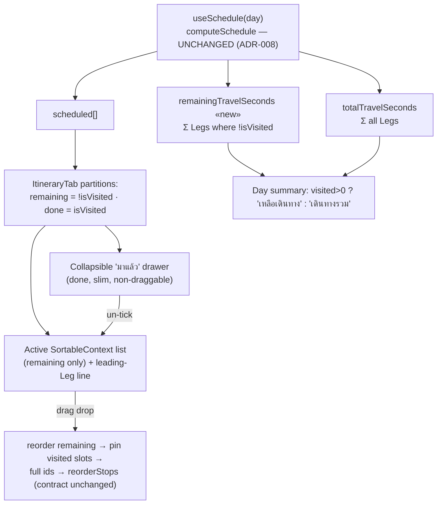
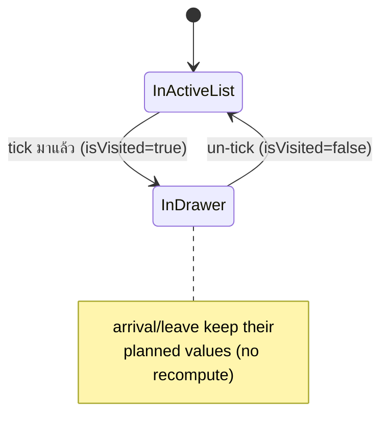

# Design — Visited Stops leave "ที่เหลือ" & drop out of remaining-travel · issue #24 (follow-up)

**Date:** 2026-07-12
**Status:** Draft for approval
**Issue:** #24 follow-up — "ให้ตัด stop ที่มาแล้ว (visited) ออกจากการคำนวณเวลาเดินทางที่เหลือ"
**ADRs:** [047](../../adr/047-visited-excluded-from-remaining-travel.md) (เหลือเดินทาง = Σ unvisited Legs, no re-cascade) ·
[048](../../adr/048-visited-drawer-and-reorder-scope.md) (มาแล้ว drawer + reorder scope) ·
builds on [039](../../adr/039-stop-visited-display-marker.md)/[040](../../adr/040-visited-presentation.md)/[042](../../adr/042-visited-non-invalidating-optimistic-write.md) (Visited) ·
[043](../../adr/043-stop-reorder-via-dnd-kit.md)/[046](../../adr/046-stop-drag-vertical-axis-legs-hidden-during-drag.md) (drag-reorder) ·
invariant [008](../../adr/008-schedule-cascade-flag-not-optimize.md)
**Confirmed mock:** [`docs/mocks/trip-visited-remaining-mock.html`](../../mocks/trip-visited-remaining-mock.html) — **แนวทาง 1** (collapsible drawer)
**Glossary:** [`CONTEXT.md`](../../../CONTEXT.md) — **Visited** revised, **เหลือเดินทาง** added



The whole change is **frontend-only** and **additive**: one new derived sum in `useSchedule`,
a display partition + drawer in `ItineraryTab`, one slim presentational row, one pure reorder
helper, and CSS. `isVisited` and `legToReach` already ship on `StopDto` (issue #24 / #31), so
there is **no backend, no API, and no migration**.

---

## 1. Goal & non-goals

**Goal.** Once the traveller ticks Stops **Visited** (มาแล้ว), the active plan should show
**what's left**: visited Stops move out of the list into a collapsed "มาแล้ว" drawer, and the
day-summary travel figure becomes **เหลือเดินทาง** — the travel time still ahead.

**Non-goals (explicit — ADR-047/048):**
- **No re-cascade.** `computeSchedule` is untouched. Arrival/leave, **Timing flags**,
  **Weather-on-arrival**, **Approach leg**, **Current-time start**, and **เสร็จ** (dayEnd) keep
  computing from the full plan, visited or not (ADR-008 invariant preserved). Only the *travel
  sum* shown changes, and only as a filtered re-sum of existing Leg values.
- **No backend / API / migration.** Purely a re-read of cache data.
- **No map change.** The map band shows all pins + the full route (ADR-041). Dimming visited
  pins is Phase 2.
- **No cross-day / drag-a-done-Stop reorder** (unchanged from ADR-046).
- **No flag/weather suppression** (ADR-040 held): a visited Stop that would flag still does.

---

## 2. Calculation — `useSchedule.ts`

Add **one** derived sum beside `totalTravelSeconds`; do **not** touch `computeSchedule` (so
`isVisited` never enters the time cascade — ADR-047 §2):

```ts
export function useSchedule(day: ItineraryDayDto, placesById: Record<string, TripPlaceDto>) {
  return useMemo(() => {
    const scheduled = composeFlags(computeSchedule(day), placesById, dayOfWeek(day.date))
    const totalTravelSeconds = day.stops.reduce((sum, st) => sum + (st.legToReach?.seconds ?? 0), 0)
    // «new» remaining travel = Legs of not-yet-visited Stops only (incl. the Leg into the
    // first remaining Stop). Order-independent sum → no dependence on computeSchedule.
    const remainingTravelSeconds = day.stops.reduce(
      (sum, st) => sum + (st.isVisited ? 0 : (st.legToReach?.seconds ?? 0)), 0)
    const dayEnd = scheduled.length ? scheduled[scheduled.length - 1].depart : day.dayStartTime.slice(0, 5)
    return {scheduled, dayEnd, totalTravelSeconds, remainingTravelSeconds}
  }, [day, placesById])
}
```

Worked example (mock data) — A(✓) → B(✓) → C → D, Legs `A=0, B=12, C=6, D=18`:
`total = 36`, `remaining = 6 + 18 = 24`. The `6` (Leg **into** the first remaining Stop C, i.e.
B→C) **is** counted — the drive still ahead — and is shown as the leading-Leg line (§3.3).

---

## 3. `ItineraryTab.tsx`

### 3.1 Partition (after `scheduled` is available)

```ts
const remaining = scheduled.filter((s) => !s.stop.isVisited)
const done = scheduled.filter((s) => s.stop.isVisited)
const visitedCount = done.length            // replaces the current inline count
const allVisited = scheduled.length > 0 && remaining.length === 0
```

### 3.2 Day-summary travel figure

Replace the fixed **เดินทางรวม** span (`:264-266`) with a label that flips once anything is
visited (zero-visited is byte-for-byte today's view — ADR-047 §3):

```tsx
{visitedCount > 0 ? (
  <span className="stat-remain">เหลือเดินทาง <b>{formatDurationMinutes(remainingTravelSeconds / 60)}</b></span>
) : (
  <span>เดินทางรวม <b>{formatDurationMinutes(totalTravelSeconds / 60)}</b></span>
)}
```

`เสร็จ {dayEnd}` and the `{visitedCount}/{scheduled.length} มาแล้ว` pill are unchanged.

### 3.3 Active list — `SortableContext` over **remaining** only

- `SortableContext items={remaining.map((s) => s.stop.id)}` (must equal the rendered children —
  ADR-048 R2).
- Map over **`remaining`**. Legs:
  - **Leading-Leg line** before `remaining[0]`: render **only** when that Stop is not the day's
    very first Stop — i.e. `scheduled.indexOf(remaining[0]) > 0` — and it has `legToReach`.
    Render a `TravelLeg` with a `lead` modifier + a muted "จากจุดที่เพิ่งไป" note. When zero
    Stops are visited this is skipped (first remaining Stop is `scheduled[0]`), matching today.
  - For `remaining[i>0]`: render `TravelLeg` for `s.stop.legToReach` as today.
- The `allVisited` case renders an empty-state in the list slot instead of cards:
  `<p className="trips-empty"><CheckIcon /> เที่ยวครบทุกจุดแล้ว</p>` — an **icon, not a 🎉 emoji**
  (project "no emoji, use Syncfusion icons" rule; the mock caption's 🎉 is illustrative only).

### 3.4 Reorder — pin visited slots (ADR-048 §3)

Extend the pure helper file `lib/reorder.ts` with a testable reconstruction (keep `computeReorder`
as-is), then use it in `handleDragEnd`:

```ts
// lib/reorder.ts — «new»
/** Reorder only the not-visited Stops; visited ids stay pinned at their original index.
 *  Returns the full-day ordered ids, or null when nothing changes. */
export function reorderKeepingVisited(
  fullIds: string[], visitedIds: ReadonlySet<string>, activeId: string, overId: string,
): string[] | null {
  const remainingIds = fullIds.filter((id) => !visitedIds.has(id))
  const nextRemaining = computeReorder(remainingIds, activeId, overId)
  if (!nextRemaining) return null
  let ri = 0
  return fullIds.map((id) => (visitedIds.has(id) ? id : nextRemaining[ri++]))
}
```

```ts
// handleDragEnd — replaces the current computeReorder call
const visitedIds = new Set(done.map((s) => s.stop.id))
const orderedStopIds = reorderKeepingVisited(
  scheduled.map((s) => s.stop.id), visitedIds, String(active.id), String(over.id))
if (!orderedStopIds) return
// …unchanged: setIsReordering(true) → reorder({...}) → refetchItinerary() → finally clear
```

The `reorderStops` request shape is **unchanged** (full-day ordered ids). Backend untouched.

### 3.5 The "มาแล้ว" drawer

Below the add-stop button, render **only when `done.length > 0`**:

```tsx
const [doneOpen, setDoneOpen] = useState(false)
// …
{done.length > 0 && (
  <div className="done-drawer">
    <button className="done-toggle" aria-expanded={doneOpen} onClick={() => setDoneOpen(v => !v)}>
      <ChevronDownIcon className="chev" />
      <span className="badge"><CheckIcon /> มาแล้ว {done.length}</span>
    </button>
    {doneOpen && (
      <div className="done-body">
        {done.map((s) => {
          const place = placesById[s.stop.tripPlaceId]
          return place ? (
            <VisitedStopRow key={s.stop.id} place={place} arrival={s.arrival}
              onUnvisit={async () => {
                try { await setStopVisited({tripId, stopId: s.stop.id, isVisited: false}).unwrap() }
                catch (err) { setActionError(getErrorMessage(err)) }
              }} />
          ) : null
        })}
      </div>
    )}
  </div>
)}
```

- Collapsed by default; a chevron rotates on expand.
- Un-ticking fires the existing **non-invalidating** `setStopVisited` (ADR-042) → optimistic cache
  patch flips `isVisited` → `useSchedule`/partition re-derive → the Stop returns to the active list.
  **No `getItinerary` refetch** (no Routes/Weather re-bill) on a tick or un-tick.

### 3.6 New component — `VisitedStopRow.tsx`

A slim, **non-sortable** row (never calls `useSortable`, so it lives safely outside the
`DndContext`). Props: `place: TripPlaceDto`, `arrival: string`, `onUnvisit: () => void`.
Renders `.done-item`: a checked checkbox (→ `onUnvisit`), the planned `arrival` (mono), and the
struck-through place name (`catEmoji(place.category) + name`). No rail / nav / drag handle / flag.

### 3.7 Toggle → view membership (state)



---

## 4. CSS (`trips-tokens.css` / `TripDetailPage.css`)

Port the confirmed mock's NEW rules: `.done-drawer`, `.done-toggle` (`.badge`; the `.chev` uses
the existing **`ChevronDownIcon`** — points down when open, `transform: rotate(-90deg)` when
`[aria-expanded="false"]` so it points right while collapsed), `.done-body`, `.done-item`
(+ `.stop-check` reuse, `.di-time`,
`.di-name` struck slate ≈AA-safe), `.travel-leg.lead .from` (muted), and `.stat-remain`
(optional accent on the remaining figure). All within `.trips-page, .trip-detail` scope. Reuse the
existing `--visited` / `--visited-bg` tokens. The `.trips-empty` all-visited line reuses the
existing empty-state class.

---

## 5. Testing

- **`useSchedule.test.ts` (pure).** Extend the `stop()` factory with an optional `isVisited`
  (default `false`, so existing calls compile). New cases: (a) no Stop visited →
  `remainingTravelSeconds === totalTravelSeconds`; (b) some visited → equals Σ of only the
  unvisited Legs; (c) the **Leg into the first remaining Stop is included**; (d) all visited →
  `0`. Assert `computeSchedule` arrival/depart are **identical** regardless of `isVisited`
  (proves no cascade coupling).
- **`reorder.ts` (pure) — `reorderKeepingVisited`.** visited prefix → suffix reorders, prefix
  pinned; visited in the **middle** → its index stays fixed while remaining reorder around it;
  `null` when `computeReorder` returns null.
- **Component (`ItineraryTab`).** Ticking moves the card to the drawer and flips the summary to
  **เหลือเดินทาง**; un-ticking from the drawer returns it; drawer is **absent** at 0 visited and
  the summary reads **เดินทางรวม**; `allVisited` shows the empty state + "เหลือเดินทาง 0 นาที";
  a tick fires `setStopVisited` with **no** `getItinerary` refetch (Network: only the PATCH).
- **tsc / build (pre-commit).** New `remainingTravelSeconds` return field — update any
  destructuring of `useSchedule`. Full suite runs on commit (~40s); do not `--no-verify`.

---

## 6. Rollout

Frontend-only. Ships through normal CD — **no migration step**. Post-deploy verification:
1. Tick a Stop → it leaves the active list into the "มาแล้ว" drawer; **เหลือเดินทาง** drops by
   that Stop's Leg; the leading-Leg line appears above the new first remaining Stop.
2. Only a `PATCH` fires on tick (no `getItinerary` / Routes / Weather calls) — ADR-042 holds.
3. With some Stops visited, drag-reorder the remaining list → order persists, visited Stops keep
   their positions, times recompute via the drop refetch (ADR-046).

---

## 7. Deferred (Phase 2)

Dimming visited map pins; a true "compress the day to what's left" re-cascade (would revisit
ADR-008); persisting the drawer open/closed state per Day; and exact leading-Leg attribution when
a visited Stop sits *between* two remaining Stops (MVP shows each remaining Stop's stored
`legToReach` as-is).
