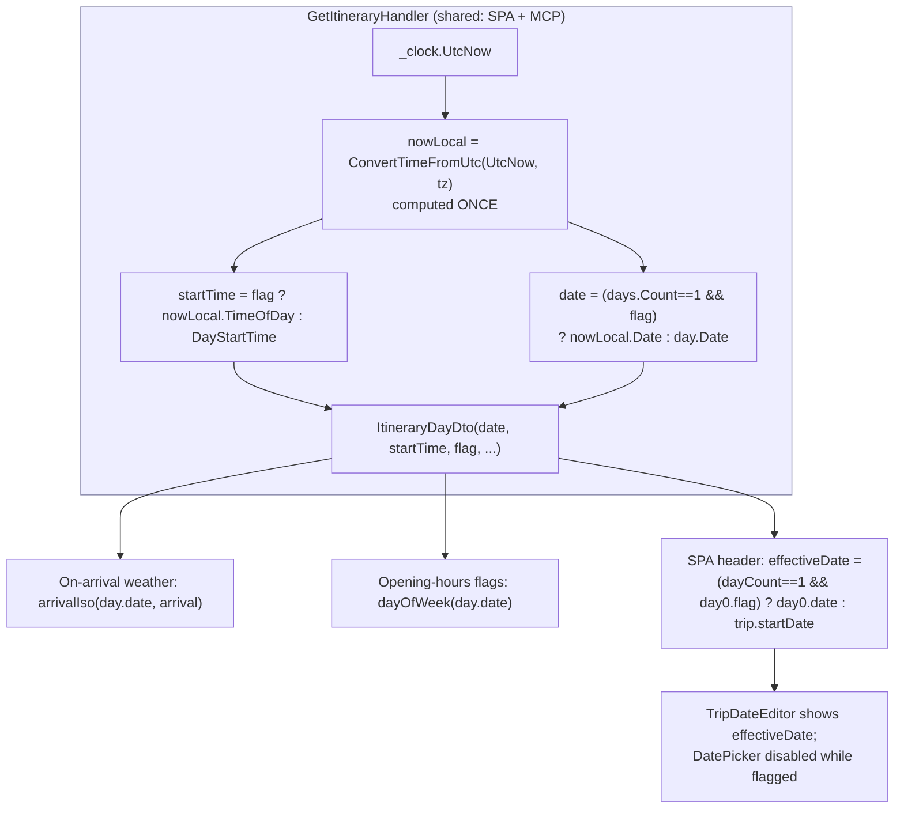

# Design — "Current-time start" also tracks **today's date** (single-day trips)

**Date:** 2026-07-13
**Status:** Draft — awaiting approval
**ADRs:** [054](../../adr/054-current-time-start-also-tracks-today-date.md) (float at read-time), [055](../../adr/055-date-float-scoped-to-single-day-trips.md) (single-day scope), [056](../../adr/056-topbar-date-sourced-from-itinerary-projection.md) (top-bar sourced from itinerary projection). Builds on [ADR-038](../../adr/038-current-time-start-viewer-timezone.md) (current-time start, time-only).
**Issue:** #TBD (open before the first commit — see project commit rule).
**Visual mock:** none — no layout/placement change. The date *value* swaps to today and the date picker takes the **same** disabled treatment the start-time `TimePicker` already has; the user's annotated screenshot is the reference.

## Overview



## Problem

A per-Day **Current-time start** flag (`UseCurrentTimeAsStart`, UI "ใช้เวลาปัจจุบันเสมอ")
already re-seeds the Day's **start time** to the viewer's local "now" on every itinerary
fetch (ADR-038) — read-time only, persisted `DayStartTime` kept as fallback. But the Day's
**date** stays the originally-planned calendar day. On the "run-this-day-trip whenever I open
it" plan in the mock (a 1-day Rayong trip), that is incoherent:

- **On-arrival weather** builds each Stop's arrival timestamp as `arrivalIso(day.date,
  arrival)`. Time snapped to now + date stuck on a past planned day ⇒ every arrival is a past
  datetime ⇒ the client's horizon gate resolves them all to **No weather data** (ADR-031). The
  fix restores this for **downstream** stops (their arrivals become future-dated); the **first**
  stop is a boundary — see the accepted-behaviour note below.
- **Opening-hours / off-window Timing flags** use `dayOfWeek(day.date)` to pick the weekday's
  window and hours — a stale date checks the **wrong weekday**.
- The **top-bar date** (point 2 in the mock) shows the planned date, not today, so the user
  can't tell the plan is "for today."

The user's ask: while the box is ticked, the date (point 2) should be **today**.

## Scope

**In scope**
- Single-day trips (`DayCount == 1`): while the one Day is flagged, its **date** projects to
  the viewer's local **today**, alongside the existing start-**time** projection.
- The SPA top-bar date reflects that projected date and the date picker locks.

**Out of scope (Phase 2 / unchanged)**
- Multi-day trips: the flag stays **time-only** (ADR-055). No per-day date float, no
  whole-trip shift.
- No change to `GetTrip` / `TripDto` / the HTTP or MCP `get_trip` contract (ADR-056).
- No change to the trips-list card (it keeps the planned `StartDate`).
- No persisted write of the date (float only — ADR-054). No DB migration.

## Backend design — `GetItineraryHandler`

The tz is already resolved once (only when some day is flagged) and no silent-UTC fallback
exists (ADR-038, unchanged). Change: compute the tz-converted **now once** before the day
loop, and derive **both** the start time (`.TimeOfDay`) and, for a single-day flagged trip,
the date (`.Date`) from that **same instant** — so the two can never straddle midnight.

Current (per-day, time only):

```csharp
var startTime = day.UseCurrentTimeAsStart
    ? TimeOnly.FromDateTime(TimeZoneInfo.ConvertTimeFromUtc(_clock.UtcNow, tz!))
    : day.DayStartTime;
result.Add(new ItineraryDayDto(day.Id, day.Date, startTime, day.UseCurrentTimeAsStart, stopDtos));
```

Target:

```csharp
// Resolve the viewer's local "now" once, from the single tz already validated above.
// Both the start time and (single-day only) the date derive from this same instant so
// they cannot land on different calendar days across a midnight tick.
DateTime? nowLocal = tz is null ? null : TimeZoneInfo.ConvertTimeFromUtc(_clock.UtcNow, tz);
var singleDay = days.Count == 1;                         // ADR-055 scope guard
// ... inside the per-day loop:
var startTime = day.UseCurrentTimeAsStart
    ? TimeOnly.FromDateTime(nowLocal!.Value)
    : day.DayStartTime;
// Date float: single-day trips only (ADR-055), read-time only — persisted Date untouched (ADR-054).
var date = (singleDay && day.UseCurrentTimeAsStart)
    ? DateOnly.FromDateTime(nowLocal!.Value)
    : day.Date;
result.Add(new ItineraryDayDto(day.Id, date, startTime, day.UseCurrentTimeAsStart, stopDtos));
```

Notes:
- `nowLocal` is only dereferenced when `day.UseCurrentTimeAsStart` is true, which implies at
  least one flagged day, which implies `tz != null` (guaranteed by the existing block that
  throws when a flagged day has no/invalid tz). The `!` is therefore safe; a defensive guard
  can be added if preferred.
- `days.Count == 1` is the scope guard (not `trip.DayCount`), matching the actually-returned
  days; realign keeps the two in sync, but the returned list is the source of truth here.
- `ItineraryDayDto`, `GetItineraryQuery`, the controller, and the MCP `get_itinerary` tool are
  **unchanged** — the projected date rides the existing `Date` field, exactly as the projected
  time already rides `DayStartTime` (honest for SPA and MCP alike).

## Frontend design — top bar (point 2)

The itinerary is already in the header's RTK cache: `useDayRoute(tripId)` (called in
`TripDetailPage`) fires `useGetItineraryQuery({tripId, tz: getViewerTimeZone(), lat, lng})`
with the identical args `ItineraryTab` uses. The header derives the effective displayed date
from that same (deduped) query — **no new network request**.

```tsx
// TripDetailPage — the two NEW HOOKS must sit ALONGSIDE the existing useDayRoute call,
// i.e. ABOVE the not-found early return (TripDetailPage.tsx:57-63) — NOT merely "before
// the desktop/mobile branch". Placing them after the guard makes them conditional and
// throws "Rendered fewer hooks than expected" on the trip-not-found path.
const viewerLocation = useAppSelector((s) => s.trips.viewerLocation)   // HOOK — above the guard
const { data: days } = useGetItineraryQuery(                            // HOOK — above the guard
  { tripId, tz: getViewerTimeZone(), lat: viewerLocation?.lat, lng: viewerLocation?.lng },
  { skip: !tripId },
) // shares useDayRoute's cache entry (identical args) → deduped, no extra fetch

// Derived (non-hook) values — may be computed after the guard.
const currentDay = trip?.dayCount === 1 && days?.[0]?.useCurrentTimeAsStart === true
const overrideDate = currentDay ? days![0].date.slice(0, 10) : undefined
// ...both call sites:
<TripDateEditor trip={trip} overrideDate={overrideDate} locked={currentDay} onError={setDateError} />
```

> **Rules-of-Hooks caveat (verified):** `frontend/.husky/pre-commit` runs only `dotnet
> build/test`, `tsc --noEmit`, and `npm run build` — **not** eslint — so a
> `react-hooks/rules-of-hooks` mistake here is caught by **no** commit gate and would surface
> only as a runtime crash on the not-found path. The two new hooks MUST be placed above the
> line-57 not-found guard (alongside `useDayRoute`); only `currentDay`/`overrideDate` may follow it.

`TripDateEditor` gains two optional props:

```tsx
export function TripDateEditor({
  trip,
  overrideDate,   // "yyyy-MM-dd" server-projected today; present only when locked
  locked = false, // disable editing while current-time-start is active
  onError,
}: { trip: TripDto; overrideDate?: string; locked?: boolean; onError: (m: string | null) => void }) {
  // displayYmd = locked ? (overrideDate ?? startYmd) : startYmd
  // <DatePicker value={ymdToDate(displayYmd)} disabled={locked} editable={false} openOnFocus clearButton={false} .../>
  // end-date band already gated on trip.dayCount > 1, so a locked (single-day) trip never shows it
}
```

Behavior:
- **Locked** ⇒ the picker is read-only-and-disabled (same treatment as the flagged start-time
  `TimePicker` in `DayStartEditor`); it shows the server-projected `overrideDate`. A pick can't
  fire, so `handleChange`/`updateTrip` is never reached while locked.
- **Unlocked** ⇒ today's behavior, verbatim (tap → DatePicker → `updateTrip` → reschedule).
- **Untick the flag** ⇒ `setDayUseCurrentTime` already invalidates `TripItinerary`; the header
  refetches, `days[0].useCurrentTimeAsStart` becomes false, `overrideDate`/`locked` clear, and
  the picker returns to the persisted planned `trip.startDate`. No `GetTrip` invalidation needed.
- **Pre-itinerary-load** ⇒ `days` undefined ⇒ `overrideDate` undefined ⇒ shows planned
  `trip.startDate` until the (already in-flight) itinerary resolves, then swaps to today. A
  brief, self-healing flash; acceptable.
- **Local-midnight rollover (accepted, per ADR-038 read-time model)** ⇒ the projected date is
  server-computed and rides the **cached** `getItinerary` DTO; `getItinerary` has no
  `pollingInterval`/`refetchOnFocus`, so it re-projects only on mount, arg change, or a
  `TripItinerary` invalidation. A single-day trip left open **untouched across local midnight**
  keeps yesterday's cached `day.date` until the next refetch — so its On-arrival chips re-gate to
  "No data" and `dayOfWeek` checks the wrong weekday until then. This is the identical read-time
  staleness ADR-038 already accepts for the start **time**; it self-heals on any interaction that
  refetches. No mitigation in scope.
- **First-stop On-arrival ≈ now (accepted)** ⇒ the first stop of a flagged single-day trip has
  no travel leg (common no-geolocation case), so its arrival equals the projected start = "now"
  (minute-floored). `weatherWindow` treats `arrivalMs < nowMs` as `'past'` (strict, no grace), so
  the first stop's **On-arrival** chip shows **"No data"** — but its **"Now"** chip already shows
  current weather at that location, so no information is lost. Downstream stops (future arrivals)
  populate normally. This is a **pre-existing** `weatherWindow` behaviour for any "start ≈ now"
  trip (e.g. tapping "ตอนนี้"), not introduced here; adding a now-grace to the shared weather gate
  is **out of scope** (deliberately not bundled — decided 2026-07-13).

```mermaid
sequenceDiagram
    actor V as Viewer
    participant H as SPA (header + tab, one itinerary cache)
    participant S as GetItineraryHandler
    V->>H: tick "ใช้เวลาปัจจุบันเสมอ"
    H->>S: PATCH .../use-current-time  (invalidates TripItinerary)
    H->>S: GET .../itinerary?tz=Asia/Bangkok
    S-->>H: day.date = today(tz), dayStartTime = now(tz)
    H-->>V: top bar + day show TODAY; both pickers locked
    Note over H: weather On-arrival & day-of-week flags now coherent
```

## No contract changes

| Surface | Change |
|---|---|
| `ItineraryDayDto` / `GetItineraryQuery` / itinerary endpoint | none (projected date rides existing `Date`) |
| `TripDto` / `GetTrip` / `get_trip` (HTTP + MCP) | none (keeps persisted planned `StartDate`) |
| DB schema / migration | none (read-time projection only) |
| `setDayUseCurrentTime` mutation + invalidation | none (already invalidates `TripItinerary`) |

## Behavior matrix

| Trip | Flag | Top-bar date (point 2) | Itinerary `day.date` | Start time |
|---|---|---|---|---|
| 1-day | on | **today** (viewer tz), picker locked | **today** | now (tz) |
| 1-day | off | planned `StartDate`, editable | planned | planned |
| Multi-day | on (any day) | planned `StartDate`, editable | planned (unchanged) | now (tz) *(time-only, ADR-055)* |
| Multi-day | off | planned, editable | planned | planned |

## Blast radius

- **Consumers of `ItineraryDayDto.date`** — `useStopWeather` (`arrivalIso`), `useSchedule`
  (`dayOfWeek` for opening-hours/off-window flags), map/route summary. They compute against today
  for a flagged single-day trip (the fix's whole point): downstream On-arrival readings and
  `dayOfWeek` flags become correct. One accepted boundary: the **first** stop's arrival ≈ now,
  which `weatherWindow` gates as past, so its On-arrival stays "No data" (covered by its "Now"
  chip — see the first-stop bullet above). No consumer breaks on a today-valued date.
- **Consumers of `TripDto.StartDate`** — unchanged (still the persisted planned date):
  trips-list card, `TripDateEditor` fallback, HTTP/MCP `get_trip`. Deliberately not touched.
- **`useDayRoute` / `ItineraryTab`** — unaffected; the header shares their existing query.

## Testing

**Backend unit (`GetItineraryHandlerTests`)** — model on the existing deterministic
`Resolves_a_current_time_day_start_in_the_supplied_time_zone` (fixed `fx.Clock.UtcNow` + known
tz ⇒ known local):
1. **Date crosses the day boundary via tz** — clock `2026-01-15 20:00 UTC`, single day, flag on,
   tz `Asia/Bangkok` (+7 ⇒ local `2026-01-16 03:00`), persisted `day.Date = 2026-01-15` ⇒ assert
   `days[0].Date == 2026-01-16` **and** `DayStartTime == 03:00`. Proves the date follows the
   tz-converted now (not the persisted date) and shares the instant with the time.
2. **Single-day, flag off** — assert `days[0].Date` stays the persisted date.
3. **Multi-day, flag on** — 2-day trip, flag a day, assert its `Date` stays persisted (scope
   guard, ADR-055) while `DayStartTime` still projects (time-only unchanged).
- The existing tz/validation tests (missing/unknown tz, no-flag ignore) must stay green — the
  change adds no new tz plumbing.

**Frontend** — the SPA vitest runs in `node` with no DOM harness (project CLAUDE.md), so any pure
logic worth covering (e.g. an `effectiveTripDate(trip, days)` helper, if extracted) goes in a
`lib/` module with a `*.test.ts`. The header wiring + disabled picker are **not** unit-testable.

**Interactive verification (required — no visual/DOM test harness, project CLAUDE.md):** in a
seeded/authed env, on a 1-day trip: tick the box ⇒ top-bar date shows today + picker locked;
On-arrival weather chips populate for **downstream** stops (future arrivals) — the **first**
stop's On-arrival ≈ now stays "No data", covered by its "Now" chip (expected, accepted);
day-of-week-sensitive Timing flags reflect today's weekday. Untick ⇒ planned date returns,
picker editable. Confirm a multi-day trip's date is unaffected.

## Non-goals / Phase 2

- Multi-day date semantics (per-day float vs whole-trip shift) — deferred (ADR-055).
- Surfacing the projected date in the trips-list card or MCP `get_trip` — not needed (ADR-056).

## Rollout

Pure code change, no migration, no server config. Ships in one commit (backend projection +
frontend wiring together) so the pre-commit full-suite stays green (project commit rule).
