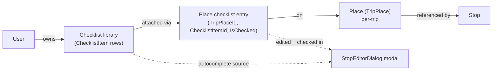
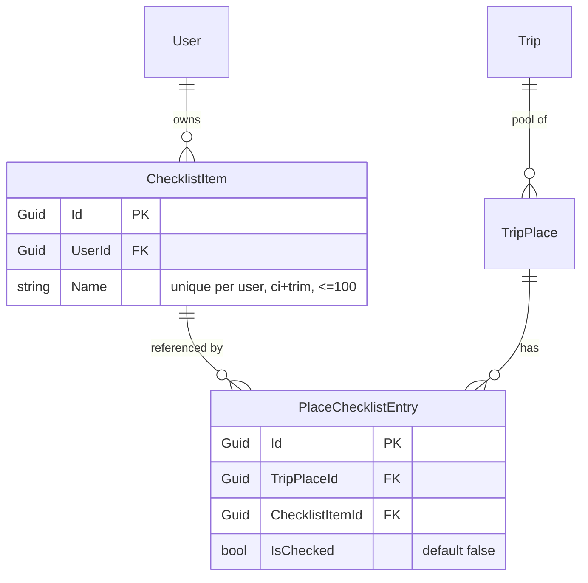
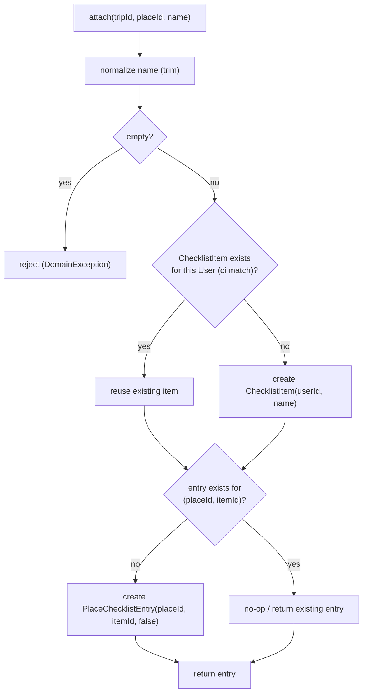
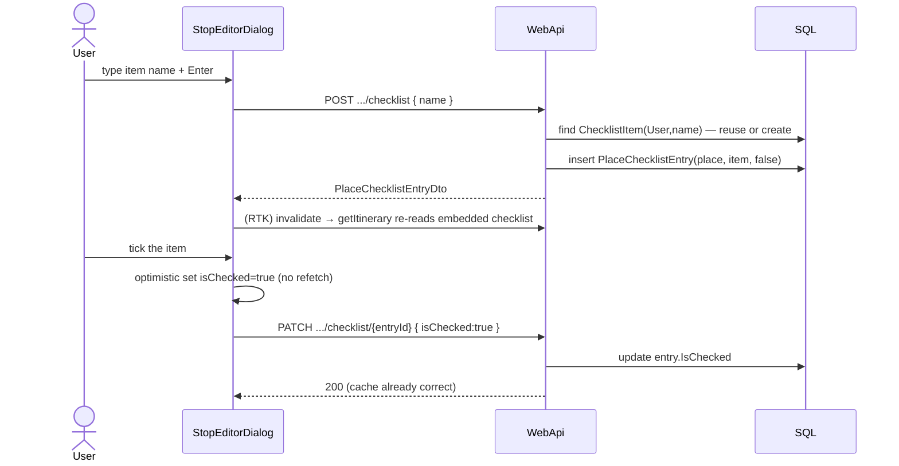

# Design spec — Place checklist items (issue #23)

**Date:** 2026-07-13
**Status:** Draft (for approval → `superpowers:writing-plans`)
**Issue:** [#23](https://github.com/ThodsaphonSonthiphin/MenuNest/issues/23) — "add check list item that
need for the place in the modal detail"
**Decisions:** ADR-058 (User-scoped reusable library), ADR-059 (junction + per-Place checked),
ADR-060 (granular endpoints + MCP), ADR-061 (Phase-1 modal-only).
**Glossary:** CONTEXT.md — *Checklist item*, *Place checklist entry*, *Checklist library*, *Checked (checklist)*.
**Visual mock:** [docs/mocks/trip-place-checklist-mock.html](../../mocks/trip-place-checklist-mock.html)

---

## 1. Summary

A **Checklist item** is a **User-scoped, reusable** label for something to bring/prepare for a visit
(e.g. "ร่ม", "พาสปอร์ต", "ครีมกันแดด"). The user attaches items to a **Place** (TripPlace); each
attachment is a **Place checklist entry** carrying a **per-Place** checked boolean ("เตรียมแล้ว"). The
same item is reused across many Places and many Trips — that reuse is the point of the feature and the
reason it is **not** modelled as per-Place JSON (the Review-links pattern, ADR-050).

Phase 1 surfaces the feature **only inside the Stop editor modal** (`StopEditorDialog`), with implicit
create-and-autocomplete (no separate library-management screen), and is exposed over **MCP** alongside
the existing Trip tools. A Stop-card summary badge and a library-management/rename/delete screen are
**Phase 2**.



---

## 2. Scope

**In scope (Phase 1)**

- New User-scoped entity `ChecklistItem` (the library) + relational junction `PlaceChecklistEntry`.
- A checklist section in `StopEditorDialog`: list the Place's entries (checkbox + name + remove), plus
  an add input with autocomplete from the library and implicit create-on-new-name.
- REST endpoints + MCP tools for: list-my-items, attach (create-or-reuse by name), detach, toggle-check.
- Read: entries + checked state embedded in `TripPlaceDto`.
- Pure logic (name normalization, validity, progress "N/M") in a new `lib/checklist.ts` with a vitest.
- EF entities + configuration + migration in the **same commit** (CLAUDE.md model-validation rule).

**Out of scope (Phase 2)** — see ADR-061

- Stop-card progress badge / any card-surface affordance.
- Library-management screen: browse, **rename**, **delete** library items; prune orphans.
- Reordering entries within a Place (Phase 1 order = insertion order).
- Sharing checklists across Users / family scope.

---

## 3. Domain model

Four new/changed pieces in `MenuNest.Domain` + `MenuNest.Infrastructure`. The Trip aggregate stays
**FK-only** (no EF navigation graph), consistent with Trip/ItineraryDay/Stop/TripPlace today.



### 3.1 `ChecklistItem` (library row)

- Fields: `Id`, `UserId`, `Name`.
- `Name` is trimmed, non-empty, `<= 100` chars. **Unique per User, case-insensitive** — enforced by a
  filtered/normalized unique index (mirror the `(TripId, GooglePlaceId)` index on `TripPlace`). The
  create-or-reuse handler resolves a name collision to the existing row.
- Domain factory `ChecklistItem.Create(userId, name)` validates and throws `DomainException` on empty /
  over-length (mirror `ReviewLink.Create`).
- Reference/display only — never referenced by the Smart Schedule.

### 3.2 `PlaceChecklistEntry` (junction)

- Fields: `Id`, `TripPlaceId`, `ChecklistItemId`, `IsChecked` (default `false`).
- **Unique `(TripPlaceId, ChecklistItemId)`** — an item attaches to a Place at most once.
- `IsChecked` is **per-Place**: the same item on two Places has two independent flags.

### 3.3 Cascade / lifecycle (ADR-059)

| Relationship | OnDelete | Rationale |
|---|---|---|
| `PlaceChecklistEntry → TripPlace` | **Cascade** | Deleting a Place (or a Trip, which cascades its Places) removes that Place's entries. |
| `PlaceChecklistEntry → ChecklistItem` | **NoAction / Restrict** | Deleting a Place must **never** touch the library. |
| `ChecklistItem → User` | NoAction | Matches `Trip → User`. |

Phase 1 has **no** delete path for `ChecklistItem` (no management UI), so the Restrict edge is never
exercised from the library side. Orphaned library items (zero entries) persist as autocomplete
suggestions — this is intended, not a leak.

---

## 4. Attach = create-or-reuse by name

Attaching is the only operation that can *create* a library row. Detaching never deletes one.



Ownership is verified the same way as `UpdateTripPlaceHandler`: resolve current User via
`IUserProvisioner`, confirm `Trip.UserId == currentUser`, and scope the Place load by `TripId`. The
library lookup/create is scoped by that same `UserId`.

---

## 5. API surface

### 5.1 REST (WebApi `TripsController`)

| Verb + route | Body | Returns | Notes |
|---|---|---|---|
| `GET /api/checklist-items` | — | `ChecklistItemDto[]` | The **Checklist library** for the current User (autocomplete source). User-scoped, not trip-scoped. |
| `POST /api/trips/{tripId}/places/{placeId}/checklist` | `{ name }` | `PlaceChecklistEntryDto` | Attach (create-or-reuse). |
| `DELETE /api/trips/{tripId}/places/{placeId}/checklist/{entryId}` | — | `204` | Detach (junction only). |
| `PATCH /api/trips/{tripId}/places/{placeId}/checklist/{entryId}` | `{ isChecked }` | `PlaceChecklistEntryDto` | Toggle checked. |

Each maps to an Application use case (`AttachChecklistItem`, `DetachChecklistItem`,
`SetChecklistEntryChecked`, `ListChecklistItems`) with a FluentValidation validator, mirroring the
existing `UpdateTripPlace` slice.

### 5.2 MCP (`TripTools`) — ADR-060

- `list_checklist_items` -> `ListChecklistItems`
- `attach_checklist_item(tripId, placeId, name)` -> `AttachChecklistItem`
- `detach_checklist_item(tripId, placeId, entryId)` -> `DetachChecklistItem`
- `set_checklist_item_checked(tripId, placeId, entryId, isChecked)` -> `SetChecklistEntryChecked`

Read is automatic through the embedded `TripPlaceDto` (like Review links, ADR-053) — no separate MCP
read tool for a Place's checklist.

---

## 6. Read model

`TripPlaceDto` gains a `checklist: PlaceChecklistEntryDto[]` field:

```
PlaceChecklistEntryDto { id: string; checklistItemId: string; name: string; isChecked: boolean }
ChecklistItemDto       { id: string; name: string }
```

`AddTripPlaceHandler.ToDto` (the shared projector) is extended to project each Place's entries. The
itinerary/places responses already carry `TripPlaceDto` to the modal, so the modal needs no extra
round-trip. The DTO carries `name` denormalized from the joined `ChecklistItem`.

---

## 7. Frontend (SPA)

All under `frontend/src/pages/trips/`. State = RTK Query in the single `shared/api/api.ts`.

### 7.1 Types (`shared/api/api.ts`)

Add `ChecklistItem`, `PlaceChecklistEntry` interfaces; add `checklist: PlaceChecklistEntry[]` to
`TripPlaceDto`.

### 7.2 Endpoints (`shared/api/api.ts`, Trips block)

- `listChecklistItems` query — user-scoped; new RTK tag `ChecklistItems`.
- `attachChecklistItem`, `detachChecklistItem` mutations — invalidate `TripPlaces` + `TripItinerary`
  for the trip (so the embedded `checklist` re-reads), like `updateTripPlace`.
- `setChecklistEntryChecked` mutation — **optimistic + non-invalidating**, following the **Visited**
  pattern (`useSetStopVisitedMutation`, ADR-042): patch the cached `TripPlaceDto.checklist[].isChecked`
  in `onQueryStarted`, roll back on error. A checkbox tick must **not** trigger a full-day itinerary
  refetch (no Routes/Weather re-bill).

### 7.3 Modal section (`components/StopEditorDialog.tsx`)

A new section after the review-links section:

- Section head: inline-SVG clipboard-check icon (new `ChecklistIcon.tsx` or add to `TripFormIcons.tsx`)
  + label "สิ่งที่ต้องเตรียม" + a "เตรียมแล้ว N/M" pill.
- Entry rows in a cream card: `checkbox` (green accent) + name + remove. A checked row shows
  strike-through + muted.
- Add input with an autocomplete dropdown listing library matches + a create row ("สร้าง … ใหม่");
  Enter attaches the highlighted match or creates.
- Styling in `TripDetailPage.css` under `.stop-editor-dialog` using the existing `--se-*` orange/cream
  tokens + a `--done`/`--done-soft` green pair. Match the mock exactly.
- **Icons are inline-SVG, never emoji** (the trips convention; `docs/frontend-guidelines.md`).

The checkbox toggle calls `setChecklistEntryChecked` immediately (optimistic). Attach/detach call their
mutations. Unlike review-links, the checklist is **not** part of the "บันทึก" full-replace — its writes
are independent granular calls (ADR-060), so they persist as the user edits.

### 7.4 Pure logic (`lib/checklist.ts` + `lib/checklist.test.ts`)

- `MAX_CHECKLIST_ITEMS_PER_PLACE = 20`, `MAX_CHECKLIST_NAME = 100`.
- `normalizeChecklistName(raw)` — trim + collapse inner whitespace.
- `isValidChecklistName(raw)` — non-empty after normalize, within length.
- `matchLibrary(query, items)` — case-insensitive contains; `exactMatch(query, items)` helper for
  reuse-vs-offer-create.
- `checklistProgress(entries)` — `{ done, total }` for the "N/M" pill.

These are the unit-testable core (the SPA has **no** jsdom/RTL — CLAUDE.md); the rendering is verified
interactively / against the mock.

---

## 8. Validation & bounds

| Rule | Value | Enforced |
|---|---|---|
| Name non-empty (after trim) | required | domain + validator + `lib/` |
| Name max length | 100 | domain + validator + `lib/` |
| Name unique per User (ci) | — | DB index + create-or-reuse handler |
| Entries per Place | soft cap 20 | validator + `lib/` (UI blocks add) |
| One entry per (Place, item) | — | DB unique index + attach no-op |

---

## 9. Runtime interaction



---

## 10. Testing & rollout

- **Backend:** create-or-reuse (new name creates; existing name reuses; ci match); detach removes only
  the junction and leaves the library item; per-Place checked independence; cascade on Place/Trip
  delete removes entries but not items; ownership rejection for another User's trip. Use the **SQLite**
  relational context (repo convention) so unique indexes are exercised — the InMemory provider can't
  see them.
- **Frontend:** `lib/checklist.test.ts` (vitest, `node` env) covers all pure helpers. The modal section
  itself has **no** automated coverage (no jsdom) — it **must** be verified interactively / against the
  mock before "done" (CLAUDE.md).
- **Migration is applied to prod BY HAND** after merge (CLAUDE.md — neither app nor CD runs
  `Migrate()`); preview with `dotnet ef migrations script --idempotent` first.
- **Same-commit rule:** the EF entities + configuration + mapping land in one commit so EF model
  validation passes for every DbContext test (CLAUDE.md, learned on #33).
- **Commit references #23** per CLAUDE.md.

---

## 11. Risks / notes

- **First user-scoped read in the Trip frontend.** `listChecklistItems` is not trip-scoped; it needs
  its own RTK tag and cache lifetime.
- **Optimistic toggle** needs the same rollback care as Visited (ADR-042).
- **Attach is not idempotent under a name race** — the per-User unique index is the backstop; the
  handler catches the unique violation and reuses the winning row.
- **Autocomplete size:** Phase 1 returns the whole library; server-side typeahead filtering is a later
  optimization (log, don't silently cap).