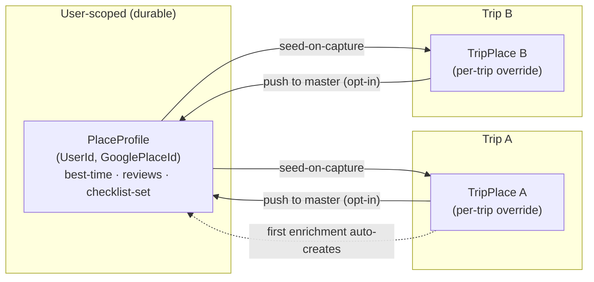
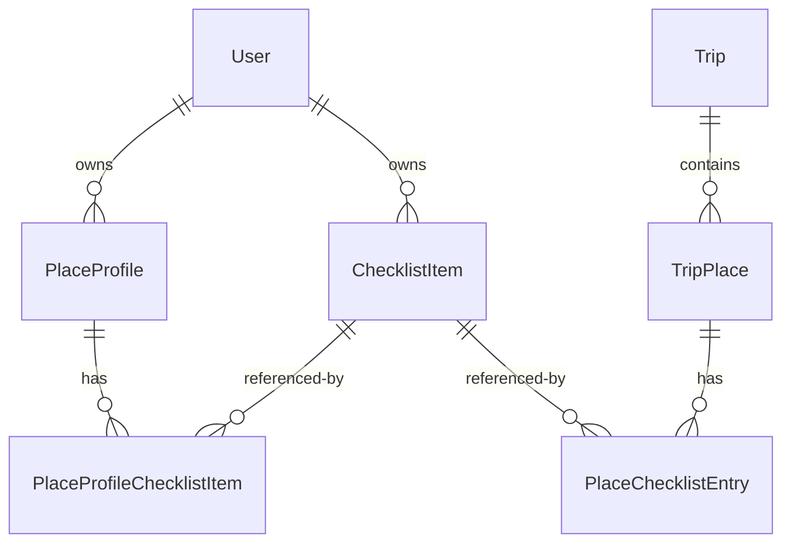
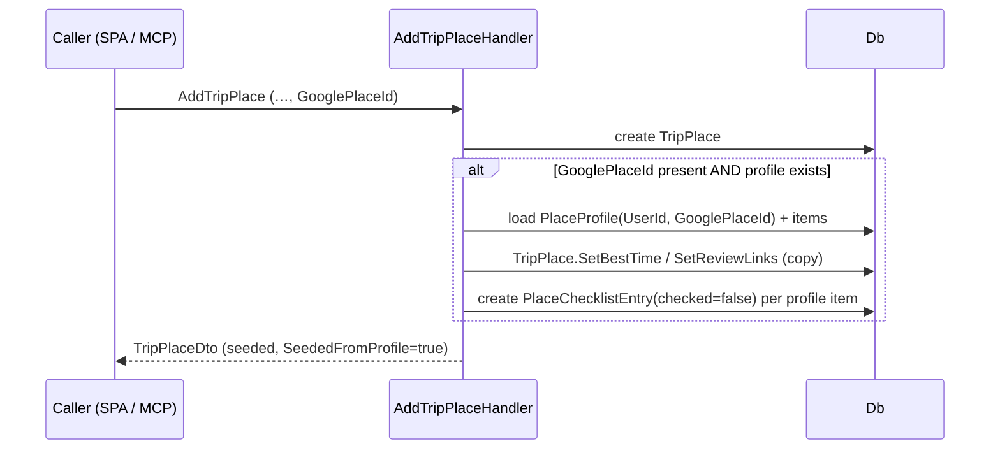
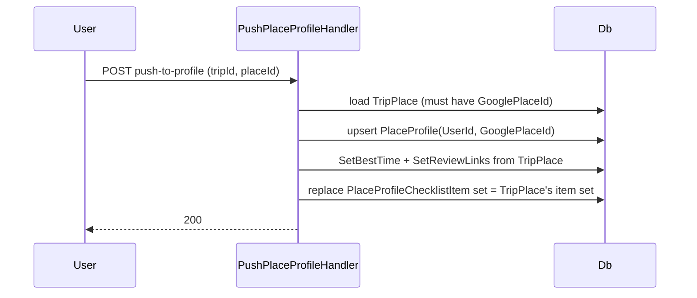

# Place library — cross-trip master profile + Place editor (design spec)

**Date:** 2026-07-13
**Status:** Approved-pending (grill-then-plan → writing-plans handoff)
**Issue:** #37 (https://github.com/ThodsaphonSonthiphin/MenuNest/issues/37)
**ADRs:** 062 (Place editor from Places tab), 063 (PlaceProfile master), 064 (seed/override lifecycle),
065 (remove-from-trip keeps master), 066 (Phase-1 scope).
**Glossary:** CONTEXT.md — *Place profile*, *Seed-on-capture*, *Per-trip override*, *Push to master*.
**Mock:** `docs/mocks/trip-place-library-editor-mock.html`.

## 1. Summary

Today the three **Place-owned** fields — best-time window, **Review link** list, and **Checklist** — can
only be edited from the **Stop editor** (Itinerary tab). A Place saved in the **คลังสถานที่** (Places)
tab but not yet on the itinerary cannot receive them at all. Two changes:

1. **Place editor** (ADR-062): click a `PlaceCard` in คลังสถานที่ → open the same warm-orange modal
   showing only the three Place-owned sections.
2. **Cross-trip Place profile** (ADR-063/064/065): the enrichment is remembered per user, per Google
   `place_id`, as a **master** that **seeds** every future Capture and survives removing a Place from a
   Trip — with **per-trip overrides** and an explicit **push to master**.

## 2. Goal & non-goals

**Goals**
- Enter/edit best-time, review links, checklist for any Place directly from คลังสถานที่.
- Enrichment persists across trips: re-capturing the same Google place restores the data.
- Per-trip edits never disturb other trips; the master only changes on first-enrichment or explicit push.
- Removing a Place from a trip keeps the master (the requested "soft delete").
- MCP capture seeds from the master too (parity).

**Non-goals (Phase 2 — ADR-066)**
- Master-management screen (browse/rename/delete profiles).
- push-to-master exposed as an MCP tool.
- Profiles for Places with no `GooglePlaceId`.
- Stop-card badges/summaries (ADR-052/061 remain deferred).

## 3. Domain model

**New — `PlaceProfile`** (`Entity`): `UserId`, `GooglePlaceId`, `BestTimeStart?`, `BestTimeEnd?`,
`ReviewLinks` (JSON, reuse `ReviewLink` value-object + converter/comparer exactly like `TripPlace`).
Unique index `(UserId, GooglePlaceId)`. FK → `User`, `OnDelete(Cascade)`. Domain methods mirror
`TripPlace`: `SetBestTime`, `SetReviewLinks`, plus factory `Create(userId, googlePlaceId)`.

**New — `PlaceProfileChecklistItem`** (junction, `Entity`): `PlaceProfileId`, `ChecklistItemId`.
Unique `(PlaceProfileId, ChecklistItemId)`. FK → `PlaceProfile` Cascade; FK → `ChecklistItem`
NoAction/Restrict (same rule as `PlaceChecklistEntry`, ADR-059). **No** `IsChecked` — checked is per-trip.

**Unchanged — `TripPlace`** and **`PlaceChecklistEntry`**: still the per-trip snapshot + per-trip checked
state. The profile is a separate, additive concept; the Trip aggregate stays FK-only.

## 4. Lifecycle & behaviors

### 4.1 Capture → seed (SPA + MCP)

Seeding is skipped when `GooglePlaceId` is null (ADR-066). Checklist items are attached by id (the items
already exist in the user's Checklist library).

### 4.2 Edit / Save / auto-create master
- **Checklist** attach/detach/check stay **live** and **per-trip** (existing endpoints, ADR-059/060).
- **Save** (best-time + review links) → existing `updateTripPlace`.
- **Auto-create trigger:** when **no** `PlaceProfile(UserId, GooglePlaceId)` exists yet, the **first
  enrichment write** creates it as a snapshot of the TripPlace's *current* best-time + reviews +
  attached checklist item-set. "First enrichment write" = `updateTripPlace` with any non-empty
  enrichment **or** `attachChecklistItem` (whichever happens first). Requires a non-null `GooglePlaceId`.
- Once a profile exists, `updateTripPlace` and checklist attach/detach write **only** to the TripPlace
  (per-trip override); the profile is untouched until an explicit push.

### 4.3 Push to master

Opt-in; overwrites the profile fully (full-replace, like review links). No-op/400 if the place has no
`GooglePlaceId`.

### 4.4 Remove from trip (ADR-065)
"เอาออกจากทริปนี้" → existing `deleteTripPlace` (hard delete; `PlaceChecklistEntry` cascades). The
`PlaceProfile` is **not** touched → re-capture restores.

## 5. Backend API surface

| Concern | Endpoint | Change |
|---|---|---|
| Seed on capture | `POST /api/trips/{id}/places` (`AddTripPlace`) | **extend handler**: lookup + copy profile; add `SeededFromProfile` to response DTO |
| Save best-time/reviews + auto-create | `PUT /api/trips/{id}/places/{placeId}` (`updateTripPlace`) | **extend handler**: auto-create profile when none exists |
| Checklist (live) | `POST/DELETE/PATCH …/checklist…` | **extend attach handler**: auto-create profile when none exists (else unchanged) |
| Push to master | `POST /api/trips/{id}/places/{placeId}/push-to-profile` | **new** command/handler/validator/controller action |
| Profile-exists flag | `GET /api/trips/{id}/places` (`listTripPlaces`) | **extend**: add `HasProfile` to `TripPlaceDto` (drives seed hint + push labeling) |
| Remove from trip | `DELETE /api/trips/{id}/places/{placeId}` | **no change** (already exists; just wire UI) |

`TripPlaceDto` gains `HasProfile: bool` (and `AddTripPlace` result gains `SeededFromProfile: bool`).
All handlers are user-scoped via `IUserProvisioner` + trip-ownership check (as today).

## 6. Persistence & migration

- New EF configs `PlaceProfileConfiguration`, `PlaceProfileChecklistItemConfiguration` (mirror
  `TripPlaceConfiguration` review-links JSON + `ChecklistItemConfiguration` unique-index patterns).
- Add `DbSet<PlaceProfile>` and `DbSet<PlaceProfileChecklistItem>` to **all three** `IApplicationDbContext`
  implementers — `AppDbContext`, `SqliteAppDbContext`, `InMemoryAppDbContext` — in the **same commit**
  as the entities (else CS0535 / EF model-validation fails the whole suite; CLAUDE.md + memory).
- Migration `AddPlaceProfiles` — **must be applied to prod by hand** (CLAUDE.md); preview with
  `dotnet ef migrations script --idempotent` first.

## 7. Frontend

- **`PlaceEditorDialog`** (new): warm-orange modal; renders 3 shared sections; header = category chip +
  "คลังสถานที่" crumb; footer = "เอาออกจากทริปนี้" (left) · "ดันขึ้น master" + "บันทึก" (right). Save →
  `updateTripPlace`; checklist live; push → new mutation; remove → `deleteTripPlace`.
- **Extract shared section components** from `StopEditorDialog`: `BestTimeBar` (already a component),
  `ReviewLinksSection`, `ChecklistSection` — both dialogs consume them (no UI divergence).
- **`PlaceCard`**: wire its existing `onClick` in `TripDetailPage` (desktop list + mobile "รายการ") to
  open `PlaceEditorDialog`. Map-pin entry out of scope.
- **Seed hint** (polish): show "เติมจากคลังของคุณ…" when `place.hasProfile` is true. Hide push + hint
  when the place has no `googlePlaceId`.
- **RTK Query**: new `pushPlaceProfile` mutation (invalidates `TripPlaces`); everything else reuses
  existing mutations. `TripPlaceDto` type gains `hasProfile`.
- Pure logic (any) → a `lib/` module with vitest (no component test harness — verify the modal
  **interactively**, CLAUDE.md).

## 8. MCP

`AddTripPlace` is shared, so MCP place capture (ADR-034/035) gets **seed-on-capture for free** — no MCP
change required for parity. push-to-master over MCP is **Phase 2** (ADR-066).

## 9. Testing

- **Relational (`SqliteAppDbContext`)**: seed-on-capture copies profile → TripPlace; auto-create on first
  enrichment; per-trip override does not touch profile; push overwrites profile + item-set; unique
  `(UserId, GooglePlaceId)`; remove-from-trip leaves profile intact; no-place_id → no profile.
- **Handler unit tests (Moq)**: ownership checks; SeededFromProfile / HasProfile flags.
- **Frontend vitest**: any extracted pure logic.
- **Interactive**: the whole editor + seed/override/push/remove flow in a seeded, authed env (no
  component harness).

## 10. Implementation notes / risks

- **Pre-commit runs the full suite** — entity + all-three DbSets + config + mapping must land together.
- **Manual prod migration** — do not forget after merge (CLAUDE.md).
- **Scan all callers** before finalizing: every `TripPlaceDto` construction site (handlers, MCP, test
  contexts incl. `InMemoryAppDbContext`, fixtures) must supply the new `HasProfile` field — positional
  DTO change fallout (memory: plan-scan-all-callers, #23).
- **Concurrency**: unique `(UserId, GooglePlaceId)` is the backstop for create-or-update races.
- **Commit hygiene**: reference the tracking issue; open one if none exists.

## 11. Out of scope (Phase 2)

Master-management screen; push over MCP; non-place_id profiles; Stop/Place-card badges.