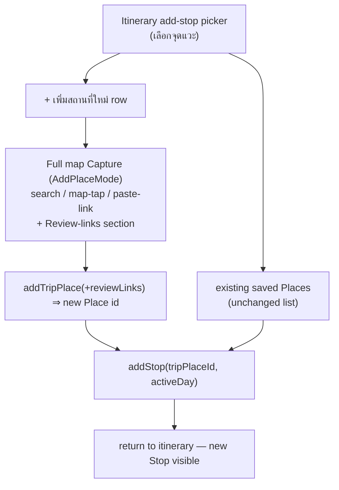
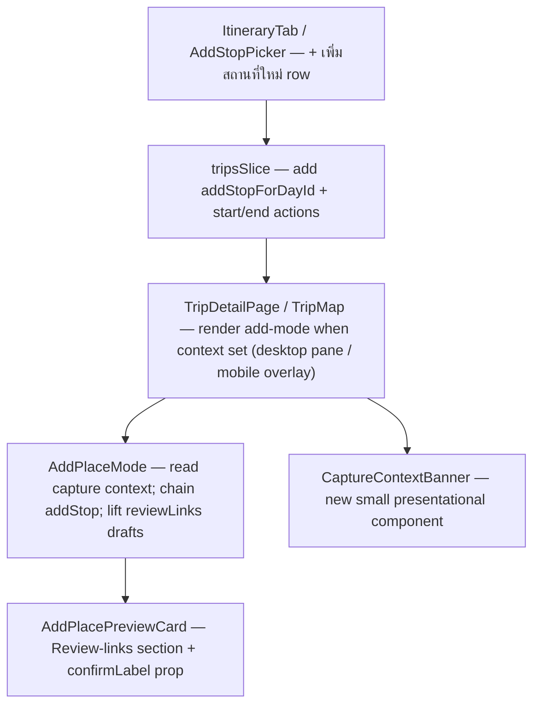

# Add a new Place (+ TikTok review link) from the itinerary add-stop picker — design

> Issue [#36](https://github.com/ThodsaphonSonthiphin/MenuNest/issues/36) ·
> Confirmed mock: [`docs/mocks/trip-add-new-place-from-itinerary-mock.html`](../../mocks/trip-add-new-place-from-itinerary-mock.html) ·
> Decisions: ADR-067, ADR-068, ADR-069, ADR-070, ADR-071



## 1. Background & problem

The Trips detail page has two tabs: **คลังสถานที่** (Places library, where **Capture** lives
on a map) and **แผนเที่ยว** (Itinerary). In the itinerary, "+ เพิ่มจุดแวะ" opens the
`AddStopPicker` sheet ("เลือกจุดแวะ"), which today can only pick from Places **already captured**
into the trip (`places.filter(p => !existingTripPlaceIds.has(p.id))`). To schedule a brand-new
place a user must leave the itinerary, switch to คลังสถานที่, Capture it, then return and add it
as a Stop. Separately, the Capture preview card cannot attach a **Review link** at all — links
can only be added afterwards by re-opening the Stop/Place editor.

Issue #36 asks for both, right at the add-stop moment: **add a not-yet-saved place** and
**attach a TikTok link** without leaving the itinerary.

## 2. Goals / non-goals

**Goals**
- From the itinerary add-stop picker, capture a brand-new **Place** and have it become a **Stop**
  on the active **Day** in one flow (ADR-067).
- Attach **Review link**s (TikTok etc.) while capturing, via the shared Capture card (ADR-069).

**Non-goals (explicitly out of scope)**
- No new backend endpoint, use-case, EF change, or MCP tool — the feature composes two existing
  operations client-side (ADR-071). `add_trip_place` over MCP already accepts `reviewLinks`.
- No atomic Place+Stop transaction (ADR-071).
- No bulk "add several new places in a row" from this flow — single-shot (ADR-068).
- No changes to how existing saved Places are picked from the sheet.

## 3. Domain & glossary

Uses existing canonical terms only — **Capture**, **Place** (TripPlace), **Stop**, **Day**,
**Review link** (see CONTEXT.md). The **Capture** entry is refined to note it is now also
reachable from the itinerary add-stop picker, where it additionally creates a **Stop** on the
active Day. No new term is introduced.

Invariant preserved: **Review link**s belong to the **Place**, never the **Stop** (ADR-049), and
never feed the Smart Schedule / Timing flags / any computed value.

## 4. Decisions (ADR summary)

| ADR | Decision |
|---|---|
| 067 | Add-new-place from the itinerary picker reuses the full map **Capture** (`AddPlaceMode`, all three entry paths) and, on success, auto-adds the Place as a **Stop** on the active Day. |
| 068 | Single-shot: one Place → one Stop → return to the itinerary immediately (deliberate divergence from ADR-016's stay-armed Places-tab capture). |
| 069 | The **Review link** editor is added to the **shared** `AddPlacePreviewCard`, so both the itinerary flow and the Places-tab Capture can attach links at capture. |
| 070 | Desktop keeps the itinerary list on the left and enables add-mode on the always-present right-pane map; mobile uses a full-screen capture surface. Both show a context banner. |
| 071 | Frontend-only: client chains `addTripPlace` → `addStop`; non-atomic (a failed `addStop` leaves the Place captured in the library, surfaced as an error). |

## 5. UX & flow

```mermaid
sequenceDiagram
    actor U as User
    participant S as SPA (Trips)
    participant API as MenuNest API
    U->>S: tap "+ เพิ่มสถานที่ใหม่" in เลือกจุดแวะ
    S->>S: enter capture context (addStopForDayId = active Day)<br/>show banner "เพิ่มสถานที่ใหม่เป็นจุดแวะ · <Day>"
    U->>S: search / map-tap / paste-link → pick place
    S->>U: preview card (name, category, Review-links section)
    U->>S: (optional) fill TikTok link(s); tap "เพิ่มเป็นจุดแวะ"
    S->>API: POST addTripPlace(...reviewLinks) 
    API-->>S: TripPlaceDto { id }
    S->>API: POST addStop(tripPlaceId=id, dayId, dwell 60, defaultTravelMode)
    API-->>S: StopDto (TripItinerary cache invalidated)
    S->>S: exit capture context, return to itinerary
    S->>U: new Stop visible in the day's list
```

Layout per breakpoint (see mock):
- **Desktop** — left pane stays on แผนเที่ยว; the right-pane `TripMap` enters add-mode. The new
  Stop appears in the left list on return (ADR-070).
- **Mobile / tablet** — a full-screen capture surface (map + search + banner) opens above the
  itinerary; closing/back returns to the itinerary.

The context **banner** (both breakpoints) reads `เพิ่มสถานที่ใหม่เป็นจุดแวะ` with a sub-line
`<Day label> · <destination>` and a back affordance that cancels the capture context.

## 6. Frontend changes

Frontend-only. Component touch-points:



1. **`tripsSlice.ts`** — add `addStopForDayId: string | null` (null = not capturing). Reducers:
   `startAddStopCapture(dayId)` (sets `addStopForDayId`, and enters add-mode) and
   `endAddStopCapture()` (clears it, exits add-mode). Keep the existing Places-tab `addMode`
   boolean independent.

2. **`AddStopPicker`** (in `ItineraryTab.tsx`) — add a prominent primary row
   **"+ เพิ่มสถานที่ใหม่"** above the existing-places list, with a "หรือเลือกจากคลังสถานที่"
   divider. Tapping it dispatches `startAddStopCapture(resolvedDayId)`. The existing list and its
   empty-state ("สถานที่ทั้งหมดอยู่ในแผนแล้ว") stay — even when every saved Place is already
   scheduled, the new-place row remains the way forward.

3. **`AddPlacePreviewCard`** — add a **Review-links section** (reuse `ReviewLinksSection` +
   `reviewLinks` lib). New props: `reviewDrafts`, `onReviewDraftsChange`, and `confirmLabel`
   (`"เพิ่มลงทริป"` default / `"เพิ่มเป็นจุดแวะ"` in the itinerary context). Review-drafts state is
   lifted into `AddPlaceMode`.

4. **`AddPlaceMode`** — accept the capture context (`addStopForDayId`, via prop from the host).
   - Hold `reviewDrafts` state; pass to the preview card; convert to `ReviewLink[]` on save
     (reuse the existing `reviewLinks` lib mapping/validation).
   - `doAdd`: `await addTripPlace({..., reviewLinks})`; **if** `addStopForDayId` is set, take the
     returned `id` and `await addStop({tripId, dayId: addStopForDayId, tripPlaceId: id,
     dwellMinutes: 60, travelModeToReach: trip.defaultTravelMode ?? 'Drive'})`, then dispatch
     `endAddStopCapture()` (single-shot, ADR-068). Without a context (Places-tab), behaviour is
     unchanged: stays armed (ADR-016), no Stop created.
   - Defaults `dwellMinutes: 60` and `travelModeToReach` mirror today's `AddStopPicker`.

5. **`CaptureContextBanner`** (new) — shown whenever `addStopForDayId` is set; renders the day
   label + back/cancel (`endAddStopCapture()`).

6. **`TripDetailPage` / `TripMap`** — render the capture surface when `addStopForDayId` is set:
   - Desktop: `addMode` on the right-pane map becomes
     `(tab === 'places' && addMode) || !!addStopForDayId`; pass the context down to `AddPlaceMode`.
     Left pane unchanged (stays on the itinerary).
   - Mobile: when `addStopForDayId` is set, render a full-screen capture overlay hosting a
     `TripMap` in add-mode (map-tap needs the map subtree) + the banner.

## 7. API & data model

**Unchanged.** Confirmed against `frontend/src/shared/api/api.ts`:
- `addTripPlace` returns `TripPlaceDto` (with `id`) and already accepts `reviewLinks: ReviewLink[]`
  and `checklist` in its body; it invalidates `TripPlaces` + `TripItinerary`.
- `addStop` accepts `{tripId, dayId, tripPlaceId, dwellMinutes, travelModeToReach}` and
  invalidates `TripItinerary`.

No controller, use-case, EF configuration, migration, or MCP change.

## 8. Error handling & edge cases

- **Non-atomic (ADR-071).** If `addTripPlace` succeeds but `addStop` fails, the Place is captured
  (visible in คลังสถานที่ and in the picker list). Surface the `addStop` error in the capture
  surface; do **not** roll back the Place. The user can add it as a Stop from the picker.
- **`addTripPlace` fails** — keep the preview card open with the error (today's behaviour); no Stop
  attempted.
- **Duplicate place** — same behaviour as existing Capture (backend/`place_id` dedupe rules
  unchanged); if a duplicate is rejected, no Stop is created.
- **Cancel mid-capture** — the banner's back affordance and Esc call `endAddStopCapture()`;
  nothing is written.
- **Place profile seeding (ADR-063/064)** — capturing a place with an existing user **Place
  profile** still seeds from master as today; Review links typed here are a **Per-trip override**
  and are **not** pushed to master unless the user explicitly does "Push to master" elsewhere.

## 9. Testing & verification

Per `CLAUDE.md`, the SPA has **no** RTL/component test harness (vitest runs in `node`), so
card/overlay/DOM cannot be unit-tested.
- **Unit (vitest)** — the review-draft → `ReviewLink[]` mapping is already covered in
  `lib/reviewLinks.test.ts`; keep any new pure helper (e.g. capture-context day-label formatting)
  in a `lib/` module with tests.
- **Gates** — `tsc -b` + `npm run build` + full backend suite must stay green (pre-commit runs the
  whole suite).
- **Interactive (required)** — in a seeded/authed env, verify on mobile and desktop: the
  "+ เพิ่มสถานที่ใหม่" row, all three capture paths, the review-links field, the banner + cancel,
  the resulting Stop appearing on the correct Day, and the non-atomic error path.

## 10. Rollout / scope boundary

Single frontend change set; no migration, no infra, no MCP. Merge → the existing frontend CD
(Static Web App) deploys. Backend untouched.

## Self-review

- Placeholders: none.
- Consistency: API facts verified against `api.ts`; ADR numbers 067–071 exist; glossary terms match
  CONTEXT.md.
- Scope: backend/MCP/atomicity/bulk-add all explicitly excluded; feature is frontend-only.
- Ambiguity: single-shot, per-breakpoint rendering, defaults, and the non-atomic failure mode are
  all pinned down.
