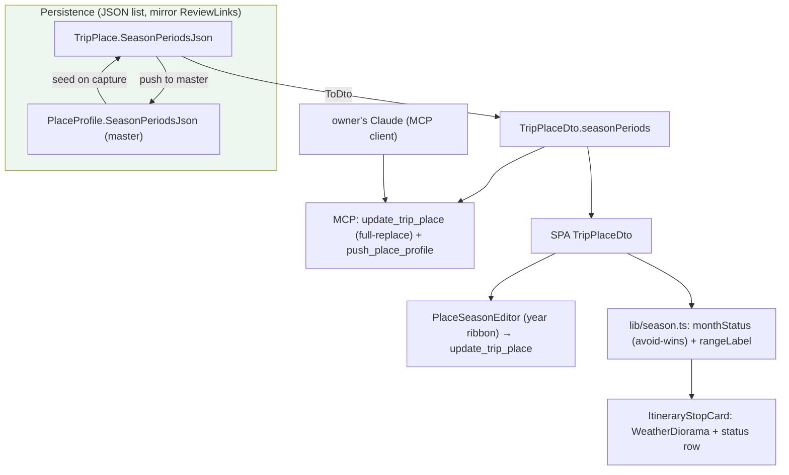
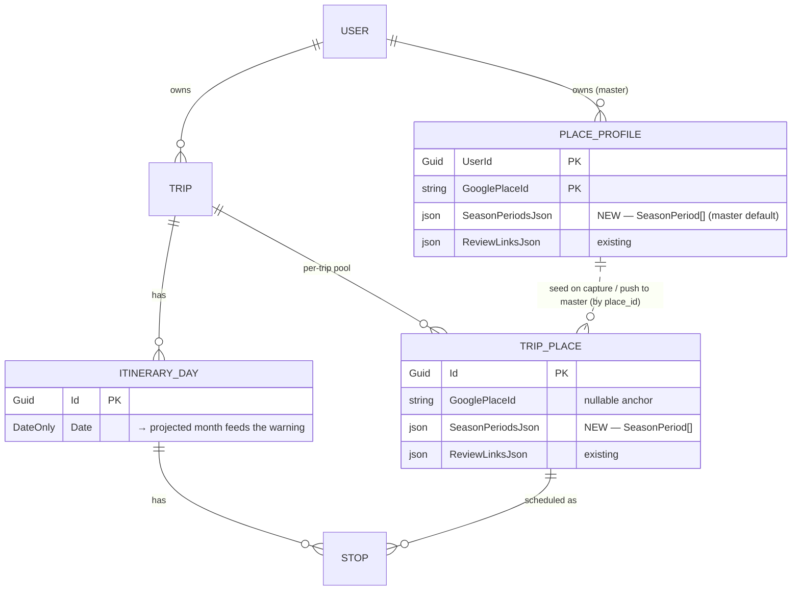
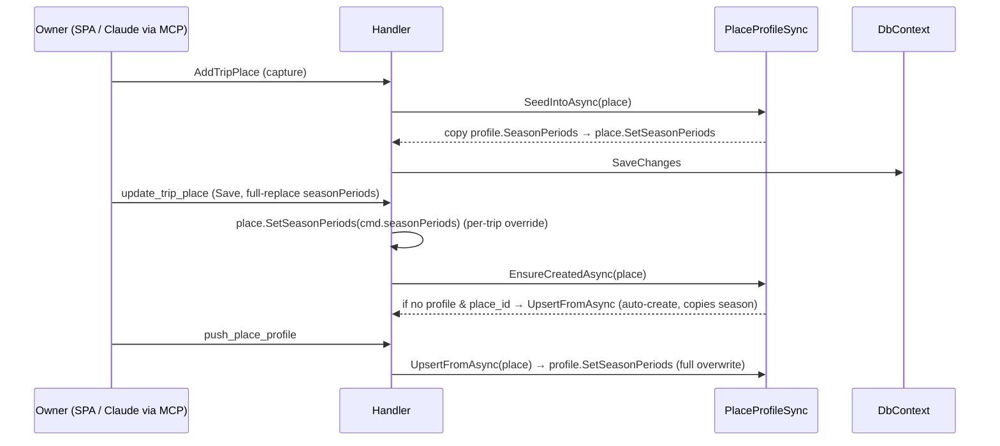
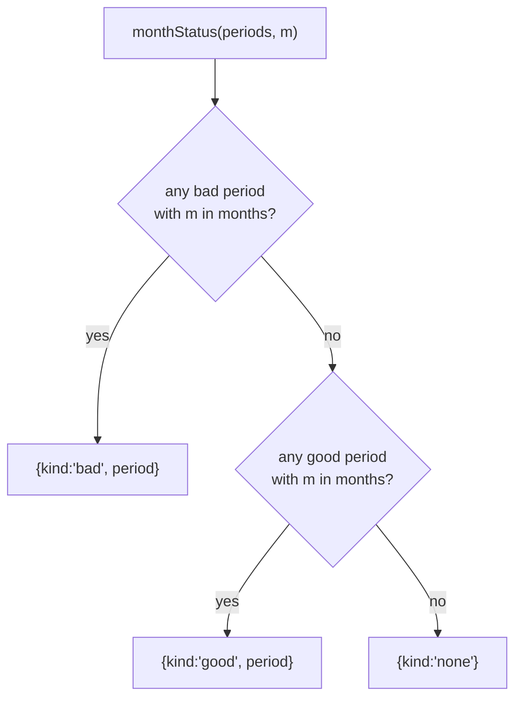

# Design spec — Place Season (issue #19)

**Date:** 2026-07-17
**Issue:** [#19](https://github.com/ThodsaphonSonthiphin/MenuNest/issues/19) — "trip ควรเก็บค่า season ที่ควรไปเที่ยว และห้ามไปเที่ยวแบบ optional … ให้เอไอช่วยเติมข้อมูลช่วงที่ควรงดกับที่ควรไป"
**Status:** Proposed — awaiting approval, then handoff to `superpowers:writing-plans`
**Decision record:** ADR-072 (period list) · 073 (master + per-trip override) · 074 (AI fill via MCP) · 075 (push-to-master over MCP) · 076 (off-season card region) · 077 (vocabulary) · 078 (weather diorama) · 079 (illustrative, not live weather) · 080 (year ribbon)
**Design source (mock):** `docs/mocks/issue-19-place-season-and-weather-diorama.md` (the owner's handoff) — the interactive `Place Season Redesign.dc.html` it references is **not on disk**; the diorama is specced from the handoff's scene table (see §9.3, §14). The earlier `docs/mocks/trip-place-season-mock.html` (chip list) is **superseded**.
**Grounding:** every code claim below is confirmed by a read of the current tree (verify-season-surface workflow, 4 readers) — file:line evidence is in the ADRs and the plan will re-cite it.

---

## 1. Overview



**One-line goal:** let a Place remember multiple good/avoid month-periods (each with its own reason), fillable by the owner's own Claude over MCP, shown in-app and used to warn when a Stop is scheduled in an avoid month.

---

## 2. Scope

**In (Phase 1):** the season data model + persistence on both entities; the seed/override/push/auto-create lifecycle; the MCP surface (`update_trip_place` field + new `push_place_profile` tool); the `PlaceSeasonEditor` (year ribbon) in the editors; `lib/season.ts` (pure, tested); the on-card `WeatherDiorama` + status row warning; the detail-sheet display.

**Out:** any in-app AI/Gemini enrichment (ADR-074); coupling the diorama to the live weather API (ADR-079); an off-season entry in the time-of-day Timing-flag pipeline (ADR-076 — it is a separate card region); a season-management/library screen.

---

## 3. Vocabulary

Defined in `CONTEXT.md`: **Season period**, **monthStatus**, **Year ribbon**, **Weather diorama**, **Off-season**. Note the deliberate non-collisions: **best time** = the time-of-day window (unchanged); **Weather reading** = the live forecast chip (unchanged); season uses none of those names.

---

## 4. Data model



**`SeasonPeriod` value object** (a JSON-embedded record, **not** a table/DbSet):

```
SeasonPeriod { kind: 'good' | 'bad', months: int[] (0..11), note?: string }
```

- **Backend:** `sealed record SeasonPeriod(SeasonKind Kind, IReadOnlyList<int> Months, string? Note)` with a **public positional ctor** (so System.Text.Json round-trips it from the column) and a validating `Create(kind, months, note)` — every month in 0..11, `Months` non-empty and de-duplicated, `Note` trimmed + length-capped, `DomainException` on violation. `enum SeasonKind { Good, Bad }`. Modelled exactly on `ReviewLink.cs`.
- **Months are 0-indexed (0 = January … 11 = December)** — matches the handoff and `getUTCMonth()`. This must be consistent across the DTO, `lib/season.ts`, and `monthOfDate`; an off-by-one silently mis-warns.
- **Persisted `SeasonPeriod` carries no `id`.** (The handoff TS interface shows an `id` — that is a *transient* React list-key on the editor draft only, never persisted, mirroring how `ReviewDraft` works.)

---

## 5. Persistence — mirror Review-links exactly

Season is a **JSON value-list**, the same shape decision as review links (ADR-050/072), **not** a scalar bitmask (the list model requires per-period kind+note, which a bitmask can't hold).

- **Entities** `TripPlace` and `PlaceProfile`: add `private readonly List<SeasonPeriod> _seasonPeriods = new();` + `public IReadOnlyList<SeasonPeriod> SeasonPeriods => _seasonPeriods;` + a **full-replace** `SetSeasonPeriods(IEnumerable<SeasonPeriod>)` (cap the count, `Clear()`+`AddRange()`, bump `UpdatedAt`). Mirror `_reviewLinks`/`SetReviewLinks`.
- **EF config** (`TripPlaceConfiguration`, `PlaceProfileConfiguration`): a `ValueConverter<IReadOnlyList<SeasonPeriod>,string>` (STJ Web opts) + a serialized-string `ValueComparer`, `.HasColumnName("SeasonPeriodsJson").HasColumnType("nvarchar(max)").HasField("_seasonPeriods").UsePropertyAccessMode(PropertyAccessMode.Field).HasDefaultValueSql("'[]'")`. Prod `AppDbContext` + test `SqliteAppDbContext` pick these up via `ApplyConfigurationsFromAssembly` — no edits there.
- **`InMemoryAppDbContext` (mandatory manual mirror):** it does **not** call `ApplyConfigurationsFromAssembly`; add the same `.HasConversion(...).HasField("_seasonPeriods").UsePropertyAccessMode(Field).IsRequired(false)` for **both** `TripPlace` and `PlaceProfile`, cloning the ReviewLinks block. Missing this fails EF model validation for every DbContext-touching test.
- **Migration** `AddSeasonPeriods`: `AddColumn<string>("SeasonPeriodsJson", nvarchar(max), nullable:false, defaultValueSql "'[]'")` on **both** `TripPlaces` and `PlaceProfiles`, plus the regenerated `AppDbContextModelSnapshot`. **Applied to prod BY HAND** after merge (`AZURE_TOKEN_CREDENTIALS=AzureCliCredential dotnet ef database update`, temp SQL firewall rule) — the app and CD never migrate.

---

## 6. Ownership lifecycle — one copy point

Season rides the shipped ADR-063/064 machinery through the **single** `PlaceProfileSync` copy point:



- **Seed-on-capture:** one line in `PlaceProfileSync.SeedIntoAsync`.
- **Push + first-enrichment auto-create:** one line in `PlaceProfileSync.UpsertFromAsync` (both `PushPlaceProfileHandler` and `EnsureCreatedAsync` call it). **The auto-create predicate needs no change** — it gates only on (place_id present ∧ no existing profile), never on which fields are set, so a season-only Save already mints the master.
- **Per-trip override:** editor Save writes season only to the `TripPlace`.

---

## 7. MCP surface (ADR-074, 075)

- **`update_trip_place`** gains a `seasonPeriods` param — **FULL REPLACE**, mirroring `reviewLinks` at every layer (HTTP `UpdatePlaceBody` → `UpdateTripPlaceCommand` → `UpdateTripPlaceHandler.SetSeasonPeriods` → MCP tool signature). Validator: `NotNull` (empty array = none), count cap, each month 0..11, note length. Read-side is automatic via `TripPlaceDto`.
- **`push_place_profile(tripId, placeId)`** — NEW MCP tool wrapping the existing `PushPlaceProfileCommand` (body-less HTTP endpoint already exists). Description states it is a **full overwrite** of the master from the current `TripPlace` (best-time + reviews + checklist + season), so the agent shapes the `TripPlace` via `update_trip_place` first.
- **`add_trip_place`** takes **no** season param (season is set post-capture via update — matches how best-time/reviews work).

**AI fill flow:** owner's Claude → `list_trip_places` (see which lack season) → reason per place → `update_trip_place` (write list, per-trip) → optional `push_place_profile` (persist to master). MenuNest calls no AI.

---

## 8. Resolution logic — `lib/season.ts` (pure, unit-tested)



- `monthStatus(periods, m)` — **`bad` wins over `good`**; overlapping bad periods resolve to the **first by list order**; the matched period supplies the note.
- `rangeLabel(months): string` — compress + **wrap-aware** Thai ranges (`[10,11,0,1]` → "ม.ค.–ก.พ., พ.ย.–ธ.ค."). Ported from the handoff's mock logic.
- `monthOfDate(isoDate): number` — 0-based month from `resolvedDay.date`, mirroring `useSchedule.dayOfWeek` (`Date.UTC(y, m-1, d).getUTCMonth()`). No `new Date()` — the date is already server-projected.
- `season.test.ts` covers avoid-wins-over-good, first-match on overlap, and `rangeLabel` wrap/compression. **This is the only automated coverage** (vitest is node-env; the editor/diorama/card cannot be gated).

---

## 9. Frontend UI

### 9.1 PlaceSeasonEditor (ADR-080)
A **year ribbon** of 12 month cells (fill per resolved status: good `#e7f6ef`/`#1f9d6b`, bad `#fdece8`/`#d4462a`, neutral; "now" = ink ring; draft-selected = accent ring), saved-period rows (kind pill + `rangeLabel` + note + delete), and an inline editor (good/avoid toggle, month-pick **by tapping ribbon cells**, note input, save/cancel). **State is lifted into the parent dialog** (like `ReviewLinksSection`) and sent through the existing `update_trip_place` Save payload — not self-persisting. Slots as a flat child of `.stop-editor` beside `BestTimeBar`/`ReviewLinksSection` in **both** `StopEditorDialog` and `PlaceEditorDialog`. Icons via `@syncfusion/react-icons` (no emoji).

### 9.2 On-card warning — a standalone region (ADR-076)
`ItineraryTab` computes `tripMonth = monthOfDate(resolvedDay.date)` and passes it to `ItineraryStopCard` (new prop) and `StopDetailSheet`. The card computes `monthStatus(place.seasonPeriods, tripMonth)` and renders a **`WeatherDiorama` header** + a status row: for `bad`, "เดือนนี้ควรเลี่ยง · `<note>`" + fix "ย้ายทริปไปเดือนอื่น", with a status-accent `border-top`; `good` a calm treatment; `none` neutral. **This is not a `composeFlags` reason** — the Timing-flag union/priority is untouched; a Stop can show both its time-of-day flag and the season diorama.

### 9.3 WeatherDiorama (ADR-078, 079)
A self-contained `<canvas>` (`ref` + one `useEffect` RAF, `kindRef` read live in-frame). Scene table (from the handoff): **bad** — high water, rain, forked lightning + flash, ripple rings, storm sky `#4c5a68→#8a97a1`; **good** — low calm water, sun-glow, occasional ripple, clear sky `#8fc7e8→#d7eefb`; **none** — light drizzle, overcast `#9aa2a9→#d6dade`. Rocks = a quadratic-curve hump (สามพันโบก) drawn dark then covered by semi-transparent water. **Perf:** gate the RAF with `IntersectionObserver` (pause off-screen). **A11y:** honour `prefers-reduced-motion` (one static frame). Illustrative of the **authored** season only — never a weather API.

---

## 10. Files to touch (from the verified surface)

**Backend:** `Domain/ValueObjects/SeasonPeriod.cs` (new) · `Domain/Enums/SeasonKind.cs` (new) · `Domain/Entities/TripPlace.cs` · `PlaceProfile.cs` · `Infrastructure/.../Configurations/TripPlaceConfiguration.cs` · `PlaceProfileConfiguration.cs` · `tests/.../Support/InMemoryAppDbContext.cs` · `Application/UseCases/Trips/TripDtos.cs` · `AddTripPlace/AddTripPlaceHandler.cs` (ToDto) · `PlaceProfileSync.cs` · `UpdateTripPlace/{UpdateTripPlaceCommand,UpdateTripPlaceHandler,UpdateTripPlaceValidator}.cs` · `WebApi/Controllers/TripsController.cs` · `McpServer/Tools/TripTools.cs` · a new migration + `AppDbContextModelSnapshot.cs`.

**Frontend:** `shared/api/api.ts` (TripPlaceDto + `SeasonPeriod` type + `update_trip_place` arg + `addTripPlace` Omit) · `pages/trips/lib/season.ts` + `season.test.ts` (new) · `components/{PlaceSeasonEditor,WeatherDiorama}.tsx` (new) · `components/{ItineraryStopCard,ItineraryTab,StopDetailSheet,StopEditorDialog,PlaceEditorDialog}.tsx` · `hooks/useSchedule.ts` (monthOfDate) · `pages/trips/TripDetailPage.css`.

---

## 11. Blast radius & gotchas

- **Positional-record fallout (scan all callers):** appending `seasonPeriods` to `UpdateTripPlaceCommand` breaks **2 source** (`TripsController:75`, `TripTools:109`) + **5 test** call sites (`UpdateTripPlaceHandlerTests`, `PushPlaceProfileHandlerTests` ×2, `PlaceProfileAutoCreateRelationalTests` ×2+). `TripPlaceDto` is built **only** in `AddTripPlaceHandler.ToDto` (season read off the entity → one edit; its callers compile unchanged).
- **`InMemoryAppDbContext` manual JSON mirror** is required (it skips `ApplyConfigurationsFromAssembly`).
- **`addTripPlace` Omit:** add `'seasonPeriods'` to the mutation's `Omit<TripPlaceDto,…>` (or pass `[]`), or `tsc` breaks.
- **One commit:** entity + EF config + InMemory mirror + migration + DTO + all positional callers + tests must land together (pre-commit runs the full Release suite).
- **No visual test harness:** editor/ribbon/diorama/card are unverifiable by tsc/build/vitest — **interactive smoke test before push** (prod deploys on push to `main`; the #36 black-screen lesson).

---

## 12. Tests

- **Frontend:** `season.test.ts` — `monthStatus` avoid-wins + first-match overlap; `rangeLabel` wrap/compression; `monthOfDate` boundaries.
- **Backend:** domain `SetSeasonPeriods` (replace/clear/cap/validation); a relational round-trip (JSON column) mirroring `TripPlaceReviewLinks*Tests`; seed-on-capture copies season; season-only Save mints the master; push overwrites master season; `update_trip_place` full-replace clears on empty. Fix all positional `new UpdateTripPlaceCommand(...)` test sites.

---

## 13. Migration & deploy

New migration applied to prod **by hand** post-merge (personal `az` session, temp firewall rule; prefer `migrations script --idempotent` to preview). CD does not migrate.

---

## 14. Open dependency

The diorama's canvas engine + `rangeLabel` are specced from the handoff's scene table because **`Place Season Redesign.dc.html` is not on disk**. If the owner drops it into `docs/mocks/`, the plan switches the `WeatherDiorama` + `rangeLabel` tasks to a **verbatim port**; otherwise they are a faithful reconstruction. This is the only under-specified area.

---

## 15. Out of scope / Phase 2

In-app AI enrichment; live-weather-driven diorama; an off-season Timing-flag pipeline entry; a season library-management screen; bulk AI automation inside the app.

---

## 16. Traceability

Each decision → ADR: list shape (072), ownership (073), AI-via-MCP (074), push-over-MCP (075), warning-as-card-region (076), vocabulary (077), diorama (078), illustrative-boundary (079), year ribbon (080). Glossary in `CONTEXT.md`. Mock: `docs/mocks/issue-19-place-season-and-weather-diorama.md`.
