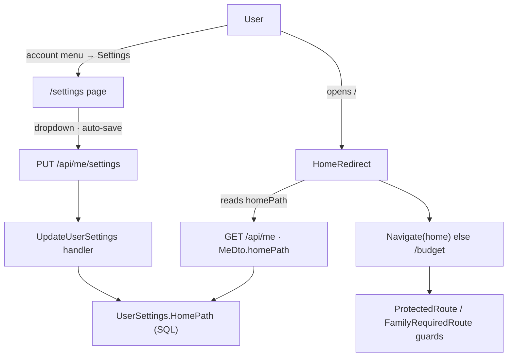
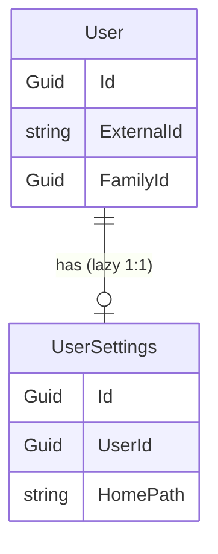
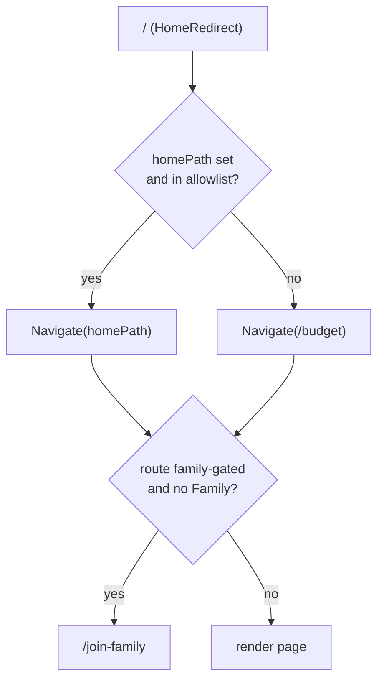

# Design spec — Set Home page (issue #39)

**Date:** 2026-07-17 · **Issue:** [#39](https://github.com/ThodsaphonSonthiphin/MenuNest/issues/39) "Add Set home path functionality"
**Decisions:** ADR-081 (scope), ADR-082 (server-side), ADR-083 (`UserSettings`), ADR-084 (resolution + selectable set), ADR-085 (UI)
**Glossary:** **Home page** (CONTEXT.md → App shell & navigation)
**Mock:** Claude Design project **"MenuNest design system"** (`8d8d4c81-41c1-4e0a-a0b7-370b39dfbe70`) → **Screens** card `set-home-page`

## What & why

Today the app's landing page is hardcoded: `/` → `<Navigate to="/budget">` (`frontend/src/router.tsx`). Issue #39 asks to let each User choose which existing page the app opens to — e.g. `/pomodoro` or `/trips`. This delivers a per-User **Home page** preference, persisted server-side so it follows the user across devices, set on a new account **`/settings`** page.



## Scope

**In:** a `UserSettings` table with a `HomePath` column; read via `GET /api/me`; write via a new `PUT /api/me/settings`; a `/settings` page with a family-aware, auto-saving Home-page dropdown reached from the account menu; a validated `/` redirect.

**Out (Phase 2):** migrating the existing localStorage prefs (pomodoro, health theme) into `UserSettings`; a backend route-allowlist; changing the `/budget` default; any second setting.

---

## Backend

### `UserSettings` entity (ADR-083)

A dedicated entity, **1:1 with `User`**, created **lazily** on first write.



- **`backend/src/MenuNest.Domain/Entities/UserSettings.cs`** — inherits `Entity` (`Id`, `CreatedAt`, `UpdatedAt`). Fields: `UserId` (Guid, FK → User), `HomePath` (`string?`, nullable). A factory `Create(userId)` and a mutator `SetHomePath(string?)` (trims; empty → null; stamps `UpdatedAt`).
- **`…/Infrastructure/Persistence/Configurations/UserSettingsConfiguration.cs`** — `ToTable("UserSettings")`, `HasKey(Id)` `ValueGeneratedNever`, **unique index on `UserId`** (enforces 1:1), FK to `Users` with `OnDelete(Cascade)`, `HomePath` `HasMaxLength(100)`. Auto-picked up by `ApplyConfigurationsFromAssembly`.
- **`DbSet<UserSettings> UserSettings`** added to `IApplicationDbContext` **and all three implementers** in the **same commit** (CLAUDE.md / ADR-083): `AppDbContext`, `SqliteAppDbContext`, `InMemoryAppDbContext` — else `CS0535` / EF model-validation failure breaks the whole suite in pre-commit.
- **Migration** `AddUserSettings` — creates the table (mirror `AddStopIsVisited` shape). **Applied to prod by hand** (temp SQL firewall rule → `dotnet ef database update` → remove rule) — the app/CD do not auto-migrate (CLAUDE.md).

### Read — extend `GET /api/me`

- `MeDto` gains **`HomePath` (`string?`)**. `GetMeHandler` loads the current user's `UserSettings` (via `IApplicationDbContext`, `FirstOrDefaultAsync` on `UserId`) and maps `HomePath` (null when no row yet).

### Write — `PUT /api/me/settings`

- New command **`UpdateUserSettingsCommand { string? HomePath }`** + handler under `…/Application/UseCases/Me/UpdateUserSettings/`.
- Handler: resolve current user (`IUserProvisioner.GetOrProvisionCurrentAsync`); **get-or-create** the `UserSettings` row (lazy); `SetHomePath(HomePath)`; `SaveChangesAsync`; return the updated settings (or the refreshed `MeDto`).
- `HomePath` is stored as-is within the 100-char bound (empty → null). Route validity is enforced **client-side** on read (ADR-084) — the backend does not keep a route allowlist (that would couple it to frontend routing). It is a per-user field; **not** family-gated.
- **`MeController`** gains a `PUT settings` action dispatching the command.

---

## Frontend

### The home-eligible allowlist — one pure source

`frontend/src/pages/settings/homeOptions.ts` (pure, unit-tested — the SPA has no component test harness, so all logic lives here):

- `HOME_OPTIONS: { path, label, requiresFamily }[]` — the top-level NavBar pages: `/health`, `/pomodoro`, `/trips` (`requiresFamily:false`); `/recipes`, `/stock`, `/meal-plan`, `/shopping`, `/budget`, `/ai-assistant` (`requiresFamily:true`).
- `homeOptions(hasFamily): HomeOption[]` — the **family-aware selectable set** (ADR-084): all when `hasFamily`, else only the non-gated three.
- `resolveHomePath(homePath): string` — the resolver (ADR-084): return `homePath` when it is a known `HOME_OPTIONS.path`, else `"/budget"`. (Family gating is left to the route guards, so this stays a pure lookup and is loop-proof.)

### `/` redirect → `HomeRedirect`

Replace `{ path: '/', element: <Navigate to="/budget" replace /> }` in `router.tsx` with `<HomeRedirect />`, which reads `homePath` + `familyId` from the `GET /api/me` RTK Query cache (already fetched under `ProtectedRoute`) and renders `<Navigate to={resolveHomePath(homePath, !!familyId)} replace />`. The existing `ProtectedRoute` / `FamilyRequiredRoute` guards then apply to whatever route it targets.



### `/settings` page (ADR-085)

- New route under `ProtectedRoute` + `AppLayout`, **not** `FamilyRequiredRoute`: `{ path: '/settings', element: <SettingsPage /> }`.
- `frontend/src/pages/settings/SettingsPage.tsx` — title "การตั้งค่า"; section "หน้าแรก (Home page)" / sub "หน้าที่จะเปิดขึ้นมาเมื่อเข้าแอป"; a Syncfusion `DropDownList` bound to `homeOptions(!!familyId)`, value = current `homePath ?? '/budget'`; **auto-save on change** → the settings mutation; inline "บันทึกแล้ว" confirmation. New icons via `@syncfusion/react-icons` (gear/home/check) — never emoji.
- `SettingsPage.css`, `index.ts` barrel.

### RTK Query

In the api slice where `GET /api/me` lives: ensure the `me` query exposes `homePath`; add a **`setUserSettings` mutation** (`PUT /api/me/settings`, body `{ homePath }`) that updates the `me` cache on success (optimistic or invalidate-and-refetch) so `HomeRedirect` and the dropdown stay consistent.

### NavBar entry (ADR-085)

Add a **"Settings"** entry (Syncfusion gear icon) to the account dropdown (`app-navbar__account-menu`) **and** the mobile drawer (`app-drawer__links`), beside *Manage ingredients / Manage family / Sign out*.

### Runtime

```mermaid
sequenceDiagram
  actor U as User
  participant SPA
  participant API
  participant DB
  U->>SPA: open "/"
  SPA->>API: GET /api/me
  API->>DB: read User + UserSettings
  DB-->>API: homePath, familyId
  API-->>SPA: MeDto
  SPA->>SPA: resolveHomePath(homePath, hasFamily)
  SPA-->>U: Navigate(home | /budget); guards apply
  U->>SPA: /settings → pick page
  SPA->>API: PUT /api/me/settings {homePath}
  API->>DB: get-or-create UserSettings; SetHomePath
  API-->>SPA: updated
  SPA-->>U: "บันทึกแล้ว"
```

---

## Testing

- **Backend (xUnit + Moq + FluentAssertions):** `UpdateUserSettingsHandler` test — get-or-create row, set/clear `HomePath` — with a mocked `IUserProvisioner`, run on `SqliteAppDbContext` (real EF config, unique `UserId` index exercised). `GetMeHandler` test — `HomePath` surfaces (and is null with no row). Add `DbSet<UserSettings>` to all three implementers in the same commit.
- **Frontend (vitest, node env):** `homeOptions.test.ts` — `homeOptions(true)` = 9 pages, `homeOptions(false)` = the 3 non-gated; `resolveHomePath` returns a valid stored path, falls back to `/budget` for null / unknown / a gated-but-not-in-list value. (Rendering/interaction verified interactively per CLAUDE.md — no component harness.)
- **Interactive smoke (before push, CLAUDE.md):** set home → reopen `/` lands there; family-less user sees only the 3 options and never dead-ends; invalid stored value falls back to `/budget`.

## Rollout

- One migration, **applied manually to prod** (firewall dance) after merge.
- Commits reference #39; entity + config + all 3 `DbSet`s land together (pre-commit runs the full suite).

## Self-review

No placeholders. Consistent with ADR-081–085 and the confirmed mock. Scope bounded (one setting; localStorage migration + backend allowlist deferred). The one spec-level choice not separately grilled — endpoint shape **`PUT /api/me/settings`** (extensible for future settings) over a field-specific `PUT /api/me/home-page` — is called out here for review.
