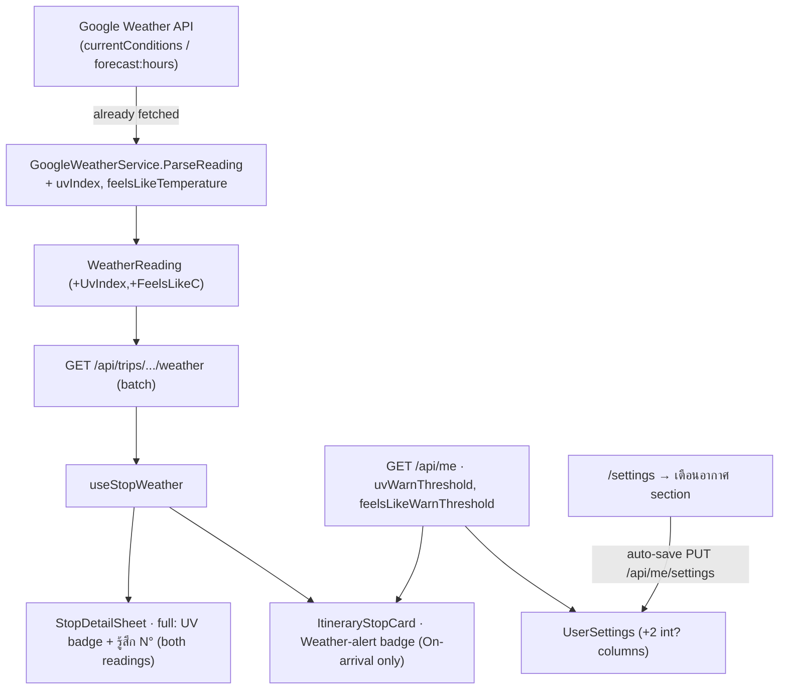
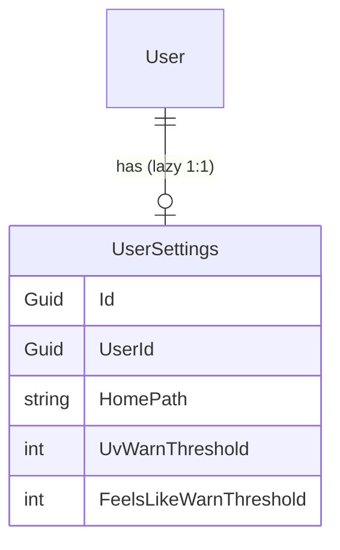
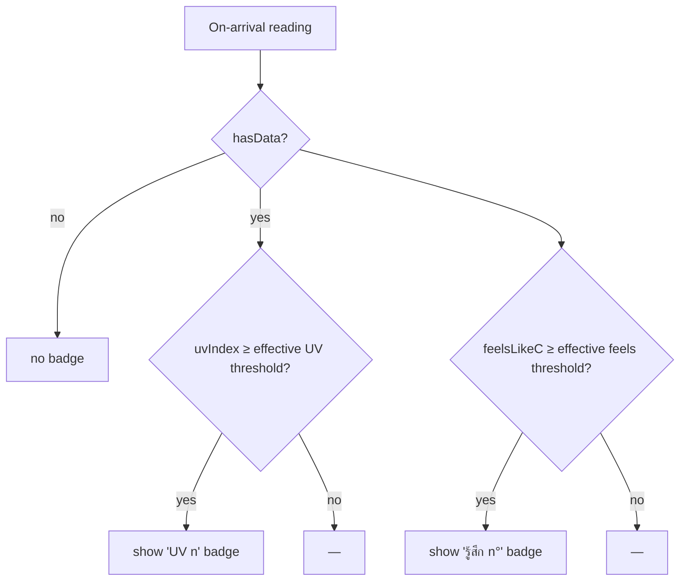

# Design spec — Show UV index + feels-like at the destination, with per-User weather alerts (issue #40)

**Date:** 2026-07-19 · **Issue:** [#40](https://github.com/ThodsaphonSonthiphin/MenuNest/issues/40) "แสดงค่า uv ที่เป้าหมายปลายทาง"
**Decisions:** ADR-086 (scope) · ADR-087 (surfaces) · ADR-088 (presentation) · ADR-089 (configurable) · ADR-090 (/settings page) · ADR-091 (storage & command) · ADR-092 (arrival-only alert) · ADR-093 (reuse existing calls)
**Glossary:** **UV index**, **UV band**, **Feels-like**, **Weather alert**, **Weather-alert threshold** (CONTEXT.md → Travel & trip planning)
**Mock:** Claude Design project **"MenuNest design system"** (`8d8d4c81-41c1-4e0a-a0b7-370b39dfbe70`) → **Screens** card `issue-40-uv-feels-like` — <https://claude.ai/design/8d8d4c81-41c1-4e0a-a0b7-370b39dfbe70>

## What & why

The owner wants to see, per itinerary **Stop**, the **UV index** and the **Feels-like** ("รู้สึกเหมือน") temperature at the destination — so that before taking their daughter out to exercise in the evening they can judge whether it will be too hot/sunny **when they arrive**. On top of the raw readings, the compact itinerary card shows an opt-in **Weather alert** badge when the on-arrival conditions cross the user's own thresholds.

The data is already in hand: the Google Weather responses MenuNest fetches per reading already carry `uvIndex` and `feelsLikeTemperature` — no new API call or cost (ADR-093).



## Scope

**In:**
- Backend: two fields on `WeatherReading` (UV index, feels-like °C), parsed from the existing responses; two `int?` columns on `UserSettings` + migration; `MeDto` + `UpdateUserSettingsCommand` extended.
- Frontend: UV badge + "รู้สึก N°" in the detail-sheet chips (both readings); a threshold-crossing **Weather alert** badge on the compact card (On-arrival only); a new **`/settings`** page shell + NavBar entry + a standalone **"เตือนอากาศ"** section with two auto-saving threshold dropdowns.

**Out (not in #40):**
- The **Home-page dropdown section** on `/settings` — that is #39's remaining frontend (ghosted in the mock). The `/` → `HomeRedirect` resolution + the `homeOptions` lib already exist (committed under #39) and are left untouched.
- Any weather alert on the **Now** reading (ADR-092); a combined "heat-risk" score (ADR-086); per-Trip/per-Family thresholds (ADR-089).

---

## Backend

### 1. `WeatherReading` gains UV + feels-like (ADR-086, ADR-093)

`backend/src/MenuNest.Application/Abstractions/IWeatherService.cs`:

```csharp
public sealed record WeatherReading(
    string StopId, bool HasData, string? ConditionType, string? IconBaseUri,
    double? TempC, int? RainPct, string? Description,
    int? UvIndex, double? FeelsLikeC);   // + issue #40
```

`backend/src/MenuNest.Infrastructure/Maps/GoogleWeatherService.cs` — `ParseReading` reads the two extra properties from the element it already parses; `NoData(...)` passes the two new nulls. `hasData` rule is unchanged (condition-or-temp present):

```csharp
int? uv = el.TryGetProperty("uvIndex", out var uvi) && uvi.ValueKind == JsonValueKind.Number ? uvi.GetInt32() : null;
double? feels = el.TryGetProperty("feelsLikeTemperature", out var fl) && fl.TryGetProperty("degrees", out var fd) ? fd.GetDouble() : null;
// ...
return new WeatherReading(stopId, hasData, type, icon, temp, rain, desc, uv, feels);
```

No new HTTP call, no field mask (the API returns the full document — a wrong mask 400s), cache/degrade paths unchanged (ADR-030, ADR-093). The batch weather endpoint's response DTO auto-carries the two fields.

### 2. `UserSettings` gains two threshold columns (ADR-089, ADR-091)

The `UserSettings` entity already exists (ADR-083); **no new `DbSet`** — only two columns + a mutator.



- `backend/src/MenuNest.Domain/Entities/UserSettings.cs` — add `UvWarnThreshold` (`int?`) and `FeelsLikeWarnThreshold` (`int?`) + a mutator `SetWeatherAlerts(int? uv, int? feels)` (stores as-is; stamps `UpdatedAt`). **Encoding:** `null` = built-in default (UV 6 / feels 40), `0` = off, positive = threshold (ADR-091).
- `…/Infrastructure/Persistence/Configurations/UserSettingsConfiguration.cs` — map the two `int?` columns (nullable; no extra index).
- **Migration** `AddWeatherAlertSettings` — adds the two nullable columns to `UserSettings`. **Applied to prod by hand** (temp SQL firewall rule → `dotnet ef database update` → remove rule) — the app/CD do not auto-migrate (CLAUDE.md). Preview with `migrations script --idempotent` first.

### 3. Read — `MeDto` + `GetMeHandler`

`MeDto` gains `int? UvWarnThreshold` and `int? FeelsLikeWarnThreshold`; `GetMeHandler` maps them from the loaded `UserSettings` (null when no row). These are the raw stored values — `null`/`0`/N — resolved to effective thresholds client-side.

### 4. Write — extend `UpdateUserSettingsCommand` (full-replace, ADR-091)

- `UpdateUserSettingsCommand(string? HomePath, int? UvWarnThreshold, int? FeelsLikeWarnThreshold)` — the existing positional record gains two params. **Scan all construction sites** before finalizing: the only caller is `MeController.UpdateSettings` (model-bound from the PUT body) + the handler test; a positional-record change ripples to any test that constructs it (per the "scan all callers" rule).
- `UpdateUserSettingsHandler` — after get-or-create, call both `SetHomePath(command.HomePath)` **and** `SetWeatherAlerts(command.UvWarnThreshold, command.FeelsLikeWarnThreshold)`; `SaveChangesAsync`. It is a **full-replace** of the snapshot — the caller sends every field.
- `UpdateUserSettingsValidator` — add light bounds (e.g. `UvWarnThreshold` in 0..15, `FeelsLikeWarnThreshold` in 0..60 when present) so a garbage value can't be stored; keep it lenient.
- `UserSettingsDto` — gains the two fields so the mutation response is complete (though the mutation also invalidates `Me`).
- `MeController` `PUT settings` is unchanged (still binds the command).

```mermaid
sequenceDiagram
  actor U as User
  participant SPA
  participant API
  participant DB
  U->>SPA: /settings → pick UV / feels-like threshold
  SPA->>API: PUT /api/me/settings {homePath, uvWarnThreshold, feelsLikeWarnThreshold}
  API->>DB: get-or-create UserSettings; SetHomePath + SetWeatherAlerts
  API-->>SPA: updated (invalidates Me)
  SPA->>API: GET /api/me (refetch)
  SPA-->>U: "บันทึกแล้ว"; itinerary badges re-evaluate
```

---

## Frontend

### 5. Types (`shared/api/api.ts`)

Hand-written slice (not codegen). Extend three shapes:

```ts
export interface WeatherReadingDto { /* …existing… */ uvIndex: number | null; feelsLikeC: number | null }
export interface MeDto { /* …existing… */ uvWarnThreshold: number | null; feelsLikeWarnThreshold: number | null }
// updateUserSettings mutation body + response become the full snapshot:
updateUserSettings: build.mutation<
  { homePath: string | null; uvWarnThreshold: number | null; feelsLikeWarnThreshold: number | null },
  { homePath: string | null; uvWarnThreshold: number | null; feelsLikeWarnThreshold: number | null }
>({ /* url/method/PUT, invalidatesTags: ['Me'] — unchanged */ })
```

`hooks/useStopWeather.ts` — the local `noData(stopId)` factory adds `uvIndex: null, feelsLikeC: null` (else the `WeatherReadingDto` literal fails `tsc`).

### 6. Pure logic in `lib/weather.ts` (unit-tested — no component harness, CLAUDE.md)

```ts
// WHO bands + defaults (canonical words live in CONTEXT.md)
export const UV_WARN_DEFAULT = 6
export const FEELS_WARN_DEFAULT = 40
export type UvBandKey = 'low' | 'mod' | 'high' | 'vhigh' | 'ext'
export function uvBand(uv: number): { key: UvBandKey; word: string }  // 0–2 ต่ำ … 11+ อันตราย

// Resolve stored tri-state (null=default, 0=off, N=value) to an effective threshold, or null=off.
export function effectiveThreshold(stored: number | null | undefined, dflt: number): number | null
  // null/undefined → dflt ; 0 → null (off) ; N>0 → N

// The compact-card alert (On-arrival only, ADR-092): returns which badges to show.
export function weatherAlertBadges(
  arrival: WeatherReadingDto | undefined,
  uvStored: number | null, feelsStored: number | null,
): { uv?: number; feels?: number }
  // no arrival / !hasData → {} ; uv badge iff arrival.uvIndex >= effectiveThreshold(uvStored,6)
  //                              feels badge iff round(arrival.feelsLikeC) >= effectiveThreshold(feelsStored,40)
```

The dropdown option presets (UV: ≥3/≥6/≥8/off → 3/6/8/0 ; feels: ≥38/≥40/≥42/off → 38/40/42/0) are a small const list in the settings module.

### 7. Detail sheet — full values (ADR-087, ADR-088)

`components/WeatherChip.tsx` — after temp, render feels-like and the UV badge when present:

```tsx
{r.feelsLikeC != null && <span className="feels">รู้สึก {Math.round(r.feelsLikeC)}°</span>}
{r.uvIndex != null && (() => { const b = uvBand(r.uvIndex);
  return <span className={`uv ${b.key}`}><SunIcon/>UV {r.uvIndex} {b.word}</span> })()}
```

`StopDetailSheet.tsx` needs no structural change — it already renders both `WeatherChip`s (`nowReading`, `arrivalReading`). `trips-tokens.css` gains the five UV band colour tokens + `.chip.wx .uv.*` / `.feels` styles; icons are inline SVG / `@syncfusion/react-icons`, never emoji.

### 8. Compact card — the Weather-alert badge (ADR-087, ADR-092)



- `lib/stopSummary.ts` — `buildStopSummary` gains a `thresholds: { uv: number|null; feels: number|null }` input and returns `alerts: { uv?: number; feels?: number }` via `weatherAlertBadges(arrivalReading, …)`. (Pure — unit-tested.)
- `components/ItineraryStopCard.tsx` — `StopSummaryLine` renders the alert badges (a sun pill for UV, a thermo pill for feels) **before** the existing weather/dwell/flag; the card takes the thresholds as props. No raw numbers otherwise.
- Data flow: the itinerary page reads `useGetMeQuery()` → `uvWarnThreshold`, `feelsLikeWarnThreshold` and threads them to each `ItineraryStopCard`.

### 9. `/settings` page + section (ADR-090)

- `router.tsx` — add `{ path: '/settings', element: <SettingsPage /> }` under `ProtectedRoute` + `AppLayout`, **not** `FamilyRequiredRoute` (a family-less user must be able to open it). **Do not** touch the existing `/` → `HomeRedirect` route.
- `pages/settings/SettingsPage.tsx` (+ `SettingsPage.css`, `index.ts`) — title "การตั้งค่า"; a standalone section **"เตือนอากาศ"** (sub "เตือนบนการ์ดเมื่อจุดหมายแดด/ร้อนเกินที่ตั้งไว้") with two Syncfusion `DropDownList`s (UV threshold, feels-like threshold) bound to the preset lists; values from `getMe` (resolve `null`→default-preset, `0`→"off"). **Auto-save on change** → `updateUserSettings` sending the **full snapshot** `{ homePath, uvWarnThreshold, feelsLikeWarnThreshold }` (homePath read back from the `getMe` cache so it is preserved); inline "บันทึกแล้ว". The Home-page section is **not** built (ghost in the mock; #39 frontend).
- `NavBar` — add a **"Settings"** entry (Syncfusion gear icon) to the desktop account dropdown **and** the mobile drawer, beside Manage ingredients / Manage family / Sign out (per ADR-085).

---

## Testing

- **Backend (xUnit + Moq + FluentAssertions):**
  - `UpdateUserSettingsHandler` — set/clear UV + feels thresholds (0=off, null, value) alongside HomePath; get-or-create; on `SqliteAppDbContext` (real EF config).
  - `GetMeHandler` — the two thresholds surface (and are null with no row).
  - `UserSettings` entity — `SetWeatherAlerts` stores/stamps; `Create` leaves them null.
  - `GoogleWeatherService` (if a parse test exists / add one) — a bucket with `uvIndex`+`feelsLikeTemperature` populates the fields; a bucket without leaves them null with `hasData` unchanged.
  - No new `DbSet` (entity exists) — but the two new members still must compile against all three `IApplicationDbContext` implementers via the shared entity (no `CS0535` expected).
- **Frontend (vitest, node env):** `weather.test.ts` — `uvBand` boundaries (2/3, 5/6, 7/8, 10/11); `effectiveThreshold` (null→default, 0→off, N→N); `weatherAlertBadges` (no arrival / No-data → {}, UV-only, feels-only, both, and neither below threshold). `stopSummary.test.ts` — alerts wired through.
- **Interactive smoke (before push, CLAUDE.md — the SPA has no render/visual harness):** detail sheet shows the UV badge (colour + Thai word) and "รู้สึก N°" on **both** readings; a hot midday-arrival stop shows the card badge, an evening-arrival stop does not (the mock's own UV 9 → UV 2 example); `/settings` dropdowns auto-save, persist across reload, and "off" removes the badge; a family-less user can open `/settings`.

## Rollout

- **One migration**, applied **manually to prod** (firewall dance) after merge (CLAUDE.md).
- Commits reference **#40**; the entity + config + migration land together; each commit leaves the whole suite green (pre-commit runs everything). Stage narrowly (never `git add -A`).

## Self-review

No placeholders; consistent with ADR-086–093, CONTEXT.md, and the confirmed mock. Scope bounded — Home-page section + `/` redirect stay deferred (#39). No emoji (Syncfusion icons / inline SVG); UV band words match CONTEXT.md; the card alert is On-arrival-only.

**One shape flagged for review** (mirrors ADR-085's endpoint call-out — not separately grilled): the **full-replace** `UpdateUserSettingsCommand` extension + the **`0 = off` / `null = default`** tri-state encoding (ADR-091). Alternative was a per-section endpoint + an `enabled` bool per setting. Confirm this is acceptable before implementation.