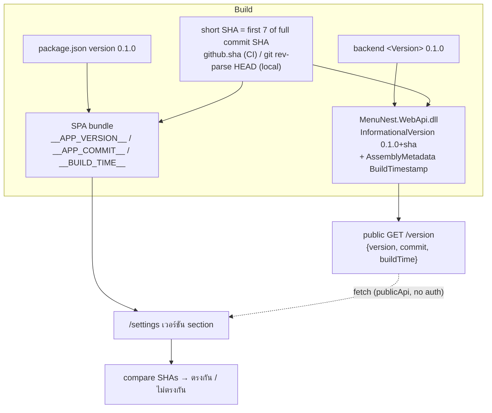
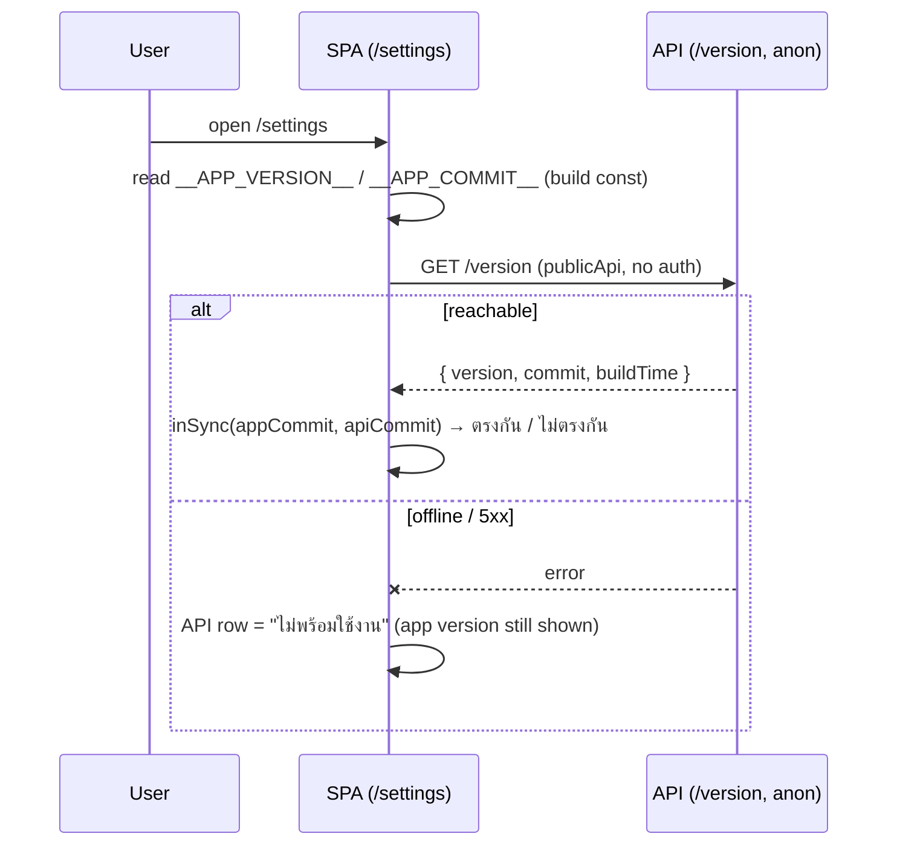

# Design spec — App & API version, auto-derived from git (issue #41)

**Date:** 2026-07-20 · **Relates to:** issue #41 ("add version to api and front end, try to use auto version with git")
**Decisions:** ADR-107 (SemVer base + short SHA) · ADR-108 (public minimal-API `GET /version`) · ADR-109 (embedded at build from git, auto everywhere + buildTime) · ADR-110 (SPA shows app + API on `/settings`, match badge, silent-fail) · ADR-111 (shared semver base, lockstep)
**Glossary:** **App version** (CONTEXT.md → Build & release)
**Mock:** MenuNest design system → Screens → **issue-41-version** (`screens/issue-41-version.html`)

> **Scrutiny fixes folded in (2026-07-21):** backend test home pinned to the existing `MenuNest.WebApi.UnitTests`; the MSBuild SHA mechanism flagged as spike-first; one canonical short-SHA rule across CI + local + both stacks; PR-preview SHA caveat noted; buildTime display semantics clarified.

## What & why

Both the API and the SPA should report which build is deployed, "auto version with git". The repo has **no tags** and deploys on every push to `main`, so the version is a **SemVer-2.0** string `MAJOR.MINOR.PATCH+<shortSHA>` (e.g. `0.1.0+a1b2c3d`): the base is hand-maintained in one file per side, the short SHA is auto-injected from git and carries the real "which commit is live" identity. It is **embedded into each artifact at build** (never runtime config), so what's deployed can't disagree with what's reported. The SPA shows its own build and the API's side by side on `/settings`, so matching SHAs prove front+back shipped together.



## Scope

**In:**
- **Backend:** `<Version>` + a git-SHA MSBuild target + a `BuildTimestamp` assembly-metadata item in `MenuNest.WebApi.csproj`; a public `GET /version` minimal-API endpoint in `Program.cs`; a pure parse helper (unit-tested in `MenuNest.WebApi.UnitTests`).
- **Frontend:** compute + inject version constants in `vite.config.ts`; declare them in `vite-env.d.ts`; a `getVersion` query on the existing `publicApi`; a pure `versionCompare` lib (unit-tested); a **เวอร์ชัน** section on `SettingsPage.tsx` + styles.
- **CI:** pass the short SHA to the backend build in `main_menunest.yml`. (Frontend pipeline needs **no** change — `GITHUB_SHA` is auto-provided.)
- Set both bases to `0.1.0`.

**Out:**
- Git tags / `git describe` / `fetch-depth: 0` (ADR-107) — deliberately avoided.
- Any DB / migration / domain layer / Mediator handler (the endpoint reads assembly metadata; no use case).
- A persistent app footer (ADR-110 — settings only).
- Push/notification of version, auto-refresh polling of `/version`, build-time enforcement that the two bases match (ADR-111 — convention only).
- Rendering the API's `buildTime` in the settings UI (kept in the payload for the curl/ops path only — see Display).
- `ci.yml` and the pre-commit hook: **unchanged** — the local-git MSBuild target fills the SHA there automatically; only the *deployed* artifact needs the explicit CI value.

## Version format (ADR-107)

`MAJOR.MINOR.PATCH+<shortSHA>` — a valid SemVer 2.0 value. Base starts `0.1.0` (change freely).

**Canonical short SHA = the first 7 characters of the full 40-char commit SHA**, computed the same way everywhere (CI: `github.sha` / `GITHUB_SHA` truncated to 7; local: `git rev-parse HEAD` truncated to 7). Deliberately **not** `git rev-parse --short`, which can return 8+ chars to disambiguate and would make the SPA↔API string compare length-mismatch. Local/git-less build degrades to `…+local`.

## Backend

### Build injection — `MenuNest.WebApi.csproj` (ADR-109)

```xml
<PropertyGroup>
  <Version>0.1.0</Version>
</PropertyGroup>

<!-- Local/dev builds: fill SourceRevisionId from git when CI didn't pass it.
     Take the FULL sha then truncate to 7 (matches the CI/frontend rule).
     The SDK then appends +$(SourceRevisionId) to InformationalVersion. -->
<Target Name="SetGitShaFromLocalRepo"
        BeforeTargets="AddSourceRevisionToInformationalVersion;GetAssemblyVersion"
        Condition="'$(SourceRevisionId)' == ''">
  <Exec Command="git rev-parse HEAD"
        ConsoleToMSBuild="true" ContinueOnError="true" StandardOutputImportance="low">
    <Output TaskParameter="ConsoleOutput" PropertyName="_FullSha" />
  </Exec>
  <PropertyGroup Condition="'$(_FullSha)' != ''">
    <SourceRevisionId>$(_FullSha.Substring(0, 7))</SourceRevisionId>
  </PropertyGroup>
</Target>

<!-- Build timestamp (UTC) baked as assembly metadata; MSBuild computes it. -->
<PropertyGroup Condition="'$(BuildTimestamp)' == ''">
  <BuildTimestamp>$([System.DateTime]::UtcNow.ToString("yyyy-MM-ddTHH:mm:ssZ"))</BuildTimestamp>
</PropertyGroup>
<ItemGroup>
  <AssemblyMetadata Include="BuildTimestamp" Value="$(BuildTimestamp)" />
</ItemGroup>
```

The .NET SDK's `IncludeSourceRevisionInInformationalVersion` (default on) appends `+$(SourceRevisionId)` → `AssemblyInformationalVersionAttribute` = `0.1.0+a1b2c3d`.

> **⚠ SPIKE THIS FIRST (highest implementation risk).** The `SourceRevisionId → InformationalVersion` append and the exact `BeforeTargets` target name/order are SDK-version-sensitive and unverified against the .NET 10 SDK. Before building the rest: run `dotnet build -p:SourceRevisionId=deadbee` and confirm the compiled DLL's `AssemblyInformationalVersionAttribute` is `0.1.0+deadbee`, and run one local build with the property unset to confirm the target fills it from git (and that a git-less build degrades cleanly). **Fallback if fiddly:** a `<Target>` that writes a generated `BuildInfo.cs` const — deterministic and target-order-independent. Do not proceed with the app work until this is proven.

### Endpoint — `Program.cs` (ADR-108)

Add after `app.MapControllers();`, before `app.Run();`. A pure helper holds the parsing so it can be unit-tested:

```csharp
// pure, unit-testable (lives in MenuNest.WebApi)
public static class BuildVersion
{
    public static (string version, string commit, string? buildTime) Read(Assembly? asm)
    {
        var info = asm?.GetCustomAttribute<AssemblyInformationalVersionAttribute>()?.InformationalVersion ?? "0.0.0";
        var buildTime = asm?.GetCustomAttributes<AssemblyMetadataAttribute>()
                           .FirstOrDefault(a => a.Key == "BuildTimestamp")?.Value;
        var commit = info.Contains('+') ? info[(info.IndexOf('+') + 1)..] : "local";
        return (info, commit, buildTime);
    }
}

// endpoint
app.MapGet("/version", () =>
{
    var (version, commit, buildTime) = BuildVersion.Read(Assembly.GetEntryAssembly());
    return Results.Ok(new { version, commit, buildTime });
}).AllowAnonymous();
```

`.AllowAnonymous()` opts the endpoint out of the default `FallbackPolicy` (RequireAuthenticatedUser). The global `app.UseCors(CorsPolicyName)` middleware already serves the SPA cross-origin for every controller today, so `/version` inherits the same working CORS (smoke-confirm only). Default STJ camelCase → `{ "version", "commit", "buildTime" }`.

## Frontend

### Build injection — `vite.config.ts` + `vite-env.d.ts` (ADR-109)

```ts
import { readFileSync } from 'node:fs'
import { execSync } from 'node:child_process'

const pkg = JSON.parse(readFileSync(new URL('./package.json', import.meta.url), 'utf-8'))
function shortSha(): string {
  let full = process.env.GITHUB_SHA ?? ''
  if (!full) { try { full = execSync('git rev-parse HEAD').toString().trim() } catch { /* git-less */ } }
  return full ? full.slice(0, 7) : 'local'   // same rule as CI + backend: first 7 of full sha
}
const sha = shortSha()
// inside defineConfig:
//   define: {
//     __APP_VERSION__: JSON.stringify(`${pkg.version}+${sha}`),
//     __APP_COMMIT__: JSON.stringify(sha),
//     __BUILD_TIME__: JSON.stringify(new Date().toISOString()),
//   }
```

`vite-env.d.ts`: `declare const __APP_VERSION__: string` (and `__APP_COMMIT__`, `__BUILD_TIME__`).

### API fetch — `publicApi` in `shared/api/api.ts` (ADR-108/110)

Add to the existing **`publicApi`** (plain `fetchBaseQuery`, no auth header, no 401 reauth — exactly right for a public endpoint; already registered in the store's reducers + middleware). Its factory param is `build`:

```ts
getVersion: build.query<{ version: string; commit: string; buildTime: string | null }, void>({
  query: () => '/version',
}),
```

Export `useGetVersionQuery` from `publicApi`'s generated hooks. Base is `VITE_API_BASE_URL || '/'` → `${base}/version` (the doctor-report endpoint's `/api/...` prefix is the deliberate difference — `/version` is at root).

### Pure compare — `shared/version/versionCompare.ts` (vitest-safe, no injected globals)

```ts
export function commitOf(version: string): string {
  const i = version.indexOf('+'); return i >= 0 ? version.slice(i + 1) : version
}
export function inSync(appCommit: string, apiCommit: string | undefined | null): boolean {
  return !!apiCommit && appCommit.length > 0 && appCommit === apiCommit
}
```

The injected globals are read only in the component (or a thin `buildInfo.ts` re-export) — kept out of this lib so the unit test never depends on Vite `define`.

### Display — `SettingsPage.tsx` + `SettingsPage.css` (ADR-110)

A new `.settings-row` **เวอร์ชัน** section at the bottom (icon + title "เวอร์ชัน" + sub "รุ่นที่กำลังใช้งานของแอปและ API"), right side a stacked block:

- **แอป** row → `__APP_VERSION__` (instant).
- **API** row → `useGetVersionQuery()`:
  - loading → skeleton;
  - success → `data.version`, plus badge: `inSync(__APP_COMMIT__, data.commit)` ? green **ตรงกัน** : amber **ไม่ตรงกัน**;
  - error/`isError` → muted **ไม่พร้อมใช้งาน** (silent-fail — no popup, matching the page's existing behaviour).
- **อัปเดตล่าสุด** line → the **SPA's own** build time (`__BUILD_TIME__`), i.e. when this app bundle was built. Format with the existing `new Date(__BUILD_TIME__).toLocaleDateString('th-TH', {…})` pattern already used in dashboard/family/meal-plan (native `Intl` — the Syncfusion-no-Thai-CLDR gap does not apply). The API's `buildTime` stays in the payload for the curl/ops path but is **not** rendered here (avoids implying it's a whole-system timestamp).

Icons inline-SVG (no emoji). States pinned in the mock (loaded/in-sync, loading, mismatch, offline).



## CI/CD

- **`main_menunest.yml` (backend deploy) — one edit:** pass the short SHA (first 7 of `github.sha`) to the **Build** step (publish uses `--no-build`, so the attribute is already compiled in):
  ```yaml
  - name: Build
    run: dotnet build backend/MenuNest.sln --configuration Release --no-restore -p:SourceRevisionId=${GITHUB_SHA::7}
  ```
  This workflow triggers only on `push`/`workflow_dispatch`, so `GITHUB_SHA` is the real pushed commit.
- **`azure-static-web-apps-green-rock-098e70e00.yml` (frontend) — no edit:** `GITHUB_SHA` is auto-provided to the `npm run build` step; `vite.config.ts` reads it. **Caveat:** this workflow also triggers on `pull_request`, where `GITHUB_SHA` is the ephemeral merge-commit ref — so **preview** builds display a synthetic SHA that won't match the API. Accepted (previews only); the `main` push path is correct.
- **`ci.yml` / pre-commit — no edit:** the local-git MSBuild target / `git rev-parse` fallback fills the SHA there; those builds don't deploy.

## Shared base (ADR-111)

Both `frontend/package.json` `"version"` (today `0.0.0`) and backend `<Version>` → `0.1.0`, bumped together in the same commit when cutting a release. No build-time enforcement; the SHA already proves same-commit.

## Testing

- **Backend:** unit-test `BuildVersion.Read` in the **existing `MenuNest.WebApi.UnitTests`** project (it already references `MenuNest.WebApi` — e.g. `OAuthJwtTests`; xUnit + Moq + FluentAssertions per CLAUDE.md). Cases: `0.1.0+a1b2c3d` → `(…, "a1b2c3d", …)`; no `+` → commit `"local"`; null asm → `"0.0.0"`; `BuildTimestamp` metadata surfaced. Adding a static class + minimal-API endpoint touches no `DbContext`, so the three-implementer CS0535 rule is not in play. The pre-commit full suite must stay green.
- **Frontend (vitest, node env):** `versionCompare.test.ts` — `commitOf` splits on `+` and passes through a bare sha; `inSync` true on equal commits, false on differing / undefined / empty.
- **Interactive smoke (before push — SPA has no render gate, CLAUDE.md):** `/settings` shows app + API versions; on prod both SHAs match after a full deploy (green **ตรงกัน**); killing/blocking `/version` shows **ไม่พร้อมใช้งาน** without breaking the page; local `npm run dev` shows `0.1.0+<HEAD sha>` and `dotnet run` `/version` returns the same shape. Verify `curl https://<api>/version` returns 200 anonymously and the response carries CORS headers for the SPA origin.

## Rollout

- Deploys on push to `main`: the frontend (Static Web App) and backend (App Service) build from the same commit, so their SHAs match once both pipelines finish (a brief **ไม่ตรงกัน** window while one is mid-deploy is expected). **No migration, no manual DB step.**
- Commit references issue #41 per CLAUDE.md; stage narrowly (never `git add -A`; keep `daily-state.md` / `AGENTS.md` / `.claude/settings.json` out).

## Self-review

No placeholders. `publicApi` confirmed present (no-auth `fetchBaseQuery`, factory param `build`, line ~1519) and registered in the store (reducer + middleware) — correct host for `/version`; the main `api` (auth + 401 reauth) is deliberately not used. No `Directory.Build.props`, so `<Version>` sits in `MenuNest.WebApi.csproj`; `Assembly.GetEntryAssembly()` is that assembly. Backend test home is the existing `MenuNest.WebApi.UnitTests` (verified to reference WebApi) — no new project. Shallow-clone trap avoided — SHA from `github.sha` / `GITHUB_SHA` (present without `fetch-depth: 0`) with a local `git rev-parse HEAD` fallback, both truncated to a **single canonical 7-char rule** so the SPA↔API compare is apples-to-apples. `.AllowAnonymous()` overrides the fallback auth policy; global `UseCors` already serves the SPA cross-origin (inherited, smoke-confirm). Pure logic extracted both sides (`BuildVersion.Read`, `versionCompare`) for real unit coverage per CLAUDE.md; injected globals kept out of the tested lib. Frontend pipeline untouched by design (PR-preview merge-SHA caveat documented). The MSBuild `SourceRevisionId` mechanism is flagged spike-first as the top risk. Consistent with ADR-107…111, the confirmed mock, and the CONTEXT.md **App version** term.
