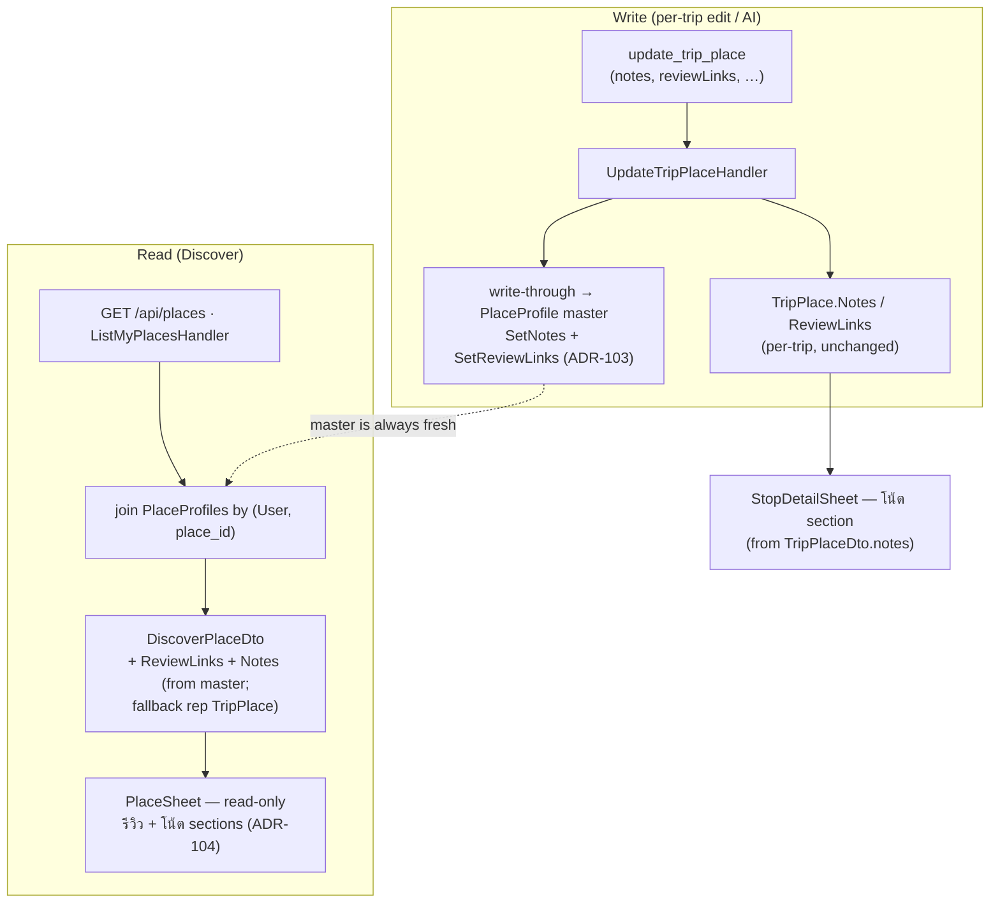
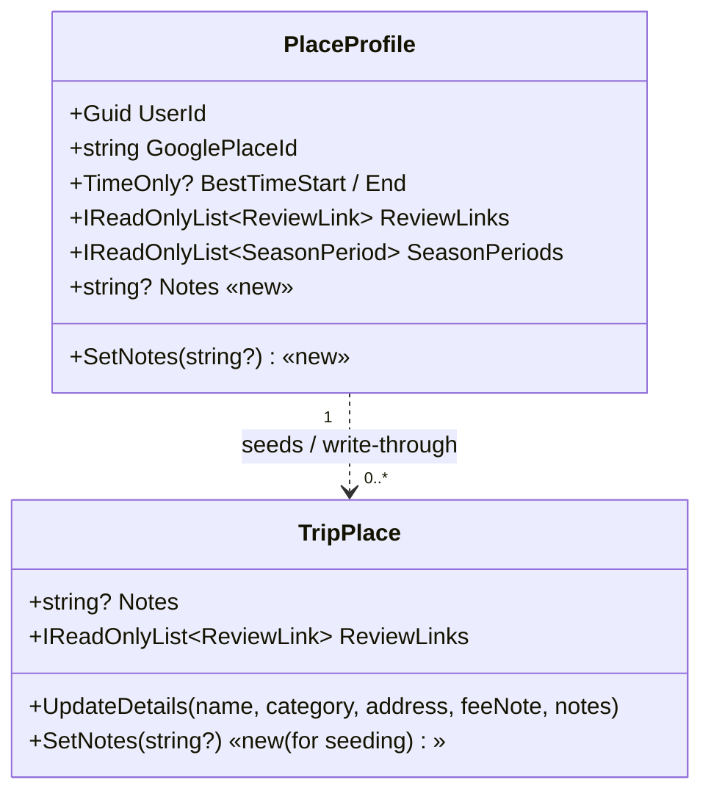
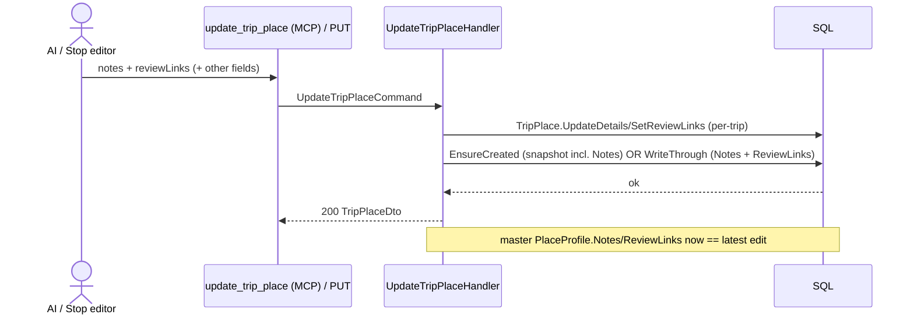

# Design — Discover ("ไปไหนดี") shows Review links (TikTok) + a Place note

**Date:** 2026-07-20
**Status:** Draft for approval
**Issue:** [#44](https://github.com/ThodsaphonSonthiphin/MenuNest/issues/44) — ไปไหนดี ต้องมี tiktok or relate link แสดง (+ โชว์ note ด้วย).
**ADRs:** [101](../../adr/101-place-note-is-master-attribute.md) (note = free-text Notes, elevated to a `PlaceProfile` master attribute) ·
[102](../../adr/102-discover-surfaces-reviewlinks-and-notes-from-master.md) (Discover sources reviewLinks + notes from master, fallback rep) ·
[103](../../adr/103-notes-and-reviewlinks-write-through-to-master.md) (write-through to master on every `update_trip_place`) ·
[104](../../adr/104-discover-and-stop-detail-display-of-reviews-and-note.md) (read-only sections on Discover `PlaceSheet` + note on trip `StopDetailSheet`)
**Confirmed mock:** MenuNest design system → Screens → `issue-44-discover-review-note` (claude.ai/design, project `8d8d4c81`).
**Glossary:** **Place note** added, **Review link** / **Place profile** / **Discover** updated in [`CONTEXT.md`](../../../CONTEXT.md).



The whole change: `Notes` becomes a field on the **master `PlaceProfile`**; `update_trip_place`
**write-throughs** `Notes` + `ReviewLinks` to that master on every save (so the master is never
stale); the Discover read (`GET /api/places`) joins the master and surfaces both on a widened
`DiscoverPlaceDto`; the Discover `PlaceSheet` renders read-only **รีวิว** + **โน้ต** sections
(reusing the shipped review components), and the trip `StopDetailSheet` gains a **โน้ต** section.

---

## 1. Goal & non-goals

**Goal.** On the Discover detail sheet (`PlaceSheet`), show — read-only — a place's **Review links**
(TikTok/relate links, opening in a new browser tab) and its **Place note** (free text), sourced from
the User's **master `PlaceProfile`** so they are one value per place across trips and always fresh.

**Non-goals / design rules (explicit — ADRs 101–104):**
- **No manual web input for the note.** The note is set via AI/MCP `update_trip_place` only; a
  place-editor textarea for notes is **deferred** (§10). The write path already exists — this issue is
  about *display* + making the note a master attribute.
- **Read-only on Discover.** Discover is a browse surface; editing stays in the trip / via AI (ADR-104).
- **No new endpoint.** Reuses `GET /api/places` (widen the DTO) and `update_trip_place` (unchanged
  signature; behaviour extended with write-through).
- **Scoped write-through.** Only `Notes` + `ReviewLinks` write-through to the master. Best-time, season
  periods, and the checklist item-set stay **push-only** (ADR-103) — unchanged.
- **No new Google calls / no computed value.** Both are reference/display data; they never feed the
  Smart Schedule, Timing flags, weather, or any signal.

---

## 2. Domain model

`Notes` is added to the master; `TripPlace` gains a granular `SetNotes` (for seed-on-capture).



**`PlaceProfile`** (`backend/src/MenuNest.Domain/Entities/PlaceProfile.cs`):

```csharp
public string? Notes { get; private set; }

public void SetNotes(string? notes)
{
    var n = notes?.Trim();
    if (n is { Length: > 2000 }) throw new DomainException("Place note is too long (max 2000).");
    Notes = string.IsNullOrEmpty(n) ? null : n;
    UpdatedAt = DateTime.UtcNow;
}
```

**`TripPlace`** (`TripPlace.cs`) gains a granular setter so `SeedIntoAsync` can copy the master note
into a freshly-captured place without going through `UpdateDetails` (which needs name/category):

```csharp
public void SetNotes(string? notes)
{
    var n = notes?.Trim();
    if (n is { Length: > 2000 }) throw new DomainException("Place note is too long (max 2000).");
    Notes = string.IsNullOrEmpty(n) ? null : n;
    UpdatedAt = DateTime.UtcNow;
}
```

(`UpdateDetails(..., notes)` stays as-is — it already trims `Notes`; adding the 2000-char guard there
too is optional and low-risk, but keep the cap consistent between the two setters.)

---

## 3. Persistence & migration

- **Column.** `PlaceProfiles.Notes` — `nvarchar(2000)`, **nullable** (a plain scalar string — NOT a JSON
  value-converter like `ReviewLinksJson`/`SeasonPeriodsJson`).
- **Mapping** (`PlaceProfileConfiguration.cs`, builder param `b`):
  ```csharp
  b.Property(p => p.Notes).HasColumnName("Notes").HasMaxLength(2000);
  ```
  A private-set property maps directly; no backing field / converter needed. Works identically on SQL
  Server and the `SqliteAppDbContext` relational double (plain string, so the nvarchar(max)-stripping
  concern from the EF relational-testing note does not apply).
- **Migration.** New EF Core migration `AddPlaceProfileNotes` — a single
  `AddColumn<string>(name: "Notes", table: "PlaceProfiles", type: "nvarchar(2000)", nullable: true)`.
- **⚠ Manual apply (CLAUDE.md).** Neither the app nor CD runs `Database.Migrate()`. After merge the
  migration **must be applied to prod by hand** or the API throws invalid-column (HTTP 500 → SPA "An
  unexpected error occurred."). Preview with `dotnet ef migrations script --idempotent`, apply with the
  `AZURE_TOKEN_CREDENTIALS=AzureCliCredential dotnet ef database update …` command in CLAUDE.md. This is
  a rollout step (§9), not optional.

---

## 4. Backend — write-through + read

### 4.1 Write-through (`PlaceProfileSync` + `UpdateTripPlaceHandler`)

Today `UpdateTripPlaceHandler` sets the `TripPlace` fields then calls
`PlaceProfileSync.EnsureCreatedAsync` (first-enrichment full snapshot only). Change:

```csharp
// UpdateTripPlaceHandler.Handle, replacing the lone EnsureCreatedAsync call:
var created = await PlaceProfileSync.EnsureCreatedAsync(_db, user.Id, place, ct); // now also snapshots Notes
if (!created)
    await PlaceProfileSync.WriteThroughNotesAndLinksAsync(_db, user.Id, place, ct); // master existed → sync the two fields
```

- **`UpsertFromAsync`** (used by `EnsureCreatedAsync` and `push_place_profile`): add
  `profile.SetNotes(place.Notes);` alongside the existing `SetBestTime` / `SetReviewLinks` /
  `SetSeasonPeriods`. So first-enrichment auto-create **and** an explicit push now carry the note.
- **New `WriteThroughNotesAndLinksAsync(db, userId, place, ct)`:**
  ```csharp
  if (string.IsNullOrEmpty(place.GooglePlaceId)) return;              // no master possible → no-op
  var profile = await db.PlaceProfiles.FirstOrDefaultAsync(
      p => p.UserId == userId && p.GooglePlaceId == place.GooglePlaceId, ct);
  if (profile is null) return;                                        // created==false already implies it exists; guard anyway
  profile.SetNotes(place.Notes);
  profile.SetReviewLinks(place.ReviewLinks);
  ```
  (No `SaveChanges` — the handler owns the unit of work, same convention as the rest of `PlaceProfileSync`.)
- **`SeedIntoAsync`** (capture): add `place.SetNotes(profile.Notes);` so a newly-captured place's trip
  card shows the master note without re-entry.

The write path:



**MCP tool.** `update_trip_place`'s **signature is unchanged** (it already has `notes` + `reviewLinks`).
Update its `[Description]` to say that `notes` and `reviewLinks` now propagate to the user's master and
show on Discover immediately (no `push_place_profile` needed for these two).

### 4.2 Read — widen `DiscoverPlaceDto` + join the master (`ListMyPlacesHandler`)

`DiscoverPlaceDto` (`Places/PlaceDtos.cs`) — append two trailing fields (positional record):

```csharp
public sealed record DiscoverPlaceDto(
    string Key, string? GooglePlaceId, string Name, double Lat, double Lng, string? Address,
    PlaceCategory Category, int? PriceLevel, string? PhotoUrl, string? OpeningHoursJson,
    TimeOnly? BestTimeStart, TimeOnly? BestTimeEnd, IReadOnlyList<SeasonPeriodDto> SeasonPeriods,
    bool Visited, IReadOnlyList<PlaceTripRefDto> Trips,
    IReadOnlyList<ReviewLinkDto> ReviewLinks,   // new
    string? Notes);                             // new
```

`ReviewLinkDto` already lives in `UseCases.Trips` (already imported by `PlaceDtos.cs` for `SeasonPeriodDto`).

`ListMyPlacesHandler` — after building `groups`, load the user's relevant master profiles once and map:

```csharp
var repGpids = groups.Select(g => g.OrderByDescending(r => r.Place.UpdatedAt ?? r.Place.CreatedAt).First().Place.GooglePlaceId)
                     .Where(id => id != null).Select(id => id!).Distinct().ToList();
var profiles = await _db.PlaceProfiles
    .Where(p => p.UserId == user.Id && repGpids.Contains(p.GooglePlaceId))
    .ToListAsync(ct);
var profileByGpid = profiles.ToDictionary(p => p.GooglePlaceId);
```

Then per group, source `ReviewLinks` + `Notes` from the master when present, else fall back to the
representative `TripPlace` (ADR-102):

```csharp
var master = rep.GooglePlaceId != null && profileByGpid.TryGetValue(rep.GooglePlaceId, out var pf) ? pf : null;
// Empty-aware fallback: a master list that is null OR empty falls back to the rep TripPlace.
// (`??` only catches null — an empty master list must NOT hide a rep that has links; see below.)
var reviewSrc = master?.ReviewLinks is { Count: > 0 } ml ? ml : rep.ReviewLinks;
var reviewLinks = reviewSrc.Select(r => new ReviewLinkDto(r.Url, r.Label)).ToList();
var notes = master?.Notes ?? rep.Notes; // null-aware is enough — a set note is non-empty
```

All other fields stay from `rep` (unchanged). Add `reviewLinks, notes` to the `new DiscoverPlaceDto(...)`.

> **Historical data (why empty-aware).** Review links shipped in #33 before write-through existed, so a
> place enriched *after* its master was auto-created can have links on the `TripPlace` but an **empty**
> master `ReviewLinks`. The empty-aware fallback keeps those visible on Discover; any subsequent
> `update_trip_place` write-throughs and heals the master. A **deliberate** clear empties both the rep and
> the master in the same operation, so it correctly shows nothing (no stale-links resurrection). No
> one-time backfill is needed.

> **Blast-radius note (ADR-103 / grill Step 3).** Write-through is scoped to `UpdateTripPlaceHandler`;
> `AddTripPlace` and other commands are untouched. `DiscoverPlaceDto` is a positional record with **one**
> backend construction site (`ListMyPlacesHandler`) — the compiler flags any missed site; the read change
> is additive (new fields, no removed/renamed ones).

---

## 5. Frontend

Files: [`api.ts`](../../../frontend/src/shared/api/api.ts) ·
[`PlaceSheet.tsx`](../../../frontend/src/pages/discover/components/PlaceSheet.tsx) ·
[`DiscoverPage.css`](../../../frontend/src/pages/discover/DiscoverPage.css) ·
[`StopDetailSheet.tsx`](../../../frontend/src/pages/trips/components/StopDetailSheet.tsx) ·
[`TripDetailPage.css`](../../../frontend/src/pages/trips/TripDetailPage.css).

### 5.1 API types (`api.ts` is hand-maintained)

`DiscoverPlaceDto` interface (:533) — add `reviewLinks: ReviewLink[]` and `notes: string | null`.
`DiscoverPlaceView extends DiscoverPlaceDto`, so both flow into the view with no other change.

### 5.2 `PlaceSheet.tsx` (Discover) — read-only รีวิว + โน้ต

`place` is a `DiscoverPlaceView`, so `place.reviewLinks` / `place.notes` are in scope. Insert **between
`.disc-detail-badges` and `.disc-actions`** (per the confirmed mock), reusing the trip helpers:

- `import {ReviewIcon} from '../../trips/components/ReviewIcon'` and
  `import {reviewLabel, reviewHost} from '../../trips/lib/reviewLinks'`.
- **รีวิว** — when `place.reviewLinks.length > 0`, render a `.disc-reviews` block: a `.disc-sec-lab`
  ("รีวิว") + each link as
  `<a className="disc-review" href={l.url} target="_blank" rel="noopener noreferrer"><ReviewIcon/><span class="disc-review-label">{reviewLabel(l,i)}</span><span class="disc-review-host">{reviewHost(l.url)}</span></a>`.
  Empty ⇒ render nothing.
- **โน้ต** — when `place.notes` is non-empty, render a `.disc-note` block: `.disc-sec-lab` ("โน้ต") +
  `<p className="disc-note-body">{place.notes}</p>` (CSS `white-space: pre-wrap`). Empty ⇒ nothing.

### 5.3 `StopDetailSheet.tsx` (Trips) — add โน้ต under the existing รีวิว

After the existing `{links.length > 0 && (<div className="sd-reviews">…)}` block, add:

```tsx
{place.notes && (
  <div className="sd-note">
    <div className="sd-sec-lab">โน้ต</div>
    <p className="sd-note-body">{place.notes}</p>
  </div>
)}
```

`place.notes` is already on `TripPlaceDto` — no API change for the trip side.

### 5.4 CSS

- **`DiscoverPage.css`** (already imports `../trips/trips-tokens.css`, so `--review`/`--review-bg`
  resolve): add `.disc-sec-lab`, `.disc-reviews`/`.disc-review`/`.disc-review-label`/`.disc-review-host`
  (mirror the mock — pink `--review`, link rows with host on the right), `.disc-note`/`.disc-note-body`
  (`--page` background, `--border`, `white-space: pre-wrap`). Match the confirmed mock exactly.
- **`TripDetailPage.css`**: add `.stop-detail-sheet .sd-note` + `.sd-note-body` mirroring the existing
  `.sd-reviews`/`.sd-sec-lab` treatment.

State machine for the review affordance on Discover is trivial — no popover (unlike the compact Stop
card): the sheet has room to list every link inline.

---

## 6. Validation summary

| Rule | Where |
|---|---|
| Note trimmed, ≤ 2000 chars, blank ⇒ null | `PlaceProfile.SetNotes` + `TripPlace.SetNotes` (domain) |
| Review-link URL http/https, ≤ 500; label ≤ 80; ≤ 10 | unchanged — `ReviewLink.Create` + `UpdateTripPlaceValidator` (already enforced) |
| `reviewLinks`/`notes` write-through scoped to `UpdateTripPlace` | `UpdateTripPlaceHandler` only |

No new client-side validation (Discover is read-only for these fields).

---

## 7. UI spec

The confirmed mock (MenuNest design system → Screens → `issue-44-discover-review-note`) is the source of
truth. States shown: (1) place **with** reviews + note — pink review links (icon + label + host) and a
free-text note block, placed between the badges and the action buttons; (2) place **without** either —
both sections **hidden**, sheet identical to today. Icons are inline SVG (`ReviewIcon`), never emoji.

---

## 8. Testing

- **Backend (xUnit + Moq + `SqliteAppDbContext` relational double).**
  - `PlaceProfile.SetNotes`: trims, nulls a blank, rejects > 2000, bumps `UpdatedAt`.
  - `TripPlace.SetNotes`: same rules.
  - **Write-through** (`UpdateTripPlaceHandler`, relational): setting `notes`/`reviewLinks` when the master
    **already exists** overwrites `master.Notes` + `master.ReviewLinks` (proves write-through, not push-only);
    **first** enrichment auto-creates the master **with** the note; best-time/season/checklist are **not**
    changed by a subsequent edit (proves they stay push-only); a place with **no** `GooglePlaceId` is a no-op.
  - `push_place_profile` (`PushPlaceProfileHandlerTests`): a full push now also carries `Notes`.
  - `SeedIntoAsync` (`PlaceProfileSeedRelationalTests`): capture seeds `TripPlace.Notes` from the master.
  - **`ListMyPlacesHandlerTests`**: `ReviewLinks` + `Notes` come from the **master** when present; **fall
    back** to the representative `TripPlace` when the place has no master; a place with no reviews/note
    surfaces `[]` / `null`.
- **Frontend typecheck (pre-commit `tsc -b`).** `DiscoverPlaceDto` gains two **required** fields — every
  `DiscoverPlaceDto`-shaped fixture must add `reviewLinks: []`, `notes: null`. Known site:
  `discover/lib/discoverFilter.test.ts` (enumerate the rest via the failing build).
- **Frontend behaviour.** No component/jsdom harness (vitest is `node`) — pure logic only. `PlaceSheet` /
  `StopDetailSheet` rendering is **not** unit-testable here.
- **Interactive verification (required — CLAUDE.md map/overlay rule).** The `PlaceSheet` is an overlay over
  the map; run the app (seeded/authed) and confirm: a place with review links shows them and they open in a
  new tab; a place with a note shows it; an empty place shows neither section and does **not** regress the
  map (no black-map overlay, #36 lesson); the trip `StopDetailSheet` shows the note. Verify a note set via
  MCP `update_trip_place` appears on Discover **without** a push.
- **Full suite.** Pre-commit runs backend build+test (Release) + frontend `tsc -b` + `npm run build` (~40s).

---

## 9. Rollout order

1. Merge the code (adds the `Notes` column mapping + migration, but does **not** apply it).
2. **Apply `AddPlaceProfileNotes` to prod by hand** (§3) — before/with deploy, so the API never queries a
   column that isn't there.
3. Deploy (existing CD). Verify per §8 interactive checks on prod.

---

## 10. Deferred (Phase 2)

Manual web input for the note (a textarea in the place/stop editor); per-trip **override** semantics for
the note (we deliberately chose write-through, ADR-103); surfacing the note/review count on the collapsed
Discover **list rows** (only the detail sheet shows them now); editing review links from Discover; and a
`push`-only mode toggle. Each is additive and does not change the semantics defined here.
