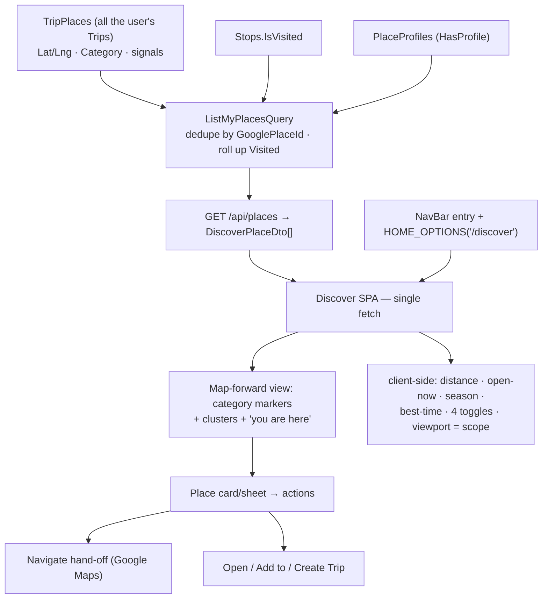
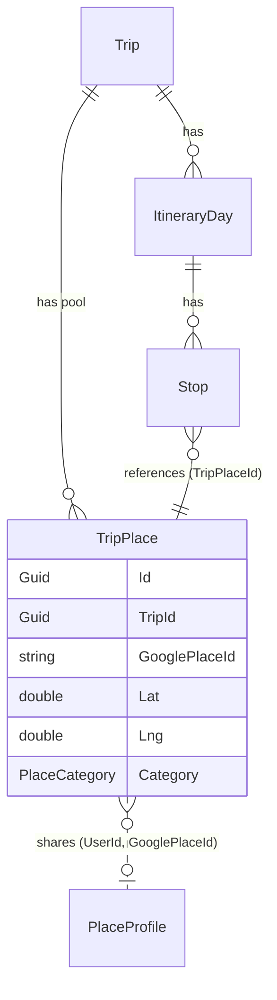
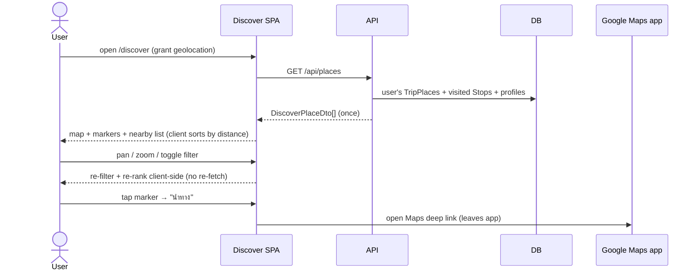
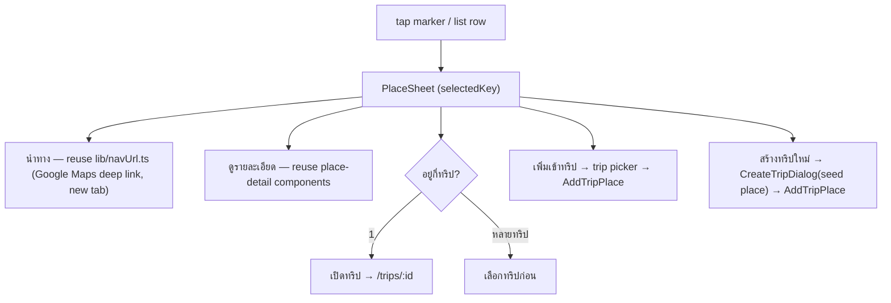

# Design spec — "ไปไหนดี / วันนี้ไปเที่ยวไหนดี": map-forward discovery of the user's own saved Places

**Date:** 2026-07-20 · **Issue:** [#42](https://github.com/ThodsaphonSonthiphin/MenuNest/issues/42)
**Decisions:** ADR-094 (source = own saved Places, no Google nearby) · ADR-095 (anchor = GPS + switchable scope) · ADR-096 (four toggleable free signals) · ADR-097 (map-forward, event-driven shell) · ADR-098 (place actions) · ADR-099 (top nav + selectable Home page) · ADR-100 (read model: `GET /api/places`)
**Glossary:** **Discover (ไปไหนดี)**, **Discovery scope**, **Discovery signal** (CONTEXT.md → Travel & trip planning)
**Mock:** Claude Design project **"MenuNest design system"** (`8d8d4c81-41c1-4e0a-a0b7-370b39dfbe70`) → **Screens** card `place-discovery` — <https://claude.ai/design/8d8d4c81-41c1-4e0a-a0b7-370b39dfbe70>

## What & why

Tourist **Places** in MenuNest exist **only inside a Trip's pool** — every place read requires a `tripId`, so there is no way to browse "where can I go near me right now" across everything the user has saved. The saved data is trapped in Trips and unusable for spontaneous decisions. **Discover (ไปไหนดี)** closes that gap: a **map-forward** screen that shows the user's own saved Places across **all** their Trips, ranked by proximity, so they can decide where to go today and act on it (navigate, open/add to a Trip).

Crucially, the coordinates and every "is-it-good-now" signal are **already stored** on each saved Place (from Capture), so Phase 1 needs **no new Google API call or cost** (ADR-094). Discovering brand-new places from Google (Nearby Search) and live weather-in-discovery are Phase 2.



## Scope

**In (Phase 1):**
- **Backend (read-only, no new entity/table/migration):** a User-scoped `GET /api/places` → `DiscoverPlaceDto[]`, aggregating the user's `TripPlace` rows across all Trips, deduped by `GooglePlaceId`, with a rolled-up `Visited` flag and the list of containing Trips (ADR-100).
- **Frontend:** a new **map-forward `/discover`** page — full Google map with the user's saved Places as category markers (clustered when dense), a "you are here" GPS pin, a floating header (title + anchor chip), a filter row (category + the four **Discovery-signal** toggles, all on/off), and a bottom-sheet list ranked by distance. Tapping a marker/row opens a place sheet with **Navigate**, **ดูรายละเอียด**, **เปิดทริป**, **เพิ่มเข้าทริป**, **สร้างทริปใหม่**. Pan/zoom changes the **Discovery scope**. A NavBar entry + a `/discover` Home-page option.
- All ranking/filtering/distance computed **client-side** from one fetch (ADR-096, ADR-097).

**Out (Phase 2 / deferred):**
- Google **Nearby Search** for brand-new, never-saved places (ADR-094); **live weather** in Discover (per-place Weather call = cost, ADR-096).
- A free-typed **area-name search** as a scope target (would be a new Google geocode call) — Phase 1 scope = live GPS + map viewport + existing Trips/Places (ADR-095).
- **Mark Visited** from Discover — selected by the user but deferred: `Visited` is per-**Stop** and a Place may map to zero/many Stops, so "mark visited here" is ambiguous (ADR-098). Revisit as a fast-follow once the target rule is settled.
- **MCP** parity (a discover tool) — SPA-only in Phase 1.

---

## Backend

### 1. `DiscoverPlaceDto` (new read model — ADR-100)

`backend/src/MenuNest.Application/UseCases/Places/PlaceDtos.cs` (new folder `UseCases/Places/`). Name avoids the banned **Location** term.

```csharp
public sealed record DiscoverPlaceDto(
    string Key,                       // GooglePlaceId when present, else "tp:{RepresentativeTripPlaceId}"
    string? GooglePlaceId,
    Guid RepresentativeTripPlaceId,   // the row the snapshot came from
    string Name, double Lat, double Lng, string? Address,
    PlaceCategory Category, int? PriceLevel, string? PhotoUrl,
    string? OpeningHoursJson,         // raw — client computes open-now
    TimeOnly? BestTimeStart, TimeOnly? BestTimeEnd,
    IReadOnlyList<SeasonPeriodDto> SeasonPeriods,   // raw — client computes monthStatus
    bool Visited,                     // rolled up: any Stop referencing this place is visited
    bool HasProfile,
    IReadOnlyList<PlaceTripRefDto> Trips);          // containing trips (id + name)

public sealed record PlaceTripRefDto(Guid TripId, string TripName);
```

Reuses the existing `SeasonPeriodDto` (from `Trips/TripDtos.cs`).

### 2. `ListMyPlacesQuery` + handler (ADR-100)

`backend/src/MenuNest.Application/UseCases/Places/ListMyPlaces/` — `ListMyPlacesQuery()` (no args; user comes from the provisioner) + `ListMyPlacesHandler`.



Handler logic (personal-app scale → **load then group in memory**; simpler and correct, paginate later if a set grows huge):
1. `user = await _users.GetOrProvisionCurrentAsync(ct)`.
2. Load the user's places: `_db.TripPlaces` joined to `_db.Trips` where `Trip.UserId == user.Id` — project `{ TripPlace fields, TripId, TripName }`. (Trips are User-scoped, ADR-005.)
3. Load the visited set: the `TripPlaceId`s of the user's `Stop`s where `IsVisited` (join `Stops`→`ItineraryDay`→`Trip` filtered to the user, **or** `Stops.Where(s => visitedTripPlaceIds.Contains(...))` scoped to the loaded TripPlace ids).
4. Load `PlaceProfiles` `GooglePlaceId`s for the user (for `HasProfile`).
5. **Group in memory:** key = `GooglePlaceId` when non-null, else `"tp:{Id}"` (each unresolved place is its own item). Per group: **representative** = row with max `UpdatedAt ?? CreatedAt` (snapshot fields from it); `Visited` = any group row's `TripPlaceId` in the visited set; `Trips` = distinct `{TripId, TripName}` over the group; `HasProfile` = key is a non-null place_id in the profile set.
6. Return `DiscoverPlaceDto[]` (no server sort needed — client sorts by distance; a stable Name sort is a fine default).

Owns nothing new: no `DbSet`, no entity, no migration — reads `TripPlaces`, `Stops`, `PlaceProfiles`, `Trips` only.

### 3. HTTP — `PlacesController`

`backend/src/MenuNest.WebApi/Controllers/PlacesController.cs` (new) — `[Authorize] GET /api/places` → `ListMyPlacesQuery` → `Ok(DiscoverPlaceDto[])`. (A new controller because the route is **not** trip-scoped, unlike `TripsController`'s `/api/trips/{id}/places`.)



---

## Frontend

Feature folder `frontend/src/pages/discover/` mirroring `trips/`: `DiscoverPage.tsx` (+ `DiscoverPage.css`, `index.ts`), `discoverSlice.ts` (UI state), `components/`, `hooks/`, `lib/` (pure + unit-tested). Reuse the `trips-tokens.css` teal palette (import it, or a small `discover-tokens.css`).

### 4. RTK Query (`shared/api/api.ts`)

Add tag `'MyPlaces'`; add the query + generated hook; declare the DTO interface inline (hand-written slice):

```ts
export interface DiscoverPlaceDto {
  key: string; googlePlaceId: string | null; representativeTripPlaceId: string;
  name: string; lat: number; lng: number; address: string | null;
  category: PlaceCategory; priceLevel: number | null; photoUrl: string | null;
  openingHoursJson: string | null; bestTimeStart: string | null; bestTimeEnd: string | null;
  seasonPeriods: SeasonPeriodDto[]; visited: boolean; hasProfile: boolean;
  trips: { tripId: string; tripName: string }[];
}
listMyPlaces: build.query<DiscoverPlaceDto[], void>({ query: () => '/api/places', providesTags: ['MyPlaces'] }),
```

`'MyPlaces'` is invalidated by the existing place mutations (add/update/delete trip place) so Discover stays fresh; wire those `invalidatesTags` to include `'MyPlaces'`.

### 5. Pure logic in `lib/` (unit-tested — the SPA has no component harness, CLAUDE.md)

- `lib/distance.ts` — `haversineKm(a, b)` (great-circle; mirrors the backend `HaversineRouteService` formula).
- `lib/openNow.ts` — `isOpenNow(openingHoursJson, now): boolean | null` — parse the stored Google opening-hours JSON against the device's local `now`; `null` when hours are absent/unparseable (never throws). Model the closed-check on the Timing-flag logic.
- `lib/bestTime.ts` — `matchesBestTime(start, end, now): boolean | null` — is `now` within the Place's best-time-of-day window.
- Reuse **`trips/lib/season.ts` `monthStatus`** for the season signal (do not duplicate).
- `lib/discoverFilter.ts` — `applyDiscover(places, { anchor, viewport, category, toggles, now })` → sorted/filtered `DiscoverPlaceView[]` with computed `{ distanceKm, openNow, seasonStatus, bestTimeMatch }`. This is the one place the four **Discovery-signal** toggles + category + viewport-scope compose. **All computation uses the device's local clock** (the viewer is physically at their location — no tz plumbing needed, unlike backend Current-time start).

Toggle semantics (finalised from the mock):
- **เปิดตอนนี้** on → drop places `isOpenNow === false` (keep `null`/unknown; badge shows state).
- **เหมาะกับเดือนนี้** on → drop places whose `monthStatus` is `bad`; sort `good` above neutral.
- **ช่วงเวลาที่ควรไป** on → sort `bestTimeMatch` places up (soft; not a hard filter).
- **ซ่อนที่ไปแล้ว** on → drop `visited` places (off → show, dimmed).

### 6. `discoverSlice.ts` (UI state only)

`{ anchor: {lat,lng} | null (from geolocation), scope: viewport bounds | null, categoryFilter: PlaceCategory | 'all', toggles: {openNow, season, bestTime, hideVisited}, selectedKey: string | null }`. Defaults: all four toggles **on** except `bestTime` off (matches the mock); category `all`. Register the reducer in `store/index.ts`.

### 7. Map-forward view (ADR-097) — `components/`

- `DiscoverMap.tsx` — reuse `@vis.gl/react-google-maps` exactly as `TripMap.tsx` (`APIProvider` with `onError={trackGoogleMapsError}`, `<Map mapId={MAP_ID}>` using `||` not `??` for the map-id fallback — the CLAUDE.md gotcha). Category-coloured `AdvancedMarker`s; the ADR-027 `.viewer-pin` for GPS. **Marker clustering** for the (potentially city-wide) set — add **`@googlemaps/markerclusterer`** driven off the `useMap()` instance (new dependency; the one piece `TripMap` doesn't already do). `onCameraChanged` (debounced) writes the viewport into `discoverSlice.scope`; tapping a marker sets `selectedKey`.
- `PlaceBottomSheet.tsx` — the ranked list (peek + drag to expand); each row = category dot + name + distance + open-now/season/trip badges; tap → selects + centres the marker.
- `PlaceSheet.tsx` — the expanded detail + action buttons (§8). Reuse existing place-detail sub-components where possible.
- `FilterBar.tsx` — category dropdown + four toggle chips (styled as in the mock).
- Geolocation: reuse the **ADR-027** pattern (`navigator.geolocation.getCurrentPosition`, round ~4dp → `discoverSlice.anchor`); denied/unsupported → `anchor = null` and the map **fits all** the user's Places instead of centring on GPS (the GPS-denied fallback, ADR-095).

### 8. Place actions (ADR-098)



Add-to-trip and create-trip **reuse `AddTripPlace`** (+ `PlaceProfile` seed-on-capture, so enrichment carries over) — build the `ResolvedPlace`-shaped payload from the `DiscoverPlaceDto`. Create-trip reuses `CreateTripDialog` then `AddTripPlace` on the new trip. **Mark Visited is deferred** (see Scope-Out).

### 9. Nav + Home page (ADR-099)

- `router.tsx` — add `{ path: '/discover', element: <DiscoverPage /> }` inside the **auth-only `AppLayout`** group (beside `/trips`), **not** `FamilyRequiredRoute`. Import from `./pages/discover`.
- `shared/components/NavBar.tsx` — one entry in the `navItems` array (covers desktop + mobile drawer). Label uses an **inline-SVG** map/compass icon (not emoji — see self-review).
- `pages/settings/homeOptions.ts` — add `/discover` to `HOME_OPTIONS` (`requiresFamily: false`); `resolveHomePath` then accepts it. Update `homeOptions.test.ts`.

---

## Testing

- **Backend (xUnit + Moq + FluentAssertions; relational handler test on `SqliteAppDbContext`):** `ListMyPlacesHandler` —
  - dedupes the same `GooglePlaceId` captured into **two** Trips into **one** item, representative = most-recently-updated;
  - a `TripPlace` with **null** `GooglePlaceId` stays its own item (`key = "tp:…"`);
  - `Visited` rolls up (true iff any referencing `Stop.IsVisited`);
  - `Trips` lists every containing trip; `HasProfile` reflects a `PlaceProfile` row;
  - **only the current user's** places are returned (another user's Trip excluded).
- **Frontend (vitest, node env — pure libs only):** `distance.test.ts` (known coordinate pairs); `openNow.test.ts` (open/closed/overnight/absent → null); `bestTime.test.ts` (inside/outside/absent); `discoverFilter.test.ts` (each toggle in isolation + combined; viewport filter; distance sort; category filter); `discoverSlice.test.ts` (default toggles, select, scope set).
- **Interactive smoke (mandatory before push — the SPA has no render/visual harness, and a map/overlay bug ships to prod otherwise, CLAUDE.md #36):** map renders with category markers + clusters + the "you are here" pin (no black-map overlay); toggles filter/re-rank live; pan/zoom changes the visible set + list; tap a marker → sheet with correct badges + actions; **นำทาง** opens Google Maps; **เปิดทริป** routes correctly (and disambiguates a multi-trip place); GPS-denied → the map fits all Places; a family-less user can open `/discover`; `/discover` is selectable as Home page and lands there.

## Rollout

- **No migration** — the feature is a read over existing tables plus frontend. (Contrast the usual manual-migration dance; not needed here.)
- **New dependency:** `@googlemaps/markerclusterer` (frontend). Confirm before adding.
- **Open a GitHub issue first** (no ticket yet) — every commit references it (`(closes #n)` on the final commit). Commit straight to `main`; stage narrowly (never `git add -A`); the full pre-commit suite must stay green.
- **Interactive verify before push** (map UI) — prod deploys on push.

## Self-review

No placeholders; consistent with ADR-094–100, the CONTEXT.md additions (Discover / Discovery scope / Discovery signal), and the confirmed mock. Scope is bounded — Google Nearby Search, live weather, area-name search, mark-Visited, and MCP are explicitly deferred. No new entity/table/migration (read model only). Reuses the map stack, geolocation (ADR-027), Haversine, `season.ts`, `navUrl.ts`, `AddTripPlace`/seed-on-capture, and the Home-page plumbing.

**Flagged for review before implementation:**
1. **Icon convention.** This spec specifies **inline-SVG** icons (the app's real pattern — `NavIcon.tsx`, `FlagIcons.tsx`, etc.) and **no emoji** in chrome. Note: a saved preference says "use `@syncfusion/react-icons`", but that package is **not installed** and the codebase actually uses inline SVG (and emoji in some legacy nav labels). Recommend **inline SVG** (matches code); if you want the Syncfusion icon set added instead, say so.
2. **Marker clustering dependency** (`@googlemaps/markerclusterer`) — the only new dep; acceptable, or prefer a hand-rolled grid clusterer with no dep?
3. **In-memory dedup/grouping** in the handler (vs a pure-SQL group-by) — chosen for correctness/simplicity at personal-app scale; confirm that's fine.
4. **Mark Visited deferred** despite being selected in grilling — acceptable to ship without it and fast-follow once the per-Stop target rule is defined?
