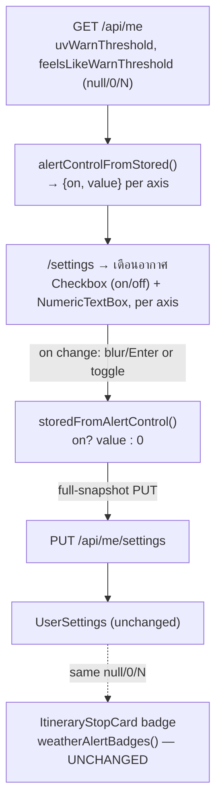

# Design spec — Weather-alert thresholds become free numeric inputs (issue #40 follow-up)

**Date:** 2026-07-20 · **Relates to:** issue #40 (weather alert)
**Decisions:** ADR-105 (free numeric input + on/off toggle, both axes) · ADR-106 (on-screen badge, not push; UV and heat as separate badges) · builds on ADR-086/087/088/089/090/091/092/093
**Glossary:** **Weather alert**, **Weather-alert threshold**, **UV index**, **UV band**, **Feels-like** (CONTEXT.md — unchanged; the widget is implementation detail, not a glossary term)

## What & why

The owner opened a Stop's detail sheet in the evening (arrival 17:45, temp 31 / feels-like 36) and expected a heat warning. None fired: the UV alert is naturally silent near sunset (UV physically drops to 0-1 even under a clear "แดดจัด" sky — verified live against the Google Weather API), and the feels-like alert — the one designed for exactly this scenario (ADR-086) — could only be set as low as the `>=38` preset, above the owner's ~36 discomfort point.

Root fix (ADR-105): stop handing users a fixed preset list; let them **type the threshold they actually care about**. The backend already accepts any value (validator UV 0..15, feels 0..60; storage tri-state `null`/`0`/`N`, ADR-091), so this is a **frontend-only** control redesign — no migration, no DB/handler/DTO change.



## Scope

**In (frontend only):**
- Replace the two preset `DropDownList`s on `SettingsPage.tsx` → "เตือนอากาศ" with, **per axis (UV and feels-like)**: an on/off **Checkbox** + a **NumericTextBox**.
- New pure helpers (unit-tested) resolving stored tri-state ↔ UI control state + clamping.
- Retire the preset lists.

**Out:**
- Any backend/DB/migration/command/validator/DTO change — none needed.
- Push notifications (ADR-106 — deferred to a separate feature).
- Warning on the Stop **detail sheet** (ADR-106 — stays card-only; optional later follow-up).
- The itinerary-card badge logic (`weatherAlertBadges`, `effectiveThreshold`, `ItineraryStopCard`, `stopSummary`) — **untouched**: the numeric input emits the same `null`/`0`/`N` values, so the badge keeps working with zero change.
- The Home-page dropdown row on `/settings` — unchanged.

## Pure logic — `frontend/src/pages/settings/weatherAlertControl.ts` (rename of `weatherAlertOptions.ts`)

Retire `UV_ALERT_OPTIONS`, `FEELS_ALERT_OPTIONS`, `selectedAlertValue`. Add:

```ts
// Bounds mirror the server validator; min is 1 (0 is reserved for "off") when enabled.
export const UV_MIN = 1, UV_MAX = 15
export const FEELS_MIN = 1, FEELS_MAX = 60

// Stored tri-state (null=default, 0=off, N=on@N) → UI control state.
export function alertControlFromStored(stored: number | null | undefined, dflt: number): {on: boolean; value: number} {
  if (stored == null) return {on: true, value: dflt}   // never set → on, showing the built-in default
  if (stored === 0)  return {on: false, value: dflt}   // off → disabled field shows the default
  return {on: true, value: stored}                     // on at N
}

// UI control state → the value the full-snapshot PUT stores.
export function storedFromAlertControl(on: boolean, value: number): number {
  return on ? value : 0
}

// Clamp a typed value to its axis' integer range so a stored value can never fail server validation.
export function clampThreshold(value: number, min: number, max: number): number {
  const n = Math.round(Number.isFinite(value) ? value : min)
  return Math.min(max, Math.max(min, n))
}
```

Defaults `UV_WARN_DEFAULT` (6) / `FEELS_WARN_DEFAULT` (40) continue to come from `lib/weather.ts` (unchanged).

## UI — `SettingsPage.tsx`

```mermaid
flowchart TD
  L["getMe loads"] --> I["init local state per axis:<br/>alertControlFromStored(stored, dflt)"]
  I --> R["render Checkbox(on) + NumericTextBox(value, min, max, disabled=!on)"]
  R --> C{"user acts"}
  C -->|toggle checkbox| S1["set on; PUT snapshot(storedFromAlertControl(on, value))"]
  C -->|edit number (commit on blur/Enter)| S2["value = clampThreshold(e.value,…); PUT snapshot"]
```

- Imports: `import {NumericTextBox} from '@syncfusion/react-inputs'` and `import {Checkbox} from '@syncfusion/react-buttons'` (both installed at 33.1.44; there is **no** `Switch` export in this version — use `Checkbox`, optionally CSS-styled as a toggle in `SettingsPage.css`). The Home-page `DropDownList` stays.
- **Local state** per axis (`uvOn`/`uvVal`, `feelsOn`/`feelsVal`), initialised from `alertControlFromStored(...)` once `!isLoadingProfile`. Local state (not the raw stored value) is what the NumericTextBox binds to, so toggling **off** (persists `0`) still keeps the typed number visible in-session and re-sends it when toggled back **on**.
- **Save** keeps the existing pattern: build the **full snapshot** `{homePath, uvWarnThreshold, feelsLikeWarnThreshold}` (homePath read back from the getMe cache) and call `useUpdateUserSettingsMutation`; show "บันทึกแล้ว"; keep the `isLoadingProfile` data-loss guard on every handler. `homePath` handler is unchanged.
  - Checkbox `onChange` → save immediately.
  - NumericTextBox `onChange` (Syncfusion commits on blur/Enter/spin, not per keystroke) → `clampThreshold` then save.
- Field is `disabled` when its checkbox is off. Optional light hint under each field (e.g. feels "แนะนำ ~35-40°", UV "≥6 = แดดแรง") — copy only, no logic.
- Labels stay Thai: "ดัชนี UV", "รู้สึกร้อน (feels-like)"; section title/sub unchanged ("เตือนอากาศ" / "เตือนบนการ์ดเมื่อจุดหมายแดด/ร้อนเกินที่ตั้งไว้"). No emoji; inline-SVG / Syncfusion controls only.

## Testing

- **Frontend (vitest, node env — no component harness, CLAUDE.md):** new `weatherAlertControl.test.ts`:
  - `alertControlFromStored`: `null`/`undefined` → `{on:true, value:dflt}`; `0` → `{on:false, value:dflt}`; `N>0` → `{on:true, value:N}`.
  - `storedFromAlertControl`: `(true, 35)` → `35`; `(false, 35)` → `0`.
  - `clampThreshold`: below-min → min; above-max → max; non-finite → min; rounds a decimal.
  - Remove the obsolete preset assertions from the old test.
- **No backend test changes** (no backend change). Existing `weatherAlertBadges`/`effectiveThreshold` tests stay green (encoding unchanged).
- **Interactive smoke (before push — SPA has no render/visual gate, CLAUDE.md):** `/settings` shows two number fields each with an enable checkbox; type feels-like 35, reload → persists; a Stop whose On-arrival feels-like ≥ your number shows the heat badge on the itinerary card, one below it does not; unchecking removes that badge; UV field behaves the same; a family-less user can open `/settings`. Verify on prod after deploy.

## Rollout

- **Frontend-only**; deploys on push to `main` (no migration, no manual DB step).
- Commit references the tracking issue (open a small follow-up issue if #40 is already closed) per CLAUDE.md; stage narrowly (never `git add -A`); the whole pre-commit suite must stay green.

## Self-review

No placeholders. Backend genuinely untouched (validator already 0..15 / 0..60; storage tri-state per ADR-091). Component names verified against installed 33.1.44 (`NumericTextBox` in react-inputs — matches budget dialogs; `Checkbox` in react-buttons; `Switch` intentionally avoided — not exported). Blast radius confirmed: preset symbols consumed only by `SettingsPage.tsx` + its test. Badge/`ItineraryStopCard`/`stopSummary`/`lib/weather.ts` unchanged by design. Consistent with ADR-105/106 and CONTEXT.md (no glossary change — widget is implementation detail).