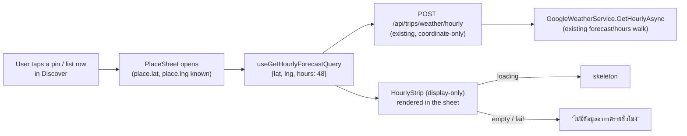

# Design Spec — Hourly weather in the Discover ("ไปไหนดี") place-detail sheet (issue #47)

**Issue:** [#47](https://github.com/ThodsaphonSonthiphin/MenuNest/issues/47) — "แสดงสภาพอากาศรายชั่วโมงนี่นี่ด้วย"
**Confirmed mockup:** MenuNest design system → Screens → **"Issue #47 — อากาศรายชั่วโมงในการ์ด 'ไปไหนดี'"**
(`screens/issue-47-discover-hourly-weather.html`, project `8d8d4c81`).
**ADRs:** 122 (surface live hourly), 123 (always-visible, auto-fetch), 124 (display-only, shared strip), 125 (full cell).

## Overview

Add a horizontal, scrollable **Hourly forecast** strip to the Discover `PlaceSheet` — the selected-place
detail sheet. It renders automatically when a Place is selected (no toggle), reusing the coordinate-based
hourly forecast plumbing shipped for trips in issue #46. This is a **frontend-only** change: no new backend
endpoint, use-case, DTO field, EF entity, migration, or Google billing SKU.



## Goal / Non-goals

**Goal.** When the user selects a saved Place in Discover, show the next ~48h of weather for that Place's
coordinates as a horizontal strip they can scroll, so they can decide "ไปตอนนี้ดีไหม / ไปกี่โมงดี".

**Non-goals.**
- No **Weather-based retiming** in Discover (no coolest-daytime/nighttime quick actions, no "ปรับเลย"
  apply-preview) — Discover has no Trip/Day/Stop to retime (ADR-124).
- No two-chip **Now / On-arrival Weather reading** in Discover — that needs a Stop's scheduled arrival
  (ADR-122). The strip's first cell (now) covers the "current conditions" need.
- No live Google **nearby search** and no change to the four **Discovery signals** (they stay call-free).
- No **UV index** in the Discover cell (kept lean; the DTO carries it but the confirmed cell shows
  temp/feels/rain only). UV in Discover is a possible later add, not this issue.

## Decisions (see ADRs for rationale)

| # | Decision | ADR |
|---|----------|-----|
| 1 | Discover surfaces the live **Hourly forecast** (reverses ADR-096's Phase-2 "no live weather in Discover", scoped to hourly only). | 122 |
| 2 | The strip is **always visible** and **auto-fetches** on Place selection — no toggle. Cost bounded: one Place at a time, cached 10 min, no new SKU. | 123 |
| 3 | **Display-only**: reuse only the presentational strip via a shared `HourlyStrip`; no retiming. | 124 |
| 4 | Each cell shows the **full** reading: time · icon · temp · "รู้สึก N°" · rain% (0% = faint "แห้ง"). 48h window; `withinHorizon` guard. | 125 |

## What already exists (reused as-is — no change)

- **Backend query:** `GetHourlyForecastQuery(double Lat, double Lng, int Hours)` →
  `GetHourlyForecastHandler` → `IWeatherService.GetHourlyAsync(WeatherPoint("", lat, lng, null), hours)`.
  Coordinate-only; no Trip/Stop; degrades to an empty list, never throws (ADR-030).
- **Endpoint:** `POST /api/trips/weather/hourly` (`TripsController.HourlyWeather`) — takes the query body,
  returns `IReadOnlyList<HourlyReadingDto>`. No trip-ownership check; already usable outside a trip context.
- **DTO:** `HourlyReadingDto { displayLocal, isDaytime, tempC, feelsLikeC, conditionType, iconBaseUri, rainPct, uvIndex }`.
- **Frontend hook:** `useGetHourlyForecastQuery({lat, lng, hours})` in `shared/api/api.ts`
  (`keepUnusedDataFor: 600`, ephemeral, no tags).
- **Helpers:** `iconUrl(iconBaseUri, isDark)` (`trips/lib/weather.ts`); `withinHorizon(targetMs, nowMs)`
  (`trips/lib/retiming.ts`). Cross-page imports from `trips/*` are already the norm in `discover/*`
  (PlaceSheet imports `trips/lib/navUrl`, `trips/lib/reviewLinks`, `trips/components/ReviewIcon`).
- **Read model:** `DiscoverPlaceView` already carries `lat` / `lng` (used today for the nav URL) — enough
  for the coordinate query. No read-model change.

## What changes (frontend only)

### 1. Share the drift-prone pure logic; keep the hour cell page-local (ADR-124)

The one genuinely drift-prone piece between the two strips is the **date-rollover label** math (a 48h
window can span three calendar dates). Extract it into a pure, unit-tested helper
`hourlyRolloverLabel(dateStr, anchorDateStr)` in `trips/lib/weather.ts` (beside `iconUrl`), and have
**both** consumers call it. Everything else stays page-local, because the two hour **cells** genuinely
diverge and the SPA has **no component/DOM test harness** (CLAUDE.md) — a shared JSX component's
correctness would rest entirely on interactive testing of *both* pages on every change:

- **trips cell (unchanged):** tappable `<button>` showing time + icon + "รู้สึก N°" — the actual temp /
  rain live in the adjacent Now / On-arrival chips. #46 behaviour is untouched; it only swaps its inline
  rollover function for the shared helper.
- **discover cell (new):** inert `<div>` showing time (first = "ตอนนี้") + icon + temp + "รู้สึก N°" +
  rain% (0% → faint "แห้ง"), in a Discover-local `DiscoverHourly` component with `.disc-wx*` CSS.

> **Blast radius (grill Step 3):** near-zero on #46 — trips `HourlyPlanner` changes only by importing the
> shared rollover helper (guarded by that helper's unit tests). Still, per CLAUDE.md's UI-change rule,
> re-smoke-test the trips hourly planner interactively (retiming, day/night tint, "พรุ่งนี้" divider)
> before pushing.

### 2. Wire the strip into `discover/components/PlaceSheet.tsx`

- Call `useGetHourlyForecastQuery({lat: place.lat, lng: place.lng, hours: 48})` when the sheet mounts.
- Filter with `withinHorizon` (drop past hours + anything beyond the 10-day horizon), exactly as
  `HourlyPlanner` does today.
- Render a new **"อากาศรายชั่วโมง"** section **between the badges and the "รีวิว" section** (weather is the
  most decision-relevant datum for "go now", so it sits high).
- Section header: label "อากาศรายชั่วโมง" on the left; an optional at-a-glance **"ตอนนี้ N° · รู้สึก N°"**
  (first in-horizon hour) on the right — kept per the confirmed mockup, cheap to drop (ADR-125).
- Below it: `<HourlyStrip variant="discover" hours={hours} />`.

### 3. States

- **Loading:** skeleton strip while the query is in flight; never blocks the rest of the sheet (reviews /
  note / actions render immediately).
- **Empty / provider failure / beyond horizon:** `hours.length === 0` ⇒ "ไม่มีข้อมูลอากาศรายชั่วโมง"
  (mirrors `HourlyPlanner`'s empty state; ADR-030/031). For a Place whose `place_id` has valid coordinates,
  "now" is always in-horizon, so the empty state realistically means a provider failure.
- A Place with **no coordinates** (shouldn't happen — a discovered Place always has a `place_id` snapshot)
  ⇒ skip the section entirely (guard on `lat`/`lng`).

### 4. CSS

The trips strip CSS is page-scoped under `.stop-detail-sheet .sd-hr*` in `TripDetailPage.css`. For the
shared component, add Discover-scoped equivalents in `DiscoverPage.css` under a `.disc-wx*` namespace using
the Discover tokens already defined on `.discover-page` (`--teal`, `--ink`, `--muted`, `--border`, `--page`),
plus day/night tints (warm `#fffdf5` / cool `#f3f5fc`) and a rain accent. (Sharing one stylesheet across the
two pages is out of scope — each page keeps its own scoped copy, the pattern the codebase already uses.)

## Cell anatomy (the "full" cell — ADR-125)

```
┌──────────┐
│  14:00   │  time — first cell shows "ตอนนี้"
│   [☀]    │  Google condition icon, tinted by isDaytime
│   34°    │  tempC (headline)
│ รู้สึก 38° │  feelsLikeC
│  ฝน 10%   │  rainPct (0% → faint "แห้ง")
└──────────┘
   warm tint = day · cool tint = night · "พรุ่งนี้" divider on date rollover
```

## Edge cases

- **Cross-midnight window:** 48h from "now" can span up to three calendar dates → a rollover divider per
  date change (reuse `HourlyPlanner`'s per-index date-compare, not a fixed "today" check).
- **Re-selecting the same Place** within 10 min → RTK Query cache hit, no re-bill (`keepUnusedDataFor: 600`).
- **Rapidly tapping many pins** → one query per distinct place selected; cache dedupes repeats. Bounded, but
  worth noting in the plan as the main cost surface.
- **Night-only / all-dry stretches** → cells still render (tint + "แห้ง"); no special-casing.

## Testing

- **Pure logic (vitest, `environment: 'node'`):** any date-rollover / horizon-filter / now-index helper
  extracted for the strip gets unit coverage in a `lib/*.test.ts`. The SPA has **no** component/DOM test
  harness (see CLAUDE.md) — rendering/layout is **not** unit-testable.
- **Full suite green:** backend build+test + `tsc --noEmit` + `npm run build` (the pre-commit hook runs all
  of it). The `HourlyStrip` extraction must leave every existing test green.
- **Interactive verification (mandatory before push, CLAUDE.md):**
  1. Discover → select a Place → strip auto-loads, scrolls horizontally, first cell "ตอนนี้", day/night
     tint, "พรุ่งนี้" divider correct, full cell content correct.
  2. Trips StopDetailSheet → hourly planner **unchanged**: cells tappable, "แผนตอนนี้" ring, coolest
     quick-actions, apply-preview, cross-day warning all still work.
  3. No overlay/black-map regression on the Discover map (CLAUDE.md #36).

## Risks

- **Phase-2 reversal / cost:** Discover now makes a live Google call per Place selection. Bounded (one at a
  time, cached, no new SKU — ADR-119/122/123). If cost ever matters, the toggle option (ADR-123 rejected
  alt) is the escape hatch.
- **Shared-component refactor touches #46** (see Blast radius above).
- **Parallel sessions renumber ADRs** — these ADRs are 122–125 against a current max of 121; fetch+rebase
  before pushing and re-check for collision (this feature already hit one renumber: 8b763a6).

## Out of scope / Phase 2

- UV index in the Discover cell; a "now" hero row; per-hour tap-for-detail; live nearby search;
  Now/On-arrival chips in Discover.