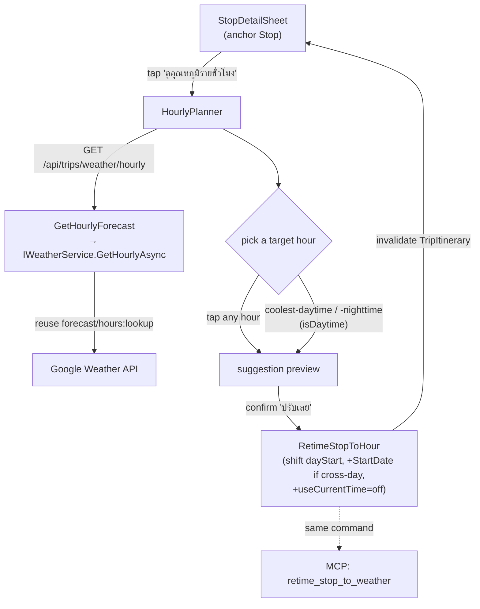
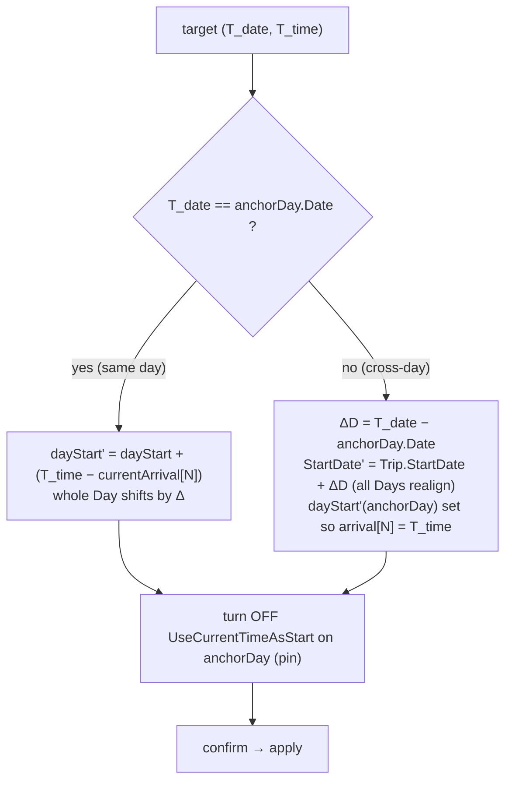
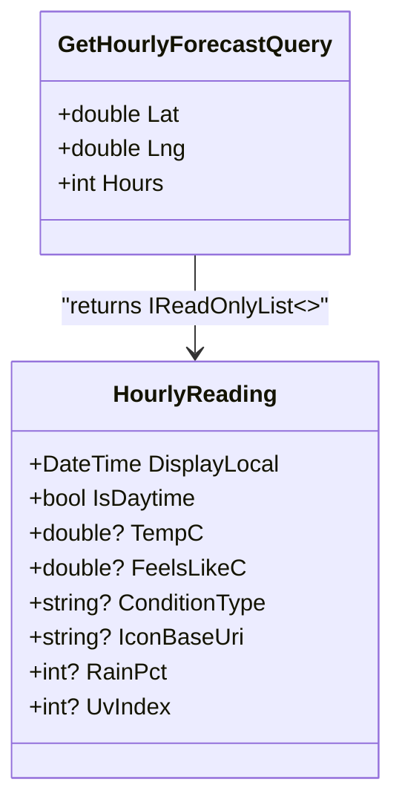

# Weather-based retiming (จัดเวลาตามอากาศ) — Design Spec

**Issue:** [#46 "show the possible heat"](https://github.com/ThodsaphonSonthiphin/MenuNest/issues/46)
**Date:** 2026-07-21
**ADRs:** 107–116  ·  **Glossary:** CONTEXT.md — *Hourly forecast, isDaytime, Weather-based retiming, Anchor Stop*
**Mockup:** MenuNest design system → Screens → *"Issue #46 — วางแผนไปถึงตอนอากาศที่ต้องการ"*

> The user asked to *see per-hour temperature so they can plan right*, and clarified the goal is to
> **arrive when the temperature is what they want**. This feature shows a Stop's hourly forecast and
> lets the user re-time the plan to hit a chosen (achievable) hour — by shifting the day start (and, for
> a cross-day target, the whole trip), suggested then applied on one tap.

## Overview



The feature is **display + a suggested, confirmed write**. It never edits the Smart Schedule cascade
directly — only its inputs (day start time, trip start date, current-time flag), which are all existing
write paths. **No database schema change / no EF migration is required.**

---

## 1. Scope (ADR-107)

Phase 1 delivers both halves of the request:

1. **Hourly forecast view** — a per-hour weather series for the **Anchor Stop**'s location.
2. **Weather-based retiming** — pick a target hour from that series; the app suggests and one-tap
   applies a re-timing so the Stop's **arrival** lands on it.

**Non-goals (Phase 2):** pinning a single Stop's arrival independently of the day; targeting beyond the
rolling window; a persisted "preferred temperature" setting; live weather inside Discover.

---

## 2. The retiming model (ADR-108, 109, 110)

Arrival is derived (ADR-008):

```
arrival[N] = dayStart + Σ leg[0..N] + Σ dwell[0..N-1]      (offset[N] is constant)
```

So to land the **Anchor Stop** (index N on its Day) at a target local datetime `(T_date, T_time)`:



- **Only lever = day start** (ADR-108): shifting `dayStart` by Δ moves *every* Stop on that Day by Δ.
  Pinning one Stop's arrival is rejected (breaks the pure cascade). Consequence: **the whole day moves**.
- **Cross-day = shift the whole Trip** (ADR-109): `ItineraryDay.Date = Trip.StartDate + index` (unique
  `(TripId, Date)`), so a later-date target shifts `Trip.StartDate` by ΔD and realigns every Day — reusing
  the existing `Trip.Reschedule` + realign (as in `UpdateTripHandler`). Single-day is the ΔD-covering case
  of the same formula. Consequence: **the whole Trip moves** (other Days change weekday / opening-hours /
  On-arrival weather) → **warn before apply**.
- **Apply pins the Day** (ADR-110): applying turns `UseCurrentTimeAsStart` **off** on the anchor Day,
  else the next fetch re-seeds the start to "now" and the target won't stick.

---

## 3. Target & selection (ADR-111, 112, 113)

- **Forecast-derived, metric = Feels-like** (ADR-111): selectable targets are the *actual hours* of the
  **Hourly forecast** — future hours within the 10-day horizon — each labelled with its real feels-like.
  An unreachable aim is reported honestly ("วันนี้เย็นสุด 30° ตอน 18:00"); no new stored setting.
- **Pick = tap any hour + two quick actions** (ADR-112): **coolest-daytime** and **coolest-nighttime**,
  each the minimum-feels-like hour of its half. Day vs night = Google's per-hour **isDaytime** flag
  (sunrise-inclusive → sunset-exclusive), *verified present* in `forecast/hours`.
- **Window = rolling now→+N, cross-midnight visible** (ADR-113): forward window from *now*, long enough to
  contain the next full daytime and nighttime (`N` = tunable const, default **48 h**, capped at the 240 h
  horizon). Cross-midnight hours show with a "พรุ่งนี้" divider and are selectable (cross-day supported).
  A Stop beyond the horizon shows **No weather data** and no planner (ADR-031/030).

Quick-action resolution:

| Action | Hour chosen |
|---|---|
| coolest-daytime | `min(feelsLikeC)` over window hours with `isDaytime === true` |
| coolest-nighttime | `min(feelsLikeC)` over window hours with `isDaytime === false` |
| (ties) | earliest such hour |
| (no candidates in that half) | action disabled with a short note |

---

## 4. Backend

### 4.1 Read — `GetHourlyForecast` (ADR-114)

No persistence. New application query + WebApi endpoint, served by a new `IWeatherService` method that
reuses the **same** `forecast/hours:lookup` walk the On-arrival reading already uses (ADR-033) — adds no
new provider and no new billing SKU (spirit of ADR-093), only returns more buckets plus `isDaytime`.



- `IWeatherService.GetHourlyAsync(WeatherPoint point, int hours, CancellationToken ct)` →
  `IReadOnlyList<HourlyReading>` — walk `forecast/hours` pages (24 buckets/page) up to `min(hours, 240)`,
  parse each bucket (extend `ParseReading` to also read `isDaytime`), skip past-hours, return ordered.
- Failure degrades to an **empty list** (ADR-030), never throws. Cache per (lat,lng@5dp, hour bucket)
  ~1–3 h, matching On-arrival.
- Endpoint: `POST /api/trips/weather/hourly` body `{ lat, lng, hours }` (single point; sibling of the
  existing `POST /api/trips/weather`).

### 4.2 Apply — `RetimeStopToHour` command

One application command invoked by **both** the WebApi and the MCP tool; computes server-side (it owns
legs/dwell) and composes existing domain methods **atomically** (single `SaveChanges`):

```
RetimeStopToHour(tripId, dayId, stopId, target)
  target = one of:  { kind: "hour", localDateTime }   // tapped hour
                    { kind: "coolestDaytime" | "coolestNighttime", windowHours }
resolve target → (T_date, T_time)      // for coolest*, fetch hourly for the stop's coords and pick
offset = currentArrival[stop] − currentDayStart(day)
dayStart' = T_time − offset
ΔD = T_date − day.Date
if ΔD ≠ 0:  trip.Reschedule(StartDate + ΔD, DayCount); realign every Day.SetDate(StartDate' + i)
day.SetStartTime(dayStart')
day.SetUseCurrentTimeAsStart(false)
SaveChanges  → return updated itinerary (+ a movedTrip flag / from→to for the warning)
```

- Reuses `Trip.Reschedule`, `ItineraryDay.SetDate/SetStartTime/SetUseCurrentTimeAsStart` — **no new domain
  surface**. Realign mirrors `UpdateTripHandler` (EF reorders statements so a same-ΔD shift never collides
  on the unique `(TripId, Date)` — see reference_ef_relational_testing).
- Validator: trip/day/stop belong to the current user; `windowHours` in `[1, 240]`; target resolvable.

### 4.3 MCP (ADR-115)

Two `TripTools` methods (lineage ADR-034):
- `get_stop_hourly_forecast(tripId, stopId, hours)` → the hourly list.
- `retime_stop_to_weather(tripId, dayId, stopId, target)` → invokes `RetimeStopToHour`; result states the
  new arrival and, when the whole Trip moved, the from→to dates.

---

## 5. Frontend

```mermaid
sequenceDiagram
    actor U as User
    participant SD as StopDetailSheet
    participant HP as HourlyPlanner
    participant API as Trip API
    U->>SD: open sheet (tap card)
    U->>SD: tap "ดูอุณหภูมิรายชั่วโมง"
    SD->>HP: open (anchor stop)
    HP->>API: POST /weather/hourly {lat,lng,hours}
    API-->>HP: hour list (feels-like, isDaytime, …)
    U->>HP: tap hour  /  quick action
    HP-->>U: suggestion (start' , warning if cross-day/trip)
    U->>HP: confirm "ปรับเลย"
    HP->>API: POST retime (RetimeStopToHour)
    API-->>HP: updated itinerary
    HP-->>SD: close; arrival = target
```

- **Pure logic** in `lib/retiming.ts` (vitest-covered; the SPA has no component harness — CLAUDE.md):
  `offsetMinutes(scheduled, stopId)`, `suggestDayStart(target, offset)`, `classifyShift(target, anchorDay)`
  → `{ sameDay | crossDay, deltaDays, movesTrip }`, `coolestHour(hours, isDaytime)`,
  `withinHorizon(...)`. Feeds both the preview and the warning; no round-trip needed for the preview
  (the client already has the schedule).
- **Data:** `useHourlyForecastQuery(lat,lng,hours)` (RTK, skip when beyond horizon) + `useRetimeStopMutation`
  (invalidates `TripItinerary`).
- **Components:** entry button in `StopDetailSheet` (under the two `WeatherChip`s); `HourlyPlanner`
  (horizontal hour strip — feels-like headline + condition icon, current-plan cell ringed, day/night tint,
  "พรุ่งนี้" divider; two quick-action buttons; apply-preview card with the resulting start time, the
  cross-day/trip warning, and the "จะปิด 'ใช้เวลาปัจจุบันเสมอ'" note). Icons = inline SVG (no emoji; not
  @syncfusion/react-icons — CLAUDE.md / no-emoji preference).
- **UI (ADR-116):** as the confirmed mockup. Not a separate top-level screen.

---

## 6. Edge cases

- **Beyond horizon** — anchor Stop arriving > 240 h out: no planner, "No weather data" (ADR-031).
- **Past hours** — today's already-passed hours are excluded (can't arrive then); reuse `weatherWindow`.
- **No candidates for a quick action** — that half has no forecast hours in-window → button disabled + note.
- **Overflow past midnight** — a large same-day shift can push arrival ≥ 24:00; the existing cascade
  overnight/overflow handling (ADR-020) applies unchanged; the preview shows the resulting times.
- **Time zone** — target hours are the location-local `displayDateTime` from Google; the trip's own
  wall-clock model (day date + HH:MM) is used for `dayStart'`, consistent with Current-time start's
  viewer-tz handling (ADR-038). Thailand has no DST.
- **Provider failure** — empty hourly list → planner shows the No-data state; retime with an unresolved
  `coolest*` target returns a domain error, no write.

---

## 7. Testing

- **Backend unit** (`MenuNest.Application.UnitTests` + `GoogleWeatherServiceTests`):
  - hourly parse incl. `isDaytime`; page-walk to `N`; past-hour skip; failure → empty.
  - `GetHourlyForecast` handler + validator.
  - `RetimeStopToHour`: same-day shift; cross-day whole-trip shift with realign (SQLite context — real
    unique `(TripId, Date)`); `UseCurrentTimeAsStart` set false; coolest-daytime/nighttime resolution;
    user-scoping.
- **MCP** (`MenuNest.McpServer.UnitTests`): both tools, incl. the moved-trip result.
- **Frontend** (`lib/retiming.test.ts`): offset/suggest/classify/coolest/horizon math.
- **Interactive verification (required — no visual harness):** open a Stop sheet, open the planner,
  confirm the strip / current-plan marker / day-night tint / cross-midnight divider; same-day apply; a
  cross-day apply on a multi-day trip shows the whole-trip warning and moves all days; verify beyond-horizon
  shows no planner. Smoke-test before pushing (prod deploys on push — CLAUDE.md).

---

## 8. Rollout notes

- **No migration** — reuses existing tables and write paths; nothing to apply to prod DB.
- Prod deploys on push to `main`; commit references #46; pre-commit runs the full suite (stage narrowly).
- Parallel-session caution (memory): another session may push ADRs — re-check ADR numbering (107–116) and
  `fetch + rebase` before pushing this worktree's branch.
