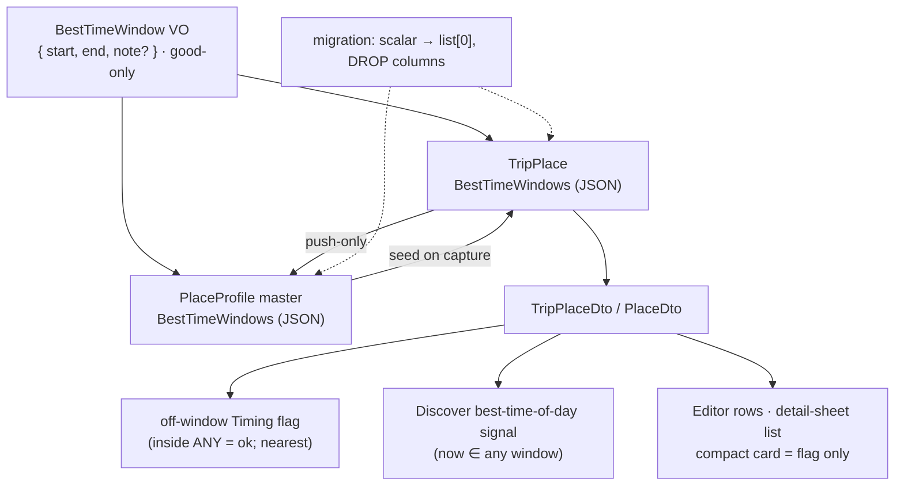
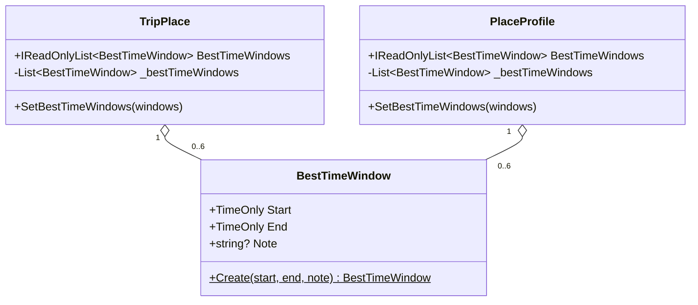
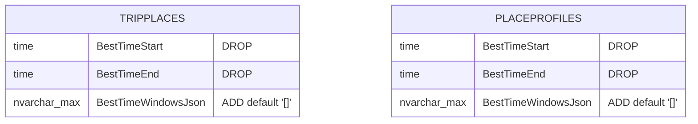
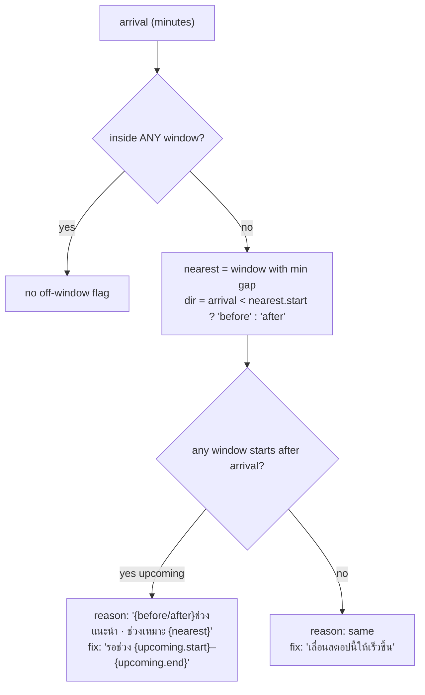
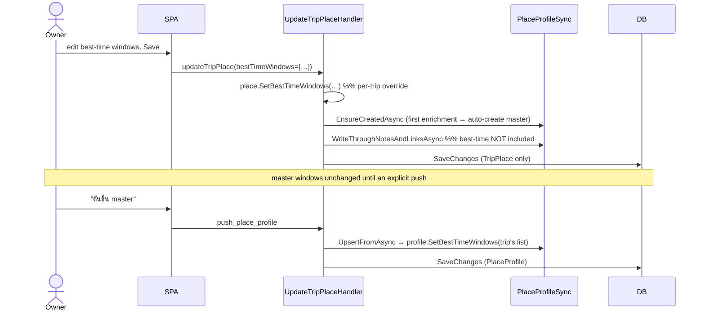

# Best-time WINDOWS — several good time-of-day windows per Place (issue #38)

**Date:** 2026-07-22
**Issue:** [#38](https://github.com/ThodsaphonSonthiphin/MenuNest/issues/38) — "add best times for trip, the trip should have several best time"
**Status:** Design approved — ready for `writing-plans`
**ADRs:** [126](../../adr/126-best-time-as-window-list.md) (representation), [127](../../adr/127-off-window-flag-inside-any-nearest.md) (off-window), [128](../../adr/128-best-time-migrate-scalar-to-list-drop-columns.md) (migration), [129](../../adr/129-best-time-windows-push-only-to-master.md) (lifecycle)
**Mockup:** MenuNest design system (claude.ai/design) → **Screens → `issue-38-best-time-windows`** — the one source of truth for the editor, compact-card, and detail-sheet surfaces.
**Glossary:** `CONTEXT.md` → **Best-time window**.

## 1. Summary

Today a **Place** carries a **single** optional best-time window — `BestTimeStart`/`BestTimeEnd`
(`TimeOnly?`) on both `TripPlace` and `PlaceProfile`. Issue #38, disambiguated with the owner during
grilling, asks for **several good time-of-day windows per Place in a day** — e.g. a temple that's good
**06:00–09:00 (แดดร่ม)** *and* **17:00–19:00 (แดดร่ม)**, each with its own reason. This spec replaces the
single scalar window with an ordered **list of `BestTimeWindow` value objects** `{ start, end, note? }`,
mirroring the shipped `SeasonPeriod`/`ReviewLink` JSON-list pattern on the *time-of-day* axis (the
`SeasonPeriod` list is the calendar-month axis; the two never merge — ADR-077).

## 2. Motivation & scope

- **In scope:** a per-Place ordered list of good time-of-day windows (each with an optional reason), on
  both `TripPlace` and `PlaceProfile`; the migration off the scalar columns; the DTO/API/MCP contract
  change; the off-window Timing-flag behaviour with multiple windows; the Discover best-time-of-day
  signal; the repeatable-row editor and the detail-sheet display.
- **Out of scope / non-goals:**
  - **No trip-level best-time** and **no per-Day best-time** — best-time stays anchored to a Place (ADR-126,
    rejected B/C). "Best time to take the whole trip" is a calendar concept and is *not* this feature.
  - **No good/avoid kind** — every window is "good" (ADR-126, rejected E). Season (#19) owns the good/avoid
    calendar axis.
  - **No write-through to master** — best-time stays push-only (ADR-129).
  - **No best-time on `add_trip_place`** — set via `update_trip_place` only, unchanged from today.
  - Deriving a Place's windows from crowd/Places-API data is not in scope (the existing "ใส่เอง" manual model
    stays).

## 3. Domain model

`BestTimeWindow` is an immutable positional record value object, exactly mirroring `SeasonPeriod`
([SeasonPeriod.cs](../../../backend/src/MenuNest.Domain/ValueObjects/SeasonPeriod.cs)): a public ctor for
`System.Text.Json` round-trip, plus a static `Create` factory that validates and normalises user input.

**`BestTimeWindow.Create(TimeOnly start, TimeOnly end, string? note)`:**
- `end > start` — else `throw new DomainException(...)` (same guard `SetBestTime` enforced for one window).
- `note` — trimmed; empty/whitespace → `null`; length ≤ **200** chars (matches `SeasonPeriod.Note`).
- No cross-window rules in the VO (overlap validation, if any, lives on the setter — see §7).

**Entity changes (both `TripPlace` and `PlaceProfile`):**
- **Remove** `TimeOnly? BestTimeStart`, `TimeOnly? BestTimeEnd`, and `SetBestTime(...)`.
- **Add** `private readonly List<BestTimeWindow> _bestTimeWindows = new();`, a public
  `IReadOnlyList<BestTimeWindow> BestTimeWindows => _bestTimeWindows;`, and
  `SetBestTimeWindows(IEnumerable<BestTimeWindow> windows)` that clears + `AddRange`, **caps at 6**, and
  bumps `UpdatedAt` — the exact shape of `SetSeasonPeriods`
  ([TripPlace.cs:99-106](../../../backend/src/MenuNest.Domain/Entities/TripPlace.cs#L99-L106)).

## 4. Persistence

Follow the `SeasonPeriodsJson` recipe on **both** host tables — no new table, no new `DbSet`.

- **Column:** `BestTimeWindowsJson` `nvarchar(max) NOT NULL DEFAULT '[]'` on `TripPlaces` and `PlaceProfiles`.
- **EF config** (`TripPlaceConfiguration`, `PlaceProfileConfiguration`): a `ValueConverter<IReadOnlyList<BestTimeWindow>, string>`
  (serialize / deserialize-with-empty-list fallback, `JsonSerializerDefaults.Web`) + a collection
  `ValueComparer`, bound with `HasColumnName("BestTimeWindowsJson")`, `HasColumnType("nvarchar(max)")`,
  `HasField("_bestTimeWindows")`, `UsePropertyAccessMode(PropertyAccessMode.Field)`, `HasDefaultValueSql("'[]'")`
  — copied verbatim from the `SeasonPeriodsJson` block
  ([TripPlaceConfiguration.cs:43-58](../../../backend/src/MenuNest.Infrastructure/Persistence/Configurations/TripPlaceConfiguration.cs#L43-L58)).
- **Three context implementers:** `AppDbContext` and `SqliteAppDbContext` pick the converter up via
  `ApplyConfigurationsFromAssembly`; `InMemoryAppDbContext` needs a hand-written `HasConversion` mirror added
  beside the existing `SeasonPeriods`/`ReviewLinks` mirrors
  ([InMemoryAppDbContext.cs:157-202](../../../backend/tests/MenuNest.Application.UnitTests/Support/InMemoryAppDbContext.cs#L157-L202)).

### 4.1 Migration (ADR-128) — one migration, both tables, applied manually to prod

Up():
1. `AddColumn BestTimeWindowsJson` (`nvarchar(max)`, `NOT NULL DEFAULT '[]'`) to `TripPlaces` and `PlaceProfiles`.
2. **Data-copy SQL** (raw `migrationBuilder.Sql`), for each table, for rows with non-null `BestTimeStart` **and**
   `BestTimeEnd`, set `BestTimeWindowsJson` to a one-element array carrying that window with a null note. The
   emitted JSON **must byte-match** the converter output (Web/camelCase keys, `TimeOnly` → `"HH:mm:ss"`):
   `[{"start":"HH:mm:ss","end":"HH:mm:ss","note":null}]`. **Before running on prod**, verify the exact string
   against a real `SeasonPeriodsJson` value / a C# round-trip of `BestTimeWindow` (naming policy + `TimeOnly`
   format), because a mismatched key case would deserialize to an empty list.
3. `DropColumn BestTimeStart`, `DropColumn BestTimeEnd` on both tables.

Down(): recreate the two columns and copy back the **first** window's start/end (extra windows are lost — an
accepted one-way narrowing on rollback). Preview with `dotnet ef migrations script --idempotent`; apply by
hand per `CLAUDE.md` (temporary SQL firewall rule for the current IP if needed).

## 5. DTOs, REST, and MCP contract

`BestTimeWindowDto` = `record BestTimeWindowDto(TimeOnly Start, TimeOnly End, string? Note)` in
[TripDtos.cs](../../../backend/src/MenuNest.Application/UseCases/Trips/TripDtos.cs) (beside `SeasonPeriodDto`).

**Blast radius — these change together (positional `TripPlaceDto` — see the #19/#37 fallout):**

| Site | Change |
|---|---|
| `TripPlaceDto` ([TripDtos.cs:17-25](../../../backend/src/MenuNest.Application/UseCases/Trips/TripDtos.cs#L17-L25)) | drop `BestTimeStart`/`BestTimeEnd`; add `IReadOnlyList<BestTimeWindowDto> BestTimeWindows` |
| `PlaceDto`/`DiscoverPlaceDto` ([PlaceDtos.cs:14-31](../../../backend/src/MenuNest.Application/UseCases/Places/PlaceDtos.cs#L14-L31)) | same field swap |
| `AddTripPlaceHandler.ToDto` ([:43-48](../../../backend/src/MenuNest.Application/UseCases/Trips/AddTripPlace/AddTripPlaceHandler.cs#L43-L48)) | the **one** production `new TripPlaceDto(...)` — map the window list |
| `ListMyPlacesHandler` ([:78-79](../../../backend/src/MenuNest.Application/UseCases/Places/ListMyPlaces/ListMyPlacesHandler.cs#L78-L79)) | map `rep.BestTimeWindows` into `DiscoverPlaceDto` |
| `TripToolsTests.cs` ([:25-33](../../../backend/tests/MenuNest.McpServer.UnitTests/Tools/TripToolsTests.cs#L25-L33)) | the **one** positional `new TripPlaceDto(...)` test literal — will not compile until updated |
| `UpdateTripPlaceCommand` + `Validator` + `Handler` | carry `IReadOnlyList<BestTimeWindowDto>`; handler calls `SetBestTimeWindows(...Select(BestTimeWindow.Create))`; validator: NotNull, ≤6, each end>start, note≤200 (mirror the `SeasonPeriods` validator) |
| `TripsController` `UpdatePlaceBody` + endpoint ([:77,157-161](../../../backend/src/MenuNest.WebApi/Controllers/TripsController.cs#L157-L161)) | swap scalar pair → `bestTimeWindows` list |
| `PlaceProfileSync` ([:23,65](../../../backend/src/MenuNest.Application/UseCases/Trips/PlaceProfileSync.cs#L23)) | seed + push copy `BestTimeWindows` as a whole list (mirror its `SeasonPeriods` handling); `WriteThroughNotesAndLinksAsync` still **excludes** it (ADR-129) |
| MCP `TripTools` ([:99-121](../../../backend/src/MenuNest.McpServer/Tools/TripTools.cs#L99-L121)) | `update_trip_place`: replace `bestTimeStart`/`bestTimeEnd` params with a `bestTimeWindows` array — **full replace** (omit / `[]` = clear), documented like `seasonPeriods`; `push_place_profile`: copies the window list; `add_trip_place`: unchanged (no best-time) |
| Frontend `api.ts` ([:521,544-545,1377,1381-1383](../../../frontend/src/shared/api/api.ts#L521)) | add `interface BestTimeWindow { start: string; end: string; note: string \| null }`; `TripPlaceDto`/`DiscoverPlaceDto` get `bestTimeWindows: BestTimeWindow[]` and drop `bestTimeStart`/`bestTimeEnd`; `updateTripPlace` body sends `bestTimeWindows`; `addTripPlace` `Omit` list swaps the old names for `'bestTimeWindows'` |

## 6. Off-window Timing flag (ADR-127)

Best-time still feeds exactly one computed value in the planner — the off-window flag
([useSchedule.ts:99-113](../../../frontend/src/pages/trips/hooks/useSchedule.ts#L99-L113)) — plus the Discover
signal (§8). It never influences the cascade (ADR-008); it only classifies the already-computed arrival.

- **Pure resolver** in a new `frontend/src/pages/trips/lib/bestTime.ts` (+ `bestTime.test.ts`) — the frontend
  has no DOM test harness, so the list logic must be pure and unit-tested (same rationale as `lib/season.ts`):
  `resolveBestTime(windows, arrivalMin)` → `null` (inside any) or `{ nearest, dir: 'before'|'after', upcoming? }`.
  `nearest` = min gap to `[start,end]`; `upcoming` = first window with `start > arrival`.
- `offWindowFlag` calls the resolver; the `TimingFlag` off-window fields
  ([useSchedule.ts:15-24](../../../frontend/src/pages/trips/hooks/useSchedule.ts#L15-L24)) `bestStart`/`bestEnd`/`windowDir`
  are populated from `nearest`/`dir` (shape unchanged — still one flag line).
- **Copy** ([timingFlag.ts:11-15](../../../frontend/src/pages/trips/timingFlag.ts#L11-L15)): `reasonLine` uses the
  nearest window; `fixLine` = `รอช่วง {upcoming.start}–{upcoming.end}` when an upcoming window exists, else the
  existing `เลื่อนสตอปนี้ให้เร็วขึ้น`. Dash between times stays EN DASH (–, U+2013).
- **Unchanged:** severity `suggestion` (amber), priority `overflow > closed > off-window`, one most-severe flag
  per Stop; a Place with **zero** windows raises no off-window flag.

## 7. Validation rules

- **Cap:** ≤ 6 windows per Place (`SetBestTimeWindows` truncates/guards; validator rejects > 6).
- **Per-window:** `end > start`; `note` trimmed, ≤ 200 chars, blank → null.
- **Overlap:** allowed (the "inside ANY window" rule handles overlaps harmlessly); windows are **not** auto-merged
  or auto-sorted by the domain — stored in the order the user added them, like `SeasonPeriods`.
- **Empty list = "no best-time set"** — identical to today's both-null state (no off-window flag, no Discover
  signal, nothing displayed).

## 8. Discover best-time-of-day signal (ADR-096)

The Discover signal ([discoverFilter.ts:42-48](../../../frontend/src/pages/discover/lib/discoverFilter.ts#L42-L48))
changes from "now ∈ the single window" to "**now ∈ any window**". `bestTimeMatch(place, now)` returns true if the
current time falls in any of `place.bestTimeWindows`; the ranking weight is unchanged (a match ranks higher when
the `bestTime` toggle is on). Reuse the §6 pure helper where practical.

## 9. Master ↔ per-trip lifecycle (ADR-129)

Seed-on-capture (`SeedIntoAsync`) copies the master's window list into a newly captured `TripPlace`, exactly as it
copies `SeasonPeriods`.

## 10. UI (mockup is the source of truth)

Confirmed mock: MenuNest design system → **Screens → `issue-38-best-time-windows`**.

- **Editor** — replace `BestTimeBar` (a single start/end pair,
  [BestTimeBar.tsx](../../../frontend/src/pages/trips/components/BestTimeBar.tsx)) with a repeatable-row editor
  (new `BestTimeEditor`) modelled on `PlaceSeasonEditor`: saved rows (`🕐 06:00–09:00 · เหตุผล`, delete ✕), a draft
  row with two Syncfusion `TimePicker`s (`เริ่ม`/`สิ้นสุด`, `format="HH:mm"`, `step={15}`) + an optional เหตุผล input,
  and a `+ เพิ่มช่วง` button hidden at 6 windows. Embedded in both `StopEditorDialog` and `PlaceEditorDialog`
  (which hold the window list in local state and emit the full array on save). Reuses the existing `.se-*`/`.sp-*`
  styles; teal accent (best-time), distinct from season's green/red.
- **Detail sheet** (`StopDetailSheet`) — a new **"ช่วงเวลาที่ดี"** section listing the windows as rows (same row
  markup as the existing `sd-seasons`/`season-rows` block), placed near the season section. The off-window flag
  banner (`FlagNote`) renders the §6 copy.
- **Compact card** (`ItineraryStopCard`) — **unchanged**: it lists no windows; it shows only the off-window flag in
  the summary line (nearest window).

## 11. Testing

- **Backend:** `BestTimeWindow.Create` (end>start throw, note trim/cap); `SetBestTimeWindows` cap 6; EF round-trip
  via `SqliteAppDbContext` (JSON column persists/rehydrates); `UpdateTripPlaceValidator` (≤6, end>start, note≤200);
  `PlaceProfileSync` seed + push carry the list, write-through excludes it; `TripTools` full-replace (omit/`[]`
  clears); DTO mapping in `AddTripPlaceHandler.ToDto`. Add a `DbSet`/mapping to all three contexts so the whole
  suite (which the pre-commit hook runs in full) stays green in one commit.
- **Frontend:** `lib/bestTime.test.ts` — inside-any, nearest window + dir, upcoming-window selection, empty list;
  Discover `bestTimeMatch` any-window. (No component/visual tests exist — verify the editor/sheet interactively
  against the mock before merge, per `CLAUDE.md`.)

## 12. Rollout order (for the plan)

Domain VO + entities + EF config + migration + all three contexts must land in **one** commit (EF model validation
gates every `DbContext` test — the #33 lesson). Then DTO/handlers/validator/controller/MCP, then frontend
types/editor/display/resolver. Apply the migration to prod **by hand** after merge (it drops columns — verify the
data-copy first). Interactive verification of the editor + detail sheet in a seeded/authed session is the final gate
before/ after push, since automated gates are blind to rendering.

## 13. Open questions

None outstanding — all forks resolved during grilling (scope, window shape, off-window behaviour, migration,
lifecycle, UI). Minor copy wording for the off-window `fixLine` is pinned in §6 and may be tuned during interactive
verification against the mock.
