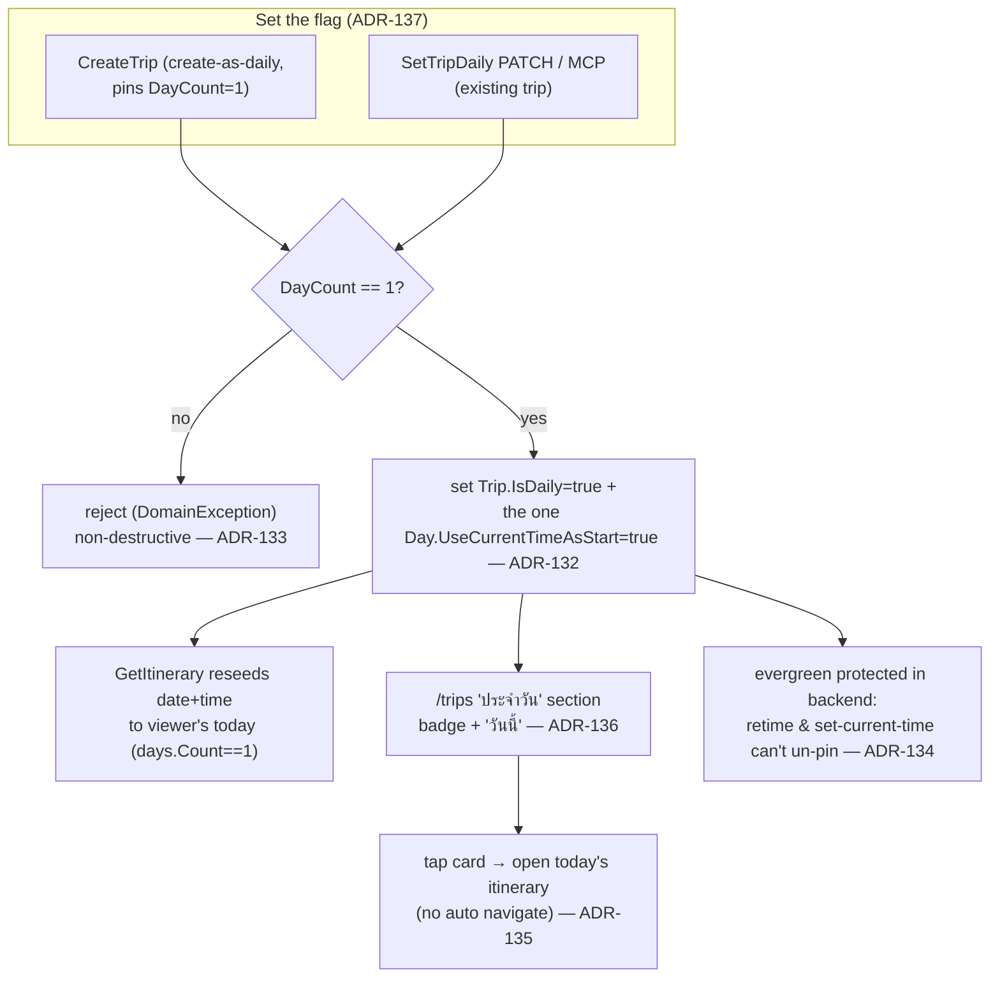
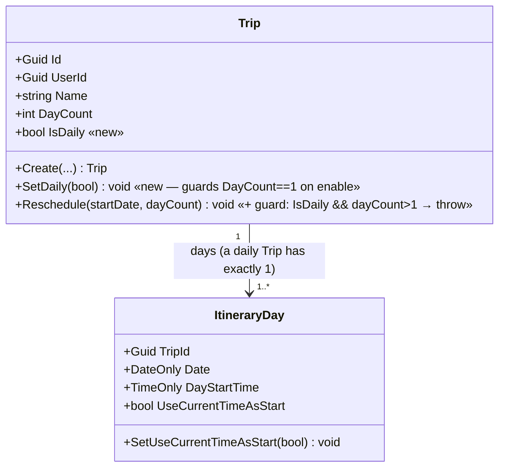
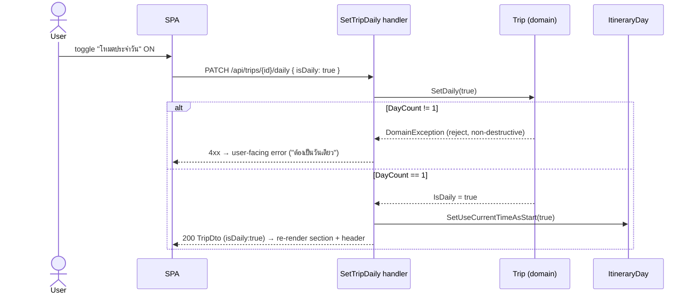
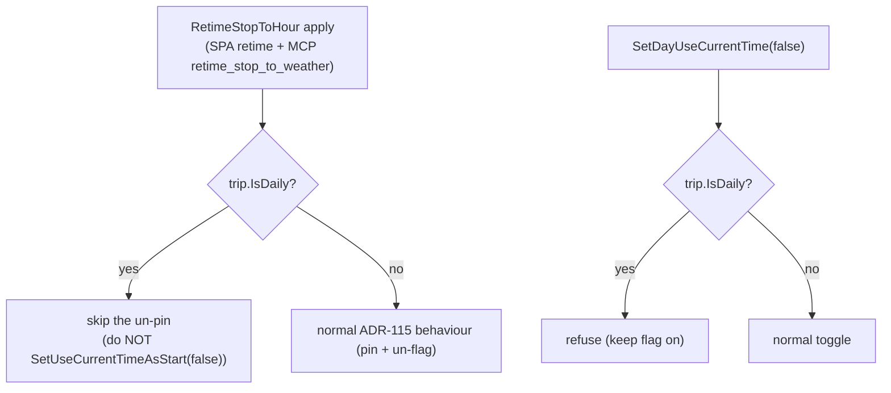

# Daily trips (ทริปประจำวัน) — design spec

**Issue:** [#49](https://github.com/ThodsaphonSonthiphin/MenuNest/issues/49) ("อยากมีฟีเจอร์แบบว่าแดรี่เดินทาง / เดินทางทุกวันแวะตามจุด")
**Date:** 2026-07-23
**Status:** Design — awaiting approval, then `superpowers:writing-plans`
**Decisions:** ADR-130 … ADR-137 · **Glossary:** CONTEXT.md → *Daily trip (ทริปประจำวัน)*
**Confirmed mock:** Claude Design → *MenuNest design system* → Screens → **"Issue #49 — ทริปประจำวัน (Daily trips)"**

A **daily trip** is an ordinary **Trip** the owner marks with an `IsDaily` switch so it runs **repeatedly as "today"** — e.g. a commute. "แดรี่" resolves to *daily* (recurring), **not** a memory *diary*: nothing is recorded per run. It reuses the existing single-day + **Current-time-start** evergreen machinery; the new surface is a flag, a section on `/trips`, a lock, and a small toggle.

## 1. Scope & intent

| # | Decision | ADR |
|---|---|---|
| D1 | Daily = a *recurring "run-as-today" route*; **no per-run history** is stored (opening re-projects the master as today at read time). | 130 |
| D2 | Reuse the **Trip** aggregate + one `bool IsDaily`; **no new entity**; a user may have **many** daily trips. | 131 |
| D3 | `IsDaily` is **one behaviour switch** (a *handler* op): require single-day, set the flag, and force the single day's `UseCurrentTimeAsStart = true`. | 132 |
| D4 | Enable only when `DayCount == 1`; keep it single-day thereafter. **Guarded in the domain, non-destructive** (reject, never collapse). | 133 |
| D5 | Protect the evergreen invariant in the **backend** (gated on `IsDaily`, not day count); UI locks the toggle + hides retiming *apply*. | 134 |
| D6 | Tapping a daily card just **opens today's itinerary**; no auto **Navigate hand-off**. | 135 |
| D7 | Surface as a **"ประจำวัน" section** atop `/trips`; daily card = **badge + "วันนี้"** (no start time / stop count). | 136 |
| — | Set the flag via **CreateTrip** (create-as-daily) + a **dedicated `SetTripDaily`** toggle; **never** via `UpdateTrip`. | 137 |

**Explicitly out of scope (Phase 2):** per-run history / diary log, a daily "streak", a new top-level nav item, making a daily trip a selectable **Home page** (ADR-081/099), and any start-time/stop-count enrichment of the trips-list read model.

## 2. Domain & data model

One nullable-free scalar column on `Trips`. `Trip` has **no** `Days` navigation, so the cross-entity part of enabling (flipping the day flag) is done in the application handler, not a domain cascade.

- **`Trip.IsDaily`** — `bool`, `IsRequired().HasDefaultValue(false)` in `TripConfiguration` (mirrors `ItineraryDay.UseCurrentTimeAsStart`). Default `false`.
- **No `IApplicationDbContext` change** and **no** edits to the three implementers (`AppDbContext`/`SqliteAppDbContext`/`InMemoryAppDbContext`): a scalar property on an already-mapped entity is discovered automatically. The "add DbSet to all three or CS0535" rule does **not** apply here.
- **Migration** `AddTripIsDaily`: single `AddColumn<bool>("IsDaily", "Trips", "bit", nullable:false, defaultValue:false)` + mirror `DropColumn`; regenerates `AppDbContextModelSnapshot`. **Must be applied to prod by hand before the code deploys** (CLAUDE.md — no `Migrate()` in app or CD; Get/List project `IsDaily` in server-side SQL, so an unapplied column 500s with "Invalid column name").

## 3. Enable / disable behaviour (D3, D4)

Enabling is a handler operation because the flag's *effect* lives on the day:

- **Enable guard** lives in the domain (`Trip.SetDaily` and the create-as-daily path) — throws `DomainException` when `DayCount > 1`.
- **Stay-single-day guard** lives in `Trip.Reschedule` (`IsDaily && dayCount > 1 → throw`). `Reschedule` is the one chokepoint `UpdateTripHandler` and `RetimeStopToHourHandler` both use; the throw fires **before** `UpdateTripHandler`'s existing silent surplus-day deletion, so a daily trip can never be silently shrunk. `RetimeStopToHour` passes `DayCount` unchanged and is unaffected.
- **Disable** (`IsDaily → false`): leaves `UseCurrentTimeAsStart` at its current value and simply **unlocks** it (no hidden side effect). The trip drops out of the "ประจำวัน" section.
- **Evergreen guarantee holds only for a single-day trip** — `GetItinerary` floats the *date* only when `days.Count == 1` (start-time floats whenever the flag is on). The single-day guard is what keeps that true.

## 4. Evergreen protection — backend-enforced (D5)

`IsDaily` implies Current-time-start **on**. Two existing paths would turn it **off** and silently un-daily the trip; both are closed in the **backend**, gated on `trip.IsDaily` (never on `tripDayCount`, which would wrongly hit ordinary single-day trips):

- **`RetimeStopToHourHandler`**: when `trip.IsDaily`, do not perform `SetUseCurrentTimeAsStart(false)` (covers the SPA `retime` endpoint and the MCP `retime_stop_to_weather` tool, which delegates here).
- **`SetDayUseCurrentTimeHandler`**: when `trip.IsDaily`, refuse to set the flag `false`.
- **UI defence-in-depth** (gated on `trip.IsDaily`, threaded down from `GetTrip`): `DayStartEditor` renders the current-time toggle **locked-on** and suppresses its `onChange`; `HourlyPlanner` **hides only the retiming apply / suggestion card** — the display-only **Hourly forecast** strip stays.

## 5. Command / API / MCP surface (D2, D7, ADR-137)

| Concern | Surface |
|---|---|
| **Read** the flag | `TripDto` gains `bool IsDaily` **appended last** (positional record). Four construction sites update in one commit: `CreateTripHandler`, `UpdateTripHandler`, `GetTripHandler` (`.Select`), `ListTripsHandler` (`.Select`). No test builds `TripDto` directly. |
| **Create as daily** | `CreateTripCommand` gains `bool IsDaily` (default false); when true the handler pins `DayCount = 1` and seeds the day with `UseCurrentTimeAsStart = true`. Validator asserts `IsDaily ⇒ DayCount == 1`. |
| **Toggle existing** | New `SetTripDailyCommand(Guid TripId, bool IsDaily)` → **`PATCH /api/trips/{id}/daily`** → returns `TripDto`; mirrors `SetDayUseCurrentTime`. Runs the D3 enable/disable logic. |
| **MCP** | New tool **`set_trip_daily(tripId, isDaily)`**. `create_trip` gains the `isDaily` arg; `update_trip` is **unchanged**. Note: `get_itinerary` over MCP **must pass a `TimeZoneId`** for a daily trip or the read throws (a daily day always has Current-time-start on). |
| **Never** | Do **not** thread `IsDaily` through `UpdateTripCommand` — its full-replace PUT would clear the flag whenever a caller omits it (`TripDateEditor` spreads every field). `UpdateTripHandler` never reads/writes `IsDaily`. |

## 6. Frontend (D6, D7)

- **`/trips` (`TripsPage`)** — partition `trips` client-side into daily (`t.isDaily`) and regular. Render a **"ประจำวัน"** section first (hidden when empty; daily cards ordered most-recent-first), then the normal **"ทริป"** section. Daily card = name + **inline-SVG "ประจำวัน" badge** + a **"วันนี้"** line (no start time, no stop count). Tapping navigates to the trip (opens today's itinerary) exactly as today (D6).
- **Toggle home** — the "โหมดประจำวัน" switch on the **trip detail** header beside `TripDateEditor` (desktop + mobile), committing immediately via the new `setTripDaily` mutation; and in the **create dialog** (when on, the day-count stepper is pinned/disabled at 1). Blocked/enable errors surface as a **user-facing message**, never a raw 500.
- **api slice** — add `isDaily: boolean` to the client `TripDto` interface; add a `setTripDaily` mutation (invalidates `Trips` + `TripDetail`). `updateTrip`'s arg is **unchanged** (so a date/name edit can't clear the flag). Thread `trip.isDaily` from `GetTrip` into `ItineraryTab → StopDetailSheet → HourlyPlanner` and `DayStartEditor` for the §4 UI locks.
- **Icons** — the badge is a new inline-SVG in `TripFormIcons.tsx` (repeat/refresh glyph). While here, replace the two pre-existing **emoji** violations: `TripsPage` header `🧳` and `TripDetailPage` top-bar `🗺️` with existing inline-SVG icons.

## 7. Touchpoints (from the #49 code-study workflow)

Backend, one commit (pre-commit runs the full suite):

| File | Change |
|---|---|
| `Domain/Entities/Trip.cs` | `+ bool IsDaily`; `+ SetDaily(bool)` (enable-guard); `Reschedule` gains `IsDaily && dayCount>1 → throw`. |
| `Infrastructure/Persistence/Configurations/TripConfiguration.cs` | `+ Property(t=>t.IsDaily).IsRequired().HasDefaultValue(false)`. |
| `Infrastructure/Persistence/Migrations/*` | new `AddTripIsDaily` + snapshot; **apply to prod manually**. |
| `Application/UseCases/Trips/TripDtos.cs` | `+ bool IsDaily` (last param). |
| `…/CreateTrip/*` | command `+IsDaily`; handler pins DayCount=1 + seeds day flag; validator `IsDaily ⇒ DayCount==1`; DTO arg. |
| `…/GetTrip`, `…/ListTrips` handlers | add `t.IsDaily` to the `.Select` projection. |
| `…/UpdateTrip/UpdateTripHandler.cs` | DTO arg only; guard inherited via `Reschedule`. **No** `IsDaily` on the command. |
| `…/SetTripDaily/*` (new) | command + validator + handler (guard + set flag + flip day). |
| `…/RetimeStopToHour/RetimeStopToHourHandler.cs` | skip the un-pin when `trip.IsDaily`. |
| `…/SetDayUseCurrentTime/SetDayUseCurrentTimeHandler.cs` | refuse to turn off when `trip.IsDaily`. |
| `WebApi/Controllers/TripsController.cs` | `+ PATCH /api/trips/{id}/daily`. |
| `McpServer/Tools/TripTools.cs` | `+ set_trip_daily`; `create_trip` gains `isDaily`. |

Frontend: `shared/api/api.ts` (TripDto + setTripDaily), `pages/trips/TripsPage.tsx` + `.css` (section + card + emoji fix), `components/TripFormIcons.tsx` (badge), `TripDetailPage.tsx` (switch + emoji fix), `CreateTripDialog.tsx` (switch + pin day=1), `components/DayStartEditor.tsx` + `ItineraryTab.tsx` + `StopDetailSheet.tsx` + `HourlyPlanner.tsx` (thread `isDaily`, lock toggle, hide retime apply).

## 8. Testing

`backend/tests/MenuNest.Application.UnitTests` (xUnit + Moq + FluentAssertions):

- Enable rejected when `DayCount > 1` (`DomainException`), non-destructive (days intact).
- Enable sets `Trip.IsDaily` **and** the single `ItineraryDay.UseCurrentTimeAsStart = true`.
- `Reschedule` / `UpdateTrip` rejects `DayCount > 1` while `IsDaily` (fires before day-deletion).
- `RetimeStopToHour` does **not** un-pin on a daily trip; `SetDayUseCurrentTime(false)` refused on a daily trip.
- Create-as-daily pins `DayCount = 1` and seeds the day flag.
- Any test asserting the **DB column default** uses `SqliteAppDbContext` (InMemory ignores `HasDefaultValue`).

**No component/visual test harness exists.** The "ประจำวัน" section, badge, card, and locked toggle **must be verified interactively / diffed against the confirmed mock** before pushing to `main` (prod deploys on push).

## 9. Self-review

- **Placeholders:** none.
- **Consistency:** the `TripDto` positional-append, the "no HH:MM/stop-count" card, the dedicated command surface, and the backend evergreen guard all match ADR-132/133/134/136/137 and the confirmed mock.
- **Scope:** history/diary, streak, nav item, Home-page, and read-model enrichment are explicitly Phase 2.
- **Ambiguity resolved:** enable = reject-not-collapse; disable leaves the day flag as-is + unlocks; card shows only "วันนี้"; evergreen protection is backend-enforced and gated on `IsDaily` (not day count) so ordinary single-day trips keep weather retiming.
- **Known consequence (not a gap):** forcing the day flag on means a daily trip's `get_itinerary` requires a `TimeZoneId`; the SPA always supplies it, MCP callers must.
