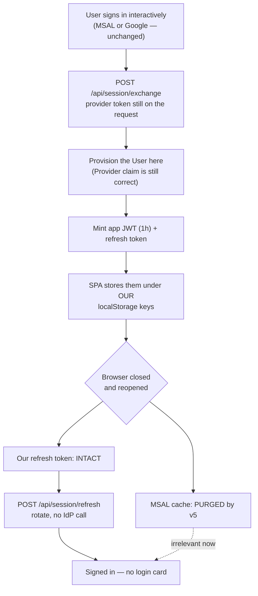
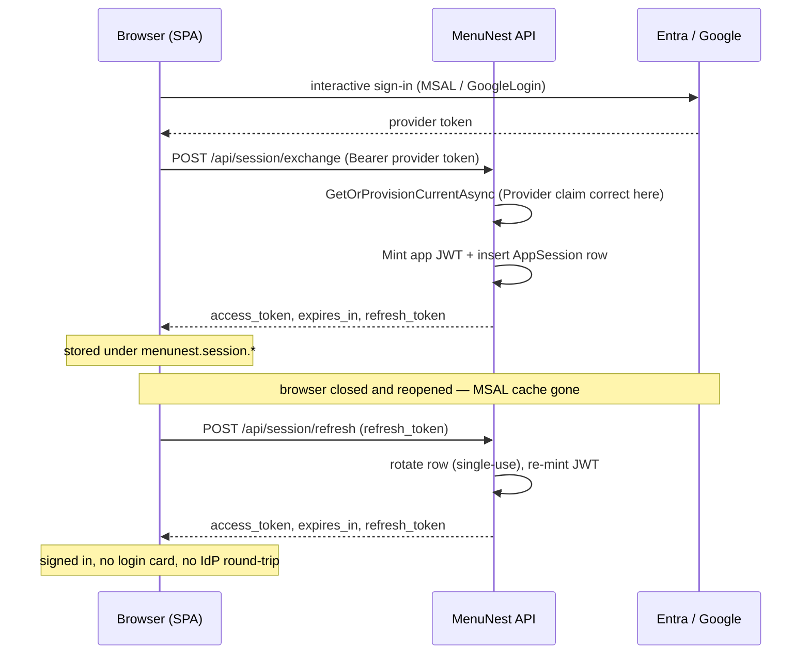

# Design: a durable SPA session that survives closing the browser (issue #5)

**Date:** 2026-08-12 · **Status:** awaiting approval
**ADRs:** ADR-159 (logout scope), ADR-160 (both providers stay), ADR-161 (app-minted session;
**supersedes ADR-036**)

## 1. Problem, and the verified cause

Closing the browser forces a full re-login, every time. Verified this session (debug-mantra),
not hypothesised:

- `@azure/msal-browser` **5.6.3** encrypts everything it writes to `localStorage` with a key held
  in the **session cookie** `msal.cache.encryption`. `LocalStorage.mjs` writes it via
  `CookieStorage.setItem(..., cookieLifeDays = 0, ...)`, and `if (cookieLifeDays)` is falsy at 0,
  so **no `expires` attribute is emitted → a session cookie**. On the next browser start MSAL
  mints a new key and `decryptData` discards every entry whose `id` differs, commented in the
  vendor source as *"from a previous session"*.
- Confirmed live on production with no credentials: loading the signed-out app already plants
  `msal.cache.encryption` carrying a 32-byte key.
- Entra's own `ESTSAUTH` is **also** session-scoped (the user does not tick "Stay signed in?"),
  which is why the password is retyped rather than silently re-issued.

Production telemetry (30 days, App Insights): **95 of 141** sessions start at `/login`; gaps over
24 h land on `/login` **15 times out of 16**; `GET /api/me` returned 401 only **4** times against
272 successes — the user is not being kicked out mid-session, they arrive with no session at all.

**ADR-036 is superseded.** Its premise (localStorage persists across browser sessions) is false
for MSAL v5, which this repo has used since the initial scaffold. Login-first sessions went
65% → 69% after that fix shipped.

## 2. What we are building

The SPA keeps MSAL / Google for the **interactive sign-in only**, then exchanges the provider
token for a **MenuNest app session**: a 1-hour access JWT plus a rotating refresh token stored
under our **own** `localStorage` keys, which MSAL's encryption does not govern.

Refresh is **self-contained** — it re-mints from the stored subject and never calls Entra or
Google. That is what lets one mechanism serve **both** buttons (ADR-160) rather than Microsoft
only.

## 3. Backend

### 3.1 New table `AppSessions`

Deliberately **not** reusing `OAuthRefreshTokens`: its `EntraRefreshToken` column is
`IsRequired()` (`OAuthRefreshTokenConfiguration.cs:14`) and the MCP refresh path dereferences it
on every call. Making it nullable to host a self-contained session would put a null into a code
path that must never see one.

| column | type | notes |
|---|---|---|
| `RefreshCode` | string(128), PK, `ValueGeneratedNever` | opaque, from `TokenUtil.Opaque()` |
| `Subject` | string(128), required | the `oid` / Google `sub` — same value as `ExternalId` |
| `ExpiresAt` | datetime, required | `UtcNow + 365d`, re-stamped on every rotation |
| `CreatedAt` | datetime, required | |

Rotation is **single-use**, mirroring `TokenStore.TakeRefreshAsync`: the presented row is deleted
and a fresh one inserted, so the 365-day clock rolls forward on every use (decision: idle expiry
= 365 days from last use — the existing behaviour, kept).

Per CLAUDE.md the `DbSet<AppSession>` must be added to **all three** `IApplicationDbContext`
implementers (`AppDbContext`, `SqliteAppDbContext`, `InMemoryAppDbContext`) **and** its EF
configuration **in the same commit**, or every DbContext test fails model validation.

The EF migration is **applied to prod by hand** (CLAUDE.md) — neither the app nor CD runs
`Migrate()`.

### 3.2 Endpoints

| endpoint | auth | behaviour |
|---|---|---|
| `POST /api/session/exchange` | existing `MultiAuth` (Microsoft/Google) | provision the User, mint JWT, insert row, return the pair |
| `POST /api/session/refresh` | `[AllowAnonymous]` | rotate the row, re-mint; `400 invalid_grant` if missing/expired |
| `POST /api/session/logout` | `[AllowAnonymous]` | delete **only** the presented row (ADR-159) |

`refresh` and `logout` must carry `[AllowAnonymous]` explicitly — `Program.cs` sets a
`FallbackPolicy` requiring an authenticated user on every endpoint, and by refresh time the
access token is expired by definition.

These are **separate** from `/oauth/token`: that endpoint is the MCP proxy's OAuth 2.1 contract
(grant types, PKCE, DCR clients) and its refresh branch is anchored on a server-held Entra
refresh token we deliberately do not have.

**Provision at exchange, not at mint.** `CurrentUserService.Provider` reads the `iss` claim and
recognises only `accounts.google.com` / `login.microsoftonline.com` / `sts.windows.net`. Our JWT
carries `iss = serverUrl`, so `Provider` would be `null` and `UserProvisioner` would silently
default a brand-new Google user to `AuthProvider.Microsoft`. Calling `GetOrProvisionCurrentAsync`
inside `exchange` — while the real provider token is still on the request — records the right
provider and means the app JWT never has to carry it. Existing users are unaffected either way:
`GetOrProvisionCurrentAsync` returns early on an `ExternalId` match and never rewrites
`AuthProvider`.

### 3.3 Accepting the token on `/api/*`

`ForwardDefaultSelector` (`Program.cs:51`) currently sends Google-issuer tokens to `Google` and
**everything else to `Microsoft`**, so an app-minted JWT would be handed to the Entra handler and
rejected. Add a branch before the fallback: when `jwt.Issuer` equals the configured server URL,
forward to the existing **`McpProxy`** scheme, which already validates exactly these tokens
(`MapInboundClaims = false`, `OAuthJwt.ValidationParameters()`).

`Mint` emits both `sub` and `oid` set to the subject, and `CurrentUserService.ExternalId` resolves
`objectidentifier` ?? `oid` ?? `sub` — so **the app session maps to the same User row**, with the
same trips and family. Verified explicitly, because this is the one failure mode that would be
unrecoverable.

*Naming debt (accepted):* the scheme keeps the name `McpProxy` while now also serving the SPA. A
consequence is that an app-session token is also accepted at `/mcp`; both represent the same
user, so this is not an escalation.

## 4. Frontend

Storage under our own keys — `menunest.session.access`, `menunest.session.refresh`,
`menunest.session.expiresAt`. Nothing in MSAL governs these.

**Both** token-acquisition sites must change; there are exactly two, and missing either leaves
that surface broken after a browser close:

1. `api.ts:63` `acquireAccessToken()` — RTK Query.
2. `useAuthDataManager.ts:157` — the Syncfusion `DataManager`, which today calls
   `acquireTokenSilent` directly. It must call the shared `acquireAccessToken()` instead.

New order inside `acquireAccessToken()`: **app session** (refreshing when within 60 s of expiry)
→ MSAL → Google.

Other touch points:

- After a successful MSAL or Google sign-in, call `exchange` once and store the result. If
  `exchange` fails (API down, not yet deployed), **degrade gracefully**: stay signed in on the
  provider token as today and retry the exchange on the next load. A failed exchange must never
  block sign-in.
- `ProtectedRoute.tsx:28` — treat a valid app session as authenticated, alongside
  `useIsAuthenticated()` and `isGoogleAuthenticated()`.
- `useCurrentUser.signOut` (`useCurrentUser.ts:34`) — call `logout`, clear our keys, then the
  existing behaviour.
- `handleAuthFailure` (`reauth.ts:34`) — clear our keys too, or a dead session survives the bounce.

Put the storage/expiry logic in a pure `lib/` module. CLAUDE.md is explicit that the SPA has
**no jsdom / component harness**, so only pure modules get real test coverage — this mirrors how
`googleAuth.ts` is structured and tested.

## 5. Testing

- **Frontend (vitest, node env):** the pure session module — store, read, expiry leeway,
  clear-on-401 — mirroring `googleAuth.test.ts`.
- **Backend:** `MenuNest.WebApi.UnitTests` for the `ForwardDefaultSelector` issuer branch and the
  three endpoints (CLAUDE.md names it the home for web-layer/claims/middleware tests). Moq +
  xUnit + FluentAssertions — **not** NSubstitute.
- **Relational:** `SqliteAppDbContext` for the rotation/expiry queries, so the real EF
  configuration and indexes are exercised.
- **Manual, required:** sign in → close the browser completely → reopen → confirm the app opens
  signed in with no login card. This is the acceptance test and no automated gate covers it.

## 6. Out of scope

- "ออกจากทุกอุปกรณ์" (Phase 2, ADR-159).
- Google's ~1 h ID-token ceiling as an *interactive* login — the app session removes it from the
  session, but a Google sign-in itself is still a fresh interactive login.
- A pre-existing, unrelated bug found while tracing: `useAuthDataManager` has **no Google
  fallback**, so a Google-signed-in user gets a `null` DataManager on Syncfusion Grid pages today.
  Noted, not fixed here.
- Removing MSAL from the SPA.

## 7. Accepted risks

- The refresh never re-validates upstream: disabling or password-changing the Microsoft/Google
  account does **not** end an existing app session (ADR-161). With ADR-159's Phase-1 lack of a
  remote sign-out, a lost device stays signed in until its row is deleted by hand.
- The refresh token is XSS-readable in `localStorage` — the same trade-off ADR-036 accepted
  explicitly, now with a longer-lived credential.
