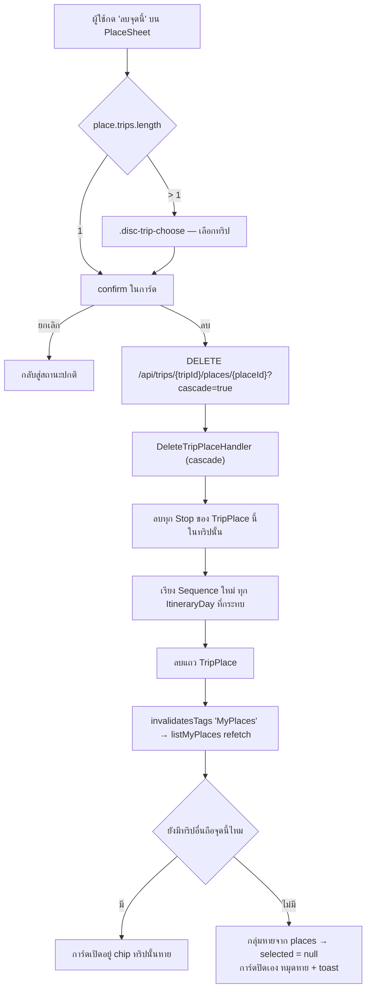

# Design — a delete control on Discover (ไปไหนดี)

**Date:** 2026-08-15
**Status:** Awaiting approval
**Decisions:** ADR-166 (the pin stays grouped; a delete names the **Trip**), ADR-167 (a scheduled
**Stop** cascades, opt-in per call), ADR-168 (the confirm lives in the sheet and names the count).
**Mockup:** *MenuNest design system* → **Screens** → `discover-place-delete`
(https://claude.ai/design/8d8d4c81-41c1-4e0a-a0b7-370b39dfbe70)
**Evidence:** `docs/decision-map/discover-place-delete/evidence/current-model-er.md`

Everything below was read off `main` at `85b39fe`. Line references are from that commit.



## 1. What this adds, in one paragraph

`PlaceSheet` gains a **"ลบจุดนี้"** action. It removes the place from **one Trip** — the Trip the
user names — by calling the `DELETE` endpoint that already exists. Because a Discover pin is a
read-time group over N `TripPlace` rows (`ListMyPlacesHandler:43`), the read model must start
carrying the per-Trip row id; because most of these places are already scheduled, the delete must be
able to take their **Stop**s with it. Nothing else about Discover changes, and there is **no schema
change and no migration**.

## 2. Backend

### 2.1 `PlaceTripRefDto` carries the row id and the scheduled count

`backend/src/MenuNest.Application/UseCases/Places/PlaceDtos.cs:7`

```csharp
public sealed record PlaceTripRefDto(Guid TripId, string TripName, Guid TripPlaceId, int ScheduledStopCount);
```

`TripPlaceId` is what makes the delete addressable (ADR-166); `ScheduledStopCount` is what lets the
confirm name a number (ADR-168). **The only construction site in the repo is
`ListMyPlacesHandler.cs:57`** — verified by grep across `backend/`; no test builds one.

### 2.2 `ListMyPlacesHandler` — one query does both jobs

`backend/src/MenuNest.Application/UseCases/Places/ListMyPlaces/ListMyPlacesHandler.cs`

Today, `:35-39` reads the `Stops` table purely to decide the "มาแล้ว" badge:

```csharp
var visitedPlaceIds = (await _db.Stops
    .Where(s => placeIds.Contains(s.TripPlaceId) && s.IsVisited)
    .Select(s => s.TripPlaceId).Distinct().ToListAsync(ct)).ToHashSet();
```

It becomes one read over the same table and the same `placeIds`, projecting both facts:

```csharp
var stopRows = await _db.Stops
    .Where(s => placeIds.Contains(s.TripPlaceId))
    .Select(s => new { s.TripPlaceId, s.IsVisited })
    .ToListAsync(ct);

var visitedPlaceIds = stopRows.Where(s => s.IsVisited).Select(s => s.TripPlaceId).ToHashSet();
var stopCountByPlaceId = stopRows.GroupBy(s => s.TripPlaceId).ToDictionary(g => g.Key, g => g.Count());
```

**The one honest cost:** the `IsVisited` predicate moves out of SQL, so the query returns every Stop
for those places rather than only the visited ones. Same table, same index, same round trip — more
rows on the wire, bounded by the user's own itinerary size. This is the whole reason ADR-168 could
name a count for free.

`:57-60` then carries both new values:

```csharp
var trips = g.Select(r => new PlaceTripRefDto(
                  r.TripId, r.TripName, r.Place.Id,
                  stopCountByPlaceId.TryGetValue(r.Place.Id, out var n) ? n : 0))
             .GroupBy(x => x.TripId).Select(x => x.First()).ToList();
```

The `GroupBy(TripId).First()` stays as-is. ADR-166 records the residue it leaves: one Trip holding
two rows in the same group surfaces only one `TripPlaceId`. Not addressed here.

### 2.3 `DeleteTripPlaceCommand` gains an opt-in switch

`backend/src/MenuNest.Application/UseCases/Trips/DeleteTripPlace/DeleteTripPlaceCommand.cs`

```csharp
public sealed record DeleteTripPlaceCommand(Guid TripId, Guid PlaceId, bool Cascade = false) : ICommand<Unit>;
```

**The default is what protects the existing callers.** All four construction sites keep compiling
and keep today's behaviour — `TripsController.cs:85`, `TripTools.cs:137` (MCP), and
`DeleteTripPlaceHandlerTests.cs:29,46`.

### 2.4 `DeleteTripPlaceHandler` — the cascade branch

`backend/src/MenuNest.Application/UseCases/Trips/DeleteTripPlace/DeleteTripPlaceHandler.cs`

Ownership check (`:16-21`) is unchanged. The scheduled-Stop guard at `:23-27` becomes conditional:

- **`Cascade == false`** — identical to today, including the message
  *"ลบไม่ได้ — สถานที่นี้ถูกจัดลงตารางแล้ว ลบจุดในแผนก่อน"*.
- **`Cascade == true`** — instead of refusing:
  1. load the Stops for this `TripPlace` **within this Trip** (the same
     `s.TripPlaceId == c.PlaceId && day.TripId == c.TripId` shape the guard already uses);
  2. `_db.Stops.RemoveRange(...)` them;
  3. for **each distinct `ItineraryDayId`** among them, resequence the day's survivors to `0..n-1`
     by ascending `Sequence` — the invariant `RemoveStopHandler:27-33` maintains, applied per
     affected day because **a Place may be scheduled on more than one day**;
  4. `_db.TripPlaces.Remove(place)`;
  5. one `SaveChangesAsync`.

Two schema facts this rests on, both verified:

| Fact | Where | Why it matters |
|---|---|---|
| `Stop → TripPlace` is `DeleteBehavior.NoAction` | `StopConfiguration.cs:23` | no database cascade exists; the Stops must be deleted explicitly, and before the principal row |
| `StopChecklistEntry → Stop` is `DeleteBehavior.Cascade` | `StopChecklistEntryConfiguration.cs:20` | the **Checked** flags follow automatically — no extra code, and their loss is intended (ADR-167) |

### 2.5 The endpoint

`backend/src/MenuNest.WebApi/Controllers/TripsController.cs:83-85`

```csharp
[HttpDelete("api/trips/{id:guid}/places/{placeId:guid}")]
public async Task<IActionResult> DeletePlace(Guid id, Guid placeId, [FromQuery] bool cascade, CancellationToken ct)
{ await _mediator.Send(new DeleteTripPlaceCommand(id, placeId, cascade), ct); return NoContent(); }
```

An absent `cascade` binds to `false`, so the route's behaviour for every existing caller is
unchanged.

**The MCP tool is deliberately not given the switch.** `TripTools.cs:137` keeps sending the
two-argument command, so an agent deleting a place still gets the refusal and has to remove the Stop
first. The cascade is a surface with a confirmation behind it; MCP has no confirmation.

## 3. Frontend

### 3.1 Types and the mutation

`frontend/src/shared/api/api.ts`

- `:563` — `export interface PlaceTripRefDto { tripId: string; tripName: string; tripPlaceId: string; scheduledStopCount: number }`
- `:1431-1434` — `deleteTripPlace` takes `{tripId, placeId, cascade?: boolean}` and appends the query
  string. **`invalidatesTags` is already correct**: it lists `'MyPlaces'` at `:1433`, which is the
  tag `listMyPlaces` provides (`:1421`), so Discover refetches with no new wiring.

### 3.2 `PlaceSheet` — three states, one component

`frontend/src/pages/discover/components/PlaceSheet.tsx`

The component already models exactly this shape for a different action: `choosing` +
`.disc-trip-choose` (`:22-31`, `:95-103`) is the "เปิดทริป (2)" chooser. The delete reuses the
pattern rather than inventing one.

```
 idle ──[ลบจุดนี้]──▶ choosing ──[เลือกทริป]──▶ confirming(trip)
   ▲                     │                          │
   └───────[ยกเลิก]──────┴──────────────────────────┘

 trips.length === 1  →  idle ──[ลบจุดนี้]──▶ confirming(trips[0])
```

- **The button** is the last row of `.disc-actions`, full width, `.disc-abtn danger` — after
  "สร้างทริปใหม่". Destructive last; the same placement reasoning as ADR-143.
- **The confirm renders inline in the sheet**, never through a portal. `PlaceSheet`'s tokens are
  page-scoped; a portaled node breaks DOM ancestry and `var(--…)` silently resolves to nothing.
- **Copy**, per ADR-168 and the mockup:
  - title — `เอา "<ชื่อ>" ออกจาก <ชื่อทริป>?`
  - warning, **rendered only when `scheduledStopCount > 0`** —
    `จุดนี้อยู่ในแผนของทริปนี้ N จุด — จะถูกลบไปด้วย`
  - always — `โน้ต · ลิงก์รีวิว · ช่วงเวลาที่ดี ยังอยู่ในคลังของคุณ`
  - actions — `ยกเลิก` / `ลบ`
- **On confirm** it calls the mutation with `cascade: true` and clears its local state. A failure
  renders the server message inline in the confirm block, the way `PlaceEditorDialog:68-76` renders
  `getErrorMessage(err)`.

### 3.3 What happens after — mostly nothing to write

`frontend/src/pages/discover/DiscoverPage.tsx:69-73` derives the open sheet from the list:

```ts
const p = places.find((pl) => pl.key === selectedKey)
```

So once `listMyPlaces` refetches:

- **other Trips remain** — the group is still there, `selected` re-derives, and the deleted Trip's
  chip is simply absent from `place.trips`;
- **it was the last Trip** — the group is gone, `places.find` returns `undefined`, `selected`
  becomes `null`, and `:240-250` swaps `PlaceSheet` back to `PlaceBottomSheet` while the marker
  disappears with the data.

**The sheet closes itself and the pin vanishes with no code for either.** The only thing to add is
the acknowledgement: a `.disc-armed-toast`-classed strip reading **ลบแล้ว**. That class already
exists in `DiscoverPage.css:728` and is used by `DiscoverMap.tsx:247` with `role="status"`; the page
renders its own element with the same class rather than lifting the map's.

### 3.4 CSS

`frontend/src/pages/discover/DiscoverPage.css` — `.disc-abtn.danger`, `.disc-abtn.danger-solid`,
`.disc-del-choose`, and the confirm block, matching the mockup's tokens
(`--bad:#b42318`, `--bad-bg:#fdeceb`, `--bad-edge:#f6cdc9`, warn `#fff4e0`/`#7a5310`).

## 4. Tests

| Layer | Case |
|---|---|
| `Application.UnitTests` (SQLite) | `Cascade == false` still refuses on a scheduled place — the **existing** `DeleteTripPlaceHandlerTests` must pass **unmodified** |
| " | `Cascade == true` deletes the row and its Stops; the day's survivors come back sequenced `0..n-1` with no gap |
| " | a place scheduled on **two days** removes both Stops and resequences **both** days |
| " | `StopChecklistEntry` rows for the removed Stops are gone (relational context only — the InMemory provider ignores the FK) |
| " | `Cascade == true` on an **unscheduled** place behaves exactly like today's success path |
| " | ownership still enforced: another user's Trip throws, with or without the flag |
| `ListMyPlaces` tests | `Trips[]` carries the per-Trip `TripPlaceId`; `ScheduledStopCount` is the number of Stops for that row and `0` when unscheduled; `Visited` is unchanged by the query rewrite |

Frontend has no component harness (`vite.config.ts` runs vitest in `environment: 'node'`), so the
state machine in §3.2 is **not** coverable by a unit test unless the reducer is extracted to
`lib/`. Extracting it is worth it: the `trips.length === 1` shortcut and the "hide the warning at
0" rule are both pure functions of the DTO.

## 5. Verification before this ships

Automated gates cannot see this feature. `tsc -b`, `npm run build` and the unit suite all pass on a
sheet whose confirm never renders. Before merge:

1. run the app and delete a place that is **scheduled**, confirming the count in the dialog matches
   the Stops that actually disappear from the itinerary;
2. delete from a place held by **two** Trips and confirm the sheet stays open with one chip gone;
3. delete the **last** Trip and confirm the pin leaves the map and the sheet closes;
4. diff the rendered sheet against the mockup card — the review gates do not do this.

## 6. Out of scope

- Re-opening ADR-155 — a **Place** stays owned by a **Trip**.
- Deleting from every Trip in one action ("ทุกทริป") — cut in ADR-168.
- Naming *which day* a Stop sits on in the confirm — the count is free, the day is not.
- Deleting the **Place profile** along with the pin. It survives by design (ADR-065); the confirm
  says so.
- The `GroupBy(TripId).First()` residue from ADR-166.
- Giving the MCP surface a cascade.
