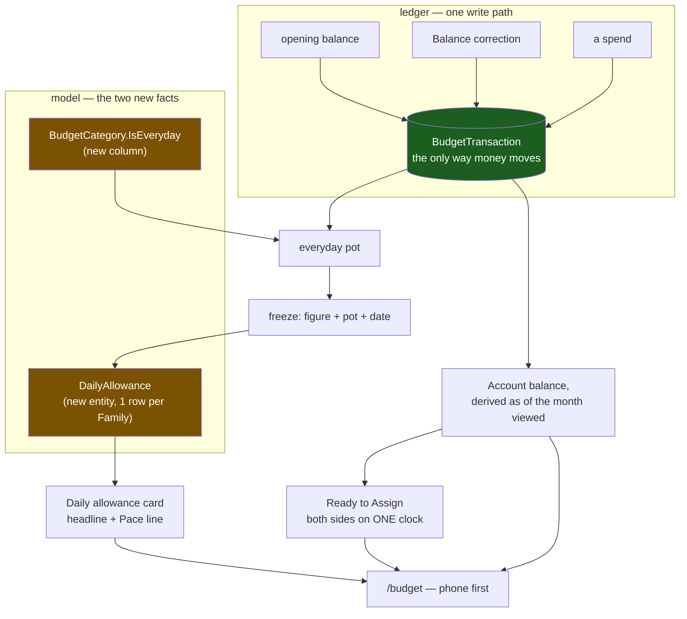
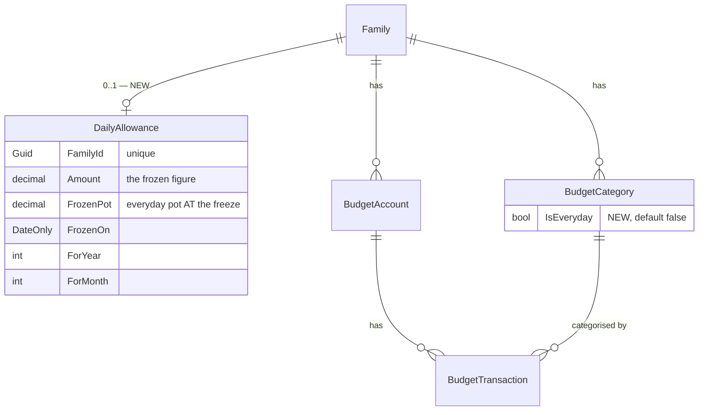
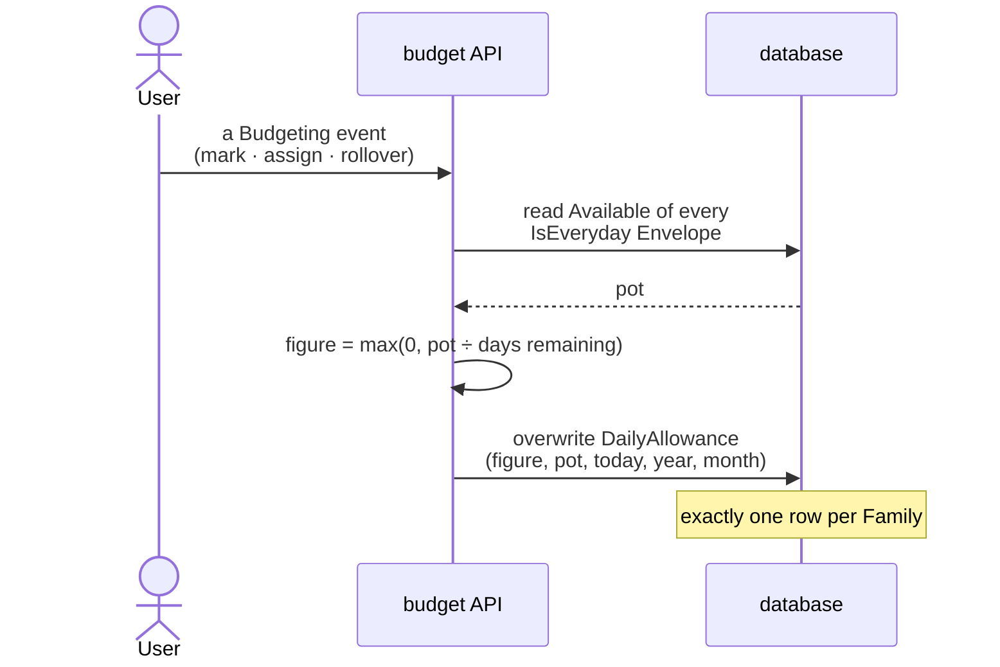
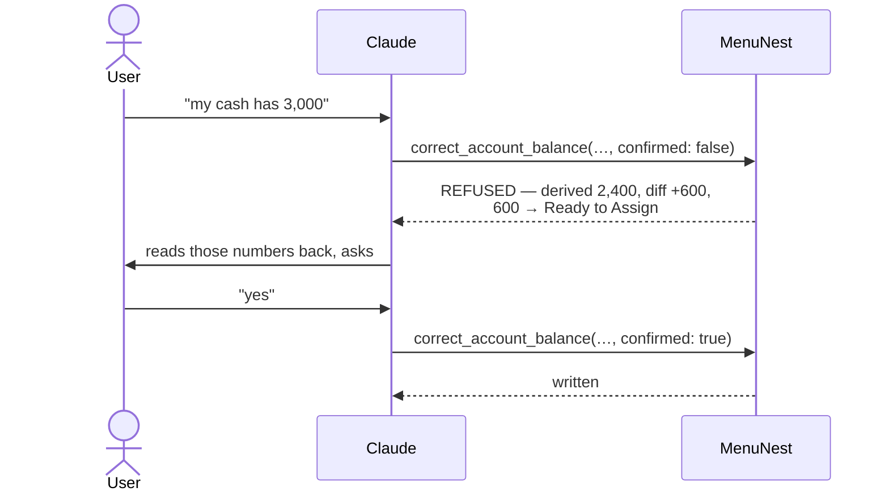

# Budget rework — `mvp` milestone design spec

**Issue:** #99 · **Milestone:** `mvp` on decision map `budget-rework-99`
**Decisions this implements:** menunest-181, -182 (from the map's tickets) and
menunest-183 … -188 (from this grilling session)
**Approved screen:** Claude Design → `MenuNest design system` →
`screens/budget-shell.html` (project `107862ef-c14b-42f4-a8f2-4bbe36951e25`)

The milestone's own sentence is the acceptance test: *on the phone, set what each
**Account** holds, and see "today you can spend X".*

---

## 1. Scope

### In

| # | Thing | Decision |
|---|---|---|
| 1 | Every movement of money writes a **Budget transaction** — opening balance included | menunest-182, -183 |
| 2 | An **Account**'s balance is derived as of the month being viewed | menunest-182, -183 |
| 3 | `SetBalance` and its MCP parameter are deleted; a gated correction tool replaces them | menunest-182, -187 |
| 4 | **Everyday envelope** mark, set in bulk from a sheet | menunest-181, -184 |
| 5 | **Daily allowance** — frozen figure, current month only | menunest-181, -185 |
| 6 | **Pace line** — completed days only | menunest-181, -186 |
| 7 | One-tap ✎ on an **Account**, one-tap ＋ on an **Envelope** | `budget-shell-ux` |
| 8 | Destructive migration, no back-fill | menunest-188 |

### Out — these are open tickets on the map and must not be touched

`planned-income-model` · `future-month-view` · `zero-out-affordance` ·
`rollout-verification-bar` · `conversational-budget-jobs`.

Concretely that means: **future months are still wrong** (they show money held
today), the envelope list keeps its current shape, and no zero-out affordance is
added. Also still fog and deliberately untouched: closed/`Loan`/`Credit`
**Accounts** counting toward **Ready to Assign**, and replacing
`ComputeEnvelopeAvailable`'s walk from January 2000.

---

## 2. Model changes

### 2.1 `BudgetCategory.IsEveryday`

New `bool`, default `false`. On the **Envelope**, never the group (menunest-181)
— verified: neither `BudgetCategory` nor `BudgetCategoryGroup` carries anything
like it today.

### 2.2 `DailyAllowance` — new entity

One row per **Family** (unique index on `FamilyId`), overwritten at every freeze
(menunest-185). It stores four things, and `FrozenPot` is the one that is not
obvious — see §4.2 for why it must exist.

**CLAUDE.md gate:** a new `DbSet<DailyAllowance>` must be added to **all three**
`IApplicationDbContext` implementers (`AppDbContext`, `SqliteAppDbContext`,
`InMemoryAppDbContext`) **and** its `DailyAllowanceConfiguration` must land in the
**same commit** as the entity. An unmapped entity fails EF model validation for
every test that touches the context, so an "entity now / mapping next" split can
never pass the pre-commit hook.

### 2.3 What is deleted

- `BudgetAccount.SetBalance(decimal)` — the method itself.
- `UpdateAccountCommand.SetBalance` and its use at `UpdateAccountHandler.cs:27`.
- `update_budget_account`'s `setBalance` parameter (`BudgetTools.cs:59`) and the
  "manually set its balance" clause in its description.

`AdjustBalance` **stays**. `BudgetAccount.Balance` survives as a cache of today's
total (menunest-182). It is read by `list_budget_accounts` / `ListAccounts` and by
the account-detail page — **not** by `GetMonthlySummary`, which derives instead
(§3.3). Every transaction write must keep calling `AdjustBalance`, or the cache
silently rots.

---

## 3. The ledger — one write path

### 3.1 Opening balance becomes a transaction

`CreateAccountHandler` currently passes `cmd.OpeningBalance` into
`BudgetAccount.Create(...)`, which writes it straight onto `Balance`. It must
instead create the **Account** with a zero balance and post one **Budget
transaction**: `categoryId: null`, `amount: openingBalance`, `date: today`,
`notes: "Opening balance"` — then `AdjustBalance` to keep the cache true.

**Edge case:** `BudgetTransaction.Create` throws when `amount == 0`
(`BudgetTransaction.cs:27`). An **Account** opened at ฿0 must therefore write **no**
transaction, not a zero one.

Uncategorised, so it lands in **Ready to Assign** — which is correct: money in an
**Account** and in no **Envelope** is by definition unassigned.

### 3.2 Balance correction

New use case `CorrectAccountBalance`. Given a stated true balance, it derives the
current balance, computes the difference, and posts one **Budget transaction**
(`categoryId: null`, `amount: difference`, caller-supplied `date` defaulting to
today, `notes` defaulting to `"Balance correction"`).

A zero difference writes nothing and is not an error.

`ReconcileBalanceDialog` already does exactly this on the web
(`ReconcileBalanceDialog.tsx:48-51` — `categoryId: null, amount: diff, notes:
'Manual balance fix'`). It is repointed at the new use case; its behaviour and its
dialog do not change.

### 3.3 Derived balance, as of the month viewed

In `GetMonthlySummaryHandler`, each **Account**'s balance for the response becomes
`SUM(BudgetTransaction.Amount) WHERE AccountId = a.Id AND Date < nextMonth`,
replacing the read of `a.Balance` in **both** places it is used — the accounts list
(step 7) and the `totalAccountBalance` that feeds **Ready to Assign** (step 5).

This is the whole of the two-clock fix: **Ready to Assign** already measures
envelopes as of the selected month, so putting the **Account** side on the same
clock repairs every past month.

**Do it in one query, not per account** — one grouped sum over
`BudgetTransactions` filtered by `FamilyId` and `Date < nextMonth`, then joined in
memory. The naive shape is a query per **Account**.

---

## 4. The Daily allowance

### 4.1 The freeze

- **pot** = sum of `Available` over every **Envelope** with `IsEveryday = true`,
  as of the current month. `ComputeEnvelopeAvailable` already produces `Available`
  per **Envelope** — reuse it, do not write a second accumulator.
- **days remaining** = `daysInMonth − today.Day + 1` — inclusive of today, matching
  menunest-181's worked example (`6,000 ÷ 11` on 21 August).
- **floor at 0** when the pot is empty or negative (menunest-181).

**The three Budgeting events** (menunest-181): marking/unmarking an **Everyday
envelope**; assigning into one (`SetAssignedAmount`, `MoveMoney`,
`CoverOverspending` where an everyday **Envelope** is involved); month rollover.
Recording a spend is **not** one.

**Rollover is lazy.** There is no scheduler. When `GetMonthlySummary` reads the row
and `ForYear`/`ForMonth` are not the current month, it re-freezes and persists
before responding. This is idempotent and happens once per month per **Family**.

### 4.2 The Pace line, and why `FrozenPot` exists

- **should-have-spent** = `Amount × completedDays`, where
  `completedDays = max(0, today − FrozenOn)`. Zero on the freeze day, so the line
  is silent that day (menunest-186).
- **actually-spent** = `FrozenPot − currentPot`.

That second line is the subtle part. The obvious implementation — summing
**Budget transactions** on everyday **Envelopes** with `Date >= FrozenOn` — is
**wrong**, because `BudgetTransaction.Date` is a `DateOnly`
(`BudgetTransaction.cs:17`): a spend made *earlier the same day* as the freeze
carries the same date, and would be counted as spending-since-freeze even though
the frozen pot already had it deducted. Measuring pot-against-pot has no date
arithmetic in it at all and cannot double-count.

It is also correct by construction: between two freezes the **only** thing that
moves the pot is a **Budget transaction** on an everyday **Envelope**, because
assigning and marking both re-freeze.

Render: `actual > should` → "you are ฿X over"; `actual < should` → "you are ฿X
under"; equal, or `completedDays == 0` → nothing.

### 4.3 The empty state

No **Envelope** marked `IsEveryday` → the card shows the invitation, never a
number (menunest-181). A missing `DailyAllowance` row shows the same thing
(menunest-185), so the two cases collapse into one branch.

### 4.4 Response shape

`MonthlySummaryDto` gains a nullable `dailyAllowance`. It is `null` whenever the
requested month is not the current real month — the card is current-month only
(menunest-185), and the check is against today's date, not an assumption about
which month was asked for.

---

## 5. MCP surface

| Tool | Change |
|---|---|
| `update_budget_account` | loses `setBalance`; keeps name, sort order, closed. Description corrected. |
| `create_budget_account` | unchanged signature; `openingBalance` now writes a **Budget transaction** (§3.1). Not gated — stating a balance at creation is not a correction. |
| `correct_account_balance` | **new**, gated |

**No everyday-marking tool is added.** menunest-181 explicitly leaves "marking an
**Envelope** as everyday as an MCP write" to `conversational-budget-jobs`, which is
still open. `correct_account_balance` is in scope only because it is *forced*:
deleting `SetBalance` breaks `update_budget_account`, so the assistant's balance
path must be rebuilt in this milestone or left broken. Nothing breaks without a
marking tool, so it waits for the ticket that owns it.

### 5.1 The gate (menunest-187)

`correct_account_balance(accountId, actualBalance, confirmed, date?, notes?)`.

Modelled on ADR-140's **Shrink** refusal on `update_trip`, which is this repo's
established route for "make the caller confirm" — there are no MCP tool
annotations anywhere in this codebase.

**The refusal text is user-facing**: it must name the derived balance, the
difference, and the **Ready to Assign** movement in real numbers. A generic
rejection defeats the whole mechanism, because the refusal *is* the question the
user gets asked.

---

## 6. Frontend

All under `frontend/src/pages/budget/`. Order on screen is fixed by the approved
mock and is unchanged from it.

| Component | Change |
|---|---|
| `DailyAllowanceCard.tsx` | **new** — headline, **Pace line**, "won't change if you spend more today", empty state. Sits above `RtaHero`. |
| `EverydayMarksSheet.tsx` | **new** — every **Envelope**, tick boxes, **no group filter** (the mark is group-independent). Opened by tapping the card. Commits **on close**, once. |
| `EnvelopeCard.tsx` | a dot on the collapsed row when `isEveryday`; a `＋` icon beside the existing `⇄`. |
| `AccountsStrip.tsx` | a `✎` icon per **Account** card → `ReconcileBalanceDialog` directly, no detour through account-detail. |
| `budgetSlice.ts` | carry `dailyAllowance`; actions for the marks and the correction. |
| `BudgetPage.css` | tokens only, from the mock's `bdg-` scope. |

**Collapsed-row crowding is real.** The row today shows emoji, name, one icon
(`⚠` when overspent, else `⇄`), and the money pill. It gains the everyday dot and
the `＋`. Check the overspent case specifically — that is where the most glyphs
compete for the least room.

---

## 7. Migration (menunest-188)

One EF migration in `backend/src/MenuNest.Infrastructure/Persistence/Migrations/`:

1. `DELETE` every `BudgetTransaction`, `MonthlyAssignment`, `BudgetCategory`,
   `BudgetCategoryGroup`, `BudgetAccount` for all families.
2. Add `BudgetCategories.IsEveryday`.
3. Create the `DailyAllowances` table.

**No back-fill.** The old **Account** data is not valid any more, so nothing is
preserved and no reconciliation code is written.

**Applied by hand** — per CLAUDE.md neither `Program.cs` nor
`.github/workflows/main_menunest.yml` runs migrations. Preview with
`dotnet ef migrations script --idempotent` first. Expect the prod SQL firewall to
need a temporary IP rule (add → apply → remove).

**After applying, the budget is empty.** The **Accounts** and **Envelopes** must be
recreated by hand once. That is the intended first real exercise of the new
opening-balance path.

---

## 8. Testing

### What the automated gates cannot see

CLAUDE.md is explicit and it matters more than usual here, because execution is
**subagent-driven development**: `tsc`, `npm run build` and vitest run in
`environment: 'node'` with no jsdom, so **none of them render anything** — and
**SDD's per-task review does not render the UI or compare it to the mock either**.
A UI task can pass every gate and ship visibly wrong (#46 shipped a flat
`HourlyPlanner` straight through every gate; #97 shipped an unstyled RTE because
no e2e spec covered the page).

So for every UI task in §6, two things are required beyond a green review:

1. **Diff the produced CSS/markup against the mock** — fetch
   `screens/budget-shell.html` via `DesignSync get_file` and compare tokens,
   colours and structure.
2. **Verify interactively** before push, because prod deploys on merge to `main`.

### Test placement

| Test | Project |
|---|---|
| derived as-of-month balance; opening balance writes a tx; zero-opening writes none | `MenuNest.Application.UnitTests` (`SqliteAppDbContext`) |
| freeze arithmetic, floor at 0, the three **Budgeting events**, lazy rollover | `MenuNest.Application.UnitTests` |
| **Pace line**: silent on freeze day; same-day-spend NOT double-counted | `MenuNest.Application.UnitTests` |
| the refuse-then-confirm gate — unconfirmed writes nothing | `MenuNest.McpServer.UnitTests` |

Mock `IUserProvisioner` with **Moq**, not NSubstitute.

**The derived-balance suite carries the weight.** menunest-188 destroyed the
free correctness check the back-fill would have given, so seeded transactions with
chosen dates spanning month boundaries and both signs are the only evidence the
derivation is right.

### Playwright

The four existing specs (`budget.smoke`, `budget.interactions`,
`budget.account-tx-crud`, `budget.add-entry-points`) must stay green. Add
`budget.daily-allowance.spec.ts`: empty state → open sheet → tick two **Envelopes**
→ close → a figure renders; and the card is **absent** after pressing `‹`.

---

## 9. Execution

Plan for **subagent-driven development**, tasks in this order — each one leaving
the full suite green, because the pre-commit hook runs all of it:

1. Model + EF config + all three `DbSet`s + migration *(one commit — CLAUDE.md)*
2. Opening balance → transaction; delete `SetBalance`
3. Derived as-of-month balance in `GetMonthlySummary`
4. Freeze + **Pace line** computation
5. MCP: drop `setBalance`, add `correct_account_balance` + the gate
6. `DailyAllowanceCard` + empty state
7. `EverydayMarksSheet` + the dot
8. One-tap `✎` and `＋`
9. Playwright spec; apply migration; recreate data; verify interactively

Commits: conventional style, `(#99)` or `Refs #99`. Stage explicit paths only —
never `git add -A`; `daily-state.md` and `AGENTS.md` must never be swept in.

---

## 10. Open, by design

- Future months still show money held today — `planned-income-model`.
- Closed / `Loan` / `Credit` **Accounts** still count toward **Ready to Assign** —
  fog.
- `ComputeEnvelopeAvailable`'s walk from January 2000 now runs a third pass and is
  still not replaced — fog.
- Two family members budgeting at once — fog. One stored figure per **Family**
  means the last **Budgeting event** wins.
