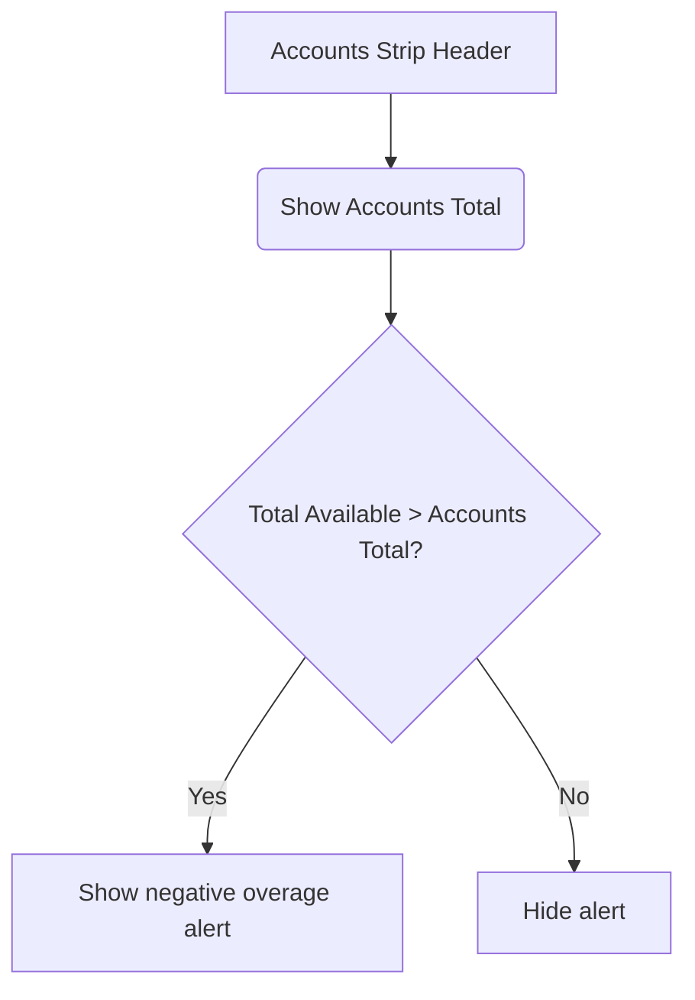

# Accounts Total vs Budget Display Design

## 1. Goal
Provide a clear, persistent view of the user's actual combined account balance on the Budget screen, and explicitly alert them if they have budgeted more money (Total Available across all envelopes) than they actually hold in their accounts.

## 2. Terminology (CONTEXT)
- **Accounts Total**: The sum of `balance` across all budget accounts.
- **Total Budget (Total Available)**: The sum of `available` across all envelopes (`summary.available`).

## 3. UI Changes
- Modify `AccountsStrip.tsx` in the frontend.
- Change the `<h3>` header from `Accounts · newest first` to include the combined total.
- **Normal State**: `บัญชีรวม ฿10,000`
- **Over-budget State**: `บัญชีรวม ฿10,000 (ตั้งงบเกิน -฿2,000)` where the overage is `Total Available - Accounts Total` and is styled in a danger color.

## 4. Logic & Calculation
- `totalAccounts = accounts.reduce((sum, a) => sum + a.balance, 0)`
- `overage = readyToAssign < 0 ? Math.abs(readyToAssign) : 0`
- Display the alert only if `overage > 0`.

## 5. Data Flow
- Update `AccountsStrip` component props to accept `readyToAssign: number` alongside `accounts: BudgetAccountDto[]`.
- Pass `summary.readyToAssign` into `AccountsStrip` from `BudgetPage.tsx`.

## 6. Global Constraints
- Text labels must match the agreed Thai wording.
- Any new CSS classes must be added to the relevant CSS file (`BudgetPage.css` or equivalent).
