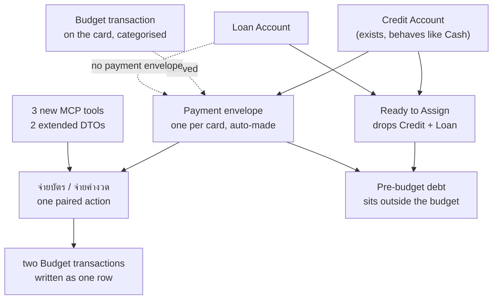
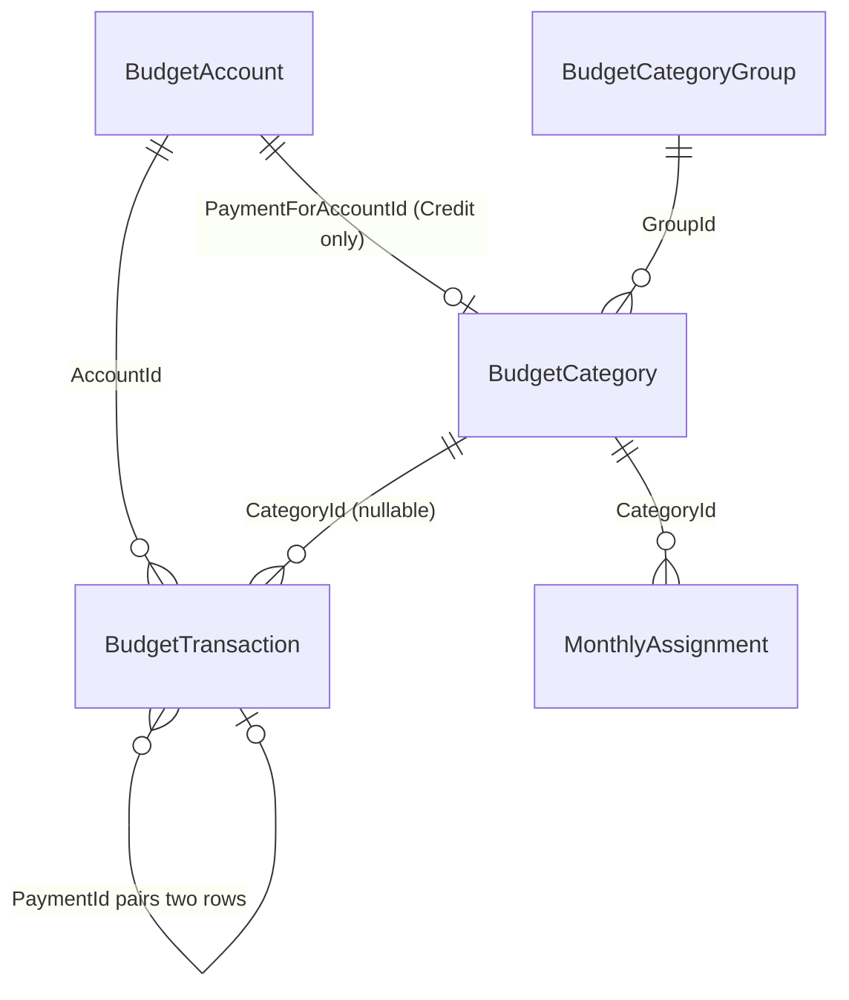
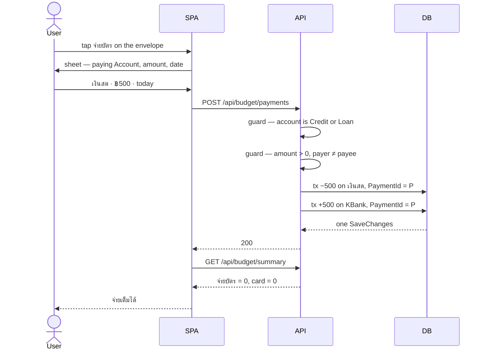

# Credit accounts and payment envelopes — design

Issue [#112](https://github.com/ThodsaphonSonthiphin/MenuNest/issues/112) ·
ADRs menunest-202 … menunest-213 ·
confirmed screen: <https://claude.ai/code/artifact/ec003765-9fb8-420b-a253-80a76463913a>



## 1. What is broken today

`BudgetAccountType.Credit` and `.Loan` already exist and are already offered in **Add Account**.
Neither carries any behaviour: both are summed into **Ready to Assign** exactly like Cash.

Two consequences, both verified against the code rather than assumed:

- **The money owed on a card is held back correctly, but invisibly.** `GetMonthlySummaryHandler`
  computes `ReadyToAssign = sum(accounts) − sum(envelope.available)`, so a card's negative balance
  already stops you assigning money you owe. Nothing on any screen says how much that is. This is
  the gap issue #112 names: *บัตเจตเงินไว้เตรียมจ่าย*.
- **A Loan puts a false number on screen.** 30,000 in the bank against 300,000 outstanding on a car
  loan renders **พร้อมจัดสรร −270,000 · ตั้งงบเกิน -270,000**. The **User** over-assigned nothing.
  This defect predates issue #112 and is fixed here because the fix is the same filter
  (menunest-206).

There is also **no transfer**: `BudgetTransaction` carries exactly one `AccountId`, so paying a
card by hand means two unlinked rows — and `GetMonthlySummaryHandler` counts the card-side inflow
as **Income**, because **Income** is every uncategorised positive row in the month.

## 2. The model

A **Payment envelope** is a `BudgetCategory` bound one-to-one to a **Credit** **Account**, created
with it, living in an auto-made **บัตรเครดิต** group. It holds the money set aside to pay that card.
Its **Available** against the **Account**'s balance is the single number that answers *"can I pay
this bill in full?"*

A **Loan** **Account** leaves **Ready to Assign** as well, but gets **no** **Payment envelope**:
nothing is ever bought with a loan, so nothing would auto-fill it, and a hand-filled envelope the
**User** may not rename or delete is strictly worse than the ordinary **Envelope** they can make
themselves (menunest-206).

> **A Payment envelope earns its existence only where spending happens on the Account.**

### Controls (menunest-205)

| | on a **Payment envelope** |
|---|---|
| assign into it, set a **Target**, **Move money** in or out | ✅ on |
| **Cover overspending** from it | ✅ on |
| rename · move to another group · delete · hide | ❌ off |
| mark as an **Everyday envelope** | ❌ off |
| **+ Transaction** | ❌ replaced by the payment action |

**Move** and **Cover** stay on in **both** directions deliberately. Pulling money *out* of a
**Payment envelope** underfunds the card, but that is the **User**'s call and it is never silent —
the shortfall line (§4) turns red and names the gap the moment it happens.

The **Everyday** exclusion is the sharp one. The **Daily allowance** divides **Everyday envelope**
money by the days left in the month; a **Payment envelope** in that pot would raise *"spend this
much today"* every time the card is used. `BudgetCategory.MarkEveryday` must refuse.

## 3. Data model



Two nullable columns. Both are safe against existing rows.

| table | column | notes |
|---|---|---|
| `BudgetCategories` | `PaymentForAccountId uniqueidentifier NULL` | non-null exactly on a **Payment envelope**; **filtered unique index** `WHERE PaymentForAccountId IS NOT NULL` — one envelope per card |
| `BudgetTransactions` | `PaymentId uniqueidentifier NULL` | the two halves of one payment share it; non-unique index |

`PaymentId` exists **only** for pairing — finding, editing and deleting both halves as one row
(menunest-209). It carries no arithmetic weight; §4 never reads it. That separation is what lets
payments written before this feature shipped still compute correctly.

The **บัตรเครดิต** group is created lazily on the first **Credit** **Account**, mirroring how
menunest-181 creates the **Daily allowance** row lazily on first read. `DeleteGroupHandler` must
refuse to delete it while it holds a **Payment envelope**.

## 4. The arithmetic

This is the load-bearing part. Three changes.

### 4.1 Ready to Assign drops debt accounts (menunest-203, menunest-206)

```
ReadyToAssign = sum(accounts WHERE Type NOT IN (Credit, Loan))
              − sum(envelope.Available across ALL categories)
```

`IsClosed` handling is **unchanged** — closed accounts still count, exactly as today. Only the
type filter is new. (`BudgetAccountType.Closed` is a separate, little-used enum value and is not
excluded; it is not a debt type.)

### 4.2 A payment envelope's Available (menunest-208)

Derived at read time. No row is ever written to place money in it.

```
Available = Σ MonthlyAssignment.AssignedAmount        (what the User assigned)
          − Σ amount of CATEGORISED rows on the account
          − Σ amount of UNCATEGORISED POSITIVE rows on the account
```

Both subtracted terms are signed sums of `BudgetTransaction.Amount`, so the second minus is not a
typo — a categorised outflow is negative, and subtracting it adds.

Worked, on a card carrying ฿20,000 of **Pre-budget debt**:

| event | row | **Δ** Available | card balance (running) |
|---|---|---|---|
| open the account at −20,000 | −20,000, uncategorised | +0 | −20,000 |
| buy food, ฿500, category อาหาร | −500, categorised | **+500** | −20,500 |
| shop refunds the ฿500 to อาหาร | +500, categorised | **−500** | −20,000 |
| buy food, ฿500, category อาหาร | −500, categorised | **+500** | −20,500 |
| cash advance ฿300, no envelope | −300, uncategorised | +0 | −20,800 |
| pay ฿500 | +500, uncategorised | **−500** | −20,300 |
| assign ฿2,000 toward the old debt | assignment | **+2,000** | −20,300 |

The uncategorised rows — the opening balance and the cash advance — contribute nothing, which is
the truth about them: they are debt no **Envelope** funds. They show only as the gap in §4.3.

Legacy hand-written payments are uncategorised positives, so they subtract correctly with no
`PaymentId` and no backfill.

### 4.3 The shortfall line

```
shortfall = max(0, −account.Balance − paymentEnvelope.Available)
```

Zero renders **จ่ายเต็มได้** in green. Non-zero renders **ขาดอีก ฿N** in red. This is the one
number issue #112 asks for.

### 4.4 The invariant (this is the acceptance test)

**No activity on a Credit account may change Ready to Assign. Not one case, the payment included.**

A payment does move cash out, but it spends down the **Payment envelope** by the same amount, so
the two cancel — which is the point: paying a card spends money you had already set aside.

| event | Δ cash accounts | Δ envelopes | Δ RTA |
|---|---|---|---|
| categorised card purchase −500 | 0 | อาหาร −500, จ่ายบัตร +500 = **0** | **0** ✅ |
| categorised refund +500 | 0 | อาหาร +500, จ่ายบัตร −500 = **0** | **0** ✅ |
| uncategorised card purchase −500 | 0 | 0 | **0** ✅ |
| opening balance −20,000 | 0 | 0 | **0** ✅ |
| payment of 500 | **−500** | จ่ายบัตร **−500** | **0** ✅ |

Every row must be a test. If any is non-zero, the model is wrong.

### 4.5 Income

`Income` must exclude rows carrying a `PaymentId`. Without this, paying your own card reports as
money arriving (menunest-204).

### 4.6 Closing a card (menunest-210)

`UpdateAccountHandler` refuses `IsClosed = true` on a **Credit** **Account** whose derived balance
is non-zero: *"ยังจ่ายบัตรไม่ครบ — ปิดบัญชีไม่ได้"*.

Once closed, its **Payment envelope** is hidden **and excluded from
`totalEnvelopeAvailableAllCats`**. The exclusion is not free and must be written: that walk covers
hidden categories today, so hiding alone would leave any over-funded remainder locked in an
envelope for a card no longer in use. `MonthlyAssignment` rows stay untouched, so reopening the
account restores the envelope and its money exactly.

## 5. The payment action



Both rows land in **one** `SaveChangesAsync`. There is no moment at which half a payment exists.

Both halves are **uncategorised**: a payment is not spending. The card-side row is kept out of
**Income** by §4.5, and the payer-side row is negative so it never reached **Income** anyway.

**Label** (menunest-212): resolved from the **Account** type at render time — **จ่ายบัตร** on a
card, **จ่ายค่างวด** on a loan. One action, one command, one tool; no branch beneath the word.

On a **Loan** the action is identical except that no **Payment envelope** is spent down, because
menunest-206 gives a Loan none. The money comes from whatever ordinary **Envelope** the **User**
made for the instalment.

## 6. Surfaces

### 6.1 API

| verb | route | notes |
|---|---|---|
| `POST` | `/api/budget/payments` | new — `{ fromAccountId, toAccountId, amount, date, notes, timeZoneId }` |
| `PUT` | `/api/budget/payments/{paymentId}` | new — edits both halves or neither |
| `DELETE` | `/api/budget/payments/{paymentId}` | new — deletes both halves |
| `GET` | `/api/budget/summary` | `EnvelopeDto` gains `PaymentForAccountId`, `Shortfall`; `BudgetAccountDto` gains `Shortfall` |
| `GET` | `/api/budget/accounts` | `BudgetAccountDto` gains `Shortfall` |
| `PUT` | `/api/budget/accounts/{id}` | now refuses close-while-owing |
| `PUT`/`DELETE` | `/api/budget/categories/{id}` | now refuse a **Payment envelope** |

### 6.2 MCP (menunest-213 — every function reachable)

Three new tools in `BudgetTools`: `pay_account`, `update_payment`, `delete_payment`. Two extended
DTOs carry the new fields to `get_budget_summary` and `list_budget_accounts`.

Everything else already works unchanged, because a **Payment envelope** *is* a `BudgetCategory`:
`set_assigned_amount`, `move_money` and `cover_overspending` all take a category id. menunest-205's
refusals need no MCP work either — `update_budget_category` and `delete_budget_category` share the
SPA's handlers, so one guard covers both callers.

Editing and deleting a payment are their own tools rather than `update_transaction` /
`delete_transaction` on one half: reaching a single half is exactly the state menunest-209 exists
to prevent.

**Out of scope, flagged:** Undo, Redo and the change history have no MCP tool. That gap predates
this issue and is unrelated to credit; it wants its own ticket.

### 6.3 SPA

Confirmed screen: <https://claude.ai/code/artifact/ec003765-9fb8-420b-a253-80a76463913a>

- `AccountsStrip` — the **บัญชีรวม** total is unchanged (it is a net figure and stays one). The
  `(ตั้งงบเกิน -N)` badge reads `readyToAssign < 0` and will simply stop firing spuriously.
- `EnvelopeList` — renders the **บัตรเครดิต** group.
- `EnvelopeCard` — for a **Payment envelope**: no everyday dot, no `＋`, no `✎ Edit`; **⇄ Move**
  and the assigned input stay; **+ Transaction** becomes the payment action; row 2 becomes the
  shortfall line.
- New `PaymentDialog` — paying **Account** picker, amount, date.
- `GlobalTransactionList` / `AccountTransactionList` — a payment renders as **one** row.

## 7. Undo and history

Unchanged, and this falls out rather than being decided separately. menunest-196 draws **Change
history** at money *placed*; a payment is two **Budget transactions**, so it is fixed where
transactions are fixed (menunest-209) and the **Shortcut rail** keeps exactly its three
menunest-191 slots.

Assigning, moving and covering **on** a **Payment envelope** *are* money placement, so they are
recorded and undoable like any other envelope's — no special case.

Assigning into a **Payment envelope** is **not** a **Budgeting event**, because menunest-181 fires
that only for **Everyday envelopes** and menunest-205 forbids the mark. The **Daily allowance**
never re-freezes because of a card. This too falls out.

## 8. Migration and rollout

Both columns are nullable, so the migration is additive and existing rows are valid. Per
`CLAUDE.md`, **it must be applied to prod by hand** — neither `Program.cs` nor
`main_menunest.yml` runs `Migrate()`, and a missed migration surfaces as `Invalid object name` /
HTTP 500.

Existing **Credit** **Accounts** get their **Payment envelope** created **lazily on first summary
read**, following menunest-181's precedent. No data backfill: §4.2 derives the correct number from
history that already exists, including hand-written payments.

The new `DbSet` is **not** needed — `BudgetCategory` and `BudgetTransaction` are already mapped, so
the four `IApplicationDbContext` implementers (`AppDbContext`, `SqliteAppDbContext`,
`InMemoryAppDbContext`, and the `SaveChangesCountingDbContext` **decorator**) need no change. New
EF configuration for the two columns goes in the existing
`BudgetCategoryConfiguration` / `BudgetTransactionConfiguration`, in the **same commit** as the
entity change — an unmapped model fails validation for every test touching the context.

## 9. Tests

`frontend/vite.config.ts` runs vitest in `environment: 'node'` with no jsdom, so `tsc` + `build` +
unit tests **cannot** see rendering. Playwright is the only automatic guard on the screen.

- **`MenuNest.Application.UnitTests`** — §4.4's five invariant rows, one test each, on
  `SqliteAppDbContext` (real EF configs, so the filtered unique index is exercised). Plus §4.2's
  seven-row walk, the close-while-owing refusal, the closed-envelope exclusion, and each
  menunest-205 refusal.
- **`MenuNest.McpServer.UnitTests`** — the three new tools, and that a payment deletes as a pair.
- **`MenuNest.WebApi.UnitTests`** — the three new routes.
- **Playwright** — extend `budget.smoke.spec.ts` and add `budget.credit-payment.spec.ts`: the
  **บัตรเครดิต** group renders, the shortfall line reads **จ่ายเต็มได้** then **ขาดอีก**, and the
  payment sheet opens.
- **Interactive check before merge** — required by `CLAUDE.md`, and diff the built card against the
  confirmed mock. The gates do not see visual fidelity.

## 10. Out of scope

Refund routing back to the originating **Envelope** beyond §4.2's honest arithmetic; interest and
fee modelling; statement dates and minimum payments; a debt-payoff schedule; MCP tools for
Undo/Redo; any change to `BudgetAccountType.Closed`.
