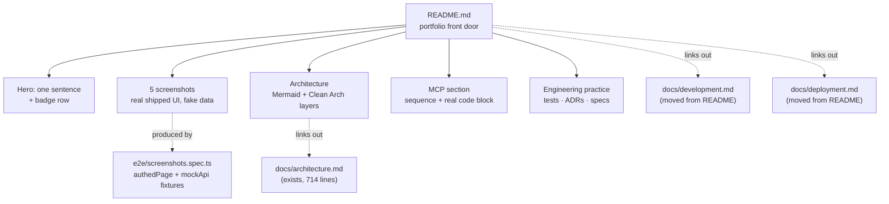

# A professional root README, usable as a hiring demo — design

ADR [menunest-216](../../adr/menunest-216-the-root-readme-is-the-portfolio-front-door.md) ·
no UI mockup (the deliverable is a Markdown document; GitHub's rendering is the surface)

## 1. What is wrong today

The current `README.md` (181 lines) was written as a maintainer's setup guide, and three
separate problems follow from that. All three are verified against the tree, not assumed.

**It is factually stale.** Six of the app's features are absent from it entirely:

| in the code | in the README |
|---|---|
| Health tracker, Meal planning | ✅ documented |
| Budget (zero-based envelopes, 24 MCP tools, 12 e2e specs) | ❌ absent |
| Trips (itinerary, weather-aware retiming, 26 MCP tools) | ❌ absent |
| Writing, Pomodoro, Discover | ❌ absent |
| MCP server — 83 tools + OAuth 2.1 proxy | ❌ absent |

**It contains a wrong claim.** Tech Stack says `React 18`; `frontend/package.json` pins
`react ^19.2.4`. The same section omits that TypeScript is `~6.0.2` and Vite is `^8.0.4`.
A version error in a document used to demonstrate competence is checkable in ten seconds.

**Its shape buries the differentiator.** Roughly half the file (lines ~85–181) is
prerequisites, App Service settings tables and Entra app-registration steps. That content
is correct and still needed — but it occupies the space where an evaluating reader decides
whether to keep reading, and it pushes the MCP server and the engineering-practice trail
below where anyone scrolls.

## 2. Audience, and the constraint that follows

Two target roles, in priority order:

1. **Full-stack .NET + React** — the primary market, and what the repo evidences most
   heavily (108k LOC C# across 5 projects; 36.6k LOC TS/TSX).
2. **AI / agent engineering** — the differentiator: an MCP server exposing 83 tools behind
   a hand-rolled OAuth 2.1 facade.

The binding constraint is that GitHub renders `README.md` and nothing else when a link is
followed. The first screenful — before any scroll — must carry the hero sentence, the
badge row, and the first screenshot. Everything else is for the reader who chose to
continue.

## 3. Deliverables

| file | action |
|---|---|
| `README.md` | rewritten (English, portfolio-shaped) |
| `docs/development.md` | **new** — prerequisites, external-account table, setup commands, moved verbatim from README |
| `docs/deployment.md` | **new** — Azure split, App Service settings, SWA settings, Entra registration, moved verbatim from README |
| `frontend/e2e/screenshots.spec.ts` | **new** — Playwright script that writes the 5 screenshots |
| `docs/images/*.png` | **new** — 5 committed screenshots |
| `docs/adr/menunest-216-*.md` | **written** (already created) |

Moved content is moved, not rewritten: the App Service and SWA settings tables and the
Entra steps are operationally load-bearing, and rewording them risks introducing an error
into instructions that currently work.

## 4. README structure

Ordered so that each section earns the next scroll.

1. **Hero** — project name, one sentence, badge row (.NET 10 · React 19 · TypeScript 6 ·
   Azure · MCP). One line stating the app is in daily production use by the author's
   household and that its UI is Thai by design — this is what separates it from a
   tutorial project, so it is said early rather than left to be inferred.
2. **What it does** — the six feature areas, one line each, each naming the non-obvious
   engineering problem it contains (e.g. zero-based budgeting's Ready-to-Assign
   derivation; the doctor report's anonymous token).
3. **Screenshots** — five images with one-line captions (§5).
4. **Architecture** — a Mermaid diagram of the Clean Architecture layers and the Azure
   topology, plus the dependency rule in one sentence. Links to `docs/architecture.md`
   for the per-feature sequence diagrams that already exist there.
5. **The MCP server** — the section that carries target audience 2 (§6).
6. **Engineering practice** — tests, ADRs, specs, postmortems, CI (§7).
7. **Running it** — three lines, linking to `docs/development.md` and
   `docs/deployment.md`.
8. **Status / license** — private personal project, no live demo link, and *why*: the
   production data is real health and financial data. Stating the reason converts an
   apparent gap into a judgment signal.

Explicitly **not** included: a "Live Demo" button. A link that lands a reader on a sign-in
wall they cannot pass, or an empty family-less account, reads as overstatement — worse
than having no link.

## 5. Screenshot pipeline

`frontend/e2e/screenshots.spec.ts` reuses the fixtures that already exist for the e2e
suite — `authedPage` (from `e2e/fixtures/healthFixture.ts`) and `mockApi`
(`e2e/helpers/mockRoutes/`, which intercepts `/api/*`). No backend, no Azure, no SQL,
and no real data.

**Two constraints established by running it, not by reading it** (debug session,
2026-09-05; see §5a):

1. **`authedPage` alone is not enough for a family-gated page.** `applyGoogleAuth` only
   writes a `google_id_token` into `localStorage`; it intercepts nothing. `/budget` and
   `/ai-assistant` sit behind `FamilyRequiredRoute` (`src/router.tsx:79`), which blocks on
   `/api/me` and renders `ProfileErrorFallback` — the literal string "Could not load your
   profile." — when that request fails. Every screenshot of a gated page **must** request
   the `mockApi` fixture and stub `/api/me`. Only 14 of the 36 existing specs do.
2. **Three of the five chosen screens are not gated at all.** `/health`, `/trips` and
   `/writing` live under the plain `AppLayout` group (`src/router.tsx:55–77`), so they
   need no `/api/me` stub — but they still need their own endpoints mocked to render
   populated rather than empty. `mockApi` today covers `episodes`, `report`, `drugs`,
   `settings` and `budget` only: **`/trips` and `/ai-assistant` have no mock routes yet
   and the script must add them.** This is new work the plan must budget for, not a
   reuse of what exists.

**Browser:** this container ships Chromium build 1194 while the pinned Playwright expects
1223, so runs here need `launchOptions.executablePath` pointed at
`/opt/pw-browsers/chromium-1194/chrome-linux/chrome`. That override is a local-run
concern; it must **not** be committed into `playwright.config.ts`, where it would break
CI (which installs its own browsers). Gate it behind an env var or keep it out of tree.

**`.env`:** the SPA warns and degrades without one, and neither the repo nor CI provides
it. `cp .env.example .env` is required before a local run; `.env` is already gitignored
(`.gitignore:109`).

Five screens:

| # | screen | why it earns its place |
|---|---|---|
| 1 | `/budget` — Ready to Assign + envelopes | densest domain logic in the repo (~30 ADRs, 24 MCP tools) |
| 2 | `/health` quick-log | the flagship feature, and the app's origin |
| 3 | `/share/:token` doctor report | shows a security design: HMAC-signed, date-bounded token, only its SHA-256 stored |
| 4 | `/trips` itinerary | weather-aware scheduling — a genuinely hard planning problem |
| 5 | `/ai-assistant` | the bridge to the MCP section: same domain, natural-language surface |

Fixed viewport (1280×800 desktop) for consistency. Images land in `docs/images/` and are
committed, so the README renders for a reader who never runs anything.

**The plan must treat "the script produces five non-blank PNGs" as a verification step
with its own inspected output, not as an assumption** — per `CLAUDE.md`, no automated
gate in this repo can catch a blank or visually broken render, and §5a below shows the
suite does not currently run clean.

## 5a. The e2e suite is red on `main` — and it is not this task's to fix

Established while validating the pipeline, and load-bearing for the plan because the
screenshot script lands in the same suite:

**The Playwright E2E workflow has failed on `main` for at least the last 8 runs**
(runs 182, 183, 184, 186, 188, 190, 193, 195 — 2026-08-30 through 2026-09-05). At HEAD
(`01447e1`, run 195): **31 failed · 17 skipped · 99 passed**.

The 31 failures are two unrelated clusters, not one:

| cluster | tests | route gated? | status |
|---|---|---|---|
| **A** | 3 budget specs, incl. `budget.smoke.spec.ts:5` | ✅ `FamilyRequiredRoute` | **root cause confirmed** — `/api/me` unmocked → `ProfileErrorFallback`. Reproduced locally and in CI, identical test and line. |
| **B** | ~21 pomodoro + 2 writing | ❌ not gated | **not diagnosed** — `getByTestId('writing-timer')` missing after `page.clock.fastForward`. The profile gate cannot explain these; they are a different bug. |

Consequences for this task:

- Cluster A is **not a blocker**: it tells the screenshot script exactly what to do (stub
  `/api/me`), and doing so is required for the `/budget` and `/ai-assistant` shots anyway.
- Cluster B is **out of scope** and must not be silently absorbed into this work. It needs
  its own issue and its own debug session.
- The plan must **not** claim "the e2e suite passes" as a completion signal, and must not
  gate this work on a green suite. The check is narrower and honest: *the five screenshot
  cases pass and their output has been looked at.*
- The README's engineering-practice section (§7) must not imply CI is green. It states
  what exists — workflows, spec counts, the pre-commit hook — and claims nothing about
  current pass state.

## 6. The MCP section

MCP has no UI, so it cannot be screenshotted. It is shown with three artefacts instead:

- **What it is, in one paragraph** — 83 tools across 8 tool classes let an AI client drive
  the same domain the SPA drives, through the same `Mediator` handlers. Not a
  read-only bridge: it creates recipes, plans meals, and pays credit cards.
  Per `menunest-213`, every function a feature adds is reachable over MCP.
- **A sequence diagram** of the OAuth 2.1 handshake, reused from
  `docs/architecture.md` §13. The interesting part is stated plainly: Entra ID v2 rejects
  the RFC 8707 `resource` parameter that claude.ai mandates (`AADSTS500011`), so
  `MenuNest.WebApi` hosts its own Authorization-Server facade at `/oauth/*` that absorbs
  the parameter, runs a clean flow against Entra server-side, keeps Entra tokens
  server-side, and mints its own HMAC JWT for `/mcp` (ADR-003, ADR-004).
- **A real code block** — one tool method lifted verbatim from
  `backend/src/MenuNest.McpServer/`, showing the `[McpServerTool]` attribute, the
  `[Description]` annotations that become the tool schema, and the `IMediator` call
  proving the tool shares the SPA's handler rather than duplicating it.

Tool distribution, for the count to be checkable: Trip 26, Budget 24, Shopping 10,
MealPlan 7, Recipe 5, Writing 4, Ingredient 4, Stock 3.

## 7. Engineering practice section

The trail that is unusual for a personal project, stated as facts a reader can verify by
clicking:

- **983 backend tests** across 4 projects (Application 822, Infrastructure integration 24,
  McpServer 80, WebApi 57), plus 61 frontend vitest files and 36 Playwright e2e specs.
- **215 ADRs** in `docs/adr/` — every design decision recorded with its rejected
  alternatives.
- **55 design specs** in `docs/superpowers/specs/`, written before implementation.
- **Postmortems** in `docs/postmortems/` — including one on a bug this project shipped.
- **CI** — 4 GitHub Actions workflows; Playwright runs on every PR. Stated as *what runs*,
  never as *what passes* — the suite is currently red on `main` (§5a), and a README that
  implied otherwise would be making a claim a reader can check and disprove in one click.
- **A pre-commit hook** running the full backend build + test and frontend typecheck +
  build on every commit.

This section is kept short and link-heavy. Its persuasive force is that the artefacts
exist and are one click away, not that the README describes them at length.

## 8. Claims verification

Every number above was counted against the tree on 2026-09-05. They are load-bearing —
a reader can check them — so they are recorded here with their commands:

| claim | value | how it was counted |
|---|---|---|
| MCP tools | 83 | `grep -rhoE "\[McpServerTool(,\|\])" backend/src/MenuNest.McpServer --include=*.cs \| wc -l` |
| tool classes | 8 | `grep -rhoE "\[McpServerToolType\]" … \| wc -l` |
| backend tests | 983 | `[Fact]`/`[Theory]` across `backend/tests/` |
| e2e specs | 36 | `ls frontend/e2e/*.spec.ts \| wc -l` |
| vitest files | 61 | `find frontend/src -name "*.test.ts" \| wc -l` |
| ADRs | 215 | `ls docs/adr/*.md \| wc -l` |
| specs | 55 | `ls docs/superpowers/specs \| wc -l` |
| C# LOC | ~108k | `.cs` under `backend/`, excluding `obj/`, `bin/` |
| TS LOC | ~36.6k | `.ts`/`.tsx` under `frontend/src/` |
| versions | .NET 10 · React 19.2.4 · TS 6.0.2 · Vite 8.0.4 · RTK 2.11.2 | `*.csproj` `TargetFramework`, `frontend/package.json` |

An earlier draft of this design cited 91 MCP tools and 38 e2e specs. Both were wrong: the
91 counted the 8 class-level `[McpServerToolType]` attributes alongside the method-level
ones, and the 38 counted non-spec entries in the `e2e/` listing. Corrected above.

## 9. Out of scope

- Any change to application code, tests, or CI beyond adding the screenshot script.
- A seeded demo account or a public share-token demo link — this would require writing
  fabricated data into the production database.
- Translating the app UI to English.
- A `README.th.md` translation.
- Renaming or renumbering any existing ADR (forbidden by `CLAUDE.md`).

## 10. Acceptance criteria

1. `README.md` is English, opens with hero + badges + a screenshot above the fold, and
   contains no factual claim that contradicts the tree.
2. All six feature areas and the MCP server appear in it.
3. `docs/development.md` and `docs/deployment.md` contain the moved content with no loss;
   the README links to both.
4. Five screenshots are committed under `docs/images/` and render in the README.
5. The screenshot script's five cases pass and their output has been *looked at* — not
   merely produced without error. The suite as a whole is **not** a gate (§5a).
6. Every number in §8 matches a re-run of its command at implementation time.
7. No claim in the README asserts CI is passing.
8. Cluster B (§5a) is filed as its own issue and left untouched by this branch.
