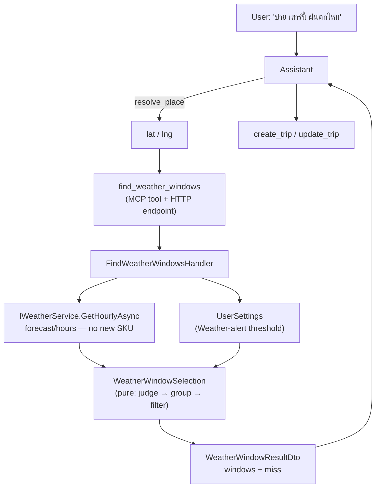
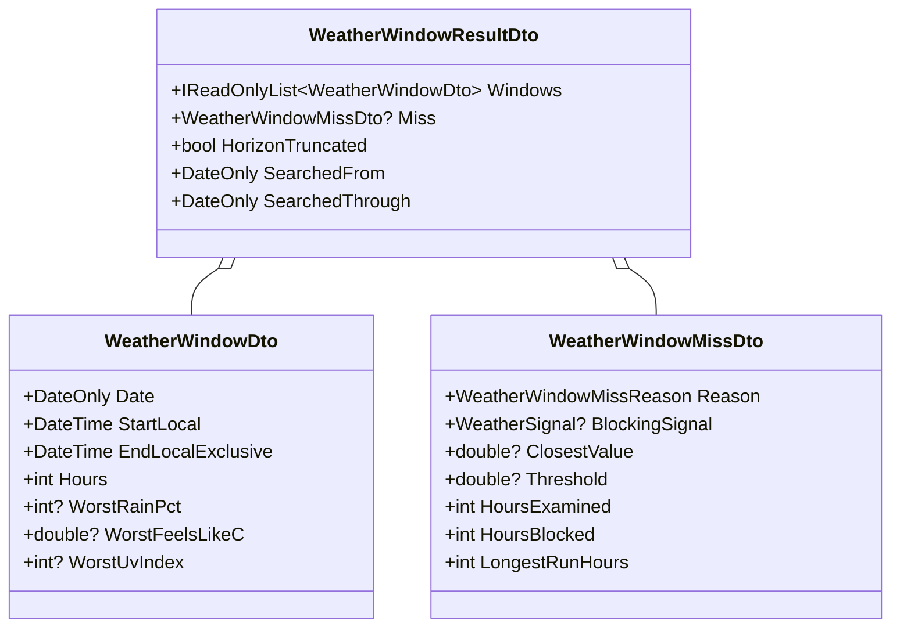
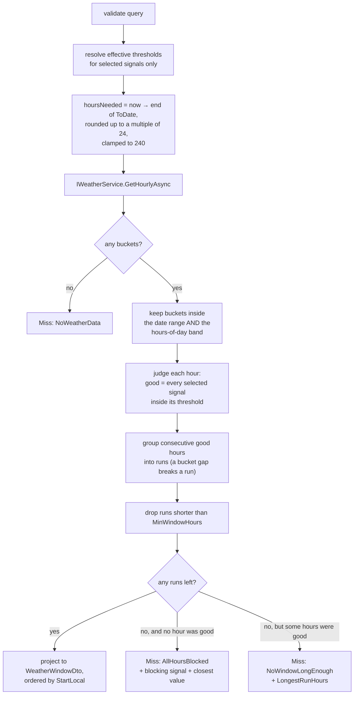
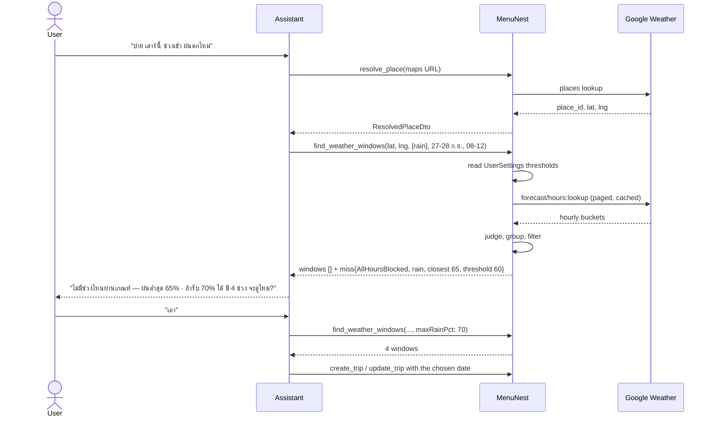
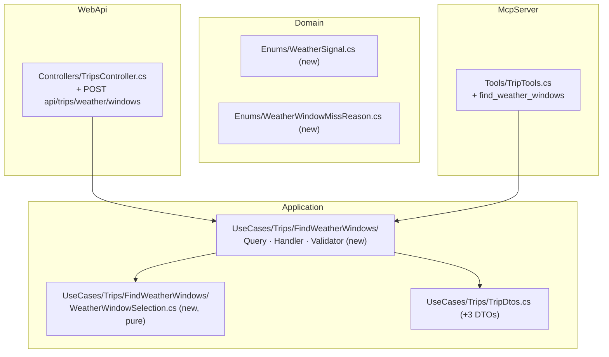

# Weather window query — design spec (issue #153)

**Date:** 2026-09-19 · **Issue:** [#153](https://github.com/ThodsaphonSonthiphin/MenuNest/issues/153)
**ADRs:** menunest-217 … menunest-225 · **Glossary:** `CONTEXT.md` → **Weather window**, **Selected signal**



## 1. What this adds, in one paragraph

A **User** names a location and asks which days are good — "วันไหนฝนไม่ตก", "วันไหนแดดไม่ร้อน" —
in order to plan a **Trip**. MenuNest answers with a list of **Weather window**s: dated, contiguous
runs of **Hourly forecast** hours where every **selected signal** stays inside its threshold. The
read is exposed as an **MCP tool** (`find_weather_windows`) and a matching HTTP endpoint. Nothing
is persisted, no new provider is called, and no new Google billing SKU is introduced.

## 2. What exists today, and the exact gap

| capability | over HTTP | over MCP |
|---|---|---|
| Now / On-arrival **Weather reading** at arbitrary coordinates | `POST /api/trips/weather` | `get_stop_weather` — `stopId` is an opaque echo key, never checked against the DB |
| **Hourly forecast** at arbitrary coordinates | `POST /api/trips/weather/hourly` → `GetHourlyForecastQuery(Lat, Lng, Hours)`, no ownership check | **none** — `get_stop_hourly_forecast` demands `tripId` + `stopId` |
| a *filtered* answer over the whole **Forecast horizon** | none | none |

So the assistant can already read hourly weather for a saved **Stop**, and the SPA can already read
it for any point — but the assistant cannot read it for a place the **User** has not yet saved into
a **Trip**, which is precisely the moment issue #153 describes. And no surface anywhere reduces 240
hourly buckets to an answer.

One more gap this closes: the **Weather-alert threshold** is stored per-**User** on `UserSettings`
and has **never been read by the backend**. Every evaluation lives in
`frontend/src/pages/trips/lib/weather.ts`. menunest-219 makes this the first server-side use.

## 3. The decisions this spec implements

| ADR | decision |
|---|---|
| menunest-217 | the answer is an MCP tool for the assistant, not a **Discover** band; the location arrives as `lat`/`lng`, resolved upstream by `resolve_place` |
| menunest-218 | one answer item is a dated **Weather window**, in a flat ordered list — not a day verdict, not day-grouped |
| menunest-219 | thresholds default to the **User**'s **Weather-alert threshold**, overridable per call |
| menunest-220 | the caller selects which **selected signal**s judge an hour |
| menunest-221 | `heat` (**Feels-like**) and `sun` (**UV index**) stay separate; three signals with `rain` |
| menunest-222 | the search is bounded by a date range **and** an hours-of-day band |
| menunest-223 | the concept is named **Weather window**, never "best time" |
| menunest-224 | a minimum window length (default 2 h); **no** result cap |
| menunest-225 | an empty result names the blocking signal; never returns a failing window |

## 4. The contract

### 4.1 Query

`FindWeatherWindowsQuery : IQuery<WeatherWindowResultDto>` in
`MenuNest.Application/UseCases/Trips/FindWeatherWindows/`.

| parameter | type | required | default |
|---|---|---|---|
| `Lat` | `double` | yes | — |
| `Lng` | `double` | yes | — |
| `Signals` | `IReadOnlyList<WeatherSignal>` | yes, non-empty | — |
| `FromDate` | `DateOnly?` | no | the local date of the first forecast bucket |
| `ToDate` | `DateOnly?` | no | the last date inside the **Forecast horizon** |
| `FromHour` | `int?` 0–23 | no | `0` |
| `ToHour` | `int?` 1–24 | no | `24` |
| `MaxRainPct` | `int?` 0–100 | no | `60` — the web app's `RAIN_TINT_THRESHOLD` |
| `MaxFeelsLikeC` | `double?` | no | the **User**'s effective **Feels-like** threshold |
| `MaxUvIndex` | `int?` | no | the **User**'s effective **UV index** threshold |
| `MinWindowHours` | `int?` 1–24 | no | `2` |

`WeatherSignal` is a new `MenuNest.Domain.Enums` enum: `Rain`, `Heat`, `Sun`.

**An empty `Signals` list is a validation error**, not "everything is good". A caller that wants
raw hours already has `get_stop_hourly_forecast` / `POST /api/trips/weather/hourly`.

A threshold parameter for an **unselected** signal is also a validation error — passing
`maxUvIndex` without `sun` means the caller misunderstands menunest-220, and silently ignoring it
would hide that.

### 4.2 Resolving the effective thresholds (menunest-219)

Only for **selected** signals. Reproduces `effectiveThreshold` from `weather.ts` server-side:

```
explicit parameter present            -> that value
else row missing OR stored is null    -> built-in default (Feels-like 40 °C, UV 6)
else stored == 0                      -> OFF: this signal never blocks an hour
else                                  -> the stored value
```

**The `UserSettings` row is created lazily on first write** (`UpdateUserSettingsHandler` calls
`UserSettings.Create(user.Id)` only when it is missing), so a **User** who has never opened
`/settings` has **no row**. A missing row must resolve exactly like `null` — the built-in defaults —
or the tool fails for the majority of users. This is the single easiest way to get this feature
wrong.

`rain` has no stored threshold; it is `60` unless overridden.

A signal whose threshold resolves to **off** is selected but never blocks. That is deliberate: a
**User** who switched the heat alert off is asking for no heat gate, and menunest-219 says so.

### 4.3 Result



`Miss` is **null** whenever `Windows` is non-empty, and non-null whenever it is empty
(menunest-225). The two are never both populated and never both absent.

The `Worst*` fields are populated **only for selected signals**; an unselected signal's field is
`null`. `CONTEXT.md`'s **Selected signal** entry says unselected signals are "ignored entirely,
never merely reported", and that is the whole reason menunest-220's option C was rejected —
reporting a value the tool did not judge on invites the assistant to reason with it.

`WeatherWindowMissReason`: `NoWeatherData` · `AllHoursBlocked` · `NoWindowLongEnough`.

### 4.4 Surfaces

- **MCP:** `find_weather_windows` on `TripTools`, following the existing pattern — `[McpServerTool,
  Description(...)]`, a `[Description]` on every parameter, body is one `mediator.Send`.
- **HTTP:** `[HttpPost("api/trips/weather/windows")]` on `TripsController`, beside
  `api/trips/weather/hourly`. Authenticated by the global fallback policy; no resource
  authorization, matching its two siblings.

## 5. The algorithm



**Contiguity** is "the next bucket's `DisplayLocal` is exactly one hour later". This is what makes
the hours-of-day band work without special handling: with a band of 08–16, the 15:00 bucket of day
1 and the 08:00 bucket of day 2 are not consecutive, so they never join into one window.

**The blocking signal** is the selected signal that failed the most hours; ties break in the
declared order `Rain`, `Heat`, `Sun`. `ClosestValue` is the best value that signal reached across
the examined hours — the number the assistant quotes when it offers to relax the threshold.

**A window may cross midnight** when the band wraps (`ToHour <= FromHour`, e.g. 18→02 for a
ตลาดกลางคืน). The wrapped tail belongs to the band opened on the earlier date, and the window's
`Date` is the local date of its **first** hour. This matches ADR-118, which already makes the
**Hourly forecast** cross midnight visibly.

**Horizon truncation.** A `ToDate` past the 10-day **Forecast horizon** is cut to the horizon and
`HorizonTruncated` is set, with `SearchedThrough` naming the real last date. It is never an error —
ADR-031 already establishes that beyond-horizon means **No weather data**, not failure.

## 6. Interaction



## 7. Edge cases

| case | behaviour |
|---|---|
| `Signals` empty | validation error |
| threshold passed for an unselected signal | validation error |
| a selected signal's threshold is stored as `0` | selected, but never blocks (menunest-219) |
| no `UserSettings` row | built-in defaults — identical to `null` |
| `FromDate` is today | windows can only start at or after the current hour, because `forecast/hours` is anchored at now. `SearchedFrom` reports the real first date so "no morning window today" is not read as "no morning window ever" |
| `ToDate` beyond the horizon | truncate, set `HorizonTruncated`, never error |
| `FromDate > ToDate` | validation error |
| band wraps midnight (`ToHour <= FromHour`) | supported; the tail belongs to the earlier date |
| Google fails or returns nothing | `Miss.Reason = NoWeatherData` — never conflated with `AllHoursBlocked` (ADR-030/031) |
| a bucket is missing `rainPct` / `feelsLikeC` / `uvIndex` while that signal is selected | the hour cannot be judged, so it is **not** good — it breaks the run and counts toward `HoursExamined`, but **not** toward `HoursBlocked`, because no signal rejected it |
| *every* examined hour was unjudgeable (`HoursBlocked == 0` and no hour was good) | `Miss.Reason = NoWeatherData`, not `AllHoursBlocked` — there is no blocking signal to name, and reporting one with a zero count would invent a cause |
| every hour good, whole range | one window per contiguous band-run, not one giant window |

## 8. Where the code goes



**Nothing touches persistence.** No entity, no `DbSet`, no migration — so the four
`IApplicationDbContext` implementers named in `CLAUDE.md` are untouched, and there is nothing to
apply to the prod DB. `UserSettings` is *read* through the existing `DbSet` on
`IApplicationDbContext`.

**No frontend work.** menunest-217 puts no screen on this, so `tsc`/`npm run build`/vitest are
unaffected and the "frontend has no visual test harness" hazard in `CLAUDE.md` does not apply.

`WeatherWindowSelection` is **pure** — it takes `IReadOnlyList<HourlyReading>`, the resolved
thresholds, the band and `MinWindowHours`, and returns the windows plus the miss record. It makes
no I/O, exactly as `WeatherHourSelection.CoolestHour` does for `RetimeStopToWeather`, so the whole
judging rule is unit-testable without a fake `IWeatherService`.

## 9. Cost

One `forecast/hours:lookup` walk per uncached call — the same request the **On-arrival** reading
and the **Hourly forecast** already make, so **no new billing SKU** (ADR-093, ADR-119).

`GetHourlyAsync`'s cache key embeds the requested `hours` and the current UTC hour, so different
`hours` values at the same point are separate cached walks. The handler therefore rounds
`hoursNeeded` **up to a multiple of 24** before calling, so a two-day and a three-day question at
the same place share entries with each other and with the SPA's 48 h calls, instead of minting a
fresh 10-page walk for every distinct range.

## 10. Tests

| project | tests |
|---|---|
| `MenuNest.Application.UnitTests` | `WeatherWindowSelectionTests` — judging, grouping, gap-breaks, `MinWindowHours`, midnight wrap, each `WeatherWindowMissReason`, null-field hours |
| `MenuNest.Application.UnitTests` | `FindWeatherWindowsHandlerTests` — threshold resolution: explicit > stored > default, `0` = off, **and the missing-row case**; `Miss`/`Windows` mutual exclusion |
| `MenuNest.Application.UnitTests` | `FindWeatherWindowsValidatorTests` — empty signals, threshold-without-signal, lat/lng ranges, `FromDate > ToDate`, `MinWindowHours` range |
| `MenuNest.McpServer.UnitTests` | `TripToolsTests` — pins the tool `Description` text, as `BudgetToolsTests` already does. The description is the only place an MCP client learns to map "วันไหนแดดไม่ร้อน" onto `[heat, sun]` (menunest-220), so a silent edit is a silent behaviour change |
| `MenuNest.WebApi.UnitTests` | route wiring for `POST api/trips/weather/windows`, alongside the existing `Controllers/TripsControllerAddPlaceTests.cs` |

Mock `IUserProvisioner` with Moq (`new Mock<IUserProvisioner>()` → `GetOrProvisionCurrentAsync`),
never NSubstitute. Relational cases use `SqliteAppDbContext`.

## 11. Risks

**A third copy of the threshold rule.** `effectiveThreshold` now exists in `weather.ts`, in
`frontend/src/pages/settings/weatherAlertControl.ts`, and server-side here. The repo already
accepts one such twin — `WeatherHourSelection.CoolestHour` mirrors the client `coolestHour`, with
an in-code comment about the rounding divergence — so this is a known shape, not a new one. Both
sides are unit-tested and the server copy carries a comment naming its twin.

**The assistant may choose the wrong signals.** Nothing validates that "วันไหนแดดไม่ร้อน" maps to
`[heat, sun]`. The mitigation is the tool `Description` carrying worked Thai examples, pinned by a
test. This is the same mechanism menunest-213 already relies on.

**A wide tool.** Eleven parameters, eight of them optional. The no-parameter-but-signals call must answer
the plain question sensibly, and the validator must reject the incoherent combinations listed in §7
rather than guessing.

## 12. Out of scope

- Any **Discover** or trips UI (menunest-217).
- Making rain a stored **Weather-alert threshold** (menunest-219 notes it and declines it).
- An MCP tool to read or write the **Weather-alert threshold** — a real gap, but its own ticket.
- Bridging a single over-threshold hour inside a good run (menunest-224 rejects it as contradicting
  the **Weather window** definition).
- Ownership/rate limiting on the weather reads. The existing weather endpoints let an authenticated
  caller bill arbitrary coordinates; this adds one more of the same shape. Worth a ticket, not this
  one.
