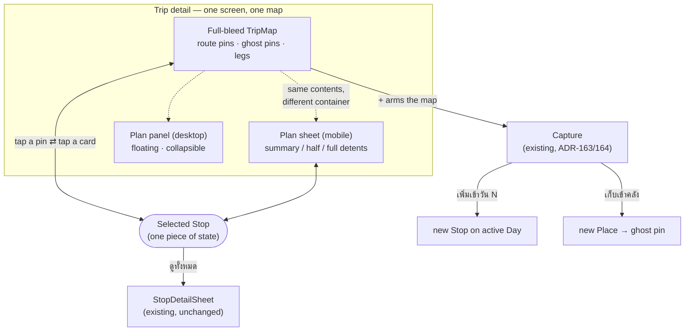
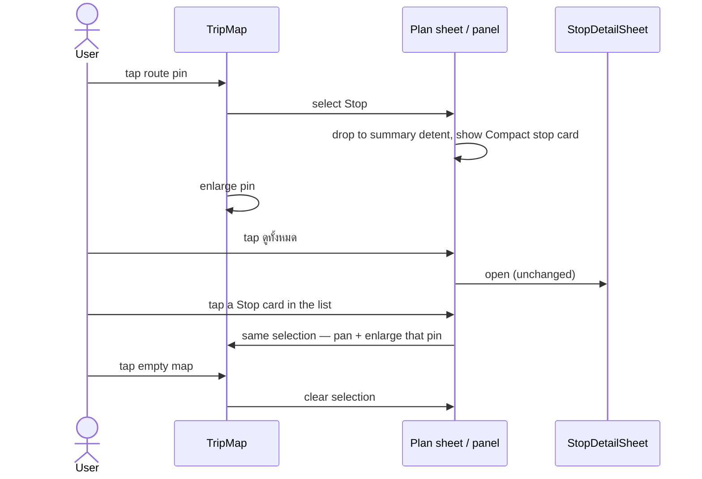
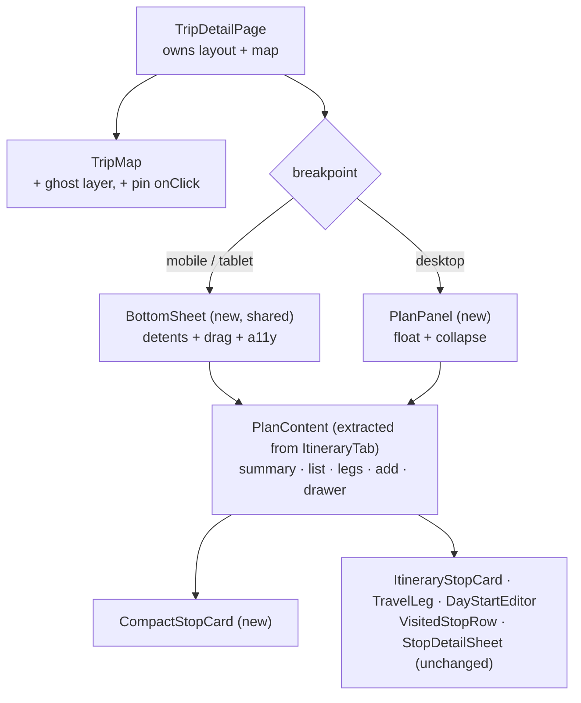

# Trip detail — map-driven redesign (mobile + desktop)

**Date:** 2026-09-20 · **Issue:** #154 (closes #6) · **Scope:** frontend only
**ADRs:** menunest-234 … menunest-241
**Mock (source of truth for the screen):** Claude Design → *MenuNest design system* → Screens →
`trip-detail-mobile` (4 frames) and `trip-detail-desktop` (option A)

---

## 1. Why

The owner reports trip detail as "ใช้งานยากมาก" on phone and web. Four symptoms were
named; all four are the same root — **the map is furniture, not a surface.** Each was
verified in code before this spec was written:

| # | symptom | verified cause |
|---|---|---|
| 1 | แผนที่แตะอะไรไม่ได้ | route pins carry no `onClick` — `TripMap.tsx:216-224` |
| 2 | มือถือ: เล็กไป / ขยายแล้วบังหมด | band is 188px or `position:fixed; inset:0` — `TripDetailPage.css:572-589` |
| 3 | ซูมออกจนจุดแวะกองกัน | `viewerLocation` is the route's first point (`useDayRoute.ts:122`) and the whole path is fed to `fitBounds` (`TripMap.tsx:139-141`) |
| 4 | กดหลายชั้น | two tab levels + a segmented view switch; adding a saved Place costs 5 steps and opens a **second** full-screen map (`.capture-overlay`) |

`/discover` already runs the target layout — full-screen map, floating top bar, FABs, a
bottom dock (`DiscoverPage.tsx:170-241`). This redesign brings trip detail in line with it.

## 2. Scope

**In:** `frontend/src/pages/trips/` — `TripDetailPage`, `ItineraryTab`, `TripMap`,
`useDayRoute`, `tripsSlice`, the trips CSS, and a new shared sheet component.

**Out, and explicitly unchanged:** every backend endpoint and DTO; `StopDetailSheet` and
everything it hosts (**Hourly forecast**, **Weather-based retiming**, checklist, review
links, season); `useSchedule` and the **Smart Schedule** cascade; **Timing flags**;
**Weather** and **Tide readings**; drag reorder (`@dnd-kit`); the มาแล้ว drawer;
`StopEditorDialog`; `PlaceEditorDialog`; `EditTripDialog`; `/discover`; `/trips`
(menunest-237).

**Non-goal:** improving what a **Stop** card *says*. This spec moves surfaces, not content.

## 3. Vocabulary

Defined in `CONTEXT.md` (added with this design): **Plan sheet**, **Detent**, **Plan panel**,
**Ghost pin**, **Selected Stop**, **Compact stop card**. **Itinerary map band** is retired.
Use these words in code and tests — not "drawer", "snap point", "active stop".

## 4. The mobile surface — map + Plan sheet

`TripMap` fills the viewport. Over it: a floating top bar, floating **Day** chips, a
right-hand control stack, and the **Plan sheet**.

### 4.1 Detents

| detent | height | contents | map visible |
|---|---|---|---|
| **summary** (opening state) | content height, ≈150px + safe area | grab handle · `วัน N · M จุด` · `x/y มาแล้ว` · เริ่ม–เสร็จ · เดินทางรวม · **นำทาง** | ~78% |
| **half** | 55 dvh | the above + the `แผนวัน` / `คลัง` segment + the **Stop** list (cards, **Legs**, flags, weather chips) + `จุดแวะ · N จุด` / `จัดลำดับ` | ~45% |
| **full** | 85 dvh | the above + `+ เพิ่มจุดแวะ` + the `มาแล้ว` drawer | a 15% strip |

Opening a Trip lands on **summary** — every Day, every time. The detent is **not**
persisted across visits; it is working state, not a preference.

The `แผนวัน` / `คลัง` segment appears from the **half** detent up (it is meaningless at
summary, where no list is shown). `คลัง` lists this Trip's **Places** for *editing* —
category, season, checklist, review links, via the existing `PlaceCard` →
`PlaceEditorDialog`. Finding a Place to schedule is the map's job now (menunest-235).

### 4.2 Gestures and behaviour

- **Non-modal is definitional.** No scrim; the map keeps pan, zoom and tap at every detent.
- **Drag from the handle and the sheet header only** — not from list content. This
  deliberately sidesteps nested drag/scroll hand-off, which is the classic source of janky
  bottom sheets; the sheet body is a plain scroll container. A future round may add
  drag-from-top-of-scroll.
- **Tap the handle** cycles summary → half → full → summary (Material 3's rule, and the
  keyboard/AT path: the handle is a `<button>` with `aria-expanded` and a Thai label naming
  the next state).
- Settle animation: `transform: translateY()` + `transition: 220ms cubic-bezier(.32,.72,0,1)`.
  Under `prefers-reduced-motion: reduce`, snap with no transition.
- The sheet never covers the floating top bar; `full` stops below it.

### 4.3 Floating chrome

- **Top bar** (over the map, safe-area aware): back · Trip name · `date · N วัน · ประจำวัน` ·
  edit pencil. Tapping the date opens the existing `TripDateEditor`; the pencil opens
  `EditTripDialog`. Both are reused as-is.
- **Day chips** below the top bar, horizontally scrollable, `วัน 1 … วัน N` + `+ วัน`.
  Rendered only when `dayCount > 1`.
- **Control stack**, bottom-right above the sheet: `คลัง · N` ghost toggle · locate-me ·
  **+** (primary, teal).
- **Day roll-up badge** (`N จุด · X กม · ~Y ชม`) — top-right of the map, the existing
  `summaryText` from `useDayRoute`, unchanged in content.

## 5. The desktop surface — map + Plan panel

Same contents, different container (menunest-236). The map fills the canvas; a **376px**
panel floats inset `16px` over the left edge, `border-radius: 16px`, elevated. A rail
button on its right edge collapses it; collapsed, the map is the whole canvas.

Panel order, top to bottom: Trip header (name, date, `IsDaily`, edit) → Day chips →
`แผนวัน` / `คลัง` segment → summary row with **นำทาง** → Stop list → `+ เพิ่มจุดแวะ` →
`มาแล้ว` drawer. The dark `.trip-topbar` and the `464px 1fr` grid are removed.

Breakpoints (`useBreakpoint`, unchanged): `desktop` ≥1024px gets the panel; `mobile` and
`tablet` get the sheet.

## 6. The map

### 6.1 Pin classes

| class | what | behaviour |
|---|---|---|
| **route pin** | a **Stop** on the active **Day** | numbered, teal, severity-coloured per ADR-022; tappable → selects |
| **ghost pin** | a **Place** on this Trip that is *not* a Stop on the active Day | 12px dot, desaturated, label beside it, `z-index` below route pins; tappable → add card |
| **viewer pin** | the device location | unchanged; never extends bounds |

`TripMap` currently renders `places` **only** when not in route mode
(`routeMode ? … : places.map(…)`). Route mode must now render both layers.

**Ghost pin actions.** A **Place** scheduled on *no* Day → tapping offers **เพิ่มเข้าวัน N**
(the active Day), which is the ADR-158 one-tap copy, not a **Capture**. A Place scheduled on
*another* Day → its card reads `อยู่ในวัน M` and offers **ไปวัน M**, which switches the
active Day. *(Judgment call, not grilled — flagged in §11.)*

**Density (menunest-241):** ghost pins are drawn by default; the `คลัง · N` toggle hides
them and the choice is persisted per User in `localStorage`. Above **12** ghost pins in the
viewport, labels are dropped and only dots render.

### 6.2 Framing (menunest-239)

`fitBounds` is computed from the **active Day's Stop coordinates only** — not
`viewerLocation`, not ghost pins. `useDayRoute` keeps building the full `segments` list
(the **Approach leg** still draws); only the `path` handed to `FitBounds` changes.

Padding must clear the overlaid chrome, or pins are framed underneath it:

| surface | padding |
|---|---|
| mobile | `{top: 88, right: 20, bottom: <current detent height> + 24, left: 20}` |
| desktop, panel open | `{top: 28, right: 28, bottom: 28, left: 408}` |
| desktop, panel collapsed | `{top: 28, right: 28, bottom: 28, left: 52}` |

`FitBounds` already re-runs on container resize via `ResizeObserver`; it must **also** re-run
when the detent or the panel-collapsed state changes, since the container does not resize.

### 6.3 Selection (menunest-238)

One piece of state — the dead `tripsSlice.activeStopId` is renamed **`selectedStopId`** and
finally used (it is declared with a reducer today and read by nothing).

**Compact stop card** — replaces the sheet's summary content while a Stop is selected:
ordinal + name, `ถึง / ออก / อยู่`, **Timing flag**, **Weather reading**, actions
**นำทาง** · **แก้ไข** · **มาแล้ว**, plus **ดูทั้งหมด** and a ✕. It reads its fields from the
same `useSchedule` projection the list card uses — no second derivation.

On desktop the equivalent is a hover/selection link: hovering a card enlarges its pin;
clicking selects; the Compact stop card is **not** needed because the list is always visible.

### 6.4 Adding (menunest-240)

**+** arms the map already on screen — the existing `AddPlaceMode` / **Capture mode**,
unchanged inputs (search · POI tap · empty-ground tap · pasted link). The
`.capture-overlay` second `TripMap` in `TripDetailPage` is deleted.

The preview offers **two** actions: **เพิ่มเข้าวัน N** (primary — the ADR-067/068 single-shot
schedule) and **เก็บเข้าคลัง** (secondary — saves the Place, which then appears as a ghost
pin). Without the second, ghost pins could never be created, because the Places tab's
library-only **+** is the control being removed.

This needs no new component: `AddPlacePreviewCard` already takes
`secondaryLabel` / `onSecondary`, and on the trip surface that slot is unused today —
`AddPlaceMode` wires it only for Discover's `choose` target
(`AddPlaceMode.tsx:286-287`). The work is wiring it, not building it.

While armed, every map tap belongs to capture (ADR-163). The armed state therefore needs an
unmistakable banner with an explicit exit, because this surface is now also the browsing
surface — a User who taps a pin while armed must not be surprised.

## 7. Code shape

- **`BottomSheet`** is written as a **shared** component (not inside `ItineraryTab`) so
  Discover can adopt it later without a second implementation existing (menunest-237).
- **`ItineraryTab` is split**, not deleted: its rendering becomes `PlanContent`; its data
  hooks (`useGetItineraryQuery`, `useSchedule`, `useStopWeather`) move up or stay beside it.
- **Slice changes:** `activeStopId` → `selectedStopId` (it is declared with a reducer today
  and read by nothing — `tripsSlice.ts:14,42`); `activeTab`, `placesView` and
  `itineraryMapExpanded` are removed; `addMode` becomes the single armed flag and
  `addStopForDayId` is dropped, because the active Day is implicit on a single-map screen.
  `lib/addStopCapture.ts`'s `addStopDayLabel` **stays** — it still names the armed banner's
  day (`วัน N · พัทยา`), so its unit test stays green.
- **Pure logic goes to `lib/`** so it is unit-testable in a repo with no component harness:
  detent resolution (`detent.ts`), fit padding (`fitPadding.ts`), ghost-pin partitioning and
  the label-density rule (`ghostPins.ts`).

## 8. Accessibility

- Every map-tappable pin is a real `<button>` with an accessible name
  (`"จุดที่ 2 — The View Ferris Wheel Pattaya, ถึง 11:20"`); the map is not the only route to
  any action — the list at the half detent reaches all of them.
- The sheet handle is a `<button>` with `aria-expanded` and a label naming the next detent.
- Touch targets ≥ 44×44 px with ≥ 8px separation (WCAG; LogRocket's bottom-sheet guidance).
- Existing `@dnd-kit` keyboard reorder and its Thai announcements are preserved verbatim.
- `prefers-reduced-motion` disables sheet and map-pan animation.

## 9. Verification

This repo has **no component/visual test harness** — `tsc`, `npm run build` and vitest
cannot see a rendering bug (CLAUDE.md; learned on #33, #46, #97). So:

1. **Unit (vitest):** `detent.ts`, `fitPadding.ts`, `ghostPins.ts`, and the `selectedStopId`
   reducers. Pure functions only.
2. **e2e (Playwright, runs in CI):** extend `trips.reorder.spec.ts`'s testids and add
   `trips.map-driven.spec.ts` — sheet renders at summary on open, handle cycles the detents,
   a route pin is a focusable button, tapping it shows the Compact stop card, the panel
   collapses on desktop. Keep `data-testid="itin-stop-card"` and `stop-drag-handle` stable so
   the existing reorder spec keeps passing.
3. **Interactive, before merge — mandatory:** run the app on a phone viewport and a desktop
   viewport and diff against the two mock cards (tokens, colours, structure), per CLAUDE.md's
   mockup-fidelity rule. Check specifically: map tiles repaint after a detent change
   (`ResizeObserver` does not fire — the container does not resize), the armed-capture banner,
   and a Place-heavy Trip for ghost-pin density.
4. **Do not push to `main` without step 3.** Pushing to `main` deploys to prod.

## 10. Risks

| risk | mitigation |
|---|---|
| Grey/misaligned tiles after a detent change | re-run `fitBounds` on detent change, not only on `ResizeObserver` (§6.2) |
| Drag vs. scroll jank inside the sheet | v1 drags from the handle/header only (§4.2) |
| Armed capture eats a pin tap | explicit armed banner + exit (§6.4) |
| Ghost pins bury the route | default-on toggle + label-density rule (§6.1) |
| Big diff lands in one commit | task-sized plan; EF-style "must land together" does not apply — this is frontend-only, so commits split by surface are safe |

## 11. Assumptions the reviewer should confirm

1. **Ghost pin for a Place scheduled on another Day** shows `อยู่ในวัน M` / `ไปวัน M` rather
   than offering to move it (§6.1). Not grilled — chosen as the least surprising default.
2. **Detent is not persisted** across visits (§4.1) — a Day always opens at summary.
3. **The ghost-pin toggle is per User, in `localStorage`**, not per Trip and not server-side.
4. **`tablet` gets the sheet, not the panel** — it follows today's `isDesktop` split.
