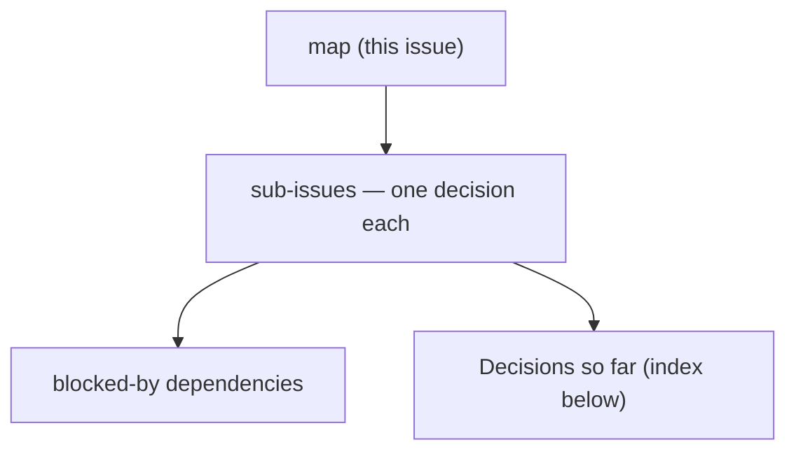

<!-- decision-map:key:route-origin-toggle-67 -->

## Destination
A user can toggle, per itinerary Day, whether that day's plan starts from their current location or from Stop 1, and the arrival times, the total distance, the finish time and the map's route all agree with that toggle - live on production with the migration applied.

## Notes
Revisits ADR-027 (approach leg from the viewer's live location) and touches ADR-011 (navigate hand-off omits origin). Owner has already fixed two scope answers: the switch is per ItineraryDay, and on a multi-day trip it is set per day. The frontend has no component/visual test harness, so any UI change must be verified interactively before push (CLAUDE.md). EF migrations are applied to prod by hand. Every commit references #67.

## Decisions so far

<!-- decision-map:decisions:start -->
- [Approach leg consumers - which code paths read the index-0 leg today?](https://github.com/ThodsaphonSonthiphin/MenuNest/issues/68) — Every leg-0 consumer on main (d251edd) already handles it absent; the real risk is null vs a zero leg, diverging in anyEstimated, StopEditorDialog and Routes cost.
- [Switch off - exactly which outputs change?](https://github.com/ThodsaphonSonthiphin/MenuNest/issues/69) — When the Day's switch is set to 'continue from previous Stop', the approach leg is dropped entirely: no viewer coordinates are sent, Stop 1 arrives at DayStartTime, and the map hides the 'you are here' pin.
<!-- decision-map:decisions:end -->

## Not yet specified

<!-- decision-map:fog:start -->
- Whether Discover (ไปไหนดี), which also ranks places by distance from the current location, should honour the same switch.
- Whether a day that has already started (some Stops marked มาแล้ว) should force one setting - the lead leg 'จากจุดที่เพิ่งไป' already moves the origin implicitly.
<!-- decision-map:fog:end -->

## Out of scope

<!-- decision-map:scope:start -->
- A stored, reusable trip origin (home or hotel) as its own entity or address field - ADR-027 rejected it and the destination does not need it.
- Changing how Routes API calls are billed, cached or batched.
<!-- decision-map:scope:end -->

## Context

Originally filed as issue #67, and converted into this map in place - the report below is the owner's own, verbatim.

> เพื่อให้การวางแผนดูได้ว่า จากจุด 1 ไปจุด ที่ 2 ใช้เวลาเท่าไหร่
> จากรูปจะเห็นว่า ถ้ามีสองจุดหมาย มันจะคำนวนจาก จุดที่เราอยู่ปัจจุบันเสมอ

The screenshot is this trip on production:
https://green-rock-098e70e00.7.azurestaticapps.net/trips/6bdfbd49-f676-4b84-892f-48e46cbe3794

Read off that screenshot: the visible Stop 1 -> Stop 2 leg is 127.4 km, while the day summary says 255.6 km and 4 hr 32 min of travel. The difference is the index-0 **approach leg** from the viewer's live location into Stop 1, added by GetItineraryHandler whenever the client sends viewer coordinates. There is no way to turn it off today.
