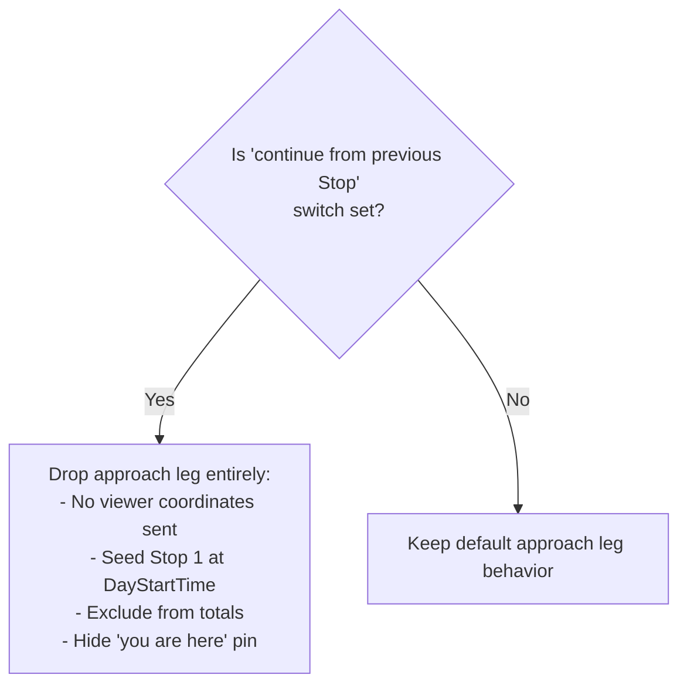

```mermaid
flowchart TD
    S{"Is 'continue from previous Stop'<br/>switch set?"}
    S -->|Yes| D["Drop approach leg entirely:<br/>- No viewer coordinates sent<br/>- Seed Stop 1 at DayStartTime<br/>- Exclude from totals<br/>- Hide 'you are here' pin"]
    S -->|No| K["Keep default approach leg behavior"]
```

> "Yes, drop it entirely: no coordinates sent, seed Stop 1 at DayStartTime, exclude from totals, and hide 'you are here' pin/polyline."
